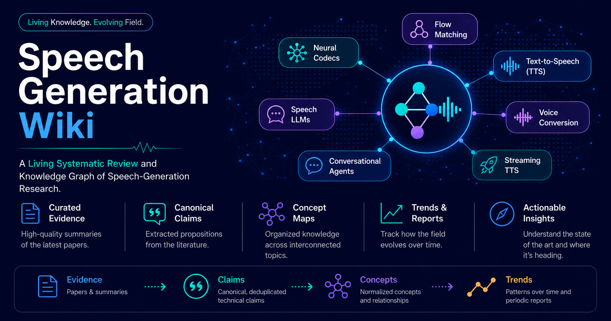

# Speech Generation Wiki



A living systematic review and knowledge graph of the state of the art in **text-to-speech (TTS)**, **voice conversion (VC)**, and **spoken conversational agents (SCA)**. Papers are ingested on a rolling basis, enabling both current-state snapshots and year-on-year trend analysis.

---

## Coverage

**Venues:** Interspeech, ICASSP, ACL, EMNLP, NAACL, NeurIPS, ICLR, ICML, ASRU, SLT, arXiv preprints, and technical reports from industry labs (Google, Microsoft, Meta, ElevenLabs, Apple, Amazon, and others).

**Period:** August 2025 onward, with foundational papers added via citation discovery.

**Corpus:** ~800 accepted papers; pages added continuously as ingestion proceeds.

---

## Structure

```
index.md         Landing page — concept navigation, links to all sections
overview.md      Evolving synthesis of dominant paradigms and emerging trends
log.md           Reverse-chronological log of ingests, integrations, and queries

papers/          One page per ingested paper — method, results, claims, novelty assessment
  index.md       Full paper catalog

concepts/        Technology and method concept pages
  index.md       Concept directory
  _evidence/     Machine-oriented evidence digests (one per concept; used for synthesis)

comparisons/     Cross-paper comparison tables generated in response to research queries
venues/          Per-venue summary pages (named {year}-{venue}, e.g. 2025-interspeech)
  index.md       Venue directory
reports/         Periodic field reports — monthly, quarterly, yearly
```

---

## Concept pages

| Area | Concepts |
|------|----------|
| Core architectures | Flow matching · Diffusion · Autoregressive codec TTS · Transformer enc-dec · GAN vocoder |
| Capabilities | Zero-shot TTS · Voice conversion · Multilingual TTS · Emotion synthesis · Prosody control · Streaming TTS · Instruction-conditioned TTS |
| Systems | Spoken language model · Speech-to-speech |
| Foundations | Neural codec · Self-supervised speech · Disentanglement · Speaker adaptation · RLHF for speech |
| Evaluation | Evaluation metrics · Subjective evaluation |

Each concept page includes: executive summary, current status, methods and variants, major claims (strongly supported / emerging / contested), relationship to other concepts, representative papers, and a trend summary.

---

## Paper pages

Each paper page includes:

- **Paper card** — venue, year, authors, paper link, and one-sentence contribution in a single callout
- **Method** — system description with embedded architecture figure where available
- **Claims** — 2–5 generalised propositions about the field that this paper supports, weakens, or complicates
- **Field significance** — level (low / moderate / high / foundational) and contribution type
- **Novelty assessment** — honest evaluation of what is genuinely new vs. incremental
- **Limitations and open questions**

---

## Pipeline

This repo is the output of an automated ingestion pipeline. Sources, scripts, metadata, and agent definitions live in the companion infra repo: [speech-generation-wiki-infra](https://github.com/msamribeiro/speech-generation-wiki-infra).

Each paper page is generated by an LLM ingest agent that reads the full parsed PDF, writes a structured wiki page, and selectively embeds architecture diagrams. A separate integration agent updates concept pages, cross-links citing/cited paper pairs, and maintains concept evidence digests. All metric values are sourced directly from paper tables — nothing is estimated.
