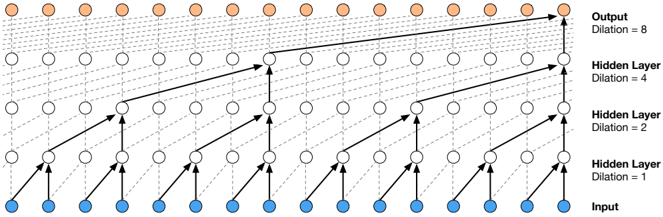
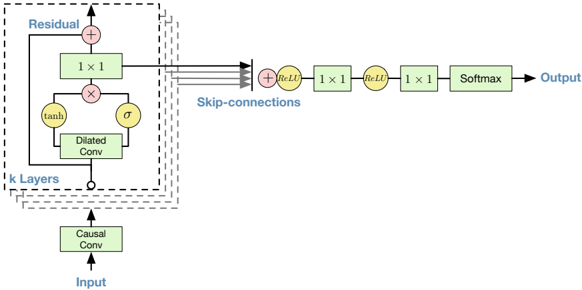

> [!abstract] arXiv · 2016 · Preprint
> **van den Oord et al.** (Google DeepMind) · [→ Paper](https://arxiv.org/abs/1609.03499) · Demo: ✓ · Code: ?
>
> WaveNet introduces a fully autoregressive deep convolutional network that generates raw audio waveforms sample-by-sample, using dilated causal convolutions to achieve receptive fields large enough for natural speech, and outperforms HMM-based concatenative and LSTM-RNN parametric baselines by a substantial margin in MOS on English and Mandarin TTS.

## Problem

Prior to WaveNet, the dominant approaches to neural TTS generated intermediate vocoder parameters (cepstra, F0, aperiodicity) rather than the raw waveform directly. Statistical parametric systems using HMMs or LSTM-RNNs suffered from over-smoothing and vocoder artifacts: the two-step pipeline (extract parameters, then reconstruct waveform via a conventional vocoder) introduced a systematic mismatch that degraded naturalness. Concatenative unit-selection systems preserved naturalness locally but required large speech databases and struggled with prosodic flexibility. No neural approach had yet shown that a single model could learn the full joint distribution over tens of thousands of audio samples per second without baking in domain-specific signal processing assumptions.

## Method

WaveNet models the joint probability of a raw audio waveform as a product of conditional probabilities, where each sample is conditioned on all preceding samples. The architecture adapts PixelCNN from image generation to 1-D audio. The core component is a stack of dilated causal convolutions: dilation doubles with each layer (1, 2, 4, ..., 512), and the pattern is repeated across multiple blocks, yielding a receptive field that grows exponentially with depth rather than linearly. A single block of ten such layers provides a receptive field of 1024 samples; three stacked blocks give the model a context window of approximately 240 milliseconds at 16 kHz. Causal masking ensures no future sample influences predictions during generation.

Each convolutional layer uses gated activation units (tanh times sigmoid, borrowed from gated PixelCNN), which empirically outperformed ReLU activations for audio modeling. Residual connections and parameterised skip connections are applied throughout to accelerate training and enable deeper architectures. The output distribution is a categorical softmax over 256 quantization levels, obtained by compressing the raw 16-bit signal via mu-law companding before quantization.

Conditioning is handled through two mechanisms. Global conditioning injects a single latent vector (such as a speaker embedding encoded as a one-hot) by adding a learned bias to every gated activation. Local conditioning accepts a lower-frequency time series (such as linguistic features or log-F0 values) that is upsampled to audio resolution via a learned transposed convolution and added to the gated activations at each timestep. For the TTS experiments, WaveNet is conditioned on linguistic features derived from text; a separate F0 prediction model provides prosody information as a secondary conditioning signal.

Training maximises the log-likelihood of the data with respect to all model parameters, a tractable objective given the autoregressive factorisation. All timestep predictions are computed in parallel during training (ground-truth samples available at all positions), but inference is strictly sequential: one sample at a time, each fed back into the network to predict the next.

## Key Results

On the MOS naturalness test using proprietary Google speech databases, WaveNet (conditioned on linguistic features and log-F0) scored 4.21 on North American English and 4.08 on Mandarin Chinese, compared to 3.86 / 3.47 for HMM-driven concatenative and 3.67 / 3.79 for LSTM-RNN parametric baselines (Table 1). The gap between the best synthetic system and natural speech narrowed by 51% for English (from 0.69 to 0.34 MOS) and 69% for Mandarin (from 0.42 to 0.13 MOS). Paired preference tests confirmed statistically significant preference for WaveNet over both baselines at p < 10^-9 in almost all comparisons.

WaveNet conditioned on linguistic features alone (no F0 input) sometimes produced unnatural prosody at the word level, attributed to the 240ms receptive field being insufficient to capture F0 contour dependencies across phrases. Adding the external F0 conditioning resolved this, showing that receptive field size is a binding constraint for prosodic naturalness independent of model capacity.

In the multi-speaker experiment on VCTK (109 speakers, 44 hours), a single global-conditioning model captured all speakers' characteristics, with validation performance improving over single-speaker training, suggesting that speaker-level representations are shared and mutually reinforcing in the model's internal structure.

## Novelty Assessment

WaveNet's contribution is genuine architectural novelty applied at a critical juncture in the field. The use of dilated causal convolutions for audio generation, the mu-law categorical output distribution, and the global/local conditioning framework are all original design choices that solve real problems specific to raw audio: extreme temporal resolution, long-range dependency, and tractable training. The adaptation of PixelCNN to 1-D time series is conceptually clean, and the training setup (parallel forward passes, sequential inference) became a template for subsequent neural vocoders.

The key limitation — sequential sample-by-sample inference — is also inherited from the PixelCNN lineage. At the time of publication WaveNet was reported to require roughly 1.5 seconds of compute per second of audio, making real-time synthesis infeasible. This constraint spurred an entire line of follow-on work (WaveRNN, WaveGlow, Parallel WaveNet, WaveGrad) aimed at retaining WaveNet's quality while enabling fast or parallel generation. The evaluation uses proprietary Google speech databases, which limits direct reproducibility, though the MOS comparisons include fair baselines trained on the same data.

## Field Significance

> [!important]
> Foundational — WaveNet establishes raw-waveform autoregressive generation as a viable and superior alternative to vocoder-based synthesis, shifting the field's definition of what a neural TTS back-end should be. The dilated causal convolution architecture, the mu-law categorical output, and the global/local conditioning interfaces all became reference designs: virtually every neural vocoder and many end-to-end TTS systems built through 2020 either adopt or directly react to WaveNet's formulation. Its demonstration that a single model can capture 109 speakers simultaneously provides the early empirical grounding for multi-speaker and zero-shot TTS research.

## Claims

- Direct generation of raw audio waveforms, without intermediate vocoder parameters, produces substantially higher naturalness than parametric or concatenative synthesis pipelines as judged by human listeners. *(§3.2, Table 1)*
- Dilated causal convolutions enable autoregressive audio models to achieve receptive fields orders of magnitude larger than standard causal convolutions with comparable computational cost. *(§2.1, Figure 3)*
- A single autoregressive model conditioned on speaker identity can represent many voices with shared internal structure, and multi-speaker training improves per-speaker quality relative to single-speaker training. *(§3.1)*
- Receptive field size is a binding constraint for prosodic naturalness: when the receptive field is insufficient to cover phrase-level F0 contours, prosody degrades even when segmental quality remains high. *(§3.2)*
- Autoregressive raw-waveform generation achieves high naturalness at the cost of sequential sample-level inference, creating a fundamental speed-quality trade-off that constrains deployment in real-time applications. *(§4, §3.2)*

## Limitations and Open Questions

> [!warning]
> Inference is strictly sequential at the sample level, requiring approximately one computation step per generated sample. At the reported generation rates (roughly 1.5× real-time compute), WaveNet is not suitable for real-time TTS deployment without hardware-specific optimisation or a parallel decoding approximation.

Evaluation is conducted on proprietary Google TTS databases, making direct replication by external researchers impossible. The MOS comparison is fair internally (same data, same test sentences for all systems) but cannot be directly compared to numbers from other published evaluations.

The receptive field of 240 milliseconds covers 3-4 phonemes. Long-range prosodic structure above the syllable and phrase level requires either an external F0 model or a substantially larger receptive field than dilated convolutions alone provide efficiently.

WaveNet as presented requires high-quality linguistic features derived from a text analysis front-end. It is not end-to-end trainable from text to waveform, deferring the alignment and duration prediction problems to external modules.

## Wiki Connections

Core architectural concept: [[autoregressive-codec-tts]]

WaveNet's raw-waveform output and its limitations with real-time inference directly motivated the development of neural vocoders and codecs: [[gan-vocoder]], [[neural-codec]]

The multi-speaker conditioning framework informs later work on speaker adaptation and zero-shot synthesis: [[speaker-adaptation]], [[zero-shot-tts]]

Evaluation methodology (crowdsourced MOS, paired preference tests): [[subjective-evaluation]]

[[1703.10135]] — Tacotron: Towards End-to-End Speech Synthesis
[[1712.05884]] — Natural TTS Synthesis by Conditioning WaveNet on Mel Spectrogram Predictions
[[2106.15561]] — A Survey on Neural Speech Synthesis
