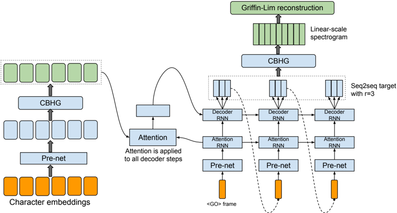
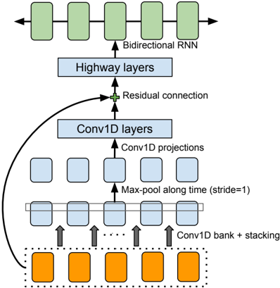

> [!abstract] arXiv · 2017 · Preprint
> **Wang et al.** (Google) · [→ Paper](https://arxiv.org/abs/1703.10135) · Demo: ? · Code: ?
>
> Tacotron introduces a fully end-to-end seq2seq architecture that synthesises mel spectrograms directly from character input, eliminating the need for separately trained linguistic feature extractors, duration models, and vocoders.

## Problem

Prior TTS pipelines consisted of multiple independently trained components: a text analysis frontend, a duration model, an acoustic model, and a signal-processing vocoder. Each component required substantial domain expertise, made brittle design decisions, and propagated its errors to downstream stages. WaveNet had shown that neural waveform generation was feasible but still depended on linguistic features from an external TTS frontend, leaving the pipeline fragmented. No system at the time had demonstrated reliable end-to-end training from raw characters to speech with competitive quality against production systems.

## Method

Tacotron applies a sequence-to-sequence architecture with Bahdanau-style attention, taking a sequence of characters as input and emitting 80-band mel-scale spectrograms frame by frame. The system is composed of three major parts: an encoder, an attention-based decoder, and a post-processing network.

The encoder centres on a novel CBHG module (1-D Convolution Bank, Highway network, and bidirectional GRU). Character embeddings pass through a bottleneck pre-net (two fully-connected layers with dropout), then into a CBHG block that convolves with K=16 filter widths to capture local and contextual patterns across different n-gram scales, max-pools to increase invariance, applies highway layers for higher-level features, and reads the result with a bidirectional GRU. The encoder thus produces robust sequence representations without requiring phoneme-level alignment or a hand-crafted linguistic frontend.

The decoder uses a content-based tanh attention mechanism whose query is produced at each step by a single-layer GRU. Context and attention RNN output are concatenated and passed to a two-layer residual GRU decoder. A key design choice is the reduction factor r: the decoder predicts r non-overlapping mel frames per step rather than one, dividing decoding steps by r, accelerating training convergence, and encouraging the attention to advance more readily through the input sequence (r=2 in the main experiments).

A second CBHG module, the post-processing net, converts the decoder's mel predictions into linear-scale spectrogram predictions. Because it can see the full decoded sequence (unlike the causal decoder), it exploits both forward and backward context to resolve harmonics and high-frequency formant structure. Griffin-Lim then reconstructs the final waveform from the linear spectrogram in approximately 50 iterations. The use of Griffin-Lim is explicitly described as an interim choice, with neural waveform inversion noted as ongoing work.

The entire system is trained end-to-end from random initialisation on text-audio pairs with no phoneme-level supervision, using an L1 loss jointly on the mel-scale (decoder) and linear-scale (post-processing net) targets, with Adam and a step-based learning-rate schedule.

## Key Results

On an internal US English test set of 100 unseen phrases (8 raters each, headphones only), Tacotron achieves a MOS of 3.82 ± 0.085. This exceeds the production LSTM parametric system (3.69 ± 0.109) and falls below the production concatenative system (4.09 ± 0.119). The margin over the parametric baseline is modest, and the authors note that Griffin-Lim artefacts reduce achievable naturalness; the comparison is therefore conservative for the underlying acoustic model.

Ablations show that replacing the CBHG encoder with a 2-layer residual GRU degrades alignment quality and causes mispronunciations. Removing the post-processing net eliminates fine harmonic structure in the output. A vanilla seq2seq baseline (no pre-net, no CBHG, no post-processing net) requires scheduled sampling to learn any alignment at all and still produces poor intelligibility.

## Novelty Assessment

The primary contribution is architectural: the first demonstration that a single attention-based seq2seq model can be trained from characters to speech end-to-end, without phoneme-level alignment supervision or separate component training. The CBHG module itself is an application of techniques from neural machine translation (Lee et al., 2016) that prove effective in TTS for the first time. The reduction factor r is a concrete design innovation that solves the slow-attention problem in character-level decoding and has a measurable effect on convergence speed and alignment stability.

The Griffin-Lim vocoder is an acknowledged placeholder rather than a contribution. The evaluation is on a single internal speaker, and the model does not generalise to multiple speakers or unseen voices in this paper. The gap to the concatenative baseline indicates that end-to-end training alone has not yet closed the full quality gap, but the direction is established.

## Field Significance

> [!important]
> Foundational — Tacotron establishes the seq2seq-with-attention paradigm as a viable backbone for end-to-end TTS, directly enabling the family of systems (Tacotron 2, FastSpeech, and their successors) that replaced statistical parametric synthesis as the dominant approach over the following years. Its core design decisions (character or phoneme input, mel-spectrogram intermediate target, learned attention alignment, post-processing network) became the structural template against which subsequent work positioned itself, whether by refining the vocoder, replacing the attention mechanism, or eliminating autoregressive decoding.

## Claims

- End-to-end TTS models trained from characters with seq2seq attention can match or exceed production statistical parametric systems in subjective naturalness without hand-engineered linguistic features. *(§5.2, Table 2)*
- Training stability and alignment quality in character-level seq2seq TTS improve substantially when the decoder emits multiple output frames per attention step rather than one. *(§3.3)*
- CBHG-style encoders combining multi-scale convolution, highway networks, and bidirectional recurrence yield more robust text representations than standard RNN encoders, reducing mispronunciation rates. *(§3.2, §5.1)*
- Post-processing networks with access to the full decoded sequence improve harmonic structure in predicted spectrograms compared to frame-level-only decoding. *(§3.4, §5.1)*

## Limitations and Open Questions

> [!warning]
> Evaluated on a single internal speaker in a controlled studio environment. No multi-speaker, out-of-domain, or noisy-data experiments are reported. The internal dataset is not released, making direct replication impossible.

Griffin-Lim waveform synthesis introduces audible artefacts that depress MOS scores and prevent fair comparison against systems using neural vocoders. The authors explicitly flag this as a known limitation and describe neural inversion as ongoing work. The reduction factor r is fixed at inference; the paper does not explore adaptive or learned stopping. The model still requires clean text-normalised input; robustness to raw text (numbers, abbreviations, punctuation) is handled by a rule-based preprocessing step rather than learned normalisation.

## Wiki Connections

This paper introduces the architecture that seeds [[transformer-enc-dec-tts]] and establishes the mel-spectrogram prediction target that subsequent works, including [[1609.03499]] (WaveNet), extend with neural vocoders. It is directly cited as the foundation of autoregressive seq2seq TTS and connects to [[prosody-control]] through its conditioning-at-input framing, [[evaluation-metrics]] through its MOS experimental setup, and [[subjective-evaluation]] as an early example of crowdsourced naturalness scoring for end-to-end TTS.
