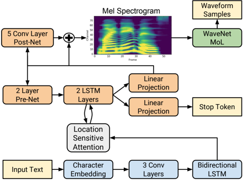

> [!abstract] arXiv · 2017 · Preprint
> **Shen et al.** (Google) · [→ Paper](https://arxiv.org/abs/1712.05884) · Demo: ? · Code: ✗
>
> Tacotron 2 establishes that a recurrent sequence-to-sequence network predicting mel spectrograms, conditioned into a WaveNet vocoder, can produce speech indistinguishable from professional recordings in a MOS evaluation.

## Problem

Prior end-to-end TTS approaches required either complex feature engineering (linguistic features, phoneme durations, F0 trajectories) as inputs to vocoders like WaveNet, or accepted lower audio quality by using Griffin-Lim phase reconstruction. The original Tacotron produced naturalistic prosody but audibly artefact-laden audio because Griffin-Lim was its vocoder. WaveNet conditioned on linguistic features required elaborate text analysis and pronunciation lexicons. No prior fully neural system had closed the gap to human speech quality while eliminating this domain-specific feature engineering.

## Method

Tacotron 2 is a two-stage pipeline. The first stage is a recurrent encoder-decoder network with location-sensitive attention that maps character sequences directly to 80-channel log-mel spectrogram frames. The encoder processes input characters with three convolutional layers (512 filters, 5-character span) followed by a bidirectional LSTM with 512 units. The decoder is autoregressive: at each step, the previous predicted frame passes through a two-layer pre-net bottleneck (256 units) before being combined with the attention context and fed through two unidirectional LSTM layers (1024 units). A five-layer convolutional post-net refines the predicted spectrogram by adding a residual correction. A sigmoid stop-token head allows the model to terminate generation dynamically rather than at a fixed length. The network is trained with summed MSE on both the pre- and post-net outputs, using teacher forcing.

The second stage is a modified WaveNet vocoder that synthesises waveforms from the predicted mel spectrograms rather than from linguistic features. The WaveNet uses 30 dilated convolutional layers organized in 3 dilation cycles, and outputs a 10-component mixture of logistic distributions at 24 kHz rather than softmax buckets over discretized amplitudes. The two components are trained separately: WaveNet is trained on ground-truth-aligned mel spectrogram predictions generated by running the encoder-decoder in teacher-forcing mode, which ensures alignment between the predicted intermediate representation and the target waveform.

A key design insight is that the mel spectrogram serves as a compact, phase-invariant acoustic intermediate that is both easy to predict from text (smooth enough for MSE training) and easy to invert into high-quality audio (sufficient low-level detail for a small WaveNet). Ablations confirm that mel conditioning allows WaveNet complexity to be reduced substantially: a 12-layer model with a 10.5 ms receptive field matches the quality of the full 30-layer 256 ms model.

## Key Results

On an internal US English single-speaker test set, Tacotron 2 achieves a MOS of 4.526 against a ground-truth MOS of 4.582 (Table 1). This compares to 4.341 for WaveNet conditioned on linguistic features, 4.001 for Tacotron with Griffin-Lim, 4.166 for the concatenative production system, and 3.492 for parametric synthesis. A side-by-side preference evaluation against ground truth yields a mean preference score of -0.270, a small but statistically significant preference for ground truth, with rater comments identifying occasional mispronunciation as the primary source.

On an out-of-domain test set of 37 news headlines, Tacotron 2 scores 4.148, essentially matching WaveNet-linguistic (4.137), indicating that the fully neural approach does not sacrifice out-of-domain robustness relative to the feature-engineering baseline.

Ablation studies show that the post-net contributes meaningfully (4.526 vs. 4.429 without it) and that mel spectrograms are strictly preferable to linear spectrograms as the intermediate representation when WaveNet is the vocoder (4.526 vs. 4.510), due to their compactness. Training WaveNet on ground-truth spectrograms and then synthesising from predicted (oversmoothed) spectrograms is the worst configuration (4.362), confirming that training and inference distributions must match.

All MOS evaluations use an internal proprietary test set with no reported inter-rater agreement beyond confidence intervals. Evaluations across systems are not directly side-by-side, limiting numerical comparisons to relative ordering within this work.

## Novelty Assessment

The contribution is architectural integration rather than invention from scratch: the sequence-to-sequence backbone builds directly on Tacotron [Wang et al., 2017] and WaveNet [van den Oord et al., 2016], both of which pre-exist. The genuinely novel elements are (1) the choice of mel spectrograms as the interface between the two components, with the empirical demonstration that this interface simplifies WaveNet substantially while preserving quality, (2) location-sensitive attention replacing additive attention to improve robustness against repetition and omission, (3) the pre-net information bottleneck for stable attention learning, (4) the convolutional post-net residual correction, and (5) the stop-token head for dynamic endpoint prediction. Each of these is a targeted engineering improvement rather than a fundamentally new idea, but their combination produces a step-change in output quality relative to any prior published system. The ablations are unusually thorough for a 2017 speech paper and make the contribution legible.

## Field Significance

> [!important]
> Foundational — Tacotron 2 establishes the mel-spectrogram-as-intermediate paradigm that defines end-to-end TTS architecture for the following several years. By demonstrating that a neural encoder-decoder feeding a neural vocoder can produce human-quality speech from characters alone, the paper removes the last functional argument for linguistic feature engineering in single-speaker TTS. The model card, training recipe, and evaluation protocol it establishes become defaults that subsequent work either adopts directly or explicitly improves upon.

## Claims

- A compact low-level acoustic intermediate representation can bridge text encoding and neural vocoder synthesis without requiring hand-crafted linguistic features, enabling fully end-to-end neural TTS at human-quality levels. *(§2.1, Table 1)*
- Location-sensitive attention, which incorporates cumulative attention weights as a conditioning signal, reduces failure modes such as repetition and omission compared to standard additive attention in autoregressive TTS decoders. *(§2.2)*
- A pre-net information bottleneck in the autoregressive decoder is essential for stable attention alignment during training. *(§2.2)*
- Training the vocoder on predicted rather than ground-truth intermediate features is necessary because predicted features are systematically oversmoothed; vocoders trained on clean features degrade when exposed to predicted inputs. *(§3.3.1, Table 2)*
- Neural vocoders conditioned on compact mel spectrograms can operate with substantially smaller receptive fields than those conditioned on linguistic features, enabling significant architecture simplification without quality loss. *(§3.3.4, Table 4)*

## Limitations and Open Questions

> [!warning]
> All experiments use a single proprietary speaker and an internal dataset. The paper provides no evidence of generalisation to multiple speakers, different languages, or recording conditions, and no training or evaluation data is publicly released, limiting independent reproducibility.

Prosody remains imperfect: 23 of 100 test sentences are rated as containing unnatural prosody (wrong emphasis, unnatural pitch), and occasional mispronunciations are identified as the main gap between the system and human speech. The paper's authors explicitly identify prosody modeling as the primary remaining challenge.

The two-stage training setup, while producing high quality, introduces a train/inference mismatch that the ablations expose: the vocoder trained on predicted spectrograms is specifically tuned to the oversmoothed distribution of the encoder-decoder output. Any change to the first stage (retraining, fine-tuning) requires retraining the vocoder independently. Joint end-to-end training is left as future work.

Real-time synthesis is not addressed; WaveNet inference was known to be slow at the time of publication.

## Wiki Connections

Core architecture concepts: [[transformer-enc-dec-tts]], [[gan-vocoder]]

Foundational upstream work this paper directly extends: [[1609.03499]] (WaveNet)

Evaluation methodology: [[subjective-evaluation]], [[evaluation-metrics]]

Downstream capabilities enabled by this architecture: [[zero-shot-tts]], [[prosody-control]]

[[2402.08093]] — BASE TTS: Lessons from building a billion-parameter Text-to-Speech model on 100K hours of data
