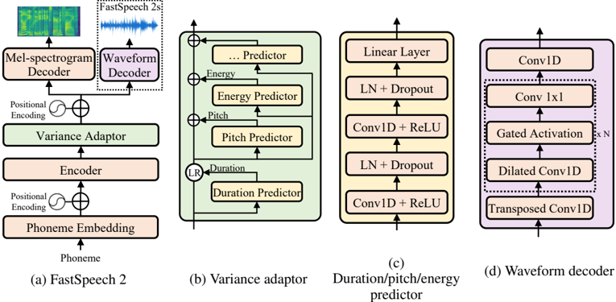

> [!abstract] arXiv · 2020 · Preprint (ICLR 2021)
> **Yi Ren et al.** (Microsoft Research Asia) · [→ Paper](https://arxiv.org/abs/2006.04558) · Demo: ✓ · Code: ?
>
> FastSpeech 2 eliminates the teacher-student distillation pipeline of its predecessor by training directly on ground-truth targets and conditioning the non-autoregressive acoustic model on explicitly extracted pitch, energy, and duration, producing higher-quality and more controllable speech at nearly 48x real-time inference speed.

## Problem

FastSpeech demonstrated that non-autoregressive TTS could match autoregressive model quality at dramatically faster inference, but at a cost: its training required a two-stage teacher-student pipeline where an autoregressive teacher provided both distilled mel-spectrograms and phoneme durations. This created three compounding problems. The distilled mel-spectrograms carried information loss relative to ground-truth recordings, placing a ceiling on achievable quality. Duration extracted from attention maps of the teacher was inaccurate. And the distillation pipeline itself doubled training time and complexity. More fundamentally, the non-autoregressive architecture had to grapple with the one-to-many mapping problem — text is underdetermined with respect to the speech it should produce, since pitch, speaking rate, and loudness all vary legitimately across utterances.

## Method

FastSpeech 2 replaces the teacher-student pipeline with direct supervision on ground-truth mel-spectrograms and addresses the one-to-many mapping problem by explicitly providing variance information at training time. The model follows a feed-forward Transformer encoder-decoder structure (4 FFT blocks each, 256 hidden dimensions) inherited from FastSpeech, with a variance adaptor inserted between encoder and decoder.

The variance adaptor contains three predictors operating sequentially on the phoneme hidden sequence: a duration predictor, a pitch predictor, and an energy predictor. Phoneme durations are obtained from the Montreal Forced Aligner rather than from a teacher model, yielding more accurate alignments (12.47 ms vs. 19.68 ms average absolute boundary error). Pitch is modeled in the frequency domain via continuous wavelet transform (CWT), which decomposes the pitch contour into 10 wavelet components forming a pitch spectrogram — this regularises pitch prediction against the high temporal variability that makes direct F0 regression difficult. Energy is computed as the L2-norm of STFT frame amplitudes. During training, ground-truth values for all three are fed as conditioning inputs; during inference, values predicted by the jointly trained predictors are used instead.

The paper also introduces FastSpeech 2s, a variant that bypasses mel-spectrograms entirely and directly generates waveform from the phoneme sequence. The waveform decoder is built on WaveNet-style non-causal dilated convolutions (30 residual blocks) trained with adversarial loss from a Parallel WaveGAN discriminator plus multi-resolution STFT loss. Because training on full-length waveforms exceeds GPU memory, the waveform decoder trains on sliced 20,480-sample clips while borrowing text feature representations from the frozen mel-spectrogram decoder, which trains on full sequences. At inference, only the waveform decoder is used. FastSpeech 2 is 23M parameters; FastSpeech 2s is 28M.

## Key Results

On LJSpeech, FastSpeech 2 achieves MOS 3.83 (±0.08), surpassing both Tacotron 2 at MOS 3.70 and FastSpeech at MOS 3.68, with all systems evaluated under identical conditions using Parallel WaveGAN as the vocoder (Table 1). FastSpeech 2s reaches MOS 3.71, matching autoregressive baselines without mel-spectrogram intermediate representation. The CMOS comparison confirms FastSpeech 2 outperforms FastSpeech by 0.885 CMOS and Transformer TTS by 0.235 CMOS.

Training efficiency improves substantially: FastSpeech 2 requires 17.02 hours versus FastSpeech's 53.12 hours (which includes teacher model training), a 3.12x reduction. Inference speed is comparable to FastSpeech at approximately 48x real-time (RTF 1.95e-2), with FastSpeech 2s marginally faster at 51.8x (Table 2).

Ablations confirm the importance of each variance component. Removing pitch from FastSpeech 2 costs 0.245 CMOS; removing it from FastSpeech 2s costs 1.130 CMOS, indicating that end-to-end waveform generation is especially reliant on explicit pitch conditioning. Predicting pitch in the frequency domain via CWT yields a further 0.185 CMOS gain over direct time-domain F0 regression (Table 6, Table 3). MFA-derived durations improve CMOS by 0.195 over teacher-extracted durations, confirming that alignment accuracy directly affects voice quality (Table 5).

## Novelty Assessment

The core contribution is architectural and methodological: framing the non-autoregressive one-to-many problem as an information gap problem and addressing it by explicitly grounding variance predictors in ground-truth signals rather than distilled approximations. The variance adaptor design and the CWT-based pitch modelling are novel components rather than combinations of prior art. Removing the teacher-student dependency is both a practical simplification and a principled quality improvement.

FastSpeech 2s is the first published attempt at fully parallel text-to-waveform generation (as distinct from non-autoregressive vocoders that require pre-computed linguistic features), though the training workaround required (sliced training with auxiliary mel-spectrogram decoder) reveals that full end-to-end non-autoregressive waveform generation at the time remained non-trivial.

The evaluation is limited to a single studio-quality English speaker (LJSpeech), which means generalisation to multi-speaker or out-of-domain conditions is not verified. Comparisons are fair within this scope, using the same vocoder across all acoustic model baselines.

## Field Significance

> [!tip]
> High — FastSpeech 2 introduces the variance adaptor pattern (explicit pitch, energy, and duration conditioning) and directly demonstrates that eliminating teacher-student distillation improves rather than degrades quality. Its results reframe why non-autoregressive TTS underperformed autoregressive models: not because of the generation strategy itself, but because of the information gap between text and speech — a gap the paper closes with ground-truth variance supervision and MFA-derived durations.

## Claims

- Explicit variance conditioning on pitch, energy, and duration in non-autoregressive TTS reduces the information gap between text and speech, enabling quality matching or surpassing autoregressive models without autoregressive inference. *(§2.2, §3.2.1, Table 1)*
- Phoneme durations derived from forced alignment are substantially more accurate than those extracted from autoregressive teacher attention maps, and this accuracy difference directly improves output voice quality. *(§3.2.2, Table 5)*
- Modeling pitch in the frequency domain via continuous wavelet transform produces more natural pitch distributions in synthesized speech than direct time-domain F0 regression. *(§2.3, §3.2.3, Table 3)*
- Removing teacher-student distillation from non-autoregressive TTS training can simultaneously simplify the pipeline, reduce training time, and improve output quality relative to the distillation approach. *(§1, §3.2.1, Table 2)*
- End-to-end parallel text-to-waveform generation is technically feasible but more sensitive to variance conditioning than mel-spectrogram-based acoustic models, particularly in the pitch dimension. *(§2.4, §3.2.3, Table 6)*

## Limitations and Open Questions

> [!warning]
> All experiments use a single studio-quality English speaker (LJSpeech). Generalisation to multi-speaker, emotional, noisy, or cross-lingual conditions is untested. The paper does not include speaker similarity metrics or speaker-conditioned variants.

The variance adaptor relies on an external forced alignment tool (MFA) and pitch extraction (PyWorldVocoder) at training time; these are not learned end-to-end, which limits the system from being fully self-contained. The authors acknowledge this and note future work toward eliminating external alignment tools.

FastSpeech 2s requires the mel-spectrogram decoder during training even though it is discarded at inference. This coupling adds training complexity and means the waveform decoder benefits from a pre-trained mel-spectrogram branch, creating a two-stage dependency that partially reintroduces the pipeline complexity the paper otherwise avoids.

The CMOS evaluation protocol is used for ablation comparisons rather than the more interpretable absolute MOS, which makes it harder to assess the magnitude of individual component contributions in absolute terms.

## Wiki Connections

Core concept: [[transformer-enc-dec-tts]] — FastSpeech 2 is the canonical variance-adaptor design in the non-autoregressive acoustic model lineage.

Related concepts: [[prosody-control]] (explicit pitch and energy conditioning as controllable variance), [[evaluation-metrics]] (MOS, CMOS, DTW-based pitch analysis), [[gan-vocoder]] (Parallel WaveGAN used as vocoder and integrated into FastSpeech 2s waveform decoder).

In-corpus references: [[1703.10135]] (Tacotron, the autoregressive baseline comparison) and [[1412.6980]] (Adam optimizer).

[[2310.00704]] — UniAudio: An Audio Foundation Model Toward Universal Audio Generation
