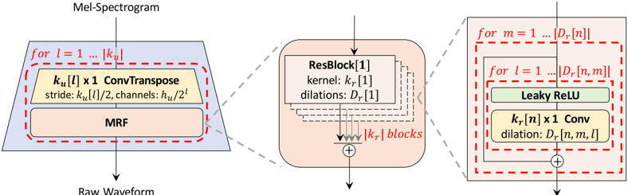

> [!abstract] arXiv · 2020 · Preprint (NeurIPS 2020)
> **Kong et al.** (Kakao Enterprise) · [→ Paper](https://arxiv.org/abs/2010.05646) · Demo: ✓ · Code: ✓
>
> HiFi-GAN introduces a multi-period discriminator and multi-receptive field fusion generator that closes the quality gap between GAN vocoders and autoregressive/flow-based models, while synthesising 22 kHz audio 167x faster than real-time on a single GPU.

## Problem

Prior GAN-based vocoders such as MelGAN achieved fast, lightweight waveform synthesis but consistently fell short of the perceptual quality of autoregressive models like WaveNet and flow-based models like WaveGlow. The core problem was that existing discriminator designs were not well suited to the periodicity inherent in speech: they operated on raw or smoothed waveforms at multiple scales, but did not explicitly model the diverse sinusoidal patterns at different periods that characterise natural speech. This left a systematic quality gap that neither architectural scale nor training recipe improvements had resolved.

## Method

HiFi-GAN is a mel-spectrogram-to-waveform vocoder consisting of one generator and two discriminators trained adversarially. The generator is a fully convolutional network that progressively upsamples a mel-spectrogram via transposed convolutions until the output matches the temporal resolution of the raw waveform (22.05 kHz). After each transposed convolution, a multi-receptive field fusion (MRF) module aggregates features from multiple residual blocks with different kernel sizes and dilation rates in parallel, giving the generator sensitivity to both fine-grained and coarse speech patterns without increasing depth.

The discriminator architecture is the paper's primary contribution. Two discriminators operate jointly: the multi-scale discriminator (MSD), adopted from MelGAN, evaluates audio at three scales via average-pooled downsampling; and the new multi-period discriminator (MPD), which reshapes the 1D waveform into a 2D matrix (height T/p, width p) and applies 2D convolutions independently across the time axis. Five sub-discriminators use periods p = [2, 3, 5, 7, 11], chosen as prime numbers to avoid overlap and maximise coverage of distinct periodic structures. This design allows gradient signals to reach all time steps while preserving periodicity information that average pooling destroys.

Training combines three losses: LSGAN adversarial loss, an L1 mel-spectrogram reconstruction loss (which stabilises early training), and a feature-matching loss measuring L1 distances in intermediate discriminator activations. Three generator variants (V1, V2, V3) trade quality for size and speed by varying the hidden dimension and receptive field structure, sharing the same discriminator configuration across all three.

## Key Results

On LJSpeech spectrogram inversion, HiFi-GAN V1 (13.92M parameters) achieves MOS 4.36 versus WaveNet MoL at 4.02, WaveGlow at 3.81, and MelGAN at 3.79, with a gap of only 0.09 from the ground truth (4.45). V2 (0.92M parameters) reaches MOS 4.23 while running 9.7x faster than real-time on CPU. V3 (1.46M parameters) achieves MOS 4.05 at 13.4x faster than real-time on CPU and 1,186x faster than real-time on GPU, comparable to WaveNet MoL at a fraction of the compute cost.

On unseen-speaker generalisation (VCTK, nine held-out speakers), all three HiFi-GAN variants outperform WaveNet MoL, WaveGlow, and MelGAN, with V1 reaching MOS 3.77 versus baselines in the 3.50-3.52 range.

In an end-to-end experiment with Tacotron2-predicted mel-spectrograms, fine-tuned HiFi-GAN variants all exceed MOS 4.0, while fine-tuned WaveGlow does not improve over its pre-fine-tuning baseline.

The ablation study shows that removing MPD causes a catastrophic MOS drop from 4.10 to 2.28 (Table 2), confirming it as the dominant component. Removing MSD drops MOS to 3.74, and removing MRF to 3.92. Adding MPD to MelGAN alone yields +0.47 MOS.

> [!note]
> All MOS evaluations in this paper were conducted from scratch via Amazon Mechanical Turk and were not taken from other papers; direct numerical comparison with numbers reported in other papers (using different raters or test sets) should be treated with caution.

## Novelty Assessment

The core novelty is the multi-period discriminator: reshaping audio into a 2D grid and applying column-wise 2D convolutions to model periodic structure is a genuinely new design choice. The insight that speech periodicity at multiple timescales is the bottleneck for GAN vocoder quality, rather than generator capacity alone, is well-motivated theoretically and supported by the ablation study. The MRF module is a straightforward parallel multi-scale aggregation design, similar in spirit to dilated residual stacks in prior work but practically effective. The paper also demonstrates that the discriminator design transfers: adding MPD to MelGAN alone recovers most of its quality deficit. The multi-variant (V1/V2/V3) framing is an engineering contribution that makes the model practical for both high-quality and on-device deployment. Overall, this is a substantive architectural contribution rather than a scaling or recipe improvement.

## Field Significance

> [!important]
> Foundational — HiFi-GAN resolves the quality gap between GAN vocoders and autoregressive models by identifying periodic structure in the discriminator, not generator depth, as the key bottleneck. It achieves MOS parity with WaveNet while running 167× faster than real-time on GPU, and its three-variant structure provides a practical template for deploying neural vocoders across server and on-device settings.

## Claims

- Explicitly modeling periodic structure in speech at multiple timescales is necessary for GAN-based vocoders to match the perceptual quality of autoregressive models. *(§2.3, Table 2)*
- A compact GAN vocoder can achieve CPU real-time synthesis with quality comparable to autoregressive models when discriminator design, rather than generator depth, is the primary quality bottleneck. *(§4.1, Table 1)*
- Vocoders trained on single-speaker data generalise to unseen speakers when the generator is conditioned only on mel-spectrograms, with quality exceeding flow-based and autoregressive alternatives. *(§4.3, Table 3)*
- Fine-tuning a mel-spectrogram vocoder on predicted (rather than ground-truth) spectrograms substantially improves end-to-end TTS quality, while flow-based vocoders do not benefit from the same adaptation. *(§4.4, Table 4)*
- Discriminator architecture choices have a larger impact on GAN vocoder quality than generator architecture choices. *(§4.2, Table 2)*

## Limitations and Open Questions

Evaluation is limited to LJSpeech (single speaker, high-quality studio recordings) and VCTK (multi-speaker English). Performance on noisy, spontaneous, or cross-lingual speech is not assessed. The end-to-end experiment is conducted with a single acoustic model (Tacotron2), so generalisation of the fine-tuning recipe to other front-ends is not established. The paper does not report streaming or chunk-wise inference latency, which matters for real-time interactive applications.

The ablation study uses only V3 (smallest variant) trained to 500k steps, rather than the full V1 model trained to convergence; it is possible that at higher capacity the relative importance of MPD versus MRF would differ.

## Wiki Connections

Architecture: [[gan-vocoder]] — HiFi-GAN defines the architecture template that most subsequent GAN vocoders extend or compare against.

Foundations: [[neural-codec]] — HiFi-GAN and its variants are widely used as vocoders inside neural audio codec pipelines.

Related corpus papers: [[1609.03499]] (WaveNet, the autoregressive baseline HiFi-GAN surpasses in quality), [[1711.05101]] (AdamW optimizer used for training).

Evaluation: [[subjective-evaluation]] — paper demonstrates careful MOS methodology (same rater pool, 95% CI, all evaluations conducted in-house).
