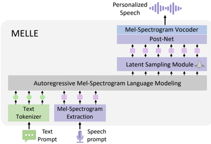

> [!abstract] ACL · 2025 · Conference
> **Lingwei Meng et al.** (Microsoft / The Chinese University of Hong Kong) · [→ Paper](https://aclanthology.org/2025.acl-long.65) · Demo: ✓ · Code: ?
>
> MELLE (Mel-spectrogram Language modeling) is a single-stage autoregressive TTS model that generates continuous mel-spectrogram frames directly — bypassing vector quantization entirely — using a regression loss, a novel spectrogram flux loss, and a variational latent sampling module to achieve CMOS of -0.032 vs. ground truth and SMOS higher than ground truth (4.40 vs. 3.94) on LibriSpeech test-clean.

## Problem

Codec language models (VALL-E and its variants) suffer from three structural problems: (1) discrete RVQ codes sacrifice fidelity relative to continuous mel-spectrogram representations, as demonstrated by the fact that mel-spectrogram reconstruction outperforms EnCodec reconstruction on both WER and SIM even at 8 codebooks; (2) the discrete sampling strategy (top-p) causes robustness failures — repetitions, silences, persistent noise — that are more severe than in text LMs because consecutive codec codes are more similar than consecutive text tokens; (3) the two-stage AR+NAR pipeline (coarse codes from AR, refinement from NAR) is computationally expensive and architecturally complex.

## Method

MELLE is a decoder-only transformer that autoregressively generates 80-dim log-magnitude mel-spectrogram frames conditioned on BPE text and a speech prompt. The architecture has five components:

**Autoregressive LM:** A 12-layer transformer decoder (16 heads, dim 1024, FFN 4096) operates on a concatenated sequence of [text tokens + prompt mel + target mel]. Input mel frames are projected to model dimension by a 3-layer MLP with dropout during both training and inference (following Tacotron). A reduction factor r allows predicting r frames per step.

**Latent Sampling Module (LSM):** Inspired by VAE, the LM output e_t is passed through a linear layer predicting (µ_t, log σ²_t) of a Gaussian distribution. A latent z_t is sampled via reparameterization and then projected back to spectrogram space. The KL divergence loss anchors the prior to N(y_t, I) rather than N(0, I) — using the ground truth frame as the prior mean accelerates learning. This module replaces top-p sampling for codec codes: it provides continuous diversity without the instability of discrete token sampling.

**Spectrogram Flux Loss:** A novel regularization term that maximizes the L1 difference between the predicted mean µ_t and the previous ground-truth frame y_{t-1}: L_flux = -Σ ||µ_t - y_{t-1}||₁. This penalizes flat predictions and prevents repetition/silence by rewarding variation between consecutive frames.

**Post-Net:** 5 convolutional blocks (kernel 5, 256 channels) refine the coarse prediction y' into y''.

**Training objective:** L = L_reg + λ·L_KL + β·L_flux + γ·L_stop, where L_reg is L1+L2 on both y' and y''. λ=0.1 after 10K warmup steps, β=0.5, γ=1.0.

**Inference:** Single forward pass — no NAR second stage. The prompt text + mel are prepended; the model autoregressively predicts target mel until the stop prediction layer signals EOS.

## Key Results

**Objective (Table 1, LibriSpeech test-clean, continuation task):**
- MELLE WER_C/WER_H: 1.47/1.98, SIM: 0.508
- VALL-E 2 WER_C/WER_H: 1.6/2.32, SIM: 0.504
- VALL-E WER_H: 3.8, SIM: 0.508
- Ground truth WER_H: 2.15, SIM: 0.668 (mel resynthesis: WER_H 2.24, SIM 0.617; EnCodec 8CB: WER_H 2.33, SIM 0.593) — confirming codec fidelity loss hypothesis

MELLE achieves 47.9% relative WER reduction vs. VALL-E and 8.1% vs. VALL-E 2 on continuation. Cross-sentence WER also beats VALL-E 2.

**Subjective (Table 3, 40 samples cross-sentence):**
- MELLE MOS: 4.20 ± 0.20 vs. GT 4.29 ± 0.16 (CMOS -0.032, p > 0.1 → not significantly different)
- MELLE SMOS: 4.40 ± 0.22 vs. GT 3.94 ± 0.25 — higher than ground truth, suggesting the model's speaker reproduction is more consistent than inter-utterance variation in the reference
- VALL-E 2 MOS: 4.08, CMOS: -0.085

**Efficiency (Table 5):**
- MELLE: 5.49s for 10s speech vs. VALL-E 2: 7.32s (no NAR second pass)
- MELLE-R2: 2.76s, MELLE-R4: 1.40s — 5x speedup at r=4 while still competitive

**Ablation (Table 4):** Removing both LSM and SFL degrades cross-sentence WER_C from 1.47 to 23.21 — catastrophic failure. SFL contributes the larger WER reduction; LSM contributes more to SIM.

## Novelty Assessment

Two genuinely novel components: (1) the spectrogram flux loss as a mechanism to prevent repetition in continuous AR prediction is a clean, effective regularizer not previously applied in this context; (2) the LSM's use of the ground-truth frame as the KL prior mean (rather than N(0,I)) is a targeted acceleration trick specific to the mel-spectrogram domain. The overall paradigm — AR prediction of continuous mel frames — builds on Tacotron's heritage but combines it with LLM-scale training and in-context learning. The paper provides the clearest empirical demonstration in the literature that codec discretization introduces a quantifiable fidelity loss vs. continuous mel.

The work is an ACL 2025 long paper and the published version of what was a Microsoft Research preprint; it represents a distinct architectural direction from VALL-E and its codec-based descendants.

## Field Significance

> [!tip]
> High — MELLE introduces a principled alternative to codec-based AR TTS by demonstrating that continuous mel-spectrogram generation can match or exceed codec language models in both quality and robustness. The spectrogram flux loss and variational latent sampling module together solve the two core challenges that had previously made continuous AR prediction impractical, establishing a new branch in the zero-shot TTS architecture landscape. The quantitative demonstration that discrete codec codes introduce a measurable fidelity loss relative to mel-spectrogram reconstruction (even at 8 codebooks) provides a concrete empirical foundation for preferring continuous representations.

## Claims

- Discrete codec representations introduce a quantifiable fidelity loss relative to continuous mel-spectrogram representations even at high codebook counts, measurable in both WER and speaker similarity. *(§5, Table 1)*
- Continuous-valued autoregressive speech synthesis can achieve robustness and naturalness on par with codec-based two-stage systems when paired with appropriate regularization objectives. *(§5.1, §5.2, Table 1, Table 3)*
- A variational latent sampling module applied to continuous spectrogram prediction provides diversity and robustness benefits analogous to top-p sampling for discrete tokens, without the instability caused by the high similarity of consecutive acoustic codes. *(§3.2.2, §5.3, Table 4)*
- Bypassing the non-autoregressive second stage in codec language model pipelines reduces inference time while maintaining competitive output quality. *(§5.4, Table 5)*
- Prediction quality in continuous-valued autoregressive TTS degrades gracefully with reduction factor increases, enabling a controllable quality-efficiency trade-off unavailable in discrete-token systems. *(§5.1, Table 1, Table 2)*

## Limitations and Open Questions

- English-only evaluation; multilingual extension not attempted.
- Vocoder quality bottleneck: uses open-source HiFi-GAN trained on 585h LibriTTS; Voicebox's proprietary vocoder trained on 60Kh provides higher quality ceiling.
- Mel-spectrogram as the only continuous representation explored; VAE latent states suggested as future work.
- SMOS exceeding ground truth may partly reflect the test setup's limitation (inter-speaker/inter-session variation in the reference set rather than genuine quality superiority).
- No streaming or low-latency inference analysis.

## Wiki Connections

MELLE is a direct architectural challenger to [[2301.02111]] (VALL-E) and its variants — its core claim is that VQ discretization is an unnecessary fidelity tax. It is cited alongside [[2406.02430]] (Seed-TTS) and [[2407.05407]] (CosyVoice) as examples of systems that combine AR LM with continuous second-stage decoding, but contrasts with them by doing everything in one stage. The codec fidelity comparison (mel > EnCodec 8CB) directly informs the [[neural-codec]] debate. The LSM component draws on [[VAE]] variational inference methodology. The [[autoregressive-codec-tts]] concept page should be updated to include MELLE as the continuous-valued AR alternative branch.

MELLE is evaluated against [[2406.05370|VALL-E 2]] and [[2406.07855|VALL-E R]] in objective and efficiency comparisons; [[2403.03100|NaturalSpeech 3]] appears in related work as a diffusion-based alternative. Citing papers in this corpus (integrated 2026-05-29): [[2025.emnlp-main.40|Controllable TTS Survey]] includes MELLE as a representative codec-free AR TTS system.
