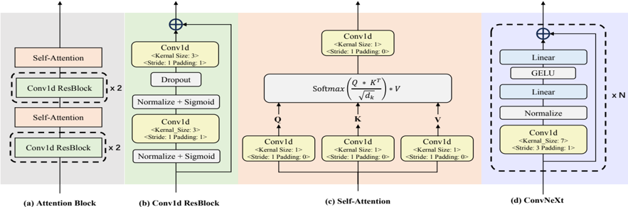

> [!abstract] ACL · 2025 · Conference
> **Shengpeng Ji et al.** (Zhejiang University) · [→ Paper](https://aclanthology.org/2025.acl-long.654) · Demo: ? · Code: ✓
>
> Language-Codec introduces a Masked Channel Residual Vector Quantization (MCRVQ) mechanism that redistributes information load across RVQ codebook channels, making the first channel easier to predict from text and thereby improving downstream autoregressive speech language model performance.

## Problem

Standard neural audio codecs (EnCodec, DAC, SpeechTokenizer) are designed to maximise reconstruction fidelity, not to ease token generation from weak conditioning signals like text. The Residual Vector Quantization (RVQ) structure concentrates most audio information in the first codebook channel, creating a high-entropy target that is difficult to model autoregressively from text. A second related problem is that high reconstruction quality typically demands many codebook layers (8+), which directly increases sequence length and computational burden for downstream language models. Prior work (SpeechTokenizer) attempted to load semantic content into the first channel via distillation from a self-supervised model, but this adds a dependency and does not address the generation difficulty in a first-principles way.

## Method

Language-Codec follows the standard encoder–quantizer–decoder structure used by EnCodec, operating at 24 kHz and outputting 75 latent frames per second. The encoder is identical to EnCodec's (1D convolution with strides (2,4,5,8), doubling channel count at each downsampling stage, followed by a two-layer LSTM).

The key architectural innovation is the **Masked Channel Residual Vector Quantization (MCRVQ)** module. Rather than a purely serial RVQ chain, MCRVQ splits the N quantizers into two stages. In the first Nq=3 layers the quantizers operate in parallel: each receives only 1/Nq of the latent frame (the rest is masked), so each of the first three codebooks carries an equal, reduced share of the total information. From layer Nq+1 onwards the quantizers revert to standard serial residual operation on the combined residual. The output embeddings from all layers are concatenated and fused. The net effect is that no single early channel dominates information content, making the first-channel token distribution lower-entropy and therefore more tractable for a text-conditioned autoregressive model to predict.

The decoder replaces EnCodec's transposed-convolution upsampler with a Vocos-style Fourier-based decoder. It runs at fixed feature resolution through Conv1d ResBlocks, a self-attention module, and ConvNeXt blocks, then reconstructs the waveform via inverse Short-Time Fourier Transform. An attention block inside the decoder is shown to matter: ablating it costs roughly 0.2 UTMOS points.

Training uses a composite loss: quantizer loss (L2 over codebook residuals), mel-spectrum L1 loss, adversarial hinge loss, and feature-matching loss. The discriminator ensemble includes the multi-period discriminator (MPD), multi-resolution discriminator (MRD), multi-scale discriminator (MSD), and a complex STFT discriminator at multiple time-scales. Training runs for 2 million iterations on 8×A100-40G GPUs with batch size 100, 24 kHz audio, and input segments truncated to 1 second.

The codec was trained on approximately 50,000 hours combining Librilight, DNS Challenge 4, Common Voice 16.0, LibriTTS, and 20,000 hours of internal Chinese speech. Downstream VALL-E and MobileSpeech models are trained on LibriTTS alone and evaluated on LibriSpeech Test-Clean following VALL-E's evaluation protocol (4–10 second prompts, first 3 seconds as acoustic prompt).

## Key Results

**Codec reconstruction (LibriTTS Test-Clean, Table 1):**
- Language-Codec with 4 codebooks (3.0 kbps): UTMOS 3.79, PESQ 3.27, STOI 0.949 — outperforms all 4-codebook baselines and several 8-codebook baselines (e.g., Encodec-8 PESQ 2.72, STOI 0.939).
- Language-Codec with 8 codebooks (6.0 kbps): UTMOS 4.04, PESQ 3.88, STOI 0.972 — best across all models on all metrics.
- Results hold under noisy conditions (LibriTTS Test-Other, Table 6) and out-of-domain (LJSpeech, Table 7).

**Downstream zero-shot TTS (LibriSpeech Test-Clean, Table 2):**
- Replacing EnCodec with Language-Codec in VALL-E raises SPK-SIM from 0.612 to 0.700 (+14%) with negligible WER change.
- MobileSpeech with Language-Codec: SPK-SIM 0.771, WER 2.9%, MOS-Q 4.20 vs. EnCodec baseline MOS-Q 3.91.

**MCRVQ ablation (Tables 3–4):** Removing MCRVQ (reverting to plain RVQ with 8 channels) reduces VALL-E SPK-SIM from 0.700 to 0.638 and MobileSpeech SPK-SIM from 0.771 to 0.710; CMOS falls by 0.19 and 0.25 respectively.

Comparisons are fair for reconstruction (same test sets, official weights used for baselines). Downstream TTS comparisons are controlled within-system (same model architecture, codec swapped), which isolates codec contribution cleanly.

## Novelty Assessment

The MCRVQ mechanism is genuinely novel in its motivation: it approaches codec design from the downstream generation perspective rather than from reconstruction alone. The insight that distributing information uniformly across the first few channels lowers prediction difficulty for autoregressive models is principled and experimentally validated.

The decoder design (Fourier-based, borrowed from Vocos) and multi-scale discriminator (borrowed from DAC/EnCodec) are not novel in isolation. The model-size ablation showing that 50k hours of training data is nearly equivalent to 585 hours for reconstruction quality is a useful empirical finding, though dataset size gains are primarily in domain coverage rather than per-sample quality.

The contribution is primarily architectural (MCRVQ) and training-recipe (discriminator design), with data-scale playing a supporting role for generalization. It is an incremental but well-motivated advance over SpeechTokenizer, which addressed a similar gap via semantic distillation rather than quantizer masking.

## Field Significance

Moderate — Language-Codec provides a first-principles alternative to semantic distillation (SpeechTokenizer) for improving codec compatibility with autoregressive speech language models: rather than injecting a semantic signal into the first codebook channel, MCRVQ achieves lower-entropy first-channel tokens purely through masked parallel quantization. The validated speaker similarity gains of 10–15% in downstream zero-shot TTS suggest that codec design choices have a meaningful and often underappreciated impact on downstream generation quality.

## Claims

- Codec token distributions in the first RVQ channel are a meaningful bottleneck for autoregressive generation from text, independent of reconstruction quality. *(§1, §3.3)*
- Redistributing information load uniformly across the first few RVQ codebook channels via parallel masked quantization consistently improves speaker similarity in downstream autoregressive TTS. *(§4.4, Table 3)*
- A Fourier-based decoder with a self-attention module achieves better codec reconstruction quality than a transposed-convolution upsampler, without length extrapolation issues. *(§3.2, Appendix G, Table 9)*
- Codec reconstruction quality does not scale substantially with training data volume beyond a few hundred hours, while domain generalization does benefit from larger and more diverse datasets. *(Appendix A, Table 5)*
- The choice of underlying codec has a larger impact on zero-shot TTS speaker similarity than on intelligibility, with codec swaps producing 10–15% SPK-SIM gains while WER differences remain within noise. *(§4.3, Table 2)*

## Limitations and Open Questions

- Language-Codec is trained and evaluated exclusively on speech; audio, music, and environmental sound domains are explicitly left as future work. The codec's suitability for general audio language models is therefore unvalidated.
- MCRVQ prediction accuracy drops when more than 4 codebook channels are used in downstream models, suggesting the information-redistribution benefit weakens at higher bitrates. The mechanism for this degradation is not fully explained.
- The paper evaluates downstream quality only with VALL-E and MobileSpeech; it is unclear whether the SPK-SIM gains extend to flow-matching or diffusion-based TTS backends.
- No demo page is linked in the paper, making it difficult to subjectively verify the quality claims beyond the crowd-sourced MOS.
- The internal 20,000-hour Chinese dataset is not publicly available, limiting full reproducibility of the 50k-hour training run.

## Wiki Connections

This paper advances [[neural-codec]] design specifically for speech language model compatibility. The downstream validation directly informs [[autoregressive-codec-tts]] — the VALL-E-style systems used as test beds. The zero-shot TTS evaluation protocol connects to [[zero-shot-tts]]. The broader framing of codecs as the interface layer between text and audio positions this work centrally within [[spoken-language-model]] research.
