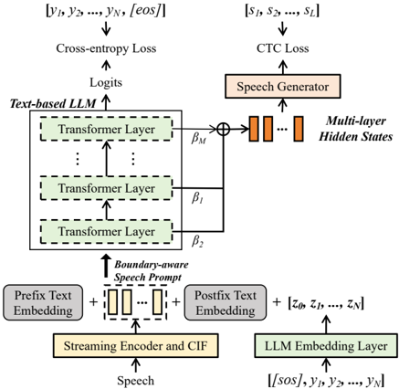
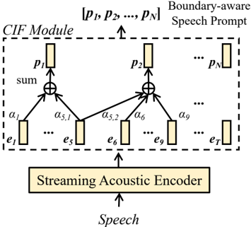

> [!abstract] ACL · 2025 · Conference
> **Deng et al.** (University of Cambridge) · [→ Paper](https://aclanthology.org/2025.acl-long.817) · Demo: ? · Code: ?
>
> SimulS2S-LLM is the first system to extend speech LLMs for simultaneous speech-to-speech translation (Simul-S2ST), using boundary-aware CIF prompts and a test-time wait-k policy to enable offline-trained LLMs to perform streaming S2ST without task-specific streaming training.

## Problem

Simultaneous speech-to-speech translation (Simul-S2ST) requires generating translated speech before the full source utterance has been received, imposing a fundamental quality-latency trade-off. Prior non-LLM systems such as StreamSpeech address this through multitask training and CTC-based alignment, but exploit neither the generation capabilities of large language models nor their potential for transfer to other tasks. The central obstacle to using speech LLMs for simultaneous inference is architectural: decoder-only speech LLMs prepend the entire speech prompt before generation, making streaming inherently incompatible with standard deployment. Existing workarounds either restrict the LLM to pre-determined streaming tasks or rely on external speech-text alignments derived during a separate processing stage, preventing end-to-end optimization.

## Method

SimulS2S-LLM assembles four components: a streaming acoustic encoder (fine-tuned from the xlsr\_53\_56k Fairseq checkpoint), a Continuous Integrate-and-Fire (CIF) module, a frozen text-based LLM (BLOOMZ-7B1 for Es-En and Fr-En; Llama3-8B for De-En), and a streaming speech generator. During offline training the complete source speech is prepended to the LLM input; the encoder and CIF are optimized in a first stage with cross-entropy loss on target-language text tokens, followed by a second stage that trains only the layer-wise LLM weighting coefficients and the causal Transformer speech generator under a CTC objective against mHuBERT semantic speech tokens.

The key innovation is the boundary-aware speech prompt: rather than using fixed downsampling of encoder outputs, the CIF module accumulates per-frame scalar weights and fires a speech prompt token whenever the cumulative weight reaches 1.0, producing prompts that are aligned to word boundaries. During simultaneous inference, a test-time wait-k policy limits which prefix of CIF-generated speech prompts is visible to the LLM at each decoding step, bridging offline training and streaming inference without any streaming-specific training. This boundary-aware representation is what makes the wait-k strategy effective: simple downsampling produces prompts that ignore word boundaries and leave the model unable to make reliable predictions from partial input.

The speech generator uses 8 causal Transformer layers (1024-dim attention, 2048-dim FFN, 8 heads) and upsamples LLM hidden states by a factor of 25 before CTC decoding. Rather than relying solely on the final LLM layer, a learned weighted sum across all layers is used: the final layer emphasizes semantic information useful for text prediction, while earlier layers retain richer representations better suited for speech token prediction. A speech-token-based 4-gram language model (KenLM) is fused into CTC decoding via shallow fusion, and an incremental beam search expands the token search space within each decoded chunk without adding latency. The predicted semantic tokens are passed to a pretrained unit-based HiFi-GAN vocoder to produce the target-language waveform.

## Key Results

On CVSS-C, SimulS2S-LLM outperforms the streaming StreamSpeech baseline by approximately 3-4 ASR-BLEU points at equivalent ATD on Es-En and Fr-En (Table 1, Fig. 4). For De-En, SimulS2S-LLM reaches 21.5 ASR-BLEU vs. StreamSpeech's 17.0 at similar latency. In streaming mode, SimulS2S-LLM (26.33 Es-En) approaches or exceeds several offline models such as UnitY (24.95) and DASpeech (21.37). BLASER 2.0 evaluation (Table 3) shows SimulS2S-LLM scoring 3.72 (QE) and 3.59 (Ref) vs. offline StreamSpeech at 3.37 and 3.35, confirming the translation quality advantage holds under a speech-aware metric.

The boundary-aware vs. boundary-unaware ablation is decisive: on Es-En, the CIF-based prompt outperforms fixed downsampling by roughly 4 ASR-BLEU points at matched ATD across all wait-k settings (Table 4, §5.1). A similar 4-BLEU gap is observed on the Simul-S2TT text output (Table 11, §5.2), confirming the gap is driven by LLM prediction quality rather than the speech generator. Multi-layer hidden state aggregation adds approximately 1 ASR-BLEU point over using only the final layer (Fig. 6, §5.3). n-gram LM fusion over greedy CTC adds 1.6 ASR-BLEU (26.3 vs. 24.7 on Es-En, Table 2, §5.4) at identical latency. Computation-aware latency is higher than standard ATD due to LLM inference overhead (Tables 8-10, §D), but the quality-latency trade-off remains competitive.

> [!note]
> Comparisons in Table 1 are not well-controlled: StreamSpeech results are from a reproduction on CVSS-C, while SeamlessStreaming (Appendix E) uses ~9,300 hours of S2ST data vs. 70-174 hours for SimulS2S-LLM. Direct numerical comparison across these rows should be interpreted with caution.

## Novelty Assessment

The primary contribution is methodological: demonstrating that offline-trained speech LLMs can be adapted to simultaneous inference through boundary-aware CIF prompting and a test-time wait-k policy, without streaming-specific retraining. CIF, wait-k, and frozen LLM inference are individually established techniques; the novelty lies in their combination and in identifying boundary-awareness as the missing ingredient that enables this combination to work. The incremental beam search, which expands the CTC search space within a chunk without propagating hypotheses across chunks, is a modest but practical algorithmic contribution. The frozen LLM design choice reflects compute constraints (7B/8B models on two A100s) rather than a deliberate design principle, and the system cannot exploit larger or closed-source models.

## Field Significance

Moderate — SimulS2S-LLM provides the first demonstration that offline-trained speech LLMs can perform simultaneous S2ST via inference-time policies, eliminating the need for task-specific streaming training. The boundary-aware CIF insight is transferable: any speech LLM using downsampled prompts for simultaneous tasks may benefit from replacing fixed downsampling with boundary-aligned representations. LLM inference overhead remains a practical obstacle, and the evaluation is confined to three European language pairs on a relatively small dataset.

## Claims

- **supports:** Boundary-aware speech representations are critical for enabling offline-trained speech LLMs to perform simultaneous inference via wait-k strategies.
  > *Evidence:* CIF-based boundary-aware prompts outperform fixed downsampling by approximately 4 ASR-BLEU points at equivalent latency on Es-En, Fr-En, and De-En CVSS-C test sets, with a parallel ~4 BLEU gap on text output confirming the bottleneck is LLM prediction rather than speech synthesis. *(§5.1, §5.2, Tables 4, 11)*

- **supports:** Offline training combined with test-time simultaneous inference policies can match or outperform systems trained specifically for streaming in speech-to-speech translation.
  > *Evidence:* SimulS2S-LLM, trained offline, consistently outperforms the streaming-trained StreamSpeech model across all three language pairs at comparable latency, achieving up to 4 ASR-BLEU improvement on Es-En. *(§5.1, Fig. 4, Table 1)*

- **supports:** Aggregating LLM hidden states across multiple layers improves discrete speech token prediction compared to using only the final layer.
  > *Evidence:* Multi-layer hidden state weighting yields approximately 1 ASR-BLEU improvement over last-layer-only decoding on CVSS-C Es-En Simul-S2ST, attributed to the final layer's focus on semantic text information at the expense of acoustic richness needed for speech token generation. *(§5.3, Fig. 6)*

- **complicates:** LLM-based approaches to simultaneous speech generation face a latency penalty from LLM inference overhead that narrows the practical quality-latency advantage over non-LLM methods.
  > *Evidence:* Computation-aware ATD for SimulS2S-LLM is substantially higher than standard ATD (e.g., 4239ms vs. 3440ms at k=8 on Es-En), and the system is not evaluated at very low latency regimes (AL < 1s) where reordering requirements make offline-trained models unsuitable. *(§D, Tables 8-10, Limitations)*

- **supports:** Shallow fusion of n-gram language models with CTC decoding of discrete speech tokens improves simultaneous speech translation quality without increasing latency.
  > *Evidence:* n-gram LM fusion over greedy CTC search improves ASR-BLEU from 24.7 to 26.3 on CVSS-C Es-En at identical ATD of 3439ms. *(§5.4, Table 2)*

## Limitations and Open Questions

> [!warning]
> The system is not evaluated at very low latency (AL < 1s), a regime the authors identify as unsuitable for offline-trained models due to reordering requirements. This excludes SimulS2S-LLM from the most latency-critical applications. Computation-aware latency is substantially higher than the reported ATD, and all experiments use 7B/8B open-source LLMs on small datasets (70-174 hours per language pair), leaving scalability to larger models and data unverified.

The evaluation is limited to three European language pairs in a single translation direction each. Language pairs with greater structural divergence or more extensive reordering would stress the wait-k assumption more severely. The system has not been evaluated on offline inference or tasks other than S2ST and S2TT, despite the claim that offline training preserves such capabilities. Long-form simultaneous speech translation is also untested due to lack of suitable data.

## Wiki Connections

- [[spoken-language-model|Spoken Language Model]] — this paper extends frozen text-based LLMs to simultaneous speech-to-speech tasks by prepending boundary-aware CIF speech prompts, demonstrating a new inference capability for speech LMs.
- [[speech-to-speech|Speech-to-Speech]] — SimulS2S-LLM directly addresses simultaneous S2ST, advancing the field by showing LLM-based approaches can outperform dedicated streaming systems in this setting.
- [[streaming-tts|Streaming TTS]] — the causal Transformer speech generator and incremental beam search enable streaming synthesis of discrete speech tokens, contributing a practical solution for low-latency speech output from LLMs.
- [[self-supervised-speech|Self-Supervised Speech]] — the system depends on two SSL models: the xlsr\_53\_56k encoder (fine-tuned as the streaming acoustic encoder) and mHuBERT (for extracting discrete speech token targets).
- [[neural-codec|Neural Audio Codec]] — the paper uses a discrete speech token pipeline (mHuBERT semantic tokens + unit-based HiFi-GAN vocoder) as its speech synthesis back-end, situating it within the broader discrete-token speech generation paradigm.
- [[2301.02111|VALL-E]] — cited as a representative example of extending LLM vocabulary with discrete speech tokens for generative spoken language modeling, contrasted with SimulS2S-LLM's approach of conditioning a frozen text LLM on continuous speech prompts.
