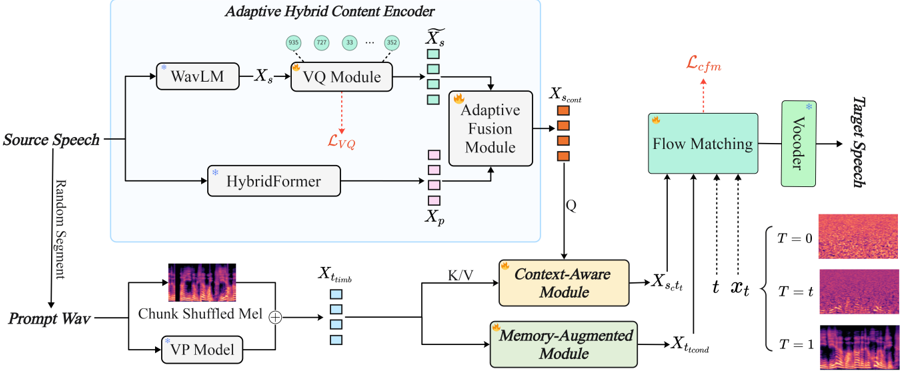

> [!abstract] ACL · 2025 · Conference
> **Yang Yuguang et al.** (Ximalaya Inc. / Kyushu University / Northwestern Polytechnical University / University of Tokyo) · [→ Paper](https://aclanthology.org/2025.acl-long.87) · Demo: ✓ · Code: ?
>
> Takin-VC proposes an adaptive hybrid content encoder that fuses PPG and quantized WavLM features alongside memory-augmented and cross-attention timbre modules to improve expressiveness and speaker similarity in zero-shot voice conversion, using conditional flow matching for mel-spectrogram reconstruction.

## Problem

Zero-shot voice conversion requires converting source speech to match an unseen target speaker while preserving phonetic content, but existing systems face two persistent challenges. First, self-supervised representations (SSL) carry residual timbre information from the source speaker, causing "timbre leakage" into the content representation. Second, most systems model timbre as a global, time-invariant speaker embedding, which fails to capture the close interdependence between timbre and local content context, weakening speaker similarity for unseen speakers. Beyond speaker similarity, existing zero-shot VC methods struggle with highly expressive speech: paralinguistic characteristics such as breathing, crying, and emotional nuances are lost in conversion, limiting applicability in real-world expressive settings.

## Method

Takin-VC consists of three main components: an adaptive hybrid content encoder, a memory-augmented context-aware timbre modeling stage, and a conditional flow matching (CFM) decoder.

The hybrid content encoder extracts content from two complementary sources. A pre-trained HybridFormer (an ASR-trained conformer variant) generates phonetic posterior-grams (PPGs), which are precise for linguistic content but lack paralinguistic richness. Separately, WavLM features from the 6th layer are quantized using a single-layer residual vector quantizer (RVQ) with an 8,200-entry codebook borrowed from EnCodec. Quantization suppresses continuous timbre variation in the SSL features before they enter the fusion stage. An adaptive fusion module then uses the quantized WavLM features as element-wise multiplicative weights applied to the PPGs: gradients flow back to scale the WavLM coefficients in a way that amplifies paralinguistic patterns underrepresented in PPGs, rather than requiring explicit supervision.

For timbre modeling, a memory-augmented module processes shuffled mel-spectrogram frames from the reference speaker (shuffling eliminates content order while retaining spectral timbre statistics) together with a speaker verification embedding, passing through convolution and self-attention layers before a FiLM layer produces the conditioning input for the CFM model. A separate context-aware module uses cross-attention to generate a fused content-timbre representation: the source content serves as query and the reference timbre as key and value. Both representations condition the CFM decoder jointly.

The CFM decoder follows optimal-transport flow matching (OT-CFM), mapping Gaussian noise to source mel-spectrograms conditioned on the two timbre representations. The decoder uses a 10-layer UNet backbone with 3 ResNet blocks and hidden size 1280, with a Memory Fusion Block inserted into the UNet to reinforce speaker consistency. Training combines the CFM regression loss with an RVQ commitment loss (weighted at 0.01). Inference uses 10 ODE steps with classifier-free guidance at 0.7. The final mel-spectrogram is passed through a pre-trained BigVGAN vocoder.

## Key Results

On LibriTTS test-clean (Table 1), Takin-VC achieves NMOS 3.98, SMOS 4.11, WER 2.35, UTMOS 4.08, and SECS 0.71, outperforming all six baselines across all metrics. The most competitive baselines are SeedVC (NMOS 3.87, SECS 0.68, WER 2.51) and StableVC (SMOS 3.88). Takin-VC also achieves the lowest RTF of 0.154, faster than all baselines including diffusion-free SEFVC (0.187). VALLE-VC, the autoregressive language model baseline, is the slowest at RTF 3.678 by a large margin.

On the large-scale proprietary dataset (500k hours, Table 2), performance improves further across all directions: NMOS reaches 4.12-4.16 and SECS reaches 0.70-0.74. Same-gender conversions (F2F: SECS 0.74, M2M: 0.73) consistently score slightly higher in speaker similarity than cross-gender conversions (F2M: 0.71, M2F: 0.70), a gap that persists on both SMOS and SECS.

Ablation results confirm the importance of each component. Removing the SSL branch (WavLM-only content) drops SMOS from 4.11 to 3.07 and SECS from 0.71 to 0.45, indicating severe timbre leakage when PPGs are absent. Removing the PPG branch (SSL-only) drops NMOS to 3.63 and WER to 2.64. Removing context-aware timbre modeling drops SMOS from 4.11 to 3.61 and SECS to 0.58. Removing the memory-augmented module drops SECS from 0.71 to 0.52.

## Novelty Assessment

The core novelty lies in how content and timbre are separately engineered. The adaptive fusion of PPGs and quantized SSL features via gradient-driven element-wise multiplication is a concrete, implementation-level contribution that addresses timbre leakage differently from simple concatenation or element-wise addition. The memory-augmented timbre module and context-aware cross-attention are incremental extensions of established mechanisms (self-attention, FiLM, cross-attention) applied to a carefully constructed timbre conditioning problem. The use of OT-CFM as the synthesis backbone rather than diffusion is a sound architectural choice for inference speed but is not novel in this paper.

The claim that this is "the first approach capable of simultaneously transforming the source timbre to arbitrary unseen speakers while effectively maintaining the paralinguistic characteristics" is not independently verifiable from the paper alone, and the evaluation of paralinguistic preservation is subjective (the paper uses NMOS and SMOS rather than targeted expressiveness or emotion metrics). The gains over competitive baselines (SeedVC, StableVC) are real but modest in absolute terms on LibriTTS. The large-scale training on 500k hours of proprietary multilingual data is a significant practical advantage that cannot be reproduced by academic groups, which limits fair comparison.

## Field Significance

Moderate - Takin-VC provides a solid engineering contribution to expressive zero-shot voice conversion by combining PPG-SSL hybrid encoding with gradient-driven fusion and structured timbre modeling. The gradient-driven adaptive fusion mechanism addresses timbre leakage in a novel way compared to prior quantization-only approaches, and the system demonstrates consistent improvements over a broad set of baselines including diffusion, language model, and SSL-based systems. The work is primarily an engineering integration with careful design choices rather than a conceptual advance in how zero-shot VC is framed.

## Claims

- supports: Combining ASR-derived phonetic features and quantized self-supervised representations via adaptive fusion reduces timbre leakage while preserving paralinguistic content in zero-shot voice conversion.
  Evidence: Removing the PPG branch (WavLM-only) causes SMOS to drop from 4.11 to 3.07 and SECS from 0.71 to 0.45 on LibriTTS, indicating that SSL features alone carry substantial timbre leakage; removing the SSL branch degrades NMOS and WER, confirming PPGs alone lose paralinguistic richness. *(§5.3, Table 3)*

- supports: Flow matching provides faster inference than diffusion-based voice conversion systems without sacrificing speaker similarity or naturalness.
  Evidence: Takin-VC achieves RTF 0.154, lower than DiffVC (0.294), NS2VC (0.347), and SeedVC (0.341), while simultaneously outperforming these baselines on NMOS, SMOS, and SECS. *(§5.1, Table 1)*

- complicates: Global, time-invariant speaker embeddings are insufficient for robust timbre modeling in expressive zero-shot voice conversion.
  Evidence: Removing the context-aware cross-attention module (which aligns source content with target timbre dynamically) drops SMOS from 4.11 to 3.61 and SECS from 0.71 to 0.58, while the memory-augmented module removal drops SECS to 0.52. Both modules provide content-sensitive timbre conditioning beyond a static speaker embedding alone. *(§5.3, Table 4)*

- complicates: Cross-gender voice conversion consistently yields lower speaker similarity than same-gender conversion even in well-trained systems.
  Evidence: On the large-scale multilingual dataset, same-gender pairs (F2F: SECS 0.74; M2M: 0.73) outperform cross-gender pairs (F2M: 0.71; M2F: 0.70) in speaker embedding cosine similarity, a gap that persists across all conversion directions. *(§5.2, Table 2)*

- refines: Quantizing self-supervised speech features before content encoding reduces timbre leakage more effectively than using continuous SSL representations directly.
  Evidence: The RVQ quantizer (codebook size 8,200) applied to WavLM features is the key mechanism for timbre suppression in the hybrid encoder; ablation with WavLM-only (continuous features without adaptive fusion) shows SECS drops to 0.45 compared to 0.71 for the full model, consistent with timbre leakage from unquantized SSL features. *(§3.2, §5.3, Table 3)*

## Limitations and Open Questions

> [!warning]
> All large-scale training data (500k hours) and the 100-speaker evaluation set are proprietary and not publicly available. The large-scale results cannot be reproduced by external researchers, and it is unclear how much of the gain over competitive baselines is attributable to data scale rather than the proposed modules.

The paper does not include targeted evaluation of paralinguistic preservation (breathing, crying, emotion transfer), despite listing this as a primary contribution. NMOS and SMOS measure general naturalness and speaker similarity but are not designed to capture expressive fidelity specifically. Speech editing under zero-shot conditions is acknowledged as out of scope and a direction for future work. Ethical risks from voice impersonation are noted but no technical mitigations are proposed.

## Wiki Connections

- [[flow-matching|Flow Matching]] — Takin-VC uses optimal-transport conditional flow matching as its mel-spectrogram reconstruction backbone, contributing evidence that flow matching enables real-time inference in zero-shot VC (RTF 0.154).
- [[voice-conversion|Voice Conversion]] — the paper addresses expressive zero-shot VC, extending the task to paralinguistic characteristics such as breathing and emotional nuances alongside standard timbre transfer.
- [[self-supervised-speech|Self-Supervised Speech]] — WavLM is a core component of the hybrid content encoder, with the 6th-layer representations quantized via RVQ to suppress timbre leakage before adaptive fusion with PPGs.
- [[disentanglement|Disentanglement]] — the adaptive fusion module, RVQ quantization of SSL features, and the separation of timbre and content pathways collectively form an explicit disentanglement strategy for zero-shot VC.
- [[speaker-adaptation|Speaker Adaptation]] — the memory-augmented and context-aware timbre modules adapt to unseen target speakers at inference time using only a short reference clip, without any fine-tuning.
- [[neural-codec|Neural Audio Codec]] — Takin-VC borrows EnCodec's RVQ quantizer to discretize WavLM content features, repurposing codec quantization as a timbre suppression tool rather than as the output representation.
