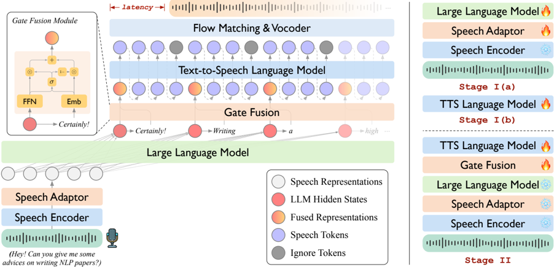

> [!abstract] ACL · 2025 · Conference
> **Qingkai Fang et al.** (Chinese Academy of Sciences) · [→ Paper](https://aclanthology.org/2025.acl-long.912) · Demo: ✓ · Code: ✓
>
> LLaMA-Omni 2 is a modular speech language model family (0.5B–14B) that achieves real-time spoken dialogue by coupling a Qwen2.5 LLM with an autoregressive streaming TTS language model and a causal flow matching decoder, surpassing prior state-of-the-art SpeechLMs while training on only 200K multi-turn samples.

## Problem

Prior spoken chatbot systems faced a three-way tension between intelligence, naturalness, and latency. Cascaded ASR-LLM-TTS pipelines accumulate errors and incur high latency. Native speech language models such as GLM-4-Voice achieve strong quality but require millions of hours of speech pretraining data. Earlier modular systems like the original LLaMA-Omni used a non-autoregressive (NAR) CTC-based streaming decoder that kept latency low but produced less natural and fluent speech. Freeze-Omni combined NAR and autoregressive models but could only do sentence-level streaming, limiting responsiveness. No prior modular system simultaneously achieved sub-600ms latency, high UTMOS naturalness scores, and low ASR-WER text-speech consistency at the efficiency of a few hundred thousand training samples.

## Method

LLaMA-Omni 2 is a modular SpeechLM comprising three learned components arranged around a frozen or fine-tuned LLM.

**Speech understanding.** A Whisper-large-v3 encoder converts input speech into frame-level representations, which pass through a downsampling adapter (5x frame concatenation followed by a feed-forward network) before entering the LLM. In Stage I(a), the encoder is frozen and the adapter plus LLM are fine-tuned on speech-instruction/text-response pairs.

**LLM backbone.** The Qwen2.5-Instruct series is used at five sizes (0.5B, 1.5B, 3B, 7B, 14B). During inference the LLM autoregressively generates text tokens, and every R tokens its hidden states and the corresponding decoded text tokens are forwarded to the TTS language model.

**Streaming TTS language model (M_TTS).** A decoder-only transformer initialized from Qwen2.5-0.5B with an extended vocabulary covering 6561 speech tokens produced by the CosyVoice 2 FSQ tokenizer (25 tokens/s, based on a quantized SenseVoice-Large encoder). M_TTS receives a gate-fused combination of LLM hidden states and text token embeddings: a learned sigmoid gate adaptively blends the two representations element-wise, allowing the model to exploit both broad contextual information from hidden states and precise textual content from embeddings. A "Read R / Write W" strategy interleaves reading R fused LLM representations with generating W speech tokens, enabling synchronized streaming of text and speech. The default setting is R=3, W=10.

**Flow matching vocoder.** Each chunk of W speech tokens is consumed by the pretrained CosyVoice 2 chunk-aware causal flow matching model, which synthesizes mel spectrogram frames that are then converted to waveform by a pretrained HiFi-GAN vocoder.

**Training** is two-stage. Stage I trains speech-to-text (adapter + LLM) and text-to-speech (M_TTS offline pretraining) components independently on decomposed speech-to-speech dialogue pairs. Stage II freezes the encoder, adapter, and LLM and trains only the gate fusion module and M_TTS end-to-end on full speech-to-speech pairs for one epoch.

**Data.** A 200K multi-turn speech-to-speech dialogue dataset was synthesized by extending the InstructS2S-200K corpus. Text dialogues were generated by Llama-3.3-70B-Instruct using a Poisson-sampled number of turns (1–5). Instruction speech was synthesized with diverse voices via fish-speech-1.5 and CosyVoice2-0.5B; responses used a single fixed voice via CosyVoice2-0.5B.

## Key Results

All results are from Table 1 (SpokenQA and Speech Instruction Following on Alpaca-Eval subsets).

**Spoken QA accuracy (S2S setting):** LLaMA-Omni2-7B achieves 60.7% on Llama Questions and 31.3% on Web Questions, versus GLM-4-Voice's 50.7%/15.9% and LLaMA-Omni's 49.0%/23.7%. The 7B model reduces the S2T-to-S2S accuracy gap to 3.2 points on Web Questions, compared to 16.3 for GLM-4-Voice and 9.7 for LLaMA-Omni.

**Speech instruction following (S2S):** LLaMA-Omni2-7B ChatGPT Score = 4.15; LLaMA-Omni2-14B = 4.35. Both exceed GLM-4-Voice (4.09) and LLaMA-Omni (3.52).

**Speech naturalness (UTMOS):** LLaMA-Omni2 models score 4.19–4.22 across sizes, substantially above GLM-4-Voice (3.48) and LLaMA-Omni (3.67).

**ASR-WER (text-speech consistency):** LLaMA-Omni2-7B achieves 3.26%, the lowest among all comparable systems, versus 9.02% for GLM-4-Voice and 5.95% for LLaMA-Omni.

**Latency:** LLaMA-Omni2-7B at R=3, W=10 achieves 582ms on a single L40 GPU, well within the 600ms threshold. With R=1, W=5 latency drops to 457ms at modest quality cost. GLM-4-Voice has latency of 1562ms by comparison.

Ablation studies (Tables 2–5) confirm the importance of the gate fusion module, streaming TTS pretraining over offline or scratch initialization, and that multi-turn data consistently improves over single-turn data of the same size.

## Novelty Assessment

The primary contributions are engineering and training-recipe rather than fundamentally new architecture. The gate fusion mechanism (blending LLM hidden states with text embeddings as input to M_TTS) is a modest but empirically validated addition over simpler fusion baselines. The key insight is that adopting CosyVoice 2's autoregressive streaming TTS design inside a modular SpeechLM, combined with a two-stage training strategy on a compact synthetic dataset, recovers the naturalness gap of prior NAR-based systems (LLaMA-Omni) while retaining their low-latency streaming property. The 200K multi-turn dataset construction pipeline is practical and replicable. The contribution is primarily a demonstration that the native/modular quality gap can be closed at far lower data cost than previously thought — GLM-4-Voice used millions of hours; LLaMA-Omni 2 uses roughly a few thousand hours of synthesized speech.

## Field Significance

Moderate — LLaMA-Omni 2 demonstrates that modular spoken conversational agents can match native speech language models in naturalness and instruction-following quality while using orders of magnitude less training data, providing practical evidence that the data cost barrier for high-quality speech interaction is lower than previously assumed. The system introduces no fundamentally new architecture but offers a well-ablated, reproducible recipe that can serve as a strong baseline for future modular SpeechLM work.

## Claims

- Autoregressive streaming speech decoders in modular spoken conversational agents substantially improve naturalness over non-autoregressive alternatives with comparable latency. *(§5.1, Table 1)*
- A gate fusion mechanism that adaptively blends LLM hidden states with text token embeddings as input to the TTS language model improves both instruction following quality and text-speech consistency over simpler additive fusion. *(§5.2, Table 2)*
- Streaming TTS pretraining on speech dialogue data is critical for quality: initializing from a text-only pretrained model degrades performance substantially, and training from scratch fails to converge. *(§5.2, Table 3)*
- Multi-turn dialogue training data consistently outperforms single-turn data of the same total size for modular speech language models across spoken QA and instruction-following benchmarks. *(§5.3, Table 5)*
- The S2T-to-S2S accuracy gap in spoken question answering is a meaningful indicator of speech generation quality, and autoregressive TTS decoders reduce this gap relative to non-autoregressive alternatives. *(§5.1, Table 1)*

## Limitations and Open Questions

The model generates speech in a single fixed output style; it cannot modulate emotion, speaking rate, or dialect in response to the content or paralinguistic cues of the input speech. All evaluation is in English. The output voice is fixed during training (a single uniform voice for all responses), which limits expressiveness and speaker diversity. The system is inherently a response-after-input architecture and does not support full-duplex conversation. Latency, while adequate for real-time interaction, leaves room for further reduction via engineering optimization. Whether the gate fusion approach generalizes to multilingual settings or to more expressive speech styles is not explored.

## Wiki Connections

This paper advances [[spoken-language-model]] by demonstrating that modular SpeechLMs can match native SpeechLMs at far lower data cost. The autoregressive streaming TTS component is a direct application of the [[autoregressive-codec-tts]] paradigm, inheriting the CosyVoice 2 speech tokenizer and [[flow-matching]] decoder. The FSQ-based speech tokenizer relates to [[neural-codec]] design. The streaming inference design connects to [[streaming-tts]] concerns around latency-quality trade-offs. [[speech-to-speech]] dialogue is the primary application context. In-corpus: [[2501.04561|OpenOmni]], a concurrent modular SpeechLM with real-time emotional speech synthesis.
