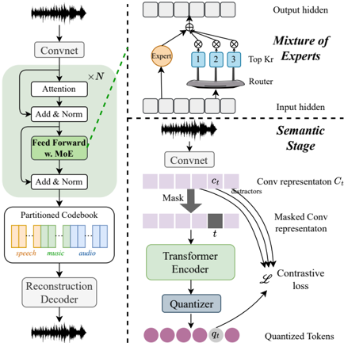

> [!abstract] ACL · 2025 · Conference
> **Jiang et al.** · [→ Paper](https://aclanthology.org/2025.acl-long.937) · Demo: ? · Code: ?
>
> UniCodec introduces a partitioned domain-adaptive codebook combined with a domain Mixture-of-Experts encoder to achieve a single-codebook, 75-token-per-second codec that matches or exceeds domain-specific baselines across speech, music, and sound simultaneously.

## Problem

Single-layer quantizer codecs have gained traction for audio language modeling because they produce one token per frame, avoiding the multi-stream decoding complexity of residual vector quantization. However, prior single-codebook codecs either target a single audio domain (speech-only WavTokenizer) or suffer significant performance degradation when trained on mixed speech, music, and sound data. The distribution mismatch across domains means that a naive shared codebook cannot simultaneously capture fine-grained acoustic detail in all three domains, and existing approaches that enrich codec semantics require external pretrained SSL encoders that cannot be naturally extended to non-speech domains.

## Method

UniCodec is built on the VQ-VAE encoder-quantizer-decoder framework, extending WavTokenizer (Ji et al., 2024) as its baseline. The encoder replaces WavTokenizer's LSTM with an 8-layer contextual Transformer (8 attention heads, RoPE positional encoding, hidden size 512, MLP dimension 2048), which provides richer contextual representations before quantization.

Two mechanisms address the multi-domain challenge. First, the codebook is partitioned into three non-overlapping regions: indices 0-4095 for speech, 4096-8191 for music, and 8192-16383 for sound, giving a total vocabulary of 16,384 entries. During training, each sample updates only the entries in its domain's region, preventing cross-domain interference. At inference, no domain label is needed; the quantizer selects the nearest entry from the full codebook, and the domain structure emerges autonomously. Second, the Transformer's feed-forward networks are structured as a domain Mixture-of-Experts (MoE) layer following the DeepSeekMoE design, with one shared expert capturing cross-domain patterns and three routed experts handling domain-specific features, with one routed expert active per token (K_r = 1). Codebook collapse is addressed via SimVQ, which uses a linear layer to improve codebook utilization without auxiliary projection heads.

Training proceeds in two stages. The acoustic stage optimises reconstruction loss in both time and frequency domains along with multi-resolution discriminator losses, following WavTokenizer. The semantic stage then adds a mask prediction objective inspired by wav2vec 2.0: a proportion of encoder convolutional output features are masked before entering the Transformer, and the quantized representations must identify the original unmasked features using a contrastive loss against within-utterance distractors. This approach enriches semantic density without any additional modules or pretrained encoders. A final fine-tuning stage on high-quality speech data (LibriTTS train-clean, VCTK, LJSpeech) corrects reconstruction quality degradation introduced by large-scale noisy training. The model has 274M parameters and operates at 75 tokens per second (320x downsample rate).

## Key Results

On speech reconstruction (LibriTTS test-clean), UniCodec achieves PESQ 3.03, STOI 0.949, and UTMOS 3.99 at 75 TPS, outperforming both WavTokenizer (speech) (PESQ 2.37, STOI 0.914) and BigCodec (PESQ 2.69, STOI 0.929) at comparable token rates. It also surpasses the unified single-codebook baseline WavTokenizer (unified) (PESQ 1.84) by a large margin. Against multi-layer RVQ codecs operating at 600 TPS, UniCodec's PESQ and STOI are competitive or better than Encodec and SpeechTokenizer at eight times fewer tokens per second (Table 3).

Subjective MUSHRA scores confirm the objective findings. UniCodec scores 90.74 on speech versus 85.44 for WavTokenizer (speech) and 80.40 for WavTokenizer (unified). In music and audio domains, UniCodec scores 77.77 and 82.43, exceeding the corresponding domain-specific WavTokenizer variants (75.24 and 80.19) (Table 4).

Semantic evaluation on the ARCH benchmark shows UniCodec outperforms WavTokenizer (speech) on speech classification (RAVDESS: 40.28 vs 32.55; Audio-MNIST: 70.94 vs 69.57) and WavTokenizer (music/audio) on music and audio classification tasks. The ablation removing the semantic training stage confirms its contribution, with RAVDESS dropping to 36.81 (Table 5).

Ablation study confirms that both the partitioned domain-adaptive codebook and the MoE module contribute substantially, with removing either leading to significant Mel Distance degradation across all three domains (Table 6). The fine-tuning stage has the largest single impact on reconstruction quality.

## Novelty Assessment

The partitioned codebook and domain MoE strategy together constitute a genuine architectural contribution to multi-domain single-codebook codec design. The idea of assigning non-overlapping codebook regions per domain and using MoE routing in the encoder's feed-forward layers is a novel combination, even though both domain partitioning and MoE are established techniques elsewhere. The self-supervised mask prediction stage avoids dependence on external SSL encoders, which is a meaningful engineering improvement over SpeechTokenizer and Mimi, but the objective is directly lifted from wav2vec 2.0. The primary advance is in showing that domain-adaptive codebook design and MoE routing can resolve the multi-domain single-codebook trade-off, rather than in fundamental methodological invention. Comparisons are fair: baselines use their own released checkpoints and are evaluated under the same conditions.

## Field Significance

Moderate — UniCodec demonstrates that a carefully partitioned codebook with domain-specific routing can close the gap between domain-specific and unified single-codebook codecs, a problem left open by prior work. The self-supervised semantic training approach provides a module-free alternative to SSL encoder distillation for enriching codec representations, relevant to any codec targeting audio language model integration.

## Claims

- supports: Domain-adaptive partitioning within a shared codebook resolves the performance degradation that plagues unified single-codebook codecs on mixed multi-domain audio.
  Evidence: Removing the partitioned codebook raises Mel Distance from 0.344 to 0.487 on speech and from 0.396 to 0.506 on music in ablation; the full UniCodec outperforms WavTokenizer (unified) on all three domains in both objective and MUSHRA evaluation. *(§3.2, §5.3, Tables 2, 4, 6)*

- supports: Self-supervised mask prediction objectives integrated directly into codec training improve semantic representation without requiring external pretrained SSL encoders.
  Evidence: The semantic training stage improves RAVDESS classification accuracy from 36.81 to 40.28 and Audio-MNIST from 69.84 to 70.94 compared to the codec without this stage; no auxiliary SSL model is used. *(§3.4, §5.2, Table 5)*

- complicates: Joint training of reconstruction and self-supervised semantic objectives from scratch degrades single-codebook codec performance; sequential staging is required.
  Evidence: Preliminary experiments show that training reconstruction, mask prediction, and contrastive loss simultaneously is infeasible; the two-stage approach (acoustic training first, then semantic stage) is necessary for stable convergence. *(§3.4)*

- complicates: Large-scale diverse audio training data introduces noise that degrades codec reconstruction quality, requiring targeted fine-tuning on curated high-quality subsets.
  Evidence: Training on 80K hours of mixed data without the fine-tuning stage raises Mel Distance by 0.103 on speech (0.448 vs 0.344) relative to the fine-tuned model; high-quality fine-tuning on LibriTTS clean, VCTK, and LJSpeech recovers most of the degradation. *(§4, §5.3, Appendix C, Table 6)*

- supports: Single-codebook codecs at 75 tokens per second can achieve acoustic reconstruction quality competitive with multi-layer RVQ codecs operating at 600 tokens per second when combined with domain-adaptive design.
  Evidence: UniCodec PESQ 3.03 and STOI 0.949 on LibriTTS test-clean exceeds Encodec (2.72, 0.939) and SpeechTokenizer (2.61, 0.917) at 600 TPS, with eight times fewer tokens per second. *(§5.1, Table 3)*

## Limitations and Open Questions

> [!warning]
> Training is sensitive to noisy or low-quality input: large-scale noisy data alone degrades reconstruction quality, and the fine-tuning stage is essential. This dependency on curated data limits scalability.

The single-codebook codec struggles to balance both acoustic reconstruction fidelity and semantic density across diverse domains simultaneously, as these objectives conflict. Streaming performance degrades relative to non-streaming inference. The paper does not demonstrate integration with an actual audio language model, leaving downstream generation quality unvalidated.

## Wiki Connections

- [[neural-codec|Neural Audio Codec]] — UniCodec proposes a novel partitioned domain-adaptive codebook with domain MoE routing to unify speech, music, and sound in a single 75-TPS codebook, advancing the design space for low-bitrate multi-domain codecs.
- [[autoregressive-codec-tts|Autoregressive Codec TTS]] — the single-codebook, single-token-per-frame design is motivated directly by reducing decoding complexity in language model-based audio generation.
- [[evaluation-metrics|Evaluation Metrics]] — the paper evaluates codec quality across acoustic dimensions (PESQ, STOI, UTMOS, Mel Distance, STFT Distance) and semantic classification accuracy on the ARCH benchmark, spanning speech, music, and audio.
- [[subjective-evaluation|Subjective Evaluation]] — MUSHRA listening tests across all three audio domains confirm the objective reconstruction findings and demonstrate that UniCodec's per-domain advantages hold under human perceptual judgment.
