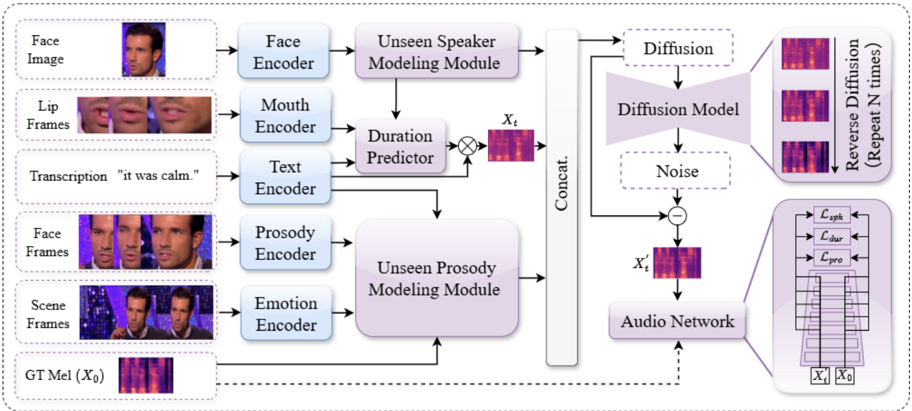
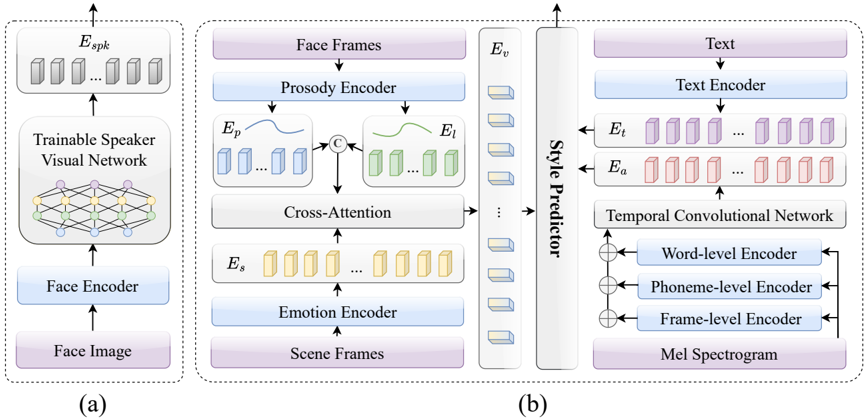

> [!abstract] CCL 2025 · 2025 · Workshop
> **Liu et al.** · [→ Paper](https://aclanthology.org/2025.ccl-1.77) · Demo: ? · Code: ?
>
> HFSD-V2C proposes a hierarchical face-styled diffusion model for zero-shot visual voice cloning, jointly predicting unseen speaker identity from facial images and hierarchical prosodic features from video, audio, and text to generate expressive dubbing speech without reference audio at test time.

## Problem

Visual voice cloning (V2C) for movie dubbing requires generating speech that matches the speaker's identity and expressiveness from multimodal inputs. Prior work such as Neural Dubber and HPMDubbing focused on audio-visual lip synchronisation and basic prosody modelling, but struggled with two specific challenges: accurately capturing the timbre of previously unseen speakers (without reference audio) and modelling fine-grained prosody and emotion in zero-shot conditions. Cross-modal connections between facial appearance and vocal characteristics were underexplored, and diffusion-based approaches had not been applied to this multimodal dubbing setting.

## Method

HFSD-V2C builds on HPMDubbing as a baseline and introduces two novel modules connected through a conditional diffusion backbone. Inputs are text (converted to phoneme sequences), a facial video, and a reference audio clip used during training; at inference, only the face video and text are required.

The cross-modal biometric unseen speaker modelling module takes a randomly selected face image from the video clip and passes it through a pre-trained ResNet50 face encoder, then a trainable speaker visual network that maps the facial features to a speaker embedding vector. Joint training aligns this visual-to-acoustic mapping so the model can reproduce an unseen speaker's timbre from their face alone.

The hierarchical unseen prosody modelling module operates across three levels: (1) the video level uses EmoFAN to extract facial pleasure (valence) and arousal, which serve as pitch and loudness proxies, combined with scene-level emotion through attention to produce a video-level prosody embedding; (2) the audio level applies a Temporal Convolutional Network with dilated causal convolutions and vector quantisation to extract multi-scale prosodic features from the reference Mel spectrogram; (3) the text level encodes the phoneme sequence to predict a global emotional tone. A style predictor then fuses all three via dual-path parallel cross-modal attention, producing a unified style representation.

The conditional diffusion model concatenates the speaker embedding, text encoding, and style representation into a single conditioning vector, then denoises a noisy Mel spectrogram under this joint condition. The training objective combines the standard diffusion loss with three auxiliary losses: speaker timbre binding, phoneme duration alignment, and prosody/emotion consistency. The pre-trained HiFi-GAN vocoder converts the generated Mel spectrogram to waveforms. The model converges after 300k steps with Adam on a single NVIDIA RTX 3090Ti, with 4 FFT blocks and feature dimension 256.

## Key Results

On LRS2, HFSD-V2C achieves MOS 4.29 vs. 4.14 for Neural Dubber and 4.12 for HPMDubbing, with the strongest identity accuracy (Id.Acc 66.87 vs. 59.25 for Neural Dubber) and emotion accuracy (Emo.Acc 65.63 vs. 61.46 for HPMDubbing). MCD improves from 8.66 to 7.25 relative to HPMDubbing. Lip sync metrics (LSE-D 6.012, LSE-C 7.003) also improve over baselines. On GRID, MOS is 4.31 with Id.Acc 68.99 and Emo.Acc 66.32, outperforming both V2C-Net and HPMDubbing on all six metrics. Ablation removing the unseen speaker module (w/o US) causes the sharpest drop in identity accuracy (to 30.75 on LRS2), while removing the prosody module (w/o UP) collapses emotion accuracy (to 22.08), confirming each module's specialised role. Speaker embedding t-SNE visualisations show well-separated clusters by identity and gender, supporting the claim that cross-modal speaker embeddings capture meaningful speaker structure.

## Novelty Assessment

The paper's most original element is applying cross-modal face-to-voice speaker embedding within a diffusion-based V2C pipeline, directly inspired by Face-TTS (Imaginary Voice, ICASSP 2023). The hierarchical prosody module draws on established attention and TCN techniques applied to three modalities simultaneously, which is a sensible engineering integration building on HPMDubbing's prosody-modelling framework. The use of diffusion for Mel spectrogram generation in dubbing is new relative to the baselines, and it demonstrably improves prosody diversity (through the stochastic denoising process). The evaluation is solid for its scale (20 clips, 20 raters, double-blind) but limited to two datasets with constrained speakers and sentence types. Comparisons are fair given all baselines use the same LRS2 and GRID splits.

## Field Significance

Moderate — HFSD-V2C demonstrates that cross-modal biometric cues from facial images can substitute for reference audio in zero-shot dubbing scenarios, and that hierarchical multimodal prosody fusion in a diffusion backbone improves both speaker fidelity and emotional expressiveness. The contribution is positioned within the V2C sub-field rather than general-purpose TTS, so its direct impact on broader speech generation research is limited. It can serve as a useful reference architecture for future audiovisual speech synthesis work targeting unseen speakers.

## Claims

- **supports:** Cross-modal facial features can provide sufficient speaker identity signal for zero-shot voice generation without reference audio.
  > *Evidence:* The cross-modal biometric unseen speaker modelling module maps a face image to a speaker embedding via ResNet50 and a trainable visual network; Id.Acc of 66.87/68.99 on LRS2/GRID exceeds all baselines that require reference audio at inference. *(§3.2, Table 1, Table 2)*

- **supports:** Diffusion-based denoising in a multimodal TTS/dubbing pipeline improves prosodic diversity relative to deterministic autoregressive or attention-based baselines.
  > *Evidence:* Running HFSD-V2C 10 times per speaker produces diverse F0 contours capturing individual accent patterns; Neural Dubber and HPMDubbing produce fixed prosodic distributions. *(§4.2.4, Figure 4)*

- **supports:** Hierarchical multimodal prosody modelling (video, audio, and text levels jointly) improves emotion accuracy over methods relying on fewer modalities.
  > *Evidence:* Emo.Acc reaches 65.63 on LRS2 and 66.32 on GRID, against 61.46 and 63.66 for HPMDubbing; the ablation (w/o UP) drops Emo.Acc to 22.08/27.64, confirming the prosody module's role. *(§4.2.1, §4.2.5, Table 1, Table 2)*

- **complicates:** Zero-shot visual voice cloning accuracy remains significantly below ground-truth speaker identity, indicating that cross-modal biometric embeddings do not fully replace reference audio.
  > *Evidence:* GT Id.Acc on LRS2 is 91.52 vs. HFSD-V2C's 66.87; GT MOS is 4.72 vs. 4.29 for HFSD-V2C, a gap of 0.43 that persists after hierarchical multimodal conditioning. *(§4.2.1, Table 1)*

## Limitations and Open Questions

The evaluation is restricted to LRS2 and GRID, both of which contain constrained speaking styles (BBC broadcasts and phonetically structured lab speech), leaving generalisation to spontaneous conversational video undemonstrated. The subjective MOS is collected on only 20 clips rated by 20 evaluators, which is a limited sample for drawing robust conclusions. The model trains on both LRS2 and GRID but the zero-shot claim means unseen speakers at test time, not unseen datasets; the extent of genuine out-of-domain generalisation is not assessed. Code and demos are not released, limiting reproducibility. Finally, the method depends on visible, well-lit face images, which may not be robust in natural video production environments.

## Wiki Connections

- [[diffusion-tts|Diffusion TTS]] — HFSD-V2C applies a conditional diffusion model to generate Mel spectrograms for dubbing, extending diffusion TTS to the multimodal visual-voice cloning setting.
- [[zero-shot-tts|Zero-Shot TTS]] — the paper addresses zero-shot generalisation to unseen speakers by replacing reference audio with cross-modal facial image embeddings rather than a voice prompt.
- [[prosody-control|Prosody Control]] — the hierarchical prosody module independently controls pitch, loudness, and emotional tone from video, audio, and text levels, making prosody control a central architectural component.
- [[emotion-synthesis|Emotion Synthesis]] — EmoFAN-derived valence and arousal features and scene-level emotion encoding are explicitly used to condition the prosody style predictor for emotionally consistent dubbing.
- [[disentanglement|Disentanglement]] — the training objective uses separate losses for speaker timbre binding, prosody/emotion consistency, and phoneme duration alignment, encouraging disentangled representations of speaker identity, prosody, and duration.
- [[speaker-adaptation|Speaker Adaptation]] — the cross-modal biometric module adapts speaker embeddings to unseen identities at inference using only a face image, a form of parameter-free speaker adaptation.
