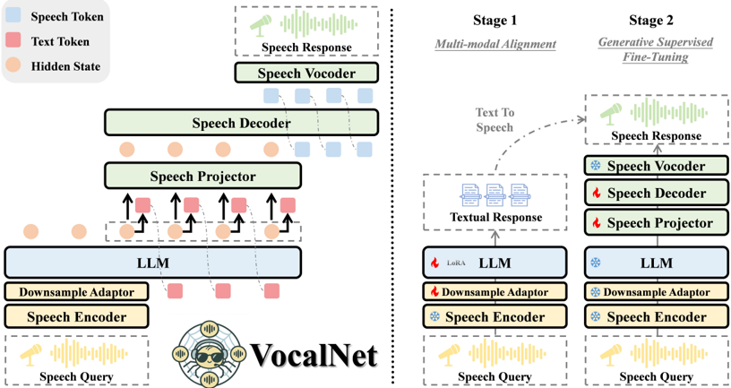
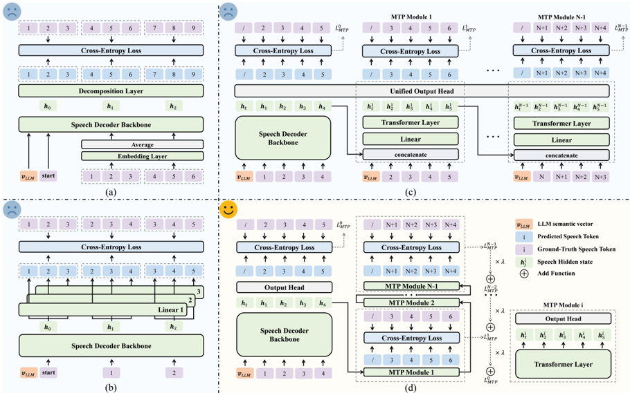

> [!abstract] EMNLP · 2025 · Conference
> **Yuhao Wang et al.** (Shanghai Jiao Tong University / Ant Group / Wuhan University) · [→ Paper](https://aclanthology.org/2025.emnlp-main.989) · Demo: ? · Code: ?
>
> VocalNet introduces multi-token prediction (MTP) as an alternative to next-token prediction for autoregressive speech generation in speech LLMs, achieving ~50% WER reduction and faster inference, paired with a simplified two-stage training framework that matches or surpasses state-of-the-art Omni LLMs using significantly less data.

## Problem

Speech LLMs for real-time voice interaction face two key limitations. First, training frameworks are unnecessarily complex — multi-stage pipelines with ASR and TTS pretraining phases whose empirical benefits are poorly validated. Second, the dominant next-token prediction (NTP) paradigm is poorly suited to speech: speech tokens have much higher temporal resolution (~25 Hz) than text (~3 Hz), producing very long sequences; and speech exhibits hierarchical acoustic-semantic structure (phonemes, syllables) that NTP's token-by-token generation cannot efficiently capture, leading to error accumulation and pronunciation failures.

## Method

**Architecture**: VocalNet follows the aligned multimodal paradigm — a frozen speech encoder (Whisper-large-v3), a downsample adaptor (2-layer linear, factor-5 reduction), an LLM backbone (LLaMA-3.2-1B-Instruct or LLaMA-3.1-8B-Instruct), a speech projector (2 LLaMA decoder layers), and a speech decoder (4 LLaMA decoder layers). Speech output tokens are converted to audio via CosyVoice2's flow-matching model and HiFi-GAN.

**Two-stage training**: Stage 1 trains on speech-to-text tasks (speech encoder frozen, adaptor + LLM LoRA fine-tuned, CE loss on text tokens). Stage 2 trains on speech-to-speech tasks (most components frozen, speech projector + decoder updated, CE loss on speech tokens). The paper empirically shows that ASR or TTS pretraining stages do not improve overall performance and add computational cost, so they are excluded.

**Multi-token prediction (MTP)**: The key innovation is a new MTP architecture for speech generation. Existing approaches (group modeling, MTP-Parallel-Linear, MTP-DeepSeek) either degrade quality at higher step counts or collapse to the NTP training objective. VocalNet-MTP uses N-1 sequential Transformer layers as MTP modules, each processing the hidden state from the previous layer without access to ground-truth tokens. At each decoding step, N future speech tokens are predicted in parallel from N output heads. Loss is a weighted sum of cross-entropy losses across all N prediction depths, with a decay factor λ assigning higher weights to earlier (more reliable) depths.

The key insight is that this training objective — minimizing `p(x_{t+1:t+K} | x_{≤t})` — is strictly different from NTP and encourages the model to learn joint distributions over future tokens, reducing error accumulation and improving capture of local speech patterns (phonemes, syllables). Best configuration: 5 MTP modules during training, 3 tokens per step at inference.

**Streaming**: Both streaming and non-streaming attention masks are supported. Streaming mode uses chunk-based causal masking (chunk sizes Ct=5 text tokens, Cs=15 speech tokens).

## Key Results

On OpenAudioBench (AlpacaEval, LLaMA Questions, TriviaQA, Web Questions, English subsets):

- VocalNet-1B significantly outperforms Mini-Omni and SLAM-Omni (both 0.5B) and matches or beats several 8B models on specific benchmarks despite being smaller.
- VocalNet-8B matches MiniCPM-o and Qwen2.5-Omni on most benchmarks (top-2 on AlpacaEval, LLaMA Questions, TriviaQA) using ~6K hours of training data vs. competitors using 887K hours or ~1.4M hours.
- Speech quality: VocalNet-1B and -8B both achieve UTMOS 4.49. VocalNet-8B WER 3.56 (second only to Qwen2.5-Omni at 2.63).

MTP ablation (on VoiceAssistant-400K, LLaMA-3.2-1B backbone):
- Baseline NTP: WER 10.62, UTMOS 4.488
- MTP-VocalNet (5 modules, 3 tokens/step): WER 5.66 (−47%), UTMOS 4.495

Latency (first chunk, single L20 GPU): VocalNet-1B 319.73 ms, VocalNet-8B 428.38 ms. Over half of latency comes from the flow-matching vocoder. This is lower latency than GLM-4-Voice (1105 ms) and MiniCPM-o (894 ms).

## Novelty Assessment

The MTP paradigm for speech generation is the key contribution. The paper correctly identifies that MTP-DeepSeek's training objective collapses to NTP, and proposes a genuinely different formulation. The theoretical analysis (via Gloeckle et al.'s relative mutual information decomposition) provides a principled explanation for the quality improvement. The data efficiency result (matching Omni LLMs with orders-of-magnitude less data) is striking. The training framework simplification (no ASR/TTS pretraining) is empirically validated. The work is primarily engineering and training-recipe innovation rather than architectural novelty.

## Field Significance

> [!tip]
> High — VocalNet demonstrates that next-token prediction is not the only viable autoregressive objective for speech LLMs, and that predicting multiple future tokens jointly reduces pronunciation errors by almost half. The result is architecturally significant because it introduces a training objective that is strictly different from NTP rather than a minor variant, and the data-efficiency finding (comparable performance to Omni LLMs trained on two orders of magnitude more data) provides strong evidence that the aligned multimodal paradigm can scale with limited speech resources.

## Claims

- Autoregressive next-token prediction underperforms multi-token prediction for speech generation because NTP's token-level granularity fails to capture the hierarchical acoustic structure spanning phonemes and syllables, leading to error accumulation. *(§3.1)*
- Training speech LLMs to predict joint distributions over multiple future tokens simultaneously reduces substitution-type pronunciation errors more than insertion or deletion errors, suggesting that inter-token dependencies are the primary failure mode of NTP-based generation. *(§5.3, Appendix C.1)*
- Dedicated ASR and TTS pretraining stages do not improve the overall spoken QA performance of aligned multimodal speech LLMs and add computational cost without benefit. *(§5.2, Table 3)*
- Speech LLMs using the aligned multimodal architecture can match Omni LLMs trained on two orders of magnitude more data when using an efficient two-stage fine-tuning regime on around 6,000 hours of synthesized speech. *(§5.1, Table 1)*
- The flow-matching vocoder is the dominant latency bottleneck in aligned multimodal speech LLMs, contributing over half of end-to-end first-chunk latency regardless of LLM backbone size. *(Appendix B.2, Table 6)*

## Limitations and Open Questions

- VocalNet relies on CosyVoice2's semantic speech tokenizer, which limits controllable speech generation and paralinguistic modeling.
- The flow-matching vocoder is the dominant latency bottleneck; further optimization of the speech decoder is identified as future work.
- No controllable prosody or emotion conditioning in current form.
- Evaluation is limited to English subsets of OpenAudioBench; multilingual performance is not characterized.

## Wiki Connections

VocalNet directly advances the [[spoken-language-model]] paradigm, specifically the aligned multimodal model subtype (separate encoder/decoder preserving LLM capabilities). The MTP mechanism relates to [[autoregressive-codec-tts]] efficiency concerns. The use of CosyVoice2 tokens and HiFi-GAN connects to [[neural-codec]] and [[gan-vocoder]]. The streaming mode relates to [[streaming-tts]]. The Whisper-large-v3 speech encoder connects to [[self-supervised-speech]]. Compare with [[2412.17048|SLM Coherence Failures]] which analyzes semantic coherence failures in speech LLMs, and [[2025.emnlp-demos.70|OpenS2S]] which targets empathetic spoken conversational agents. The survey [[2025.acl-long.682|SpeechLM survey]] provides the broader SpeechLM context in which VocalNet's MTP approach sits — specifically within the aligned multimodal LLM sub-paradigm that the survey identifies as the dominant direction in 2025.
