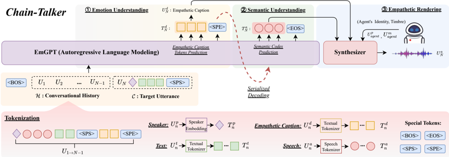

> [!abstract] ACL · 2025 · Conference
> **Hu et al.** (Inner Mongolia University; ByteDance; CUHK-Shenzhen) · [→ Paper](https://aclanthology.org/2025.findings-acl.101) · Demo: ✓ · Code: ✓
>
> Chain-Talker introduces a three-stage chain-modeling framework for empathetic conversational speech synthesis, sequentially predicting natural language emotion captions, supervised semantic speech tokens, and then rendering speech via flow matching conditioned on both.

## Problem

Existing conversational speech synthesis (CSS) models struggle to achieve genuine empathy because they generate speech tokens directly from dialogue context without an explicit intermediate understanding of the emotional state. Two specific gaps motivate Chain-Talker: first, general-purpose discrete speech codes from unsupervised models (e.g., HuBERT) mix semantic and acoustic information, limiting expressive control; second, emotion is not explicitly modelled before speech generation, so the system cannot verify or inspect what emotion it is responding with. Prior CSS systems like GPT-Talker address naturalness through GPT-style token prediction but leave emotion comprehension implicit and opaque.

## Method

Chain-Talker decomposes conversational speech synthesis into three ordered stages, each built on the output of the previous. The two main components are EmGPT and a separate Synthesizer.

EmGPT is a GPT-style autoregressive language model (14 transformer blocks, 1024 hidden size) fine-tuned from CosyVoice-300M-25Hz. Dialogue context is encoded as a unified token sequence alternating speaker identity, speech tokens, text (BPE), and empathetic captions from prior turns. Stage 1 (Emotion Understanding) has EmGPT predict a natural language empathetic caption for the current utterance by attending to the full dialogue history. Stage 2 (Semantic Understanding) extends that same autoregressive pass, using the predicted caption together with the context to generate CosyVoice-style supervised semantic speech tokens (4096-codebook VQ, 25 Hz). Because these tokens are derived from an ASR model with an inserted vector quantiser, they carry purely semantic content without entangled acoustic information.

Stage 3 (Empathetic Rendering) passes the semantic tokens and empathetic caption to a separate Synthesizer. The Synthesizer uses an optimal-transport conditional flow matching model (OT-CFM, following CosyVoice) to predict mel spectrograms, conditioned on: the semantic token sequence, the empathetic caption encoded by a sentence-level BERT model, the agent's speaker embedding, and a masked mel spectrogram from the agent's reference speech. A HiFi-GAN vocoder converts mel spectrograms to waveform.

Training follows a two-stage schedule: EmGPT is first trained on approximately 170,000 hours of single-sentence TTS data to acquire baseline speech generation capability, then fine-tuned on the NCSSD-EmCap dialogue dataset (384 hours across DailyTalk, NCSSD, and MultiDialog). The Synthesizer can be trained independently in single-sentence mode using empathetic captions and semantic codes, which improves robustness.

The paper also introduces CSS-EmCap, an LLM-driven annotation pipeline that generates empathetic captions for any CSS dataset. It first extracts sentence-level style factors (pitch, energy, tempo, gender) using ASR and acoustic tools, then classifies dialogue-level emotion using Gemini 1.5 Pro over the full dialogue context, and finally prompts Gemini to produce diverse natural language captions from these attributes plus the original speech.

## Key Results

On the NCSSD-EmCap test set, Chain-Talker achieves DMOS-N 4.147 and DMOS-E 4.239, outperforming the next best baseline (GPT-Talker, 3.962 / 3.913) by margins of 0.185 and 0.326. Speaker similarity (SSIM 0.862) and emotion accuracy (ACC_m 0.612) are also best-in-class. In pitch expressiveness, Chain-Talker achieves DDTW 38.784 against GPT-Talker's 44.625, a 13% reduction in deviation from ground truth pitch trajectories.

Ablations confirm the contribution of each component. Removing dialogue context (w/o context) drops DMOS-E by 0.255. Removing empathetic captions entirely (w/o captions, reducing to direct token prediction like GPT-Talker) cuts DMOS-E by 0.155. Omitting the caption loss (w/o L_caption) drops DMOS-N by 0.200 and DMOS-E by 0.283. Skipping first-stage pretraining causes the largest single degradation, with DMOS-N falling to 3.756.

For the CSS-EmCap captioning pipeline, the full system achieves DMOS-C 4.462, exceeding ground-truth style labels (4.327) and outperforming Qwen2-Audio (4.212) and SECap (4.268). Caption diversity (DIS-1: 0.106, DIS-2: 0.296) is substantially higher than competing methods.

On a style controllability benchmark (TextrolSpeech), Chain-Talker achieves ACC_m 0.598, outperforming Salle (0.506) and PromptTTS (0.494) on emotion accuracy, confirming that empathetic captions are effective conditioning signals independently of the conversational context.

## Novelty Assessment

The three-stage chain modeling structure is genuinely new for CSS: prior systems such as GPT-Talker predict speech tokens directly from dialogue context, while Chain-Talker inserts explicit caption prediction as an intermediate step. This interpretability gain and the decoupling of emotion from acoustics via supervised semantic tokens are the core architectural contributions.

That said, every building block is an existing component: CosyVoice provides the supervised tokeniser and the fine-tuned language model backbone; OT-CFM and HiFi-GAN are the synthesiser; empathetic captioning via LLMs draws on prior work in natural language style description for TTS. The contribution is primarily in the pipeline architecture and the CSS-EmCap annotation methodology. The evaluation is conducted on a small-scale setting (384 hours of dialogue fine-tuning, 30 raters), and the dialogue datasets used are all Chinese/English daily conversation corpora with limited domain diversity.

## Field Significance

Moderate -- Chain-Talker provides evidence that explicit intermediate emotion captioning improves empathetic response quality in CSS, offering a more interpretable alternative to end-to-end speech token prediction. The CSS-EmCap pipeline provides a practical tool for annotating conversational speech datasets with natural language emotion descriptions, which may support future work in expressive dialogue synthesis. The contribution is methodologically interesting but narrowly scoped to the CSS task, and relies heavily on existing CosyVoice infrastructure.

## Claims

- supports: Decomposing conversational speech synthesis into sequential emotion-understanding and speech-generation stages improves expressiveness over direct speech token prediction.
  Evidence: Chain-Talker (DMOS-E 4.239) outperforms GPT-Talker's direct token prediction (3.913) and GPT-Talker_c, which adds emotion understanding without fully chaining it through caption prediction (4.102); the ablation w/o captions (4.084) confirms the caption conditioning is the key factor. *(§6.5, Table 2)*

- supports: Natural language emotion captions are more effective conditioning signals for empathetic speech synthesis than discrete emotion category labels.
  Evidence: Chain-Talker using empathetic captions (DMOS-E 4.239) outperforms Chain-Talker_e using emotion labels (4.127) and Chain-Talker_s using style labels (4.015); DMOS-C scores also show captions exceed ground-truth label quality (4.462 vs 4.327). *(§6.4, §6.5, Tables 1 and 2)*

- supports: Supervised ASR-derived semantic speech tokens provide more interpretable and expressive conversational speech generation than unsupervised tokens that mix semantic and acoustic content.
  Evidence: The paper argues that HuBERT tokens in GPT-Talker contain entangled acoustic information that limits emotional comprehension; Chain-Talker's ASR-VQ tokens improve DDTW from 44.625 to 38.784 and ACC_m from 0.562 to 0.612. *(§2.3, §6.5, Table 2)*

- supports: LLM-driven automatic speech emotion captioning with multi-level attribute extraction produces higher-quality annotations than single-modality or keyword-based description approaches.
  Evidence: CSS-EmCap (DMOS-C 4.462, SIM_G 0.694, DIS-2 0.296) outperforms Qwen2-Audio (4.212, 0.534, 0.174) and SECap (4.268, 0.617, 0.186); ablations confirm that removing either sentence-level style factors or dialogue-level emotion significantly degrades both quality and diversity. *(§6.4, Table 1)*

- complicates: Autoregressive chain modeling for empathetic conversational speech synthesis introduces latency that does not yet support real-time interaction requirements.
  Evidence: Chain-Talker generates average empathetic responses of 2.5 seconds duration on an RTX 4080 with 32 GB VRAM; authors describe this as a gap relative to real-time dialogue and identify streaming inference as a necessary future direction. *(§Limitations)*

## Limitations and Open Questions

> [!warning]
> Chain-Talker is fine-tuned on only 384 hours of dialogue data drawn from daily conversational domains and predominantly young adult speakers. The authors explicitly note it may not capture the speaking styles of children or the elderly, and domain generalisation to non-conversational or non-English settings is untested.

Inference latency is a practical bottleneck: the three-stage autoregressive pipeline produces responses averaging 2.5 seconds, which is insufficient for low-latency real-time dialogue. Streaming inference is identified as future work but not yet implemented.

The subjective evaluations rely on 30 university students rating 50 sentences, which is a small sample. Additionally, the empathetic caption generation pipeline depends on Gemini 1.5 Pro, which is closed-source, making the full CSS-EmCap pipeline difficult to replicate without API access.

The zero-shot voice cloning capability is noted to carry safety risks (voice spoofing), which the authors plan to address through open-source license restrictions.

## Wiki Connections

- [[emotion-synthesis|Emotion Synthesis]] -- this paper introduces chain-modeled empathetic captioning as a new intermediate conditioning stage for emotion-aware CSS, providing quantitative evidence that caption-based emotion representation improves over category labels.
- [[autoregressive-codec-tts|Autoregressive Codec TTS]] -- Chain-Talker's EmGPT stage adapts autoregressive discrete token prediction to conversational speech, extending the codec-TTS paradigm to multi-turn dialogue with interpretable intermediate representations.
- [[flow-matching|Flow Matching]] -- the Synthesizer uses OT-CFM (optimal-transport conditional flow matching) for mel spectrogram prediction, following the CosyVoice framework and demonstrating flow matching's applicability to emotion-conditioned rendering.
- [[instruction-conditioned-tts|Instruction-Conditioned TTS]] -- empathetic captions are natural language descriptions encoding gender, pitch, energy, tempo, and emotion, serving as a direct conditioning signal for the synthesizer in a manner closely related to instruction-conditioned TTS.
- [[spoken-language-model|Spoken Language Model]] -- EmGPT consumes and emits discrete semantic speech tokens within a GPT-style autoregressive framework, placing Chain-Talker squarely within the spoken language model paradigm applied to conversational settings.
