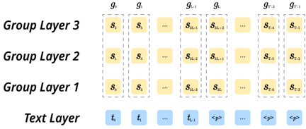

> [!abstract] ACL · 2025 · Conference
> **Wenxi Chen et al.** (Shanghai Jiao Tong University / Microsoft) · [→ Paper](https://aclanthology.org/2025.findings-acl.115) · Demo: ? · Code: ?
>
> SLAM-Omni introduces grouped semantic token prediction to resolve the text-audio frequency mismatch in end-to-end spoken dialogue, enabling zero-shot timbre control and competitive speech-text alignment at 0.5B scale through single-stage fine-tuning without any TTS or ASR pre-training.

## Problem

End-to-end spoken dialogue models face two intertwined problems that SLAM-Omni targets simultaneously. First, existing systems cannot generate responses with diverse speaker timbres: most training corpora use a uniform output voice and no framework explicitly models speaker identity at the dialogue level. Second, parallel audio-text generation suffers from a severe frequency mismatch: semantic tokens operate at 50 Hz while text tokens step at approximately 3 Hz, producing audio sequences that are roughly 16 times longer than their text counterparts. Prior work either tolerated this through expensive interleaved token modeling (requiring extensive pre-training) or bypassed the issue with text-driven decoding that loses paralinguistic attributes.

## Method

SLAM-Omni uses Qwen2-0.5B as its LLM backbone with a frozen Whisper-small encoder providing speech input features. User speech is encoded at 50 Hz, downsampled by a factor of 5 via frame concatenation, and aligned to the LLM embedding dimension through a linear projector. On the output side, text tokens and single-layer CosyVoice supervised semantic tokens are predicted in parallel at each autoregressive step, with the vocabulary extended to include both token types.

**Semantic Group Modeling** addresses the frequency mismatch by projecting audio logits through a linear layer to predict G semantic tokens simultaneously per step, reducing audio sequence length by a factor of G. With G=3 (the paper's default), training compresses from 126 to 60 GPU hours while ASR-WER drops from 18.23% to 4.54% compared to ungrouped prediction.

For **timbre control**, semantic tokens inherently decouple linguistic content from speaker identity. A conditional flow-matching model converts semantic tokens and a speaker prompt into mel spectrograms, which HiFi-GAN then renders into waveforms. Block causal attention in the flow-matching Transformer enables streaming synthesis.

**Historical Text Prompting** compresses multi-turn dialogue history by storing only the text transcriptions of past turns rather than interleaved audio-text token sequences. The template `<System> <History> <Input> <Answer>` is fed to the LLM with KV-cache reuse across turns, keeping context length manageable.

Training is fully single-stage: Qwen2-0.5B is fine-tuned end-to-end on synthesized spoken dialogue data (VoiceAssistant-400K for the primary experiment) with the Whisper encoder frozen. No ASR or TTS pre-training is applied.

## Key Results

Against similarly-sized models (Mini-Omni and Mini-Omni2, both 0.5B), SLAM-Omni achieves markedly higher ChatGPT Score (39.32 vs. 22.58 / 26.56), higher UTMOS (4.45 vs. 4.42 / 4.43), and lower ASR-WER (4.54% vs. 6.05% / 10.24%), using a subset of Mini-Omni's training data (Table 3). Human evaluation confirms the pattern: SLAM-Omni wins 66.83% of speech-content comparisons against Mini-Omni and 64.82% against Mini-Omni2 (Table 4).

For timbre control, SLAM-Omni achieves SIM-o of 0.517, comparable to FireRedTTS (0.486) but below CosyVoice2 (0.684), which trains on approximately 50x more data (Table 5). The speaker similarity gap is attributed to insufficient training data diversity rather than to the method itself.

Ablation over group size shows G=3 as the sweet spot: G=1 yields ASR-WER of 18.23%, G=3 reduces it to 4.54%, while G=5 begins to degrade ChatGPT Score (33.93) relative to G=3 (39.32), suggesting that over-grouping loses resolution in token prediction (Table 6).

The pre-training ablation is counterintuitive: adding ASR pre-training before the main stage lowers ChatGPT Score from 39.32 to 34.02, and TTS pre-training lowers it further to 27.22, while ASR-WER changes negligibly (4.54% vs. 4.38% / 4.53%). The gap is attributed to pre-training nudging the model away from general instruction-following (Table 7).

## Novelty Assessment

Semantic Group Modeling is a genuine new mechanism for handling the text-audio frequency mismatch in parallel spoken dialogue systems, though it adapts the grouped codec prediction idea from VALL-E 2 to the semantic token domain. Historical Text Prompting is a practical contribution that cleanly sidesteps the long-audio-history problem using text-only history, though it is essentially an application of standard LLM-style context management. Zero-shot timbre control in spoken dialogue is the first of its kind but directly applies the CosyVoice approach (speaker-decoupled semantic tokens + flow-matching vocoder) without architectural changes.

The single-stage training finding is the most practically impactful result: the demonstration that modality-specific pre-training actively hurts instruction-following is a useful counterpoint to the multi-stage paradigm dominant in larger systems. The caveat is that this finding applies at 0.5B scale; whether it generalises to larger backbones or more diverse data regimes is left as future work.

## Field Significance

Moderate — SLAM-Omni provides concrete evidence that grouped semantic token prediction resolves the text-audio frequency mismatch in parallel dialogue generation at substantially lower training cost, and demonstrates that TTS or ASR pre-training degrades instruction-following capability in single-stage dialogue fine-tuning. The first timbre-controllable spoken dialogue system result is meaningful but constrained to small-scale settings, and the speaker similarity gap relative to dedicated TTS systems points to data volume as the primary remaining bottleneck.

## Claims

- **supports:** Grouping discrete semantic tokens during autoregressive generation reduces training and inference costs by alleviating the frequency mismatch between text and audio token streams.
  > *Evidence:* Semantic Group Modeling with G=3 reduces SLAM-Omni training from 126 to 60 GPU hours and ASR-WER from 18.23% (G=1) to 4.54%, with G=3 providing the best quality-efficiency trade-off across five group sizes tested. *(§5.4.1, Table 6)*

- **refines:** Multi-stage pre-training on modality-specific tasks for spoken dialogue systems can degrade instruction-following ability despite improving modality alignment metrics.
  > *Evidence:* ASR pre-training reduces ChatGPT Score from 39.32 to 34.02 and TTS pre-training to 27.22, while ASR-WER improves only marginally (4.38% / 4.53% vs. 4.54%), indicating that modality-specific pre-training shifts the model away from general instruction-following capabilities. *(§5.4.2, Table 7)*

- **complicates:** Zero-shot timbre control in spoken dialogue systems achieves competitive speaker similarity but remains constrained by training data volume relative to dedicated TTS systems.
  > *Evidence:* SLAM-Omni reaches SIM-o of 0.517, comparable to FireRedTTS (0.486) but below CosyVoice2 (0.684), with the gap attributed to approximately 50x less training data; limited and less diverse data cause ambiguities in timbre rendering during vocoder synthesis. *(§5.2, Table 5)*

- **complicates:** Compressing multi-turn dialogue history to text representation sacrifices non-verbal paralinguistic context that may be important for maintaining dialogue coherence across turns.
  > *Evidence:* Historical Text Prompting stores only text history, explicitly trading away emotional and prosodic signals from previous dialogue turns for computational efficiency; the paper identifies this as a primary limitation affecting scenarios requiring sustained dialogue coherence. *(§3.5, §6 Limitations)*

- **supports:** Semantic token-based speech generation in spoken dialogue systems provides tighter speech-text alignment than acoustic codec-based approaches, as measured by word error rate between generated speech and corresponding text.
  > *Evidence:* SLAM-Omni achieves the lowest ASR-WER (4.54%) among all evaluated spoken dialogue models, outperforming larger models including Moshi (7.18%), GLM-4-Voice (12.71%), and Freeze-Omni (16.32%), using single-layer semantic tokens rather than multi-codebook acoustic tokens. *(§5.1, Table 3)*

## Limitations and Open Questions

> [!warning]
> The finding that single-stage training outperforms multi-stage pre-training is demonstrated only at 0.5B scale with limited data (400K utterances). The authors explicitly note that extending to larger LLMs would require substantially more training data, and whether the result holds at larger scales or with more diverse corpora is untested.

Historical text prompting provides computational efficiency at the cost of discarding non-verbal paralinguistic signals (emotion, prosody) from previous dialogue turns. This limits the system's ability to maintain affective continuity across multi-turn conversations. The evaluation is also narrow: the custom 8-task benchmark measures general spoken interaction but not domain-specific or emotion-aware dialogue quality.

## Wiki Connections

- [[spoken-language-model|Spoken Language Model]] — SLAM-Omni operates within the speech LM paradigm, autoregressively predicting discrete semantic tokens alongside text tokens using a pre-trained LLM backbone.
- [[zero-shot-tts|Zero-Shot TTS]] — the timbre control mechanism adapts zero-shot TTS principles (speaker-decoupled semantic tokens, speaker-prompted vocoder synthesis) to the spoken dialogue domain for the first time.
- [[neural-codec|Neural Audio Codec]] — SLAM-Omni uses CosyVoice's supervised semantic tokenizer rather than a traditional neural audio codec, arguing that single-layer semantic tokens provide better speech-text alignment than multi-codebook acoustic tokens.
- [[flow-matching|Flow Matching]] — the vocoder converts semantic tokens to mel spectrograms using a conditional flow-matching model with block causal attention for streaming synthesis.
- [[gan-vocoder|GAN Vocoder]] — HiFi-GAN serves as the final waveform synthesis stage, rendering mel spectrograms produced by the flow-matching component into audio.
- [[speech-to-speech|Speech-to-Speech]] — SLAM-Omni is an end-to-end speech-in, speech-out dialogue system that bypasses cascaded ASR-LLM-TTS pipelines to reduce latency and preserve paralinguistic information.
