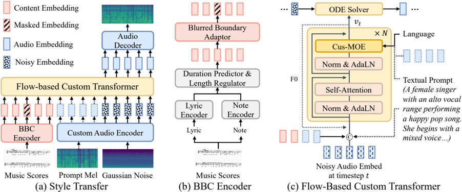
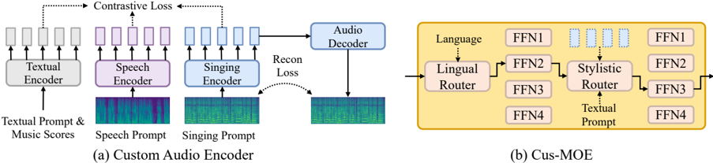

> [!abstract] ACL · 2025 · Conference
> **Zhang et al.** (Zhejiang University) · [→ Paper](https://aclanthology.org/2025.findings-acl.687) · Demo: ✓ · Code: ?
>
> A multilingual zero-shot singing voice synthesis model combining a boundary-blurring content encoder for smooth phoneme/note transitions, a contrastive-learning encoder to align style representations from audio and text prompts, and a flow-matching transformer with language- and style-specialised mixture-of-experts routing.

## Problem

Zero-shot singing voice synthesis (SVS) faces two distinct obstacles that existing models do not adequately address together. First, SVS models depend heavily on precise phoneme and note boundary annotations from tools like the Montreal Forced Aligner; these annotations contain systematic errors, causing models to learn incorrect pronunciations and producing unnatural transitions between phonemes and notes — a problem that worsens in zero-shot scenarios with unseen singers. Second, models with style transfer capability (like the predecessor TCSinger) support only a fixed set of audio prompts or categorical labels for style conditioning, lacking the flexibility to accept natural language descriptions, speech prompts, or cross-modal style specifications that broader applications demand.

## Method

TCSinger 2 processes lyrics and musical notation through three coordinated modules to generate a mel spectrogram, which a pre-trained HiFi-GAN vocoder then converts to waveform at 48 kHz.

The **Blurred Boundary Content (BBC) Encoder** first encodes lyrics and notes separately, predicts phoneme/note durations, and extends content embeddings to frame-level sequences. Critically, it then randomly masks 8 tokens at each phoneme and note boundary, replacing fixed boundaries with soft ones. This boundary blurring forces the downstream flow-matching transformer to infer smooth transitions through self-attention rather than relying on annotation-level alignment, making the model more robust to annotation errors and improving naturalness in zero-shot generation.

The **Custom Audio Encoder** uses a VAE-based architecture for singing and speech prompts, and a cross-attention mechanism combining music scores with textual prompts for the text modality. Contrastive learning (CLIP-style) aligns triplets of singing, speech, and textual prompt embeddings in a shared style space across three contrast types: same content/different style, similar style/different content, and different style/different content. An audio decoder trained with L2 reconstruction and LSGAN adversarial losses ensures that compressed representations do not lose singing voice content. This shared embedding space enables a single model to perform style transfer from audio (singing or speech) or multi-level style control from natural language descriptions such as "A female singer with an alto vocal range performing a happy pop song, beginning with mixed voice and transitioning to falsetto."

The **Flow-based Custom Transformer** uses four transformer blocks (hidden size 768, eight attention heads) with RMSNorm, AdaLN for global style modulation, and RoPE for positional encoding. The flow-matching objective trains a vector field estimator over 1,000 timesteps; inference uses the Euler ODE solver in 25 steps. F0 is predicted from the first block's output and fed as supervision and input to subsequent blocks, reinforcing pitch accuracy throughout synthesis. **Cus-MOE** (Custom Mixture of Experts) operates inside the transformer: a Lingual-MOE selects language-family-specific experts based on lyric language, while a Stylistic-MOE selects experts conditioned on the style prompt type. Routing uses a dense-to-sparse Gumbel-Softmax that transitions from dense (temperature 2.0) to sparse (0.3) during training, with deterministic top-1 routing at inference. Four experts per group is the optimum identified by ablation. Classifier-free guidance (CFG scale 3) at inference further improves style controllability.

Training data spans 289 hours across 9 languages from five open-source datasets (Opencpop, M4Singer, OpenSinger, PopBuTFy, GTSinger) plus 50 hours of proprietary annotated singing voices. Multi-level style labels (emotion, singing method, segment-level and word-level techniques) were hand-annotated by music experts and converted to natural language prompts via GPT-4o. The total parameter count is 105M.

## Key Results

On zero-shot parallel style transfer (Table 1), TCSinger 2 achieves MOS-Q 4.13 and MOS-S 4.27, compared to TCSinger's 3.94 and 4.01 — the strongest prior SVS model. F0 Frame Error (FFE) improves from 0.26 to 0.21 and singer cosine similarity (Cos) from 0.91 to 0.93. On cross-lingual style transfer, MOS-Q reaches 3.96 versus TCSinger's 3.77. For multi-level style control via textual prompts (Table 2), MOS-Q is 4.07 and MOS-C (controllability) is 4.19, versus TCSinger's 3.99 and 3.97. Speech-to-singing style transfer shows MOS-Q 3.97 and MOS-S 3.96 versus TCSinger's 3.89 and 3.84 (Table 3).

Ablation (Table 4) shows that removing the BBC Encoder causes the largest quality drop (CMOS-Q -0.36 for style transfer), removing the Custom Audio Encoder most damages style similarity (CMOS-S -0.37), and removing F0 supervision degrades all dimensions (CMOS-Q -0.33, CMOS-S -0.24). The complete Cus-MOE contributes evenly to quality and style (CMOS-Q -0.31, CMOS-S -0.32 without it). Comparisons against TTS baselines (StyleTTS 2, CosyVoice) adapted with note encoders confirm the superiority of an SVS-native architecture over adapted speech models on singing tasks.

## Novelty Assessment

The BBC Encoder's boundary masking strategy is a compact and practically motivated contribution: rather than improving annotation pipelines, it trains the model to be invariant to precise boundary locations. This approach is specific to SVS and has no direct equivalent in TTS boundary modeling.

The Custom Audio Encoder's contrastive alignment across singing, speech, and text modalities is the main enabler for the speech-to-singing task and natural language style control, and represents meaningful progress over TCSinger's label-based conditioning. However, the contrastive framework (CLIP-style) and VAE components are well-established building blocks; the contribution is their co-adaptation for SVS style representation.

The Cus-MOE applies the mixture-of-experts paradigm (standard in large language models) to singing voice synthesis with domain-specific routing signals (language family, style prompt). This is an engineering integration of an established technique, but the routing design tailored to SVS conditions is reasonably novel within the field.

Overall, TCSinger 2 is an architectural novelty for the SVS sub-domain, but each component draws on established techniques from TTS, self-supervised learning, and LLM research. The main limitation on reproducibility is the proprietary 50-hour training split and the cost of multi-level style annotation.

## Field Significance

Moderate — TCSinger 2 is the most capable zero-shot multilingual SVS system at submission time within the SVS sub-field, demonstrating that flow-matching with mixture-of-experts routing and cross-modal contrastive style alignment can be combined in a single framework spanning audio, speech, and natural language conditioning. Its relevance extends modestly beyond singing synthesis: the BBC Encoder's boundary blurring technique and the multi-modal contrastive style alignment may generalise to other generation tasks with imprecise alignment supervision.

## Claims

- **supports:** Boundary masking during training improves zero-shot singing synthesis naturalness by forcing the model to learn smooth phoneme and note transitions without relying on precise alignment annotations.
  > *Evidence:* BBC Encoder masks 8 tokens at each phoneme/note boundary; ablating this masking causes CMOS-Q to drop -0.36 in style transfer and -0.39 in style control, the largest single-component quality degradation. *(§3.2, Table 4)*

- **supports:** Contrastive alignment of cross-modal style embeddings (singing, speech, natural language) enables a single encoder to support style transfer, speech-to-singing, and instruction-conditioned synthesis without modality-specific architectures.
  > *Evidence:* Custom Audio Encoder trained with CLIP-style triplet contrastive loss achieves unified style space across modalities; removing it drops CMOS-S by -0.37 (style transfer) and CMOS-C by -0.41 (style control). *(§3.3, Table 4)*

- **supports:** Language-conditioned mixture-of-experts routing in a flow-matching transformer improves multilingual singing synthesis quality by directing language-family-specific token processing to specialised experts.
  > *Evidence:* Lingual-MOE ablation (replaced with standard FFN) causes CMOS-Q to drop -0.29 in style transfer; Stylistic-MOE ablation causes CMOS-S -0.26 and CMOS-C -0.33; four experts per group is the optimal configuration before diminishing returns. *(§3.4, Table 4, Table 7)*

- **supports:** F0 supervision applied to intermediate transformer representations improves both synthesis quality and style fidelity in zero-shot singing voice synthesis.
  > *Evidence:* Removing F0 supervision from the first block's output causes CMOS-Q -0.33 and CMOS-S -0.24 in style transfer, and CMOS-Q -0.31 and CMOS-C -0.27 in style control. *(§3.4, Table 4)*

- **complicates:** Multi-level style control via natural language prompts in singing synthesis requires costly manual annotation, limiting dataset scale and introducing labelling errors.
  > *Evidence:* Style labels (emotion, singing method, vocal range, word-level techniques) annotated by music experts at $300/hour, then converted to natural language via GPT-4o; the paper cites labelling cost and annotation errors as primary limitations constraining generalisation. *(§6, Appendix B)*

## Limitations and Open Questions

> [!warning]
> The training and test sets share the same underlying singer pool: 30 "unseen" singers are held out from a pool drawn from the same data collection. This limits the assessment of generalisation to truly out-of-distribution singers or languages not present in training (all 9 test languages are also in training).

Generation speed does not meet real-time industrial requirements at current inference settings, despite 25-step ODE inference; streaming inference is deferred to future work.

Multi-level style annotation requires music expert labour and is therefore not easily scalable; automatic labelling tools are noted as future work but not yet demonstrated.

The model's potential for misuse in unauthorised dubbing is acknowledged. Vocal watermarking is proposed as a mitigation but has not been implemented in this paper.

## Wiki Connections

- [[flow-matching|Flow Matching]] — TCSinger 2 adopts rectified flow matching as the generative backbone for mel-spectrogram synthesis, using 25 Euler ODE steps at inference with CFG.
- [[zero-shot-tts|Zero-Shot TTS]] — the model achieves zero-shot singing style transfer by conditioning on unseen singer audio prompts at inference without speaker-specific fine-tuning.
- [[multilingual-tts|Multilingual TTS]] — TCSinger 2 trains and evaluates across 9 languages with a Lingual-MOE routing expert selection by language family to improve per-language quality.
- [[emotion-synthesis|Emotion Synthesis]] — multi-level style control includes emotion attributes (happy, sad) specifiable at global and segment level via natural language textual prompts.
- [[instruction-conditioned-tts|Instruction-Conditioned TTS]] — natural language descriptions of singing style (vocal range, technique, emotion, word-level effects) serve as a conditioning signal through the contrastive-aligned textual encoder.
