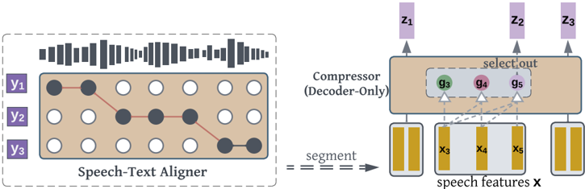

> [!abstract] IWSLT · 2025 · Workshop
> **Tan et al.** · [→ Paper](https://aclanthology.org/2025.iwslt-1.5) · Demo: ✗ · Code: ?
>
> SSR-CONNECTOR uses speech-text alignments to segment and compress speech features to match text token granularity, then applies a two-stage distillation-and-fine-tuning pipeline to integrate speech into pre-trained language models while mitigating catastrophic forgetting.

## Problem

Fusing speech into pre-trained language models poses two interrelated challenges: speech sequences are much longer and sparser in information density than their text counterparts, and fine-tuning an LLM on speech data tends to erode its pre-trained text capabilities. Prior connector-based approaches apply fixed-rate or query-based compression (stacking, Q-former) without exploiting the natural correspondence between speech frames and text tokens, leaving a representational gap that hurts both speech understanding quality and cross-modal reasoning. Unit-based methods that expand the LLM vocabulary with discrete speech tokens sidestep the connector problem but exacerbate sequence length issues and still suffer from catastrophic forgetting when the model is fine-tuned on speech-text data.

## Method

SSR-CONNECTOR consists of two components: a speech-text aligner and a feature compressor. Given speech features extracted by a pre-trained encoder (DinoSR in the reported experiments), the aligner produces a monotonic mapping between speech frames and transcription characters. The paper evaluates two aligners: UNITY2 (which uses both speech and text as input) and character-level CTC (CHAR-CTC, which operates text-free). Using the alignment boundary indices, speech features are segmented into chunks that each correspond to one transcription token. A linear projection layer maps the features to the LLM's embedding dimension (768 to 4096 for LLAMA3), and a 4-layer causal Transformer Decoder transforms and compresses the frames within each chunk by selecting the boundary-indexed feature as the compressed representation for that segment. The resulting sequence has the same length as the transcription token sequence.

Training proceeds in two stages. In Stage 1, the LLM is frozen and the connector is pre-trained by distilling text token embeddings: given aligned speech-text data, a combined cosine similarity and MSE loss pulls the connector's compressed speech representations toward the LLM's text embedding space. This alignment-by-distillation approach allows the connector to learn without any explicit ASR supervision objective. In Stage 2, the connector is frozen and the LLM is fine-tuned with next-token prediction using the compressed speech representations as input and transcription tokens as targets. The paper compares vanilla fine-tuning, LoRA, and multitask fine-tuning (which mixes speech-text and text-only data during Stage 2) as strategies to limit catastrophic forgetting. Training used the English portion of MLS (approximately 50,000 hours) with 32 A100 GPUs and distributed data parallelism.

## Key Results

After Stage 1 distillation alone, SSR-CONNECTOR (UNITY2) achieves 5.6% and 12.1% WER on LibriSpeech clean and other test sets in zero-shot prompting, with no explicit ASR training. The connector outperforms SPIRITLM (LLAMA3) on all spoken language understanding benchmarks except sWUGGY: on StoryCloze (S), it reaches 69.3% vs. 61.1%; on StoryCloze (S→T) cross-modal reasoning, 74.8% vs. 61.6%. On the introduced Speech-MMLU benchmark, the connector achieves 64.2% (0-shot) and 68.6% (5-shot) versus 40.5% and 42.75% for SPIRITLM (LLAMA3), a gap of roughly 20 points. MMLU text accuracy is also preserved substantially better: 65.3% vs. 53.5% (Table 2). The sWUGGY underperformance is attributed to aligner failure on synthesized non-words that were not seen during aligner training, a known scope limitation rather than a general quality issue.

For Stage 2 fine-tuning, multitask fine-tuning (mixing speech-text and text-only data) emerges as the most effective strategy: StoryCloze (S) improves to 63.4% for CHAR-CTC while MMLU drops only modestly to 63.1% (from 65.3%). Vanilla fine-tuning and LoRA both show steeper text capability degradation (Table 5). A notable finding is that Stage 2 fine-tuning improves speech-only task performance but consistently hurts cross-modal (S→T) tasks, indicating a trade-off that multitask fine-tuning only partially resolves.

The paper also demonstrates that the connector's representations retain paralinguistic information: using in-context learning on the Expresso benchmark, the SpeechLM reaches 75.9% accuracy at 10-shot for whisper-vs-laugh classification, compared to 54.7% for a cascaded Whisper+LLAMA3 baseline (Appendix B, Table 8).

## Novelty Assessment

The core innovation is alignment-aware segmentation: using a speech-text aligner to match speech features to text token boundaries before compression, rather than applying fixed-rate or learned-query compression agnostic of linguistic structure. This is a genuine architectural contribution for the connector module, not simply a new application of an existing compressor design. The two-stage distillation pipeline is also novel in its formulation, replacing the standard ASR pre-training objective with direct embedding-space distillation, which avoids locking the connector to ASR-only representations before fine-tuning.

The evaluation is thorough for a workshop paper: the paper introduces Speech-MMLU, ablates multiple aligners and fine-tuning strategies, and includes a paralinguistic analysis. However, the work is evaluated exclusively on English, the backbone is limited to one LLM family (LLAMA3), and the speech encoder choice (DinoSR) is not ablated against alternatives. The improvement is clearest on cross-modal tasks; on purely speech-only lexical tasks (sWUGGY), the alignment-based approach underperforms discrete-unit baselines, a trade-off the authors acknowledge.

## Field Significance

Moderate — SSR-CONNECTOR demonstrates that linguistically informed compression (alignment-aware segmentation) substantially outperforms fixed-rate and learned-query connectors for speech-text modality fusion, particularly on tasks requiring cross-modal reasoning. The Speech-MMLU benchmark it introduces provides a useful cross-modal evaluation tool that extends MMLU to the speech domain. The two-stage distillation-then-fine-tuning recipe offers a practical template for integrating speech into pre-trained LLMs while limiting text capability degradation, though the approach is validated only on English and a single LLM backbone.

## Claims

- supports: Grounding speech compression in explicit speech-text alignment boundaries improves spoken language understanding and cross-modal reasoning in speech-augmented language models.
  Evidence: SSR-CONNECTOR (UNITY2) achieves 64.2% / 68.6% (0/5-shot) on Speech-MMLU vs. 40.5% / 42.75% for SPIRITLM (LLAMA3), and 74.8% on StoryCloze (S→T) vs. 61.6%, while maintaining 65.3% MMLU text accuracy. *(§4.3, Tables 2–3)*

- complicates: Fine-tuning a pre-trained LLM on speech data degrades cross-modal understanding even when catastrophic forgetting is mitigated through multitask training.
  Evidence: All Stage 2 fine-tuning methods improve speech-only task performance (sWUGGY, sBLIMP) but consistently reduce Speech-MMLU and StoryCloze (S→T) accuracy; multitask fine-tuning limits the drop but cannot eliminate it. *(§5.2, Table 5)*

- supports: Distillation from text embeddings is an effective pre-training objective for speech-text modality connectors, enabling cross-lingual transfer to ASR without explicit transcription supervision.
  Evidence: After Stage 1 distillation alone (no ASR objective), SSR-CONNECTOR achieves 5.6% / 4.0% WER on LibriSpeech clean (0/5-shot) via in-context prompting, using only the alignment-supervised distillation loss. *(§4.3, Table 3)*

- complicates: Alignment-aware speech segmentation reduces effectiveness on lexical tasks that depend on synthesized anomalous phoneme sequences.
  Evidence: SSR-CONNECTOR underperforms on sWUGGY because the aligner was not trained on incorrectly spoken words (non-words), causing segmentation errors; the paper notes this as a known scope limitation of alignment-based methods. *(§4.3)*

## Limitations and Open Questions

All experiments use a single language (English), a single LLM backbone (LLAMA3), and a single self-supervised speech encoder (DinoSR). The paper does not ablate the speech encoder, which is a notable gap since encoder quality directly determines the input representations. The Speech-MMLU benchmark excludes domains with synthesis quality issues (e.g., algebra), limiting its breadth as a general evaluation tool. The trade-off between enhanced speech understanding (Stage 2 fine-tuning) and degraded cross-modal performance remains partially unresolved: even with multitask fine-tuning, cross-modal tasks suffer. Extending SSR-CONNECTOR to languages with looser speech-text alignment (e.g., tonal languages, code-switched speech) is left to future work.

## Wiki Connections

- [[spoken-language-model|Spoken Language Model]] — SSR-CONNECTOR directly addresses the speech-text modality fusion problem in speech LMs, proposing an alignment-aware alternative to fixed-rate and query-based connectors.
- [[self-supervised-speech|Self-Supervised Speech]] — DinoSR, a self-supervised speech representation model, serves as the primary feature extractor for SSR-CONNECTOR, and the UNITY2 aligner also relies on XLS-R features.
- [[evaluation-metrics|Evaluation Metrics]] — the paper introduces Speech-MMLU, a cross-modal benchmark derived from MMLU by synthesizing question text to speech, addressing the gap in evaluating speech LMs on knowledge-intensive reasoning tasks.
