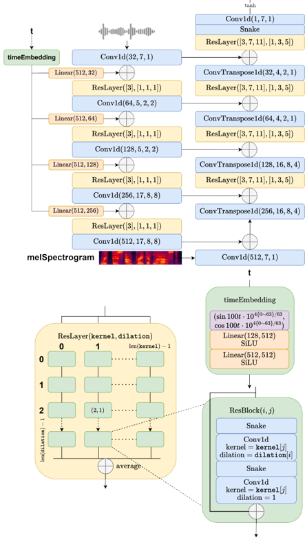

> [!abstract] NAACL · 2025 · Conference
> **Tianze Luo et al.** (Tsinghua University) · [→ Paper](https://aclanthology.org/2025.naacl-long.110) · Demo: ? · Code: ?
>
> WaveFM is a reparameterized flow matching vocoder that uses a mel-conditioned prior, multi-resolution auxiliary losses (including a novel phase angle loss), and a tailored consistency distillation method to achieve superior audio quality and single-step waveform generation.

## Problem

Applying vanilla flow matching directly to neural vocoders produces subpar audio quality because: (1) a standard Gaussian prior incurs unnecessary transport costs given that mel-spectrograms already encode the energy distribution of waveforms; (2) the original flow matching objective predicts random derivatives, preventing the use of auxiliary perceptual losses (e.g., mel-spectrogram loss, STFT loss) that GAN vocoders rely on; and (3) existing consistency distillation methods designed for fixed Gaussian-prior SDEs do not transfer directly to flow matching vocoders with dynamic priors. Prior diffusion vocoders either require many sampling steps or sacrifice quality when using fast samplers.

## Method

WaveFM builds on the flow matching framework with three principal innovations:

**Mel-conditioned prior.** Rather than sampling noise from N(0, I), WaveFM draws initial noise from N(0, Σ) where the diagonal covariance Σ is derived from the mel-spectrogram's energy. This reduces the transport distance the ODE must traverse and directly leverages the conditioning signal available at inference time.

**Reparameterized objective.** The standard flow matching loss predicts instantaneous derivatives. WaveFM reparameterizes the network to directly predict the clean waveform, analogous to how GAN discriminators supervise the generator. This makes it straightforward to add auxiliary losses with fixed weight: a refined multi-resolution STFT loss (with spectral convergence replaced by a phase angle loss L_pha) and gradient/Laplacian operators on STFT magnitudes, plus an L1 mel-spectrogram loss (λ₀ = λ₁ = 0.02). Snake-beta activations from BigVGAN are incorporated because the reparameterization removes the noise that previously disrupted their periodic inductive bias.

**Consistency distillation.** A specialized distillation algorithm adapts consistency distillation (Song et al. 2023) to the flow matching ODE. The student is initialized from the pretrained teacher; training samples t from a truncated N(0, 0.33²) clipped to [0, 0.99] to emphasize early timesteps. Distillation adds only ~25k steps (~2 hours on a single RTX 4090) on top of 1M training steps (~2 days).

**Architecture.** A 19.5M-parameter asymmetric U-Net with multi-receptive field (MRF) modules adapted from HiFi-GAN. The decoder side is deliberately wider than the encoder because the primary task is upsampling mel-spectrograms to waveforms. Strided/transposed convolutions handle downsampling/upsampling; time is embedded as a 128-dim sinusoidal vector expanded via two linear-SiLU layers.

**Training data.** Full LibriTTS (all splits: train-clean-100, train-clean-360, train-other-500; ~1000 hours, 24 kHz), with 100-band mel-spectrograms.

## Key Results

On the LibriTTS dev set (Table 1), WaveFM-6 Steps achieves SMOS 4.19, PESQ 3.882, MCD 1.15, outperforming BigVGAN-base (SMOS 4.17, PESQ 3.503, MCD 1.316) and all diffusion baselines. WaveFM-1 Step (distilled, single inference step) achieves SMOS 4.11, PESQ 3.514, competitive with BigVGAN-base while operating at 303× real-time (vs. HiFi-GAN V1 at 325×) — essentially the speed of a GAN vocoder. Six-step inference runs at 50.2× real-time, between BigVGAN-base (90.3×) and diffusion models (~17–70×).

On out-of-distribution music (MUSDB18-HQ, Table 2), WaveFM-6 Steps achieves SMOS 4.05 vs. BigVGAN-base 3.95, demonstrating better generalization to non-speech audio.

Ablation study (Table 4) confirms that: mel-conditioned prior is the most impactful component (removing it drops SMOS from 4.11 to 3.79); reparameterization is essential (without it, SMOS 3.88); auxiliary losses are necessary (SMOS 3.97 without); and the refined STFT loss (with phase loss and gradient operators) improves over the original (4.11 vs. 4.05).

## Novelty Assessment

The combination of three well-motivated components — mel-conditioned prior, reparameterized clean-waveform objective enabling auxiliary losses, and adapted consistency distillation — is new. Individual elements have precedents: mel-conditioned priors exist in diffusion vocoders (PriorGrad), auxiliary STFT losses exist in GAN vocoders, and consistency distillation exists for DDPMs. The key insight is that reparameterizing the flow matching objective is what unlocks auxiliary loss usage and enables snake activations, making this more than component assembly. The phase angle loss is a minor novel contribution. The work is primarily an engineering contribution: a well-executed synthesis of existing ideas applied to flow matching vocoders.

## Field Significance

Moderate — WaveFM demonstrates that flow matching vocoders can match GAN vocoder inference speed via consistency distillation while exceeding diffusion vocoder quality, providing a concrete existence proof for this combination. The reparameterized objective technique that enables auxiliary losses in flow matching is reusable and can serve as a design pattern for future flow matching vocoders. The contribution is primarily engineering integration with a well-motivated objective reformulation.

## Claims

- A mel-conditioned prior that matches the energy distribution of the target signal reduces transportation cost in flow matching vocoders and substantially improves one-step generation quality. *(§3.1, Table 4)*
- Reparameterizing the flow matching objective to directly predict clean output, rather than random derivatives, enables auxiliary perceptual losses (STFT, mel) and periodic activation functions that cannot otherwise be applied. *(§3.2, Table 4)*
- Consistency distillation can be adapted to flow matching vocoders with dynamic priors, enabling single-step inference at near-GAN speeds without adversarial training. *(§3.3, Table 3)*
- Flow matching vocoders trained with auxiliary perceptual losses generalize better to out-of-distribution audio (music) than diffusion vocoders trained without them. *(§4.4, Table 2)*

## Limitations and Open Questions

The model is a vocoder (mel-spectrogram to waveform); it does not address acoustic modeling (text to mel). The 19.5M-parameter model is evaluated only on English speech. The out-of-distribution music results, while strong, use the vocal track for ASR-based metrics, limiting the scope of the claim. Whether the reparameterization technique generalizes to latent flow matching (i.e., operating in a lower-dimensional space) is unexplored.

## Wiki Connections

- [[flow-matching]] — WaveFM applies flow matching to neural vocoding with a reparameterized objective and mel-conditioned prior
- [[gan-vocoder]] — borrows auxiliary STFT losses, snake-beta activations, and the asymmetric U-Net architecture from HiFi-GAN and BigVGAN
- [[diffusion-tts]] — benchmarked against DiffWave, PriorGrad, FastDiff, and FreGrad; adapts consistency distillation from the DDPM literature
