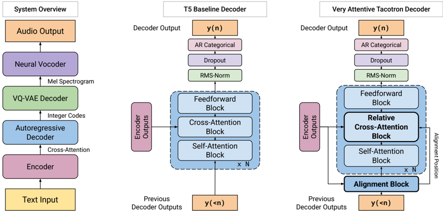

> [!abstract] NAACL · 2025 · Conference
> **Battenberg et al.** (Google DeepMind) · [→ Paper](https://aclanthology.org/2025.naacl-long.591) · Demo: ✓ · Code: ✓
>
> Very Attentive Tacotron (VAT) augments a T5-based encoder-decoder TTS system with a learned monotonic alignment mechanism that provides cross-attention operations with alignment-relative position information, eliminating word drops, repetitions, and length generalization failures without sacrificing naturalness.

## Problem

Autoregressive Transformer-based encoder-decoder TTS models are prone to word omissions, repetitions, and catastrophic failure on sequences longer than those seen during training. These failures stem from cross-attention operations that lack any notion of relative position between encoder and decoder time steps, making them sensitive to the length and repetition structure of input text. Prior approaches to robustness in encoder-decoder TTS either constrained cross-attention to a narrow, hard-coded window (sacrificing modeling power) or abandoned the attention mechanism entirely in favour of duration-based models (sacrificing expressivity). More recent discrete AR Transformer systems such as VALL-E and its successors exhibit the same class of failures and have required external forced alignments or transducer-based objectives to address them, at the cost of inference complexity.

## Method

VAT builds on a T5-based encoder-decoder architecture. The encoder processes phoneme input through two stages of residual convolutions (downsampling 2x) followed by three non-causal self-attention Transformer blocks. The decoder is an autoregressive model trained to predict a sequence of discrete spectral codes produced by a spectrogram VQ-VAE; within each frame, the joint distribution of eight product-quantized (PQ) codes is further factored using an auxiliary autoregressive feedforward network. A GAN-based neural vocoder (combining Parallel WaveGAN's dilated-convolution generator with HiFi-GAN's multi-scale and multi-period discriminators) converts predicted spectrograms to waveforms.

The central contribution is a mechanism that extends T5's relative position biases (RPBs) to cross-attention. Standard RPBs use integer relative distances and cannot be applied to encoder-decoder cross-attention because there is no canonical relative distance between encoder and decoder positions. VAT resolves this by introducing Interpolated Relative Position Biases (IRPBs): the bucket-index function is evaluated at real-valued inputs and the bias value is obtained by linearly interpolating between adjacent integer entries in the bias matrix. This makes the RPBs differentiable with respect to a continuous alignment position.

A lightweight alignment layer, implemented as a single LSTM, is prepended to each decoder block. It produces a monotonically advancing alignment scalar by (a) attending to encoder outputs using purely location-based attention (attention scores are the IRPBs alone, with no content-based query-key comparisons) and (b) projecting its hidden state to a delta that is passed through softplus to enforce monotonicity. This alignment position is fed to every subsequent cross-attention layer in the decoder, which augments standard dot-product attention with alignment-informed IRPBs. Because the alignment position is unobserved, it cannot be teacher-forced and must be computed serially during training; subsequent decoder layers still run in parallel, limiting the throughput penalty to roughly 12-20% depending on model size. A Maximum Distance Penalty (MDP) applied to IRPBs beyond a maximum relative distance D prevents undefined behaviour at lengths unseen during training.

The cross-attention IRPB matrices are initialised with a Gaussian window centred at zero relative distance. This initialization biases early training toward local attention, providing enough stability for the alignment layer to learn meaningful trajectories before the rest of the model has converged.

Speaker conditioning uses per-speaker learned embeddings, not audio prompting; the paper explicitly targets multi-speaker industry scenarios rather than zero-shot voice cloning.

## Key Results

Naturalness evaluations (MOS and AB7 side-by-sides) show VAT matches the T5 baseline: on the Lessac voice, MOS is 3.68 for VAT versus 3.75 for T5 (overlapping 99% confidence intervals), and the side-by-side score versus VAT is -0.06 ± 0.14, indicating statistical equivalence. On LibriTTS, MOS is 3.16 for VAT versus 3.07 for T5, again with overlapping intervals. VAT is preferred over Tacotron-GMMA (SxS -0.32 ± 0.14) and marginally preferred over Non-Attentive Tacotron (not significant at 99%).

The robustness gap is large and clear. On the Lessac test set, CER is 3.3 for VAT versus 10.2 for T5 baseline; on LibriTTS, 4.6 versus 10.7 (Table 1). These errors arise because the T5 baseline drops or repeats words, especially as utterance length approaches or exceeds the 9.6-second training maximum. In the repeated-words stress test, VAT makes zero errors across 27 phrases (1-9 repetitions), while T5 fails on 14 of 27 (52%), including phrases with as few as 2 repetitions.

Length generalisation is evaluated via CER on 1034 transcripts ranging from 100 to 1500 characters (up to ~90 seconds). VAT's CER stays flat across the full length range. The T5 baseline's CER rises sharply beyond the 9.6-second training boundary, eventually producing babbled, incomprehensible output. Tacotron-GMMA and NAT also generalise well, but both produce less expressive output than VAT as measured by side-by-side preference.

## Novelty Assessment

The core novelty is the IRPB mechanism and its integration into an alignment layer: making T5 relative position biases differentiable with respect to a continuous alignment position allows the monotonic constraint to be learned end-to-end without forced alignments, dynamic programming, or inference-time reranking. This is a technically clean solution to a well-documented problem. The insight that location-based attention in the alignment layer need only maintain a coarse alignment, leaving fine-grained phoneme tracking to content-based multi-head cross-attention in subsequent layers, is a practical architectural decision that preserves modeling power. The discrete token approach (VQ-VAE over mel-spectrograms) is the paper's own engineering choice rather than a reliance on off-the-shelf neural codecs, which is somewhat unusual and limits direct codec-level comparisons with VALL-E class systems. Evaluation is limited to English, to two datasets, and to a speaker-conditioned (not zero-shot) setting; the paper explicitly acknowledges these scope restrictions.

## Field Significance

Moderate - VAT provides a principled and empirically validated solution to length generalization failure in encoder-decoder AR Transformer TTS, a problem that had persisted across multiple prior systems and had driven many practitioners toward duration-based alternatives. The alignment-through-interpolated-RPBs mechanism can be applied to any encoder-decoder cross-attention model and provides a model-internal alternative to alignment supervision. Its primary scope is encoder-decoder architectures with per-speaker conditioning rather than the zero-shot codec LM paradigm that has dominated recent AR TTS work.

## Claims

- **supports:** Monotonic alignment can be learned end-to-end as a latent property of an encoder-decoder TTS model via backpropagation, without requiring forced alignments or dynamic programming during training.
  > *Evidence:* VAT's alignment layer learns continuous alignment positions through interpolated relative position biases (IRPBs); alignment trajectories emerge from joint training with no external supervision, and generalise to utterances far longer than the training distribution. *(§3.3, §3.4)*

- **supports:** Augmenting cross-attention with a learned monotonic alignment position enables unbounded length generalisation in encoder-decoder TTS without degrading naturalness relative to an unmodified Transformer baseline.
  > *Evidence:* VAT achieves near-zero CER on inputs up to 1500 characters (~90 seconds) despite training only on utterances up to 9.6 seconds, while matching the T5 baseline in side-by-side naturalness evaluations (SxS -0.06 ± 0.14 on Lessac, 0.01 ± 0.14 on LibriTTS). *(§5.1, §5.2, §5.3, Table 1)*

- **complicates:** Standard MOS evaluations are insufficient to surface robustness failures in autoregressive TTS because raters cannot detect dropped or repeated words without access to target transcripts.
  > *Evidence:* The T5 baseline achieves overlapping MOS with VAT (3.75 vs. 3.68 on Lessac) while producing a CER of 10.2 versus VAT's 3.3; the perceptual quality rating is statistically indistinguishable despite systematic robustness failures. *(§5.1, §5.2, Table 1)*

- **complicates:** Autoregressive Transformer TTS without explicit alignment guidance fails on repeated words even within training sequence length limits.
  > *Evidence:* The T5 baseline makes errors on 14 of 27 (52%) repeated-word test phrases, including phrases with as few as 2 repetitions of a single word, while VAT makes zero errors across all 27 templates. *(§5.4)*

- **refines:** Duration-based TTS achieves better ASR-measured character error rates than expressive autoregressive models, but the gain is attributable to hyper-intelligible, monotone synthesis rather than superior text coverage.
  > *Evidence:* NAT achieves CER 3.3 on LibriTTS, below both VAT (4.6) and ground truth (3.6), yet VAT is preferred over NAT in naturalness side-by-sides because NAT's unsupervised duration predictor produces robotic, monotonous prosody. *(§5.3, Table 1)*

## Limitations and Open Questions

Training speed is affected by the need to compute alignment positions serially during training, imposing a 12-20% slowdown relative to the T5 baseline depending on model scale. All experiments use English and a speaker-conditioned (non-zero-shot) setting; generalisation to other languages and to audio-prompted zero-shot scenarios is untested. Evaluation compares against T5, Tacotron-GMMA, and NAT; no direct comparison with codec LM systems (VALL-E, SPEAR-TTS, MQTTS) is provided, which the paper attributes to incompatible dataset scales and evaluation protocols. Hyper-parameter choices for the alignment layer, IRPB initialization, and maximum distance penalty are reported but not systematically ablated.

## Wiki Connections

- [[transformer-enc-dec-tts|Transformer Encoder-Decoder TTS]] - VAT directly extends this architecture family by adding alignment-informed relative cross-attention to address its well-known length generalisation failures.
- [[autoregressive-codec-tts|Autoregressive Codec TTS]] - VAT applies discrete AR decoding over VQ-VAE spectrogram codes within an encoder-decoder framework, sharing the token-prediction paradigm with codec LM approaches.
- [[neural-codec|Neural Audio Codec]] - VAT uses a custom product-quantized VQ-VAE over mel-spectrograms rather than an off-the-shelf neural audio codec, enabling flexible bitrate control without retraining a full codec stack.
- [[gan-vocoder|GAN Vocoder]] - VAT's waveform synthesis stage combines the Parallel WaveGAN generator with HiFi-GAN discriminators, illustrating how GAN vocoders serve as modular components in discrete TTS pipelines.
