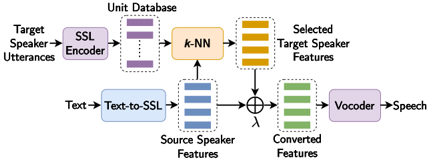

> [!abstract] NAACL · 2025 · Conference
> **El Hajal et al.** (Idiap Research Institute) · [-> Paper](https://aclanthology.org/2025.naacl-short.65) · Demo: ✓ · Code: ✓
>
> kNN-TTS achieves zero-shot multi-speaker TTS competitive with models trained on thousands of hours of multi-speaker data by replacing speaker embeddings with kNN retrieval over pre-trained WavLM SSL features, requiring only 24 hours of single-speaker transcribed data for training.

## Problem

State-of-the-art zero-shot multi-speaker TTS systems such as XTTS and HierSpeech++ require thousands of hours of transcribed speech from hundreds of speakers to learn generalizable speaker representations. This data requirement creates a significant barrier for developing multi-speaker TTS in low-resource languages and domains. The key question is whether it is possible to achieve zero-shot speaker generalisation without large multi-speaker training corpora, by exploiting structural properties of SSL feature spaces instead.

## Method

kNN-TTS is a four-component pipeline. A Text-to-SSL model first converts input text into SSL feature sequences representing a source speaker; this is the only component that requires transcribed audio and can be trained on a single speaker's data. A pre-trained WavLM-Large encoder (layer 6) then provides the SSL feature space; this layer was chosen because its representations simultaneously encode phonetic content and speaker identity, with linearly close frames from different speakers sharing phonetic properties. At inference, kNN retrieval matches each source frame to the k=4 nearest frames from a pre-built target speaker database (using cosine distance), replacing the source speaker's voice attributes while preserving phonetic content. The retrieved target frames are then linearly interpolated with the original source frames using a weighting parameter λ, enabling fine-grained voice morphing by blending source and target styles. A pre-trained HiFi-GAN V1 vocoder decodes the resulting feature sequence back to a waveform.

Two Text-to-SSL implementations are evaluated: GlowkNN-TTS uses a GlowTTS backbone (flow-based non-autoregressive, 51.5M params, trained 650k steps) and GradkNN-TTS uses a GradTTS backbone (diffusion-based, 31.5M params, trained 2M steps). Both are trained solely on LJSpeech (24h). The SSL encoder and vocoder are frozen pre-trained models; the kNN retrieval step is non-parametric.

## Key Results

Results are summarised in Table 1, evaluated on LibriSpeech test-clean (40 speakers). GlowkNN-TTS achieves N-MOS 4.07 and S-MOS 3.93, which falls within the confidence intervals of HierSpeech++ (N-MOS 4.15, S-MOS 4.01) and XTTS (N-MOS 4.11, S-MOS 3.93), trained on 2,796h and 27,282h respectively. On speaker similarity (SECS), GlowkNN-TTS (0.72) outperforms both XTTS (0.40) and YourTTS (0.54), though it falls short of HierSpeech++ (0.67). Intelligibility (WER 3.71%) is better than YourTTS (6.09%) but slightly worse than HierSpeech++ (3.36%) and XTTS (2.76%). GlowkNN-TTS is the most parameter-efficient of the top performers at 51.5M params and 0.45 GB GPU memory, compared to XTTS at 482M / 2.15 GB. The diffusion-based GradkNN-TTS shows similar speaker similarity (SECS 0.71) but higher WER (4.32%) and slower inference (RTF 2.41 vs 0.24 for GlowkNN-TTS) due to 100 diffusion steps.

## Novelty Assessment

The main contribution is architectural in a pipeline sense: the paper demonstrates that kNN retrieval over SSL features, previously applied to voice conversion in kNN-VC (Baas et al., 2023), can substitute for multi-speaker training in TTS. The individual components (WavLM, GlowTTS, GradTTS, HiFi-GAN) are all existing systems. The framework novelty lies in combining them through the kNN retrieval step rather than end-to-end multi-speaker training, and in introducing an interpolation parameter for voice morphing. The data efficiency result is the headline finding: a 100x-1000x reduction in transcribed training data with broadly competitive quality. The evaluation is thorough (both objective and crowd-sourced subjective), uses real baselines with default checkpoints, and clearly quantifies the trade-off. The approach is English-only in this paper, and the absence of duration adaptation to the target speaker is a genuine limitation left to future work.

## Field Significance

Moderate -- kNN-TTS demonstrates that SSL feature retrieval can serve as a practical alternative to multi-speaker end-to-end training for zero-shot TTS, enabling deployment in low-resource settings at a fraction of the data cost. The result is useful evidence for the broader proposition that pre-trained SSL representations encode sufficient cross-speaker structure for voice transfer, and the approach directly extends the kNN-VC line of work from voice conversion to TTS.

## Claims

- **supports:** SSL feature spaces from pre-trained models encode cross-speaker structure that enables zero-shot voice transfer through nearest-neighbor retrieval, without speaker-specific training data.
  > *Evidence:* kNN-TTS uses WavLM-Large layer 6 features, where frames from different speakers that are linearly close share phonetic information while preserving speaker identity; kNN retrieval over these features achieves SECS 0.72 and competitive MOS scores trained only on 24h of single-speaker LJSpeech data. *(§2.1, Table 1)*

- **supports:** Zero-shot multi-speaker TTS competitive with large multi-speaker end-to-end systems can be achieved with single-speaker transcribed training data by delegating speaker identity to inference-time retrieval.
  > *Evidence:* GlowkNN-TTS (24h training, single speaker) achieves N-MOS and S-MOS within the confidence intervals of HierSpeech++ (2,796h, 7299 speakers) and XTTS (27,282h, multi-speaker) on LibriSpeech test-clean. *(§4, Table 1)*

- **complicates:** Retrieval-based zero-shot TTS requires substantially more reference audio from the target speaker than embedding-based approaches to achieve sufficient quality.
  > *Evidence:* kNN-TTS requires approximately 30 seconds of target speaker audio for suitable intelligibility and around 1 minute for speaker similarity to plateau, whereas competing embedding-based systems show diminishing returns beyond 10-30 seconds of reference audio. *(§Limitations, Figure 3b)*

- **complicates:** Frame-level kNN speaker transfer does not address speaker-specific duration and rhythm, leaving prosodic timing patterns fixed to the training speaker.
  > *Evidence:* In kNN-TTS, utterance duration is determined entirely by the single-speaker Text-to-SSL model; frame-by-frame retrieval substitutes voice quality but does not adapt speaking rate or rhythm to the target speaker. *(§Limitations "Rhythmic variations")*

## Limitations and Open Questions

> [!warning]
> The reference audio requirement is a practical limitation: kNN-TTS needs approximately 30 seconds of target speaker audio for usable intelligibility, which is notably higher than embedding-based competitors that can function with shorter clips. This restricts applicability in truly few-shot or single-utterance zero-shot scenarios.

Duration adaptation to the target speaker is not addressed; the speaking rate and rhythm of the output always reflect the training speaker (LJSpeech). The paper proposes Urhythmic-style rhythm modeling as future work. Evaluation is English-only, and while the authors note potential for cross-lingual transfer (via kNN-VC cross-lingual capabilities), this is not demonstrated. Using mel-spectrogram features as an alternative to SSL features was ablated and found completely ineffective, confirming the dependency on WavLM's particular representational structure.

## Wiki Connections

- [[zero-shot-tts|Zero-Shot TTS]] -- kNN-TTS directly addresses zero-shot multi-speaker synthesis, achieving competitive performance while bypassing multi-speaker training data requirements.
- [[self-supervised-speech|Self-Supervised Speech]] -- WavLM-Large layer 6 features are the core representation enabling cross-speaker kNN retrieval; the paper's approach depends critically on SSL features' cross-speaker linear structure.
- [[voice-conversion|Voice Conversion]] -- the kNN retrieval mechanism is directly inspired by kNN-VC (Baas et al., 2023), extending that voice conversion methodology to the TTS setting.
- [[speaker-adaptation|Speaker Adaptation]] -- kNN-TTS offers a non-parametric inference-time approach to speaker adaptation, contrasting with fine-tuning or embedding-based methods.
- [[gan-vocoder|GAN Vocoder]] -- HiFi-GAN V1 pre-trained on LibriSpeech train-clean-100 WavLM features is used as the waveform decoder throughout.
