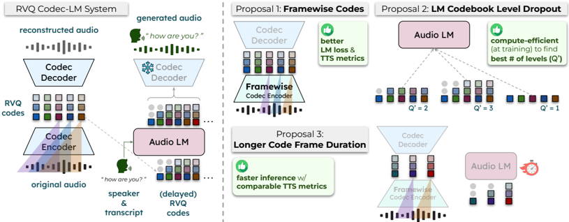

> [!abstract] NAACL · 2025 · Conference
> **Wu et al.** (Cartesia AI / MIT / CMU) · [→ Paper](https://aclanthology.org/2025.naacl-srw.6) · Demo: ? · Code: ✓
>
> Three codec-LM co-design interventions (framewise codec encoder, codebook level dropout, longer frame duration) together double TTS inference speed while improving intelligibility, audio quality, and speaker similarity relative to a siloed baseline built on DAC and a Delay-pattern LM.

## Problem

Neural codec language model systems treat the codec and the LM as independent research concerns, developed in isolation. Codec research optimises reconstruction quality and compression rate without considering the downstream effects on LM training or inference. LM research treats the codec as a fixed black box, optimising token-sequence modeling while ignoring how codec design choices (frame duration, codebook depth, encoder receptive field) propagate into the LM's task. This siloed approach leaves end-to-end performance gains on the table: choices that improve codec reconstruction metrics do not necessarily improve, and may actively harm, the codec-LM system's intelligibility or speaker fidelity.

## Method

The paper builds on a streamable (causal) variant of DAC (Descript Audio Codec) as the backbone codec, paired with a 400M-parameter hybrid LM consisting of 24 layers of interleaved Mamba2 and Transformer decoder blocks. The LM models RVQ codes using the Delay pattern (from MusicGen/Copet et al., 2023), which staggers RVQ levels across time to shorten effective sequence length while preserving autoregressive dependencies. TTS conditioning prepends character-level text embeddings and a speaker embedding (from a raw-waveform speaker recognition model) to the RVQ code sequence.

Three co-design interventions are proposed. First, the framewise codec encoder removes receptive-field overlap between adjacent code frames on the encoder side by reshaping the input waveform from `(B, T*fs, 1)` to `(B*T*fx, fs/fx, 1)` before encoding, then reshaping back, requiring no architectural change to DAC. The decoder retains overlapping receptive fields, preserving inter-frame mutual information for reconstruction while giving the LM cleaner, non-confounded per-frame representations. Second, LM codebook level dropout (CL drop) trains a single LM to handle variable numbers of RVQ levels by randomly truncating the level dimension of the Delay-patterned codes during training, using a dropout distribution that allocates 90% of steps to the full level count and distributes the remaining 10% uniformly. This allows practitioners to identify the optimal level count from a single training run rather than training one LM per candidate level count. Third, the paper explores doubled frame duration (from 11ms to 22ms), which halves LM sequence length and inference latency; codec quality is maintained by increasing the number of RVQ levels proportionally to preserve total bitrate.

The codec is trained on 1.7K hours of in-house YouTube podcast data for TTS and 200 hours of FMA music. The LM is trained on 550-hour LibriTTS-R for TTS and 1.5K hours of MTG-Jamendo for music. Inference uses pure sampling from the LM's output logits.

## Key Results

Applying only the framewise encoder (Proposal 1) reduces WER from 4.12% to 3.71% and LM NLL by more than 8%, with small gains in NISQA (4.35 to 4.37) and speaker similarity (80.2% to 80.7%), at 11ms frame duration (Table 1). Notably, the framewise encoder slightly degrades Mel-L1 reconstruction quality, confirming that better codec reconstruction does not imply better end-to-end generation.

Combining framewise encoder, codebook level dropout (Proposal 2), and 22ms frame duration (Proposal 3) in the final configuration achieves WER 3.86%, NISQA 4.43, and speaker similarity 80.8%, with a 2.01x inference speedup over the causal baseline (Table 3). The doubled frame duration alone yields a 1.94x speedup while preserving or improving all TTS metrics relative to the framewise-encoder-only setting. Increasing frame duration further to 44ms provides a 3.2-3.8x speedup but substantially degrades WER and speaker similarity.

CL drop faithfully tracks the performance profile of 12 separately trained LMs across all candidate level counts (Figure 2), validating it as an efficient hyperparameter search mechanism. The optimal level count differs by metric: WER peaks at 3-4 levels while NISQA and speaker similarity peak at around 9 levels; FAD serves as a useful proxy for selecting a balanced level count.

## Novelty Assessment

The framewise encoder intervention is a genuine observation about the asymmetric roles of encoder and decoder receptive fields in RVQ codecs, and the implementation is practically useful (no architecture change, immediate gains). The insight that codec reconstruction quality and end-to-end LM quality can diverge is the paper's sharpest empirical contribution. LM codebook level dropout is an engineering adaptation of the existing quantizer dropout technique from codec training, applied to the LM side; the mechanism is straightforward but the practical payoff (one training run instead of O(Q)) is real. The frame duration scaling result is primarily empirical, confirming that 2x duration is a safe operating point while 4x is not. Overall, the contribution is a combination of a modest architectural insight (framewise encoder) and two engineering recipes for the codec-LM practitioner. The evaluation is clean and the ablations are thorough for a workshop paper.

## Field Significance

Moderate -- This paper provides concrete evidence that codec and LM design choices are not independent in RVQ-based TTS systems, and that targeted codec modifications can improve LM log-likelihood and end-to-end speech quality simultaneously. It introduces practical recipes (framewise encoder, codebook level dropout, doubled frame duration) that practitioners can apply to existing DAC-based pipelines without architectural redesign. The result that better codec reconstruction does not always translate to better end-to-end generation is a useful empirical caution for the field.

## Claims

- supports: Non-overlapping encoder receptive fields in RVQ codecs improve downstream language model likelihood and end-to-end TTS metrics relative to the standard causal overlapping setup.
  Evidence: Replacing the overlapping causal encoder with a framewise encoder on a DAC-based codec reduces LM NLL by more than 8% and improves WER, NISQA, and speaker similarity on LibriTTS-R test-clean, despite slightly worsening Mel-L1 reconstruction. *(§3.1, Table 1)*

- complicates: Better codec audio reconstruction quality does not reliably predict better end-to-end speech generation quality in codec-LM systems.
  Evidence: The framewise encoder achieves higher NLL and better TTS metrics than the causal baseline while scoring slightly worse on Mel-spectral L1 reconstruction distance, demonstrating that reconstruction-optimised codecs can be suboptimal for downstream LM training. *(§4, Table 1)*

- supports: Increasing RVQ codec frame duration can substantially reduce codec-LM inference latency with little or no degradation in TTS intelligibility and speaker similarity, provided the bitrate is held approximately constant by adjusting codebook depth.
  Evidence: Doubling frame duration from 11ms to 22ms yields a 1.94x inference speedup with WER 4.21%, NISQA 4.42, and speaker similarity 81.0%, matching or improving on the 11ms framewise baseline. Quadrupling to 44ms further accelerates inference (3.2-3.8x) but substantially degrades WER and speaker similarity. *(§3.3, §4, Table 2)*

- supports: A single LM trained with codebook level dropout can efficiently approximate the performance profile of training one LM per candidate RVQ level count.
  Evidence: Training with 90%-full CL drop on a 12-level codec produces per-level performance curves for WER, NISQA, and speaker similarity that closely track those of 12 independently trained LMs across all Q' values 1-12. *(§3.2, §4, Figure 2)*

- refines: The optimal number of RVQ codebook levels for end-to-end codec-LM TTS differs across evaluation dimensions, and more levels are not universally better for end-to-end performance even when they monotonically improve codec reconstruction.
  Evidence: End-to-end FAD reaches a global minimum at 9 levels before degrading, while WER reaches its best at 3-4 levels and NISQA and speaker similarity peak at approximately 9 levels, in contrast to codec Mel-L1 which improves monotonically. *(Appendix B, Figure 3)*

## Limitations and Open Questions

> [!warning]
> The evaluation is conducted on a single English TTS corpus (LibriTTS-R test-clean) using automatic metrics only (WER via Whisper, NISQA, cosine speaker similarity). No human listening test is reported, so perceptual quality gains are estimated rather than directly validated.

The codec is trained on proprietary in-house podcast data (1.7K hours), which limits reproducibility for the codec training stage specifically. The LM training does use the public LibriTTS-R dataset. The codebook size hyperparameter (|V|) remains outside the scope of CL drop, requiring separate trial-and-error search. The paper does not investigate multilingual or noisy speech settings. The optimal frame duration finding (22ms being the sweet spot) is specific to this codec architecture and training data and may not generalise to other codec families.

## Wiki Connections

- [[autoregressive-codec-tts|Autoregressive Codec TTS]] -- This paper examines the codec design choices that govern end-to-end performance in autoregressive codec LM systems and proposes techniques to jointly optimise them.
- [[neural-codec|Neural Audio Codec]] -- The framewise encoder and frame duration scaling experiments directly target RVQ codec design, establishing that encoder receptive field choice matters for downstream LM quality.
- [[zero-shot-tts|Zero-Shot TTS]] -- The system uses speaker embedding conditioning for zero-shot speaker control, and speaker similarity is a primary evaluation axis across all experiments.
- [[streaming-tts|Streaming TTS]] -- The use of a causal (streamable) DAC codec and the motivation to reduce inference latency via longer frame durations connect directly to streaming deployment constraints.
- [[evaluation-metrics|Evaluation Metrics]] -- The paper demonstrates that codec Mel-L1 reconstruction and end-to-end TTS metrics (WER, NISQA, SPK-SIM) can diverge, contributing evidence about the limitations of using reconstruction quality as a proxy for generative system performance.
