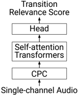

> [!abstract] SIGDIAL 2025 · 2025 · Workshop
> **Miyazawa and Sato** (Fairy Devices Inc.) · [→ Paper](https://aclanthology.org/2025.sigdial-1.21) · Demo: ✗ · Code: ✗
>
> TRPDformer combines a contrastive predictive coding (CPC) encoder with a causal self-attention transformer to detect transition relevance points (TRPs) in real time from acoustic features alone, enabling spoken dialogue systems to determine response timing without silence thresholding or ASR.

## Problem

Conventional spoken dialogue systems determine when to respond by waiting for a pause of fixed duration after the user stops speaking. This approach produces unnaturally timed responses: systems either cut in too early, before the user has finished a turn construction unit, or wait too long after a natural completion point. Prior work on turn-taking prediction either relied on linguistic features extracted from transcriptions (introducing ASR latency), operated in batch mode at the end of utterances, or conflated speaker-change prediction with the distinct task of identifying when a turn shift is permissible — what conversation analysts call the transition relevance point.

## Method

TRPDformer frames TRP detection as a binary sequence labelling problem over continuous audio. A pre-trained CPC model (Rivière et al., 2020) encodes raw audio into representations at 100 Hz; a convolutional downsampling layer then reduces this to 20 Hz. A causal self-attention transformer (embedding dimension 256, four heads) processes these representations, and a time-distributed dense head with a logistic activation predicts a transition relevance score r(t) in the range [0, 1] at 20 ms intervals. Cross-entropy loss is computed within a 1000 ms window centred on the end of each inter-pausal unit (IPU), which avoids the severe class imbalance that would arise from training on the full audio stream.

The paper distinguishes three latency regimes: predictive (L = -240 ms, fires before the IPU end), just-in-time (L = 0), and retrospective (L = +240 ms). This allows the operating point to be tuned based on whether response latency or interruption avoidance is prioritised. A voice activity detection (VAD) baseline triggers on pauses exceeding a configurable threshold.

The architecture is structurally derived from the stereo VAP model of Ekstedt and Skantze, with two modifications: the input is single-channel (user audio only) and the output is a single score rather than stereo voice activity projections. Despite the shared structure, the paper emphasises that TRP detection and VAP address different tasks: VAP predicts who will speak next, while TRP detection identifies when a turn shift is acceptable.

## Key Results

On the Corpus of Everyday Japanese Conversation (CEJC, 200 hours, 862 speakers), all TRPDformer variants outperform the VAD baseline across precision-recall space (§5.3, Figure 6). In the fixed reception period condition (S = 1000 ms), all latency variants achieve AUC = 0.83. In the variable reception period condition (where detection must occur before the next IPU onset), the predictive model has a slight advantage. On the validation set, just-in-time achieves AUC = 0.807 and predictive achieves AUC = 0.801, versus AUC = 0.763 for the retrospective variant.

A human preference test (117 stimulus pairs, 40 raters each) found that third-party listeners rated TRPDformer response timing as more natural than the VAD baseline. Even when both models misdetected TRPs, subjects preferred the proposed model, suggesting that the learned score provides a better quality ranking than a fixed pause threshold (§5.5, Figure 8).

## Novelty Assessment

The primary contribution is applying CPC-based self-supervised speech features together with a causal transformer to TRP detection, enabling purely acoustic, frame-level inference without ASR. The architecture is a straightforward adaptation of an existing VAP model to a new task, so the structural novelty is limited. The more significant contribution is conceptual: the paper carefully distinguishes TRP detection from speaker-change prediction and from VAP, provides a statistical argument for why a perfect VAP model would underperform at TRP detection (recall ceiling of 0.60 at precision 0.71 in CEJC), and formalises the transition relevance score as a trainable target. The evaluation is limited to one language (Japanese) and one corpus, and the paper does not report real-time processing speed, which is a relevant constraint for deployment.

## Field Significance

Moderate — This paper provides a clear methodological baseline for acoustic TRP detection in spoken dialogue systems, situating the problem precisely in relation to the more widely studied VAP and speaker-change prediction tasks. Its value lies in clarifying the task boundary and demonstrating that acoustic-only, causal inference is feasible; the architecture itself adapts established components rather than introducing structural innovations.

## Claims

- **supports:** Purely acoustic, real-time turn-taking inference is feasible without relying on ASR or linguistic features.
  > *Evidence:* TRPDformer achieves AUC = 0.83 on CEJC using only CPC audio representations and a causal transformer, outperforming a VAD baseline with no transcription step. *(§5.3, Figure 6)*

- **complicates:** Voice activity projection models are not directly transferable to transition relevance point detection, even though the tasks appear structurally similar.
  > *Evidence:* Statistical analysis of CEJC shows that a theoretically perfect VAP model would achieve at most recall = 0.60 and precision = 0.71 on TRP detection, below TRPDformer's empirical performance, because speaker shift and TRP are not equivalent events. *(§4.2)*

- **supports:** Learned acoustic response-timing models produce perceptibly more natural dialogue turn-taking than fixed-threshold silence detection.
  > *Evidence:* In a preference test with 40 raters per stimulus pair, subjects preferred TRPDformer's response timing over the VAD baseline, including in cases where both models misdetected TRPs. *(§5.5, Figure 8)*

- **complicates:** Frame-level TRP models trained on spontaneous conversation may not generalise across languages or domains, limiting their direct applicability in multilingual or task-oriented dialogue systems.
  > *Evidence:* TRPDformer is trained and evaluated solely on CEJC (Japanese everyday conversation); the paper identifies cross-lingual and cross-domain robustness as open future directions. *(§6)*

## Limitations and Open Questions

> [!warning]
> Evaluation is limited to a single language (Japanese) and a single corpus (CEJC). Generalisation to other languages, accents, or task-oriented dialogue domains is untested, and the paper does not report real-time processing latency or robustness to noise — both of which are critical for deployment.

The paper also does not evaluate the downstream effect of TRPDformer on a full spoken dialogue system end-to-end, only on the timing component in isolation via a preference test. Response timing is studied independently of response content quality, and the paper acknowledges that future work should integrate TRPDformer into a complete dialogue system to assess its impact on overall conversational quality.

## Wiki Connections

- [[self-supervised-speech|Self-Supervised Speech]] — The model uses CPC (contrastive predictive coding) as its core speech encoder, making self-supervised pre-training central to the architecture.
- [[evaluation-metrics|Evaluation Metrics]] — The paper uses AUC on precision-recall curves as the primary quantitative metric and introduces a human preference test methodology for evaluating response timing naturalness.
- [[subjective-evaluation|Subjective Evaluation]] — A controlled preference test with 40 raters per pair evaluates whether differences in TRP detection are perceptible to human listeners, establishing perceptual validity for the AUC-based evaluation.
