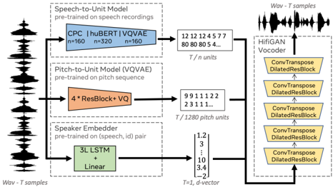

> [!abstract] arXiv · 2021 · Preprint
> **Polyak et al.** (Facebook AI Research) · [→ Paper](https://arxiv.org/abs/2104.00355) · Demo: ✓ · Code: ?
>
> Disentangled self-supervised representations for speech content, pitch, and speaker identity are separately extracted and combined to drive a HiFi-GAN vocoder, enabling controllable speech resynthesis, voice conversion, and an ultra-low-bitrate codec reaching 365 bits per second.

## Problem

Prior work on self-supervised speech representations largely evaluated those representations in the context of ASR, leaving their suitability for synthesis unclear. The extent to which speaker identity and pitch information are encoded within learned discrete units, versus being disentangled from them, was unknown. Existing low-bitrate speech codecs relied on hand-engineered signal models or supervised neural components, and did not leverage the compact discrete speech representations that SSL methods produce.

## Method

The system uses three separate encoders operating in parallel on a raw waveform. A content encoder extracts discrete speech units via one of three SSL models: CPC (contrastive predictive coding), HuBERT, or VQ-VAE. Because CPC and HuBERT produce continuous representations, k-means clustering with K=100 centroids converts them to discrete tokens; VQ-VAE is already discrete. A separate F0 encoder applies a VQ-VAE trained on extracted pitch contours, producing a 20-token discrete pitch sequence at 12.5 Hz (65 bps). A pretrained speaker verification network provides a 256-dimensional d-vector as global speaker conditioning. The three representations are combined and fed to a modified HiFi-GAN generator: content and pitch token sequences are embedded via lookup tables, upsampled, concatenated, and augmented with the speaker embedding at every frame. Training follows the standard HiFi-GAN objective with adversarial, feature-matching, and mel-spectrogram reconstruction losses.

The modular design allows independent manipulation of each representation stream. Speaker conversion is achieved by substituting the speaker embedding at inference; pitch manipulation by replacing or flattening the F0 tokens. For the codec experiment, HuBERT with 50 units (300 bps content) combined with the 65 bps F0 track yields a total bitrate of 365 bps.

## Key Results

On speech resynthesis, HuBERT achieves the lowest PER (9.52%) and WER (6.96%) on LJSpeech among the three content encoders, with MOS of 3.66 (vs. ground truth 4.33). VQ-VAE outperforms HuBERT and CPC on F0 reconstruction metrics (VDE 7.19 vs. 13.09 for HuBERT on LJSpeech), indicating that VQ-VAE retains more pitch information in its content codes, making it less suitable for independent prosody control.

On voice conversion (Table 2), HuBERT achieves EER of 0.31 on LJ-to-VCTK conversion, indicating near-complete speaker disentanglement in its content units. VQ-VAE performs substantially worse (EER 9.65), confirming that its content codes entangle speaker identity. MOS for HuBERT voice conversion reaches 3.71.

The low-bitrate codec experiment (MUSHRA on VCTK, 20 utterances from 5 unseen speakers) shows HuBERT with 50 units at 365 bps outperforms Opus at 9 kbps, Codec2 at 2.4 kbps, and LPCNet at 1.6 kbps in perceived quality. Exact MUSHRA scores are visible in Figure 2 but not tabulated numerically in the paper.

## Novelty Assessment

The central novelty is the systematic decomposition of the speech signal into three independently controllable discrete streams using entirely pre-trained, fixed SSL encoders combined with a learned HiFi-GAN decoder. No single prior work had simultaneously (a) compared CPC, HuBERT, and VQ-VAE from a synthesis and disentanglement standpoint, or (b) demonstrated that SSL content units could serve as the core of an ultra-low-bitrate codec that outperforms classical codecs at a fraction of their bitrate. The architectural contribution is genuine: the three-encoder structure with independent discrete conditioning is not a simple recombination of published components but a purposeful design for controllability. The empirical comparison across multiple SSL methods is thorough and the evaluation covers content, pitch, speaker, and codec quality simultaneously. The limitation is that the approach depends entirely on pre-trained SSL models and does not train a fully end-to-end system, which constrains adaptation to new domains.

## Field Significance

> [!tip]
> High — This paper establishes that self-supervised discrete speech units, originally developed for ASR, can function as effective speech content representations for synthesis and voice conversion, and it provides the systematic disentanglement analysis and bitrate results that subsequent codec and speech LM work builds on. The codec result in particular (surpassing Opus at 1/25th the bitrate) demonstrates the extreme compression efficiency latent in SSL representations and can serve as a conceptual baseline for neural codec research.

## Claims

- SSL content representations that are well-disentangled from speaker identity also exhibit stronger voice conversion performance, while representations that entangle speaker information perform worse at conversion but better at pitch reconstruction. *(§4, Table 1, Table 2)*
- Discrete speech units learned by SSL models can form the basis of an ultra-low-bitrate speech codec that outperforms classical parametric codecs in subjective quality. *(§4, Figure 2)*
- Among self-supervised content encoders, HuBERT units carry less speaker and pitch information than VQ-VAE units, making them better suited for downstream controllable synthesis. *(§4, Table 2)*
- Pitch and speaker identity can be independently conditioned in a GAN vocoder through separate discrete token streams, enabling controllable F0 manipulation without retraining. *(§3, §4)*

## Limitations and Open Questions

> [!warning]
> The codec evaluation uses only 20 utterances from 5 VCTK speakers, all unseen during training but from the same corpus. Generalization to out-of-domain speech (conversational, noisy, or non-English) is untested.

The resynthesis MOS scores remain well below ground truth on both LJSpeech (3.66 vs. 4.33) and VCTK (3.41 vs. 4.08), indicating a quality gap the system does not close. Disentanglement is evaluated indirectly through proxy metrics (EER, VDE, FFE) rather than a direct information-theoretic measure. The speaker encoder requires speaker embeddings from training-set speakers for the lookup-table variant; the d-vector approach generalizes but relies on a separately trained verification model. No ablation isolates the contribution of the F0 conditioning stream to final MOS. The MUSHRA scores in Figure 2 are visual only, making exact numerical comparison to baselines difficult to reproduce from the paper text alone.

## Wiki Connections

- [[self-supervised-speech]] — content representations from CPC, HuBERT, and VQ-VAE are the core input to the synthesis pipeline
- [[disentanglement]] — separates content, pitch, and speaker identity into three independent discrete streams
- [[voice-conversion]] — speaker substitution at inference by swapping the d-vector, demonstrated on LJ-to-VCTK
- [[neural-codec]] — HuBERT 50-unit + F0 stream yields a 365 bps codec outperforming Opus at 9 kbps
- [[gan-vocoder]] — HiFi-GAN decoder reconstructs waveform from the three discrete conditioning streams
- [[prosody-control]] — independent F0 token stream enables pitch manipulation without retraining
- [[1609.03499]] (WaveNet) — cited as a vocoder baseline; Polyak et al. replace it with HiFi-GAN
- [[2106.15561]] (Neural TTS Survey) — surveys this paper as a foundational example of discrete disentangled SSL resynthesis
