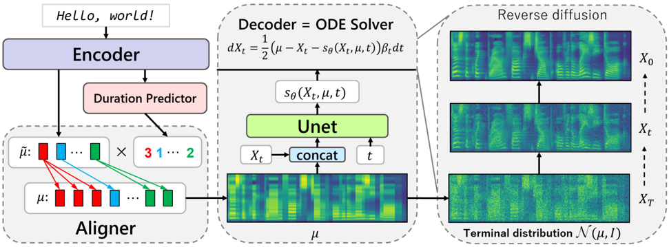

> [!abstract] arXiv · 2021 · Preprint
> **Popov et al.** · [→ Paper](https://arxiv.org/abs/2105.06337) · Demo: ✓ · Code: ✓
>
> Grad-TTS introduces the first diffusion probabilistic acoustic feature generator for TTS, using a score-based decoder that denoises from encoder-aligned Gaussian noise rather than pure white noise, enabling high-quality mel-spectrogram synthesis with as few as ten reverse-diffusion steps.

## Problem

Prior acoustic feature generators fell into two camps: autoregressive models like Tacotron2 achieved high naturalness but suffered from attention failures, slow inference, and pronunciation errors; non-autoregressive models like Glow-TTS and FastSpeech accelerated synthesis but required teacher-forced alignment or pre-trained external aligners, and produced speech with robotic quality artefacts. Diffusion probabilistic models had shown promise for waveform synthesis (WaveGrad, DiffWave) but had not been applied as acoustic feature generators producing mel-spectrograms. No existing framework allowed explicit, continuous control over the quality-speed trade-off at inference time.

## Method

Grad-TTS is a two-part acoustic feature generator composed of a transformer-based encoder and a diffusion-based decoder, connected through Monotonic Alignment Search (MAS). The encoder architecture mirrors Glow-TTS, using a pre-net of convolutional layers, six transformer blocks with multi-head self-attention, and a linear projection. A duration predictor (two convolutions plus projection) is trained in log-domain with MSE loss to predict token durations, enabling non-autoregressive inference. MAS is applied iteratively during training to find optimal monotonic alignments without requiring an external teacher.

The decoder is the key architectural contribution. Rather than transforming data to standard Gaussian noise N(0, I) as in conventional diffusion, Grad-TTS uses a generalised forward diffusion that transforms data toward N(µ, I), where µ is the aligned encoder output. This means the terminal noise at inference already encodes text-conditioned structure, reducing the reconstruction difficulty for the reverse process. The decoder uses a U-Net score network with approximately 7.6M parameters, conditioned on both noisy data and the encoder output µ at each step.

The overall training objective combines three losses: an encoder MSE loss (L_enc) aligning encoder output with target mel-spectrograms, a duration predictor MSE loss (L_dp), and a diffusion denoising loss (L_diff) that trains the score network to estimate gradients of the log-density at all noise levels. At inference, the ODE (rather than SDE) reverse diffusion path is used, with the number of Euler steps N freely chosen to trade speed against quality.

## Key Results

All comparisons use HiFi-GAN as a shared vocoder on the LJSpeech test set (approximately 500 short recordings). Human MOS scores with 95% confidence intervals are reported from Amazon Mechanical Turk with 10 evaluators per sample.

With 10 reverse-diffusion steps, Grad-TTS-10 achieves MOS 4.38 (±0.06), matching Tacotron2 at 4.32 (±0.07) and outperforming Glow-TTS at 4.11 (±0.07) while running approximately twice as fast as Tacotron2 (RTF 0.033 vs. 0.075 on GPU). With 1000 steps, Grad-TTS-1000 reaches MOS 4.44 (±0.05), within 0.09 of ground truth (4.53 ±0.06). The 4-step model (Grad-TTS-4, RTF 0.012) still achieves MOS 3.96, approaching Glow-TTS quality.

An ablation replacing the text-conditioned terminal distribution N(µ, I) with standard N(0, I) demonstrates the benefit directly: even with 50 reverse diffusion steps, the N(0, I) variant is significantly worse than Grad-TTS-10 (preference test, p < 0.005), showing that the text-informed starting distribution is not merely a heuristic but a structural advantage.

Objective log-likelihood evaluation on 50 sentences finds Grad-TTS achieves better log-likelihood than Glow-TTS (0.174 vs. 0.082) despite Glow-TTS having a 3x larger decoder explicitly trained to maximise exact data likelihood.

Error type analysis reveals that Glow-TTS produces robotic-sounding output and incorrect word stress in a substantial fraction of samples, whereas Grad-TTS and Tacotron2 share similar, less severe error profiles. *(§4.1, Table 1, Table 2, Figure 4)*

## Novelty Assessment

The central novelty is the generalised diffusion framework that replaces the standard N(0, I) terminal distribution with N(µ, I) where µ is encoder output, reducing the reverse diffusion task from blind denoising to informed reconstruction. This is a genuine architectural contribution: the mathematical derivation from stochastic differential equations is principled, and the ablation in Table 1 confirms the benefit is not trivial. The MAS-based encoder and duration predictor are directly reused from Glow-TTS, which is acknowledged clearly.

The quality-speed trade-off controllable at inference time without retraining is a practical advantage over both Glow-TTS (fixed single-pass) and autoregressive models (fixed sequential decoding). The U-Net decoder reuses the Ho et al. (2020) image-generation architecture with minor modifications, so the architectural novelty is concentrated in the text-conditioned terminal distribution design and the loss formulation rather than in the score network itself.

The evaluation is single-speaker (LJSpeech, English female) and does not assess speaker generalisation, prosody diversity, or multilingual settings. The comparison set, while appropriate for 2021, uses HiFi-GAN as a shared vocoder, making comparisons fair across systems. The FastSpeech baseline used an unofficial implementation, which the authors acknowledge may understate that model's quality.

## Field Significance

> [!tip]
> High — Grad-TTS is among the first demonstrations that diffusion probabilistic models can replace flow- or GAN-based acoustic feature generators in a full TTS pipeline, achieving competitive naturalness with flexible inference-time quality-speed control. The text-conditioned terminal distribution design provides a reusable formulation that subsequent diffusion TTS work can directly adopt or extend.

## Claims

- Diffusion-based acoustic feature generators can match autoregressive TTS naturalness while enabling flexible inference-time speed-quality trade-offs not available in single-pass models. *(§4.1, Table 2)*
- Initialising reverse diffusion from a text-conditioned noise distribution rather than standard Gaussian substantially reduces the number of steps required for high-quality synthesis. *(§3.1, Table 1)*
- Diffusion models can achieve higher data log-likelihood on mel-spectrograms than normalising-flow models with larger decoder capacity explicitly trained for maximum likelihood. *(§4.2, Table 2)*
- Subjective quality in diffusion-based mel-spectrogram synthesis improves diminishingly with reverse-diffusion step count, with most quality gain recovered by 10 steps rather than 1000. *(§4.1, Table 2)*

## Limitations and Open Questions

> [!warning]
> Evaluation is restricted to a single-speaker English dataset (LJSpeech); no multi-speaker, zero-shot, or multilingual capability is demonstrated, leaving generalisation of the diffusion framework to diverse speakers untested.

Training requires approximately 1.7 million iterations on a single GPU (NVIDIA RTX 2080 Ti), and slow convergence of the diffusion loss is noted as a necessary condition for quality. The paper does not report total training time or wall-clock comparisons with baselines.

The end-to-end variant (replacing the mel-spectrogram output with raw waveform via a WaveGrad decoder) does not reach the quality of the two-stage system and is excluded from the main listening test, leaving the end-to-end direction as a preliminary result.

The noise schedule is a simple linear function of time; the paper acknowledges that more principled schedule design and loss weighting are open questions that could improve sample quality and training efficiency.

## Wiki Connections

- [[diffusion-tts]] — foundational application of score-based diffusion to mel-spectrogram generation for TTS
- [[transformer-enc-dec-tts]] — encoder mirrors Glow-TTS with MAS-based duration prediction; non-autoregressive alignment
- [[evaluation-metrics]] — MOS, log-likelihood, and RTF compared across systems on LJSpeech with HiFi-GAN vocoder
- [[subjective-evaluation]] — AMT listening test with 10 evaluators per sample; 95% CI reported throughout
