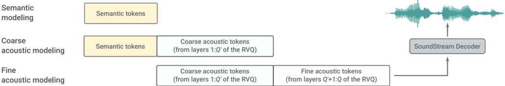

> [!abstract] arXiv · 2022 · Preprint
> **Borsos et al.** (Google Research) · [→ Paper](https://arxiv.org/abs/2209.03143) · Demo: ✓ · Code: ?
>
> AudioLM establishes a hierarchical language modeling framework that combines self-supervised semantic tokens with neural codec acoustic tokens to generate coherent, high-quality speech continuations from short prompts, without any text supervision, producing output indistinguishable from real speech in human listening tests.

## Problem

Prior neural audio generation systems faced a fundamental tension between two competing objectives. High-fidelity vocoders and neural codecs could reproduce fine acoustic details accurately but lacked long-term coherence, generating unintelligible babbling when used without strong textual conditioning. Conversely, textless speech language models (such as GSLM) learned to model linguistic structure through discrete speech units but produced low-quality, single-speaker output because their tokens were optimised for semantic discriminability rather than reconstruction fidelity. No prior work had shown how to achieve both simultaneously without relying on text transcripts, MIDI sequences, or other symbolic supervision.

## Method

AudioLM treats audio generation as a language modeling problem over a hybrid vocabulary of discrete tokens, and solves the quality-versus-coherence tension by separating the representation into two complementary token streams.

**Semantic tokens** are extracted by applying k-means clustering (K=1024) to the intermediate representations of w2v-BERT XL (0.6B parameters), a self-supervised model trained with contrastive and masked language modeling objectives. The 7th layer of the MLM module is selected based on ABX phonetic discriminability scores. These tokens, sampled at 25 Hz, capture linguistic content, prosody, and long-term structure, but allow only poor waveform reconstruction (ViSQOL ≈ 1.1 even at matched bitrate).

**Acoustic tokens** come from SoundStream, a 12-layer residual vector quantizer codec operating at 50 Hz with a 1024-entry codebook per layer. The coarse 4 layers (2000bps) capture speaker identity and recording conditions; the fine 8 layers (additional 4000bps) capture fine waveform detail. Full 6000bps reconstruction achieves ViSQOL ≈ 3.9.

The language model itself consists of three cascaded decoder-only Transformers, each with 12 layers, 1024-dimensional embeddings, 16 attention heads, and T5-style relative positional embeddings, giving approximately 0.3B parameters per stage.

- **Stage 1 (semantic modeling):** autoregressively predicts the full semantic token sequence, capturing long-term structure.
- **Stage 2 (coarse acoustic modeling):** conditions on the semantic tokens and generates the coarse 4 RVQ layers, capturing speaker identity and recording conditions.
- **Stage 3 (fine acoustic modeling):** conditions on the coarse acoustic tokens and fills in the fine 8 RVQ layers in 3-second non-overlapping chunks, independent of sequence length.

This separation is motivated by the conditional independence assumption that semantic tokens are independent of past acoustic tokens given past semantic tokens, which allows each stage to operate on shorter token sequences and reduces the quadratic attention cost. At inference for continuation tasks, a 3-second prompt is encoded into both semantic and coarse acoustic tokens; the three stages then extend these autoregressively; the SoundStream decoder reconstructs the final waveform.

## Key Results

**Semantic content preservation:** When acoustic generation is conditioned on ground-truth semantic tokens from LibriSpeech test-clean, the resulting speech achieves WER of 6.0% and CER of 3.4%, compared to 6.6%/2.9% for GSLM's unit-to-speech synthesis and 2.5%/0.8% for the original audio. This shows semantic tokens faithfully carry linguistic content through the generation pipeline. *(§IV-C, Table II)*

**Disentanglement of content and speaker:** Speaker classification accuracy on acoustic generations conditioned on the same semantic tokens is 3.2% (versus 100% for SoundStream reconstructions), confirming that speaker identity is encoded in the acoustic tokens and not the semantic tokens. *(§IV-D, Table III)*

**Speaker-consistent continuation:** When continuing 3-second prompts from unseen speakers in LibriSpeech test-clean, the speaker classifier identifies the original speaker in 92.6% of generated continuations, demonstrating that prompting with both semantic and acoustic tokens preserves voice identity. *(§IV-F, Table III)*

**Human perception test:** In a forced-choice listening test where raters judged whether a 7-second continuation was real or synthesized (first 3 seconds known-real), raters achieved only 51.2% accuracy, which a binomial test (p=0.23) confirms is not statistically distinguishable from chance. *(§IV-G)*

**Linguistic knowledge:** On the ZeroResource Challenge 2021 benchmarks, AudioLM achieves 71.5% sWUGGY (all) / 83.7% (in-vocab) and 64.7% sBLIMP, improving over GSLM (68.7% in-vocab, 57.1% sBLIMP) and surpassing non-causal models and even a supervised forced-alignment topline on sBLIMP. *(§IV-E, Table IV)*

**Piano continuation:** A model retrained on 40k hours of internal piano data generates continuations preferred over acoustic-token-only baselines in 83.3% of pairs in a subjective test, demonstrating the framework generalises beyond speech. *(§IV-I)*

**Anti-spoofing:** A companion classifier trained to detect AudioLM-generated speech achieves 98.6% accuracy, despite human listeners being at chance. *(§IV-H)*

## Novelty Assessment

AudioLM's core novelty is the insight that semantic and acoustic tokens serve fundamentally different roles in audio generation, and that these roles can be separated into a hierarchical language model without any text supervision. While the individual components (w2v-BERT, SoundStream, decoder-only Transformers) are all pre-existing, their combination into a three-stage hierarchical generation framework is architecturally novel.

The key conceptual advance is explicit: semantic tokens from a self-supervised model carry linguistic structure but are undecodable to high-quality audio; acoustic codec tokens enable high-quality synthesis but lack long-term coherence. Using the former to condition the latter in a cascade resolves the trade-off that prior work treated as unavoidable.

The paper also demonstrates that this framework generalises across audio domains (speech and piano music), which is significant as most prior work addressed each modality separately. The rigorous evaluation, including the human indistinguishability test and the ZeroResource benchmark comparison, is thorough and methodologically sound. The limitation is that the model is not conditioned on text: it generates continuations but cannot yet synthesise speech from a given transcript, a gap the authors explicitly acknowledge.

## Field Significance

> [!important]
> Foundational — AudioLM introduces the semantic-token-plus-acoustic-token paradigm that becomes the structural blueprint for subsequent codec language model approaches to speech synthesis. By demonstrating that a hierarchy of self-supervised semantic tokens and codec acoustic tokens can generate speech indistinguishable from real audio without text supervision, the paper reframes text-free speech generation from a niche linguistic probe task into a serious audio generation capability. The architecture pattern of coarse-semantic to coarse-acoustic to fine-acoustic cascaded language models is adopted and extended in subsequent systems including VALL-E, SoundStorm, and MusicLM, making AudioLM a direct ancestor of the dominant paradigm in neural TTS circa 2023 onward.

## Claims

- Combining self-supervised semantic tokens with codec acoustic tokens in a hierarchical language model resolves the quality-versus-coherence tension that affects single-tokenizer audio language models. *(§III-B, §III-C, Table I)*
- Semantic and acoustic tokens in speech carry complementary information: semantic tokens primarily encode linguistic content and prosody, while acoustic tokens primarily encode speaker identity and recording conditions. *(§IV-C, §IV-D, Tables II–III)*
- Autoregressive language modeling over discrete audio tokens can produce speech continuations indistinguishable from real speech to human listeners in an unpaired forced-choice test. *(§IV-G)*
- The semantic-to-acoustic hierarchical generation pattern transfers across audio domains: a model trained on piano music without symbolic notation also benefits from the two-tier tokenization. *(§IV-I)*
- Self-supervised speech representations trained with masked language modeling objectives encode sufficient lexical and syntactic information to outperform earlier causal spoken language models on zero-resource linguistic benchmarks. *(§IV-E, Table IV)*

## Limitations and Open Questions

> [!warning]
> AudioLM is a continuation model only: it generates continuations of an audio prompt but cannot synthesise speech from a specified transcript. The paper explicitly frames TTS integration (encoder-decoder with text conditioning) as future work, which means the WER/CER results reflect acoustic fidelity to a given semantic token sequence, not instruction-following capability.

The system requires three separately trained transformer models totaling approximately 0.9B parameters, plus frozen SoundStream and w2v-BERT models, making inference substantially more expensive than single-model TTS systems. Inference latency is not reported.

All speech experiments use English only; the model is trained on Libri-Light (audiobook speech), which is a clean, single-language, read-speech corpus. Generalisability to spontaneous speech, noise, or other languages is untested.

The paper does not evaluate unconditional generation quality against baselines with matched compute or training data, so the contribution of scale versus architecture is not fully disentangled.

The anti-spoofing classifier achieving 98.6% accuracy is trained on the same generative model it detects; its performance against other generators, or against an adversarially optimised version of AudioLM, is not assessed.

## Wiki Connections

**Concepts:** [[autoregressive-codec-tts]] — AudioLM establishes the semantic-then-acoustic token cascade pattern that defines this paradigm. [[spoken-language-model]] — demonstrates text-free spoken language modeling at near-human quality. [[neural-codec]] — SoundStream codec tokens are central to the method. [[self-supervised-speech]] — w2v-BERT embeddings provide the semantic token stream. [[zero-shot-tts]] — prompt-conditioned continuation generalises to unseen speakers. [[disentanglement]] — explicit separation of semantic content from speaker acoustic identity.

**Papers:** [[1609.03499]] — WaveNet, the autoregressive waveform generation ancestor that AudioLM's framework supersedes for the generation task.

[[2303.03926]] — Speak Foreign Languages with Your Own Voice: Cross-Lingual Neural Codec Language Modeling
[[2305.02765]] — HiFi-Codec: Group-residual Vector quantization for High Fidelity Audio Codec
[[2305.09636]] — SoundStorm: Efficient Parallel Audio Generation
[[2306.00814]] — Vocos: Closing the gap between time-domain and Fourier-based neural vocoders for high-quality audio synthesis
[[2306.12925]] — AudioPaLM: A Large Language Model That Can Speak and Listen
