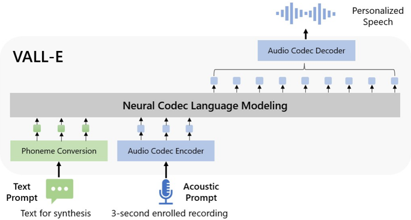
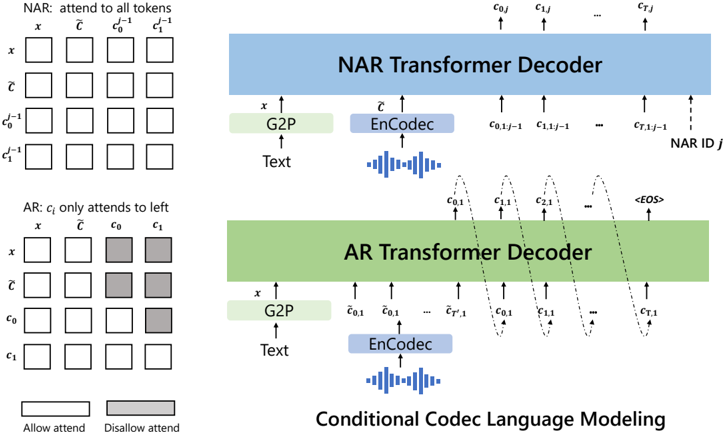

> [!abstract] arXiv · 2023 · Preprint
> **Wang et al.** (Microsoft) · [→ Paper](https://arxiv.org/abs/2301.02111) · Demo: ✓ · Code: ?
>
> VALL-E reframes TTS as conditional codec language modeling — generating discrete EnCodec tokens rather than predicting continuous mel spectrograms — and shows that training on 60K hours of semi-supervised speech produces a zero-shot system that synthesises highly speaker-similar speech from a 3-second enrolled recording without any fine-tuning.

## Problem

Prior zero-shot TTS systems relied on speaker adaptation (fine-tuning on target-speaker data) or speaker encoding (extracting a fixed embedding from a reference clip), neither of which generalised well to unseen speakers without either additional engineering complexity or degraded speaker similarity. Training data was typically limited to hundreds of hours of clean studio recordings, which constrained speaker diversity, prosodic range, and acoustic condition coverage. The field lacked a zero-shot TTS approach with the flexible in-context learning capability of large language models.

## Method

VALL-E treats TTS as a conditional language modeling problem over discrete acoustic tokens. Audio is tokenised using EnCodec, a convolutional encoder-decoder with residual vector quantization (RVQ): the encoder produces embeddings at 75 Hz, and each frame is modelled by eight hierarchical quantizers with 1024 entries each, corresponding to a 6K bitrate. A 10-second waveform maps to a 750 × 8 integer matrix. Given a phoneme sequence and a 3-second enrolled recording from an unseen speaker, the model generates the corresponding acoustic code matrix, which the EnCodec decoder reconstructs to a 24 kHz waveform.

Generation is decomposed into two stages that mirror the RVQ hierarchy. An **autoregressive transformer** (AR model) generates first-codebook tokens sequentially, conditioned on the phoneme sequence and the first-codebook prefix from the enrolled recording. Sampling-based decoding is used at inference; beam search is avoided because it causes the model to loop. A **non-autoregressive transformer** (NAR model) then generates the remaining seven codebooks in staged passes, conditioning on all previously generated codes, the phoneme sequence, and the full 8-codebook acoustic prompt from the enrolled recording. The current RVQ stage index is injected through Adaptive Layer Normalization (AdaLN), allowing a single parameter set to serve all seven refinement stages.

Both models use the same transformer configuration: 12 layers, 16 attention heads, embedding dimension 1024, and feed-forward dimension 4096. Training uses LibriLight (60K hours, approximately 7000 speakers), with phoneme alignments produced by a hybrid DNN-HMM ASR model; no clean studio recordings are required. In training, the AR model is trained purely as a causal language model without an explicit enrolled-speech prompt — any prefix of a sequence serves as acoustic context — so prompting at inference is a natural consequence of the training objective.

## Key Results

On LibriSpeech test-clean (zero-shot, 3-second prompt, 40 unseen speakers), VALL-E achieves SMOS 4.38 ± 0.10 versus YourTTS's 3.45 ± 0.09, a +0.93 gap that closes most of the distance to ground truth (4.50 ± 0.10). Speaker similarity (SPK-SIM via WavLM-TDNN) improves from 0.337 to 0.580 against a ground-truth ceiling of 0.754. WER falls from 7.7% to 5.9%, approaching ground-truth 2.2%. Naturalness (CMOS) exceeds YourTTS by +0.12 (Table 3).

On VCTK (108 speakers, all unseen for VALL-E; 97 of 108 seen for YourTTS), VALL-E reaches +0.04 CMOS over ground truth — statistically indistinguishable from human recordings on naturalness — and outperforms the baseline on speaker similarity at all prompt lengths (3s, 5s, 10s). Speaker similarity improves monotonically with longer prompts, and the gap between systems widens when YourTTS is evaluated on its truly unseen 11 speakers (Table 6).

Ablations confirm that both prompt components are necessary to the NAR model: removing all prompts raises WER to 19.6% and drops SPK-SIM to 0.518; adding back only the phoneme prompt reduces WER to 3.0% but leaves speaker similarity unrecovered. Removing the AR model's acoustic prompt collapses SPK-SIM from 0.585 to 0.236, confirming that speaker identity is primarily captured through the acoustic prefix (Table 5).

## Novelty Assessment

The decisive contribution is the reframing: treating TTS as codec language modeling rather than mel-spectrogram regression, and treating the enrolled recording as an acoustic few-shot prompt — the same in-context learning mechanism used in GPT-3 for text. AudioLM (2022) had already demonstrated LM-based audio generation over codec tokens in a speech-to-speech setting; VALL-E's contribution is extending this to text-conditioned synthesis with explicit phoneme control, and demonstrating that noisy semi-supervised data at 60K-hour scale can substitute for clean studio recordings. The hierarchical AR+NAR decomposition is technically motivated by the RVQ structure and is elegant, but not independently groundbreaking. The paper is foundational not for any single mechanism but for the combination: a familiar transformer LM, an off-the-shelf codec, and a massive semi-supervised corpus, assembled in a way that produced a qualitative capability jump in zero-shot speaker generalisation.

## Field Significance

> [!important]
> Foundational — VALL-E established codec language modeling as the primary paradigm for zero-shot TTS and directly redirected the field's research agenda. Its in-context learning framing for speaker adaptation — using a 3-second clip as an acoustic prompt rather than fine-tuning — has been adopted or cited as the baseline by the large majority of subsequent zero-shot TTS work. Its demonstration that noisy large-scale data outperforms small clean corpora overturned a prevailing assumption in the field. The scope of its influence is visible in the density of citing papers proposing alternatives to its specific design choices (AR architecture, RVQ discretization, EnCodec tokenizer), all of which implicitly accept its core framing.

## Claims

- Treating TTS as conditional language modeling over discrete codec tokens enables zero-shot speaker generalisation as in-context learning, without speaker-specific fine-tuning or engineered speaker encoders.
- Training on large-scale semi-supervised speech data, even with noisy transcriptions and diverse acoustic conditions, yields stronger generalisation to unseen speakers than training on smaller clean corpora.
- The hierarchical structure of residual vector quantization supports a two-stage AR+NAR generation pipeline in which first-codebook tokens carry speaker identity and subsequent codebooks refine fine acoustic detail.
- Speaker similarity in zero-shot codec TTS improves monotonically with acoustic prompt length, suggesting that speaker identity modelling does not saturate within a few seconds.
- Stochastic sampling in autoregressive codec generation introduces output diversity — varying speech rate, prosody, and accent realisation — that is both a feature for data augmentation and a complication for deterministic evaluation.

## Limitations and Open Questions

> [!warning]
> Synthesis robustness is a material constraint: the autoregressive first-stage LM exhibits attention alignment failures that cause word deletions, insertions, and repetitions. WER on LibriSpeech test-clean is 5.9%, nearly three times the ground-truth rate of 2.2%. This limits deployment in applications requiring high intelligibility and is the principal limitation acknowledged by the authors.

Training data is entirely English audiobook speech, limiting coverage of accented, spontaneous, or conversational speech styles. The two-model architecture (AR + NAR) adds inference complexity; the authors note that a single universal model is a natural future direction. Model parameter count is not reported, making compute comparisons with non-codec TTS systems difficult. The evaluation covers two benchmarks only; no noise-robustness or cross-domain experiments are included. Zero-shot voice cloning from 3 seconds of audio raises misuse risks that the paper acknowledges but does not experimentally mitigate.

## Wiki Connections

[[autoregressive-codec-tts]] · [[zero-shot-tts]] · [[neural-codec]] · [[spoken-language-model]] · [[speaker-adaptation]] · [[self-supervised-speech]]

Back-linked by [[2508.02849]] (SecoustiCodec), which proposes frame-level cross-modal contrastive learning as an alternative to VALL-E's EnCodec-based RVQ tokenization for semantic-paralinguistic separation.

Also cited by: [[interspeech-2025-0468]] (DualCodec, builds on EnCodec as a baseline), [[interspeech-2025-1440]] (FreeCodec, disentangled codec with fewer tokens vs. RVQ), [[interspeech-2025-1641]] (phoneme position prediction for VALL-E-style AR LM, achieving 52.7% CER reduction on hard cases), [[interspeech-2025-1993]] (watermark-aware codec protecting zero-shot TTS models built on VALL-E paradigm), [[interspeech-2025-2447]] (Speech Speculative Decoding for AR TTS inference acceleration). Integration pass 7 (2026-06-05): [[2508.19205]] (VibeVoice) cites VALL-E as a foundational neural codec LM baseline.

[[2303.03926]] — Speak Foreign Languages with Your Own Voice: Cross-Lingual Neural Codec Language Modeling
[[2305.02765]] — HiFi-Codec: Group-residual Vector quantization for High Fidelity Audio Codec
[[2305.09636]] — SoundStorm: Efficient Parallel Audio Generation
[[2306.12925]] — AudioPaLM: A Large Language Model That Can Speak and Listen
[[2310.00704]] — UniAudio: An Audio Foundation Model Toward Universal Audio Generation
[[2402.01912]] — Natural language guidance of high-fidelity text-to-speech with synthetic annotations
[[2402.05755]] — Spirit LM: Interleaved Spoken and Written Language Model
[[2402.08093]] — BASE TTS: Lessons from building a billion-parameter Text-to-Speech model on 100K hours of data
[[2403.16973]] — VoiceCraft: Zero-Shot Speech Editing and Text-to-Speech in the Wild
[[2406.04904]] — XTTS: a Massively Multilingual Zero-Shot Text-to-Speech Model
[[2406.18009]] — E2 TTS: Embarrassingly Easy Fully Non-Autoregressive Zero-Shot TTS
[[2407.08551]] — Autoregressive Speech Synthesis without Vector Quantization
[[2411.19842]] — Scaling Transformers for Low-Bitrate High-Quality Speech Coding
[[2502.17239]] — Baichuan-Audio: A Unified Framework for End-to-End Speech Interaction
[[2507.16632]] — Step-Audio 2 Technical Report
