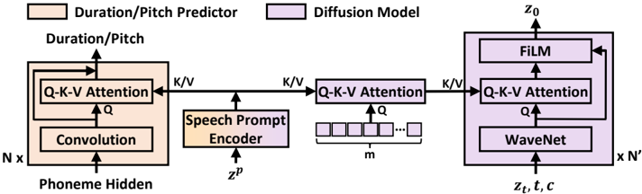

> [!abstract] arXiv · 2023 · Preprint
> **Shen et al.** (Microsoft Research Asia) · [→ Paper](https://arxiv.org/abs/2304.09116) · Demo: ✓ · Code: ?
>
> NaturalSpeech 2 replaces the autoregressive discrete-token pipeline of VALL-E-style systems with a latent diffusion model that operates on continuous RVQ vectors, enabling more robust and expressive zero-shot TTS, voice conversion, and singing synthesis from a 3-second speech prompt.

## Problem

Large-scale TTS systems in 2023 followed the autoregressive discrete-token paradigm (VALL-E, SPEAR-TTS): a neural codec converts speech to discrete tokens, then a language model predicts those tokens autoregressively. This pipeline has two structural weaknesses. First, using residual vector quantizers for high-fidelity reconstruction produces very long token sequences — up to 8 times frame count when using 8 RVQ codebooks — making autoregressive modeling slow and unstable. Second, single-codebook VQ compresses too aggressively, losing fine-grained acoustic detail. The resulting systems suffer from word skipping, word repeating, and speech collapse on hard phoneme sequences, and produce prosody that poorly tracks the reference speaker.

## Method

NaturalSpeech 2 sidesteps the discrete-token dilemma by using a custom RVQ codec that produces continuous latent vectors rather than discrete indices. The codec encoder maps 16 kHz speech to frame-level representations at 12.5 ms per frame (200x downsampling), then an RVQ with 16 residual quantizers produces per-frame embeddings; the sum of these residual vectors forms the continuous latent target. A WaveNet-based audio decoder reconstructs waveform from this latent. Because the generation target is continuous rather than discrete, the paper can use a diffusion model (non-autoregressive) rather than an autoregressive language model.

The diffusion model is formulated as a stochastic differential equation (score-based). The prior module consists of a 6-layer Transformer phoneme encoder and separate 30-layer convolutional duration and pitch predictors; during training, ground-truth durations and pitches are used, and at inference, predicted values drive length expansion. The denoising network is a 40-layer WaveNet that predicts z_0 (the clean latent) directly rather than the score, which the authors find produces better quality. A novel RVQ cross-entropy loss (L_ce-rvq) computed at each residual quantizer level is added as a regularisation term, contributing to sharper latent prediction.

Zero-shot capability is achieved through a speech prompting mechanism. During training, a random contiguous segment of the target speech latent is held out as the "prompt" and the model predicts the remaining frames. A Transformer-based prompt encoder processes this segment. For the duration and pitch predictors, cross-attention is added to condition on the prompt encoding. For the diffusion model, a two-stage cross-attention design is used: first, a set of 32 learnable query tokens attend to the prompt hidden state (compressing it to a fixed-length representation), then the WaveNet layers attend to this compressed representation via FiLM-conditioned affine transforms. The indirection through query tokens prevents over-reliance on prompt details that could cause training instability.

The full model has 435M parameters (27M codec, 72M phoneme encoder, 34M duration predictor, 50M pitch predictor, 69M prompt encoder, 183M diffusion model). Training uses 44K hours of English MLS speech data across 5,490 speakers. Singing synthesis is supported by mixing in approximately 30 hours of crawled singing data. The model can also perform zero-shot voice conversion by using a source-aware diffusion process to partially encode the source audio, then denoising conditioned on a target speaker prompt.

## Key Results

On LibriSpeech test-clean (zero-shot setting, all speakers unseen during training), NaturalSpeech 2 achieves a CMOS of 0.00 reference-anchored, matching ground truth at +0.04 CMOS — a result the authors interpret as human-level naturalness on this benchmark. YourTTS trails by 0.65 CMOS on the same test. On VCTK, NaturalSpeech 2 at 0.00 CMOS outperforms ground truth which scores -0.30 CMOS (reflecting the noisier recording conditions of VCTK). SMOS on LibriSpeech is 3.28 vs. 2.03 for YourTTS, a 1.25-point margin; on VCTK, 3.20 vs. 2.43. WER is 2.26% on LibriSpeech (ground truth: 1.94%) and 6.99% on VCTK (ground truth: 9.49%). A direct comparison with VALL-E (using VALL-E's own demo samples) gives NaturalSpeech 2 a 0.31 CMOS advantage and 0.30 SMOS advantage. On robustness, NaturalSpeech 2 achieves 0% error rate on 50 adversarially hard sentences (vs. 24% for Tacotron, 34% for Transformer-TTS, and known failures for VALL-E).

Ablation results show that removing the diffusion prompt entirely causes convergence failure, confirming that the speech prompting mechanism is load-bearing rather than marginal. Removing prompt conditioning from duration/pitch predictors degrades pitch mean difference from 10.11 to 21.69. The RVQ CE loss and two-stage query attention each contribute smaller but consistent improvements.

Longer prompts improve prosody adherence: 10-second prompts reduce pitch mean difference substantially compared to 3-second prompts on LibriSpeech.

## Novelty Assessment

The paper's central contribution is replacing the autoregressive discrete-token generation pipeline with a continuous-vector latent diffusion approach, addressing the robustness and sequence-length problems that plagued VALL-E-style systems. The codec with continuous RVQ vectors is a deliberate design choice: rather than eliminating quantisation entirely, the authors keep RVQ (for memory efficiency and to enable the CE regularisation loss) but sum the residual embeddings into continuous vectors at training time, so the diffusion model targets a continuous space. This is a principled engineering choice that resolves the VQ-RVQ dilemma described in §2.1.

The speech prompting mechanism with the two-stage query-token cross-attention is novel: the first attention compresses the prompt into a fixed-length bottleneck, preventing the diffusion model from simply copying acoustic details from the prompt. This design choice is empirically justified and differentiates the zero-shot approach from simpler speaker embedding injection. The extension to singing synthesis from a speech-only prompt (no singing prompt required) is a capability demonstration enabled by the architecture's use of continuous pitch and duration predictors rather than discrete token structure.

The evaluation methodology is relatively fair — comparing on fully unseen speakers — though the VALL-E comparison uses demo samples rather than a controlled shared test set, which limits the strength of that particular comparison. The model is still described as underfitting at 300K steps, suggesting the results represent a lower bound.

## Field Significance

> [!tip]
> High — NaturalSpeech 2 establishes continuous latent diffusion as a viable alternative to autoregressive discrete-token TTS at scale, demonstrating that the robustness and prosody quality problems associated with codec LM generation can be substantially mitigated by moving to non-autoregressive continuous generation. It is one of the first systems to demonstrate zero-shot singing synthesis from a speech-only prompt. The paper's framing of the VQ-RVQ dilemma provides a clear conceptual contribution that clarifies the continuous vs. discrete codec generation trade-off at scale.

## Claims

- Latent diffusion models operating on continuous codec vectors avoid the word-skipping and repetition errors that arise from autoregressive generation over long discrete token sequences. *(§2.3, §5.3, Table 7)*
- Speech prompting via in-context learning during training enables zero-shot speaker adaptation without requiring speaker embeddings or multi-step speaker encoding pipelines. *(§3.3, §5.5)*
- Prosody adherence in zero-shot TTS improves monotonically with the length of the reference speech prompt, at least up to 10 seconds. *(§5.5, Table 10)*
- Non-autoregressive TTS architectures maintain near-zero error rates on adversarially difficult phoneme sequences where autoregressive models degrade significantly. *(§5.3, Table 7)*
- A system trained jointly on speech and singing data can synthesise singing in novel timbres using only a speech reference prompt, demonstrating cross-modal timbre transfer within a shared latent space. *(§5.6)*

## Limitations and Open Questions

> [!warning]
> The direct comparison with VALL-E is based on VALL-E demo page samples rather than a controlled shared test set — the 16 compared utterances are cherry-picked by the VALL-E authors and may not be representative. This limits the strength of the head-to-head quality claim.

The model is described as still underfitting at 300K training steps, meaning reported results are likely below the system's ceiling performance. Inference requires 150 diffusion steps (ODE solver), and 1000 steps for singing, which is slow for real-time deployment. The paper cites consistency models as future work for acceleration. Training and evaluation are English-only, so multilingual generalisation is uncharacterised. The singing dataset is approximately 30 hours of web-crawled data with no formal provenance or quality validation beyond alignment filtering, which raises questions about singing style coverage. Code and model weights are not publicly released, limiting reproducibility.

## Wiki Connections

Core methods: [[diffusion-tts]], [[neural-codec]], [[zero-shot-tts]], [[prosody-control]], [[disentanglement]], [[singing]]

Related in-corpus papers this work builds on or compares to: [[2301.02111]] (VALL-E, the primary autoregressive baseline this paper supersedes), [[2210.13438]] (EnCodec, the neural codec whose RVQ design this work adapts), [[2209.03143]] (AudioLM, introduced two-stage codec LM generation this paper critiques), [[2105.06337]] (GradTTS, earlier diffusion TTS system), [[1609.03499]] (WaveNet, used as the denoising network backbone)

Cited by in-corpus papers: [[2409.00750]] (MaskGCT uses NaturalSpeech 2 as a baseline for diffusion-based zero-shot TTS comparison)

[[2310.00704]] — UniAudio: An Audio Foundation Model Toward Universal Audio Generation
[[2402.08093]] — BASE TTS: Lessons from building a billion-parameter Text-to-Speech model on 100K hours of data
[[2406.18009]] — E2 TTS: Embarrassingly Easy Fully Non-Autoregressive Zero-Shot TTS
