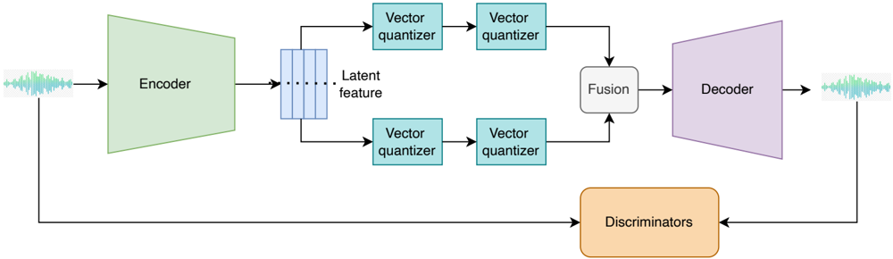

> [!abstract] arXiv · 2023 · Preprint
> **Yang et al.** (Peking University / Tencent AI Lab / Zhejiang University) · [→ Paper](https://arxiv.org/abs/2305.02765) · Demo: ? · Code: ✓
>
> HiFi-Codec introduces group-residual vector quantization (GRVQ), a novel quantization scheme that achieves better reconstruction quality than EnCodec while requiring only 4 codebooks instead of 12, significantly reducing the sequence length burden on downstream generation models.

## Problem

Neural audio codecs based on residual vector quantization (RVQ) face a fundamental tension when used as discrete intermediate representations for generation models: achieving high reconstruction fidelity requires many codebooks (EnCodec needs 8-12), but each additional codebook multiplies the sequence length that a downstream autoregressive or language model must generate. Most information is captured by the first codebook, while subsequent codebooks store sparse, scattered detail information. This makes RVQ codecs poorly suited for generation tasks, where sequence length directly determines computational cost. Additionally, the training processes for EnCodec and SoundStream were not publicly available, creating a reproducibility barrier for researchers.

## Method

HiFi-Codec follows the encoder-decoder architecture of EnCodec and SoundStream, using a fully convolutional encoder with residual units, strided downsampling layers, and a two-layer LSTM for sequence modeling. The encoder output is a latent vector z of dimension D. The key innovation is the group-residual vector quantization (GRVQ) module: rather than applying a single RVQ chain to z, GRVQ first splits z into two groups (z1, z2), then applies independent RVQ chains to each group in parallel. The quantized outputs from both groups are concatenated before being passed to the decoder. The motivation is that by distributing the first-layer codebook capacity across two parallel chains rather than one, each group's first layer can capture more information, allowing fewer residual layers overall.

The encoder uses configurable channel widths (C in {32, 48, 64}), B=4 convolution blocks, and downsampling strides of (2, 4, 5, 8) or similar combinations yielding a total downsampling factor of 240 or 320 relative to the waveform. The model operates at 16kHz or 24kHz. Training uses a GAN objective combining time-domain L1 reconstruction loss, multi-scale mel-spectrogram loss (following EnCodec), adversarial hinge loss, and feature matching loss. Three discriminator types are used jointly: a multi-scale STFT-based (MS-STFT) discriminator from EnCodec, and the multi-period discriminator (MPD) and multi-scale discriminator (MSD) from HiFi-GAN. Models are trained on LibriTTS, VCTK, and AISHELL (over 1000 hours total) using 8 GPUs.

The authors also release AcademiCodec, an open-source toolkit providing training code and pre-trained models for EnCodec, SoundStream, and HiFi-Codec.

## Key Results

Evaluated on objective speech quality metrics (PESQ and STOI), HiFi-Codec with 4 codebooks at 24kHz (downsample factor 240) achieves PESQ 3.63 / STOI 0.95, compared to Facebook's EnCodec at 8 codebooks (PESQ 3.01 / STOI 0.94) and 12 codebooks (PESQ 3.21 / STOI 0.95). The 4-codebook HiFi-Codec thus outperforms the 12-codebook EnCodec on PESQ while matching on STOI, representing a 3x reduction in codebook count at equivalent or better reconstruction quality.

The paper does not include subjective evaluation (MOS), which the authors acknowledge as a limitation. All comparisons are on the same training/test data distribution (LibriTTS, VCTK, AISHELL), and the reproduction of EnCodec under different hyperparameter configurations introduces some confounding; results reflect the authors' own trained EnCodec rather than the published Facebook checkpoint alone. The reported Encodec (ours) at downsample 240 already outperforms the published Facebook checkpoint, suggesting HiFi-Codec's advantage over Facebook's checkpoint is partially attributable to the different training configuration.

The best overall configuration uses 8 codebooks (4 per group, 2 residual layers) at 24kHz, achieving PESQ 3.92 / STOI 0.95. The authors recommend the 4-codebook variant for generation use cases as the preferred balance point.

## Novelty Assessment

The core contribution is GRVQ: splitting the latent feature vector into groups and applying parallel RVQ chains before concatenating for decoding. This is a genuine structural modification to the standard RVQ pipeline, not merely a tuning change. The insight that distributing first-layer codebook capacity across parallel groups improves information packing is well-motivated and empirically validated within the paper's comparisons.

However, the encoder-decoder backbone and the adversarial training framework are directly inherited from EnCodec and SoundStream. The discriminator combination (MS-STFT + MPD + MSD) is drawn from existing work. The open-source contribution (AcademiCodec) is significant as an engineering-integration effort that lowers the barrier to codec research, independently of the GRVQ novelty.

The evaluation is limited to objective metrics on the codec's own training distribution; no downstream TTS or generation tasks are reported. This means the claim that fewer codebooks reduce burden on generation models is asserted rather than demonstrated experimentally in this paper.

## Field Significance

> [!tip]
> High — HiFi-Codec introduces GRVQ as a principled approach to reducing codebook count without sacrificing reconstruction quality, directly addressing a bottleneck for autoregressive generation models that must predict discrete codec tokens. Alongside the release of AcademiCodec as an open training toolkit, this paper enables codec research at institutions without large-scale proprietary data or infrastructure. The GRVQ design and the 4-codebook operating point influence subsequent neural codec and codec-based TTS work that requires compact discrete representations.

## Claims

- Grouping residual vector quantization into parallel chains rather than a single sequential chain improves reconstruction quality per codebook, enabling competitive fidelity with fewer total quantizers. *(§3.3, Table 1)*
- The burden that codec codebook count imposes on downstream generation models is a practical constraint that drives codec architecture choices independently of raw reconstruction quality. *(§1 Introduction, §3.3)*
- Objective speech quality metrics such as PESQ and STOI are insufficient alone to characterise codec reconstruction quality, and subjective evaluation is necessary but often omitted in codec research. *(§6 Limitations)*
- Publicly available training code and pre-trained baselines for neural audio codecs are necessary for reproducible research, as previously these were unavailable for EnCodec and SoundStream. *(§5 Conclusion, §6 Limitations)*

## Limitations and Open Questions

> [!warning]
> No subjective evaluation is included. The paper's own §6 acknowledges this as a limitation: "Subjective evaluation is always the best choice, but this part is missed in this study." All quality comparisons rest solely on PESQ and STOI, which the authors themselves note may not accurately reflect perceptual quality.

Beyond the missing subjective evaluation, the paper does not validate GRVQ on downstream generation tasks. The claim that 4 codebooks reduce burden on generation models is plausible and consistent with the motivation, but no TTS or audio LM experiments are included. The training data is limited to English and Chinese speech from public TTS corpora; generalisation to music, environmental sound, or noisy/spontaneous speech is not tested. Finally, the paper trains at 16kHz and 24kHz only; higher sample rates (44.1kHz, 48kHz) used in music and high-fidelity audio applications are not addressed.

## Wiki Connections

Related concepts: [[neural-codec]] | [[autoregressive-codec-tts]] | [[gan-vocoder]] | [[evaluation-metrics]]

In-corpus papers cited: [[2301.02111]] (VALL-E, which uses EnCodec as its codec backbone) | [[2209.03143]] (AudioLM, uses SoundStream tokens) | [[2210.13438]] (EnCodec, the primary baseline) | [[2301.11325]] (MusicLM)

[[2310.00704]] — UniAudio: An Audio Foundation Model Toward Universal Audio Generation
