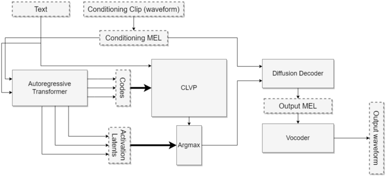

> [!abstract] arXiv · 2023 · Preprint
> **Betker** · [→ Paper](https://arxiv.org/abs/2305.07243) · Demo: ? · Code: ✓
>
> TorToise combines a GPT-2-style autoregressive model with a DDPM diffusion decoder and a contrastive re-ranking model (CLVP) to produce an expressive, zero-shot multi-speaker TTS system trained on approximately 50,000 hours of internet-scraped speech.

## Problem

Prior TTS systems were largely designed around efficiency constraints: small datasets, fast inference, and architectures tailored to the mel-spectrogram domain. This focus on deployment latency kept the field from applying the scaling techniques that had transformed image generation. The alignment problem between text and audio (variable-length inputs and outputs with no explicit temporal correspondence) also ruled out direct application of diffusion models, which require fixed output shapes. As a result, systems remained trained on hundreds rather than tens of thousands of hours of speech, and expressiveness and multi-speaker generalisation lagged far behind what contemporaneous image generation could achieve.

## Method

TorToise assembles four components into an end-to-end pipeline. First, a VQVAE encodes mel spectrograms into a discrete codebook of 8,192 tokens at 4x compression, giving the autoregressive model a tractable sequence length. Second, a GPT-2-style autoregressive decoder (30 transformer layers, dim 1024, 16 heads) is trained to predict sequences of these speech tokens conditioned on text and a speaker conditioning vector. The conditioning vector is produced by averaging the outputs of a self-attention encoder over one or more reference audio clips, enabling zero-shot speaker cloning at inference. Third, CLVP (Contrastive Language-Voice Pretrained Transformer) is a CLIP-style dual encoder trained contrastively on text/speech pairs; it scores autoregressive output candidates during re-ranking before the expensive diffusion step, allowing many candidates to be filtered cheaply. Fourth, a diffusion decoder converts the top-k autoregressive candidates into high-quality mel spectrograms, which are then passed to a UnivNet vocoder.

The "TorToise Trick" is the most consequential design choice: after training the diffusion decoder on discrete VQVAE tokens to convergence, it is fine-tuned to decode the final hidden-state activations of the autoregressive model rather than the discrete tokens. This latent-space conditioning gives the diffusion model access to richer semantic context than discrete tokens carry, and the paper describes this as the single largest contributor to output quality.

Inference is a multi-pass sampling procedure: generate a large number of AR candidates, score them with CLVP, run the diffusion decoder on only the top-k, and return the best result. DDIM with 64 steps and classifier-free guidance at strength 2 is used for diffusion sampling. This makes TorToise significantly slower than real-time at inference, a trade-off the paper acknowledges explicitly. Training used 8 NVIDIA RTX-3090s over approximately one year. The extended dataset of 49,000 hours was self-assembled from audiobooks and podcasts, transcribed with a fine-tuned wav2vec2-large model that was adapted to predict punctuation.

## Key Results

The paper does not report standard MOS tables against baselines. Evaluation is conducted using CLVP itself as a distance metric analogous to FID for images (CLVP-FID), alongside an open-source wav2vec model for intelligibility. The author argues that comparing against closed-source contemporaries via listening tests is impractical, pointing instead to side-by-side audio samples published online. The conclusion drawn is that TorToise "outperforms all previous TTS models in realism," though this claim rests on qualitative sample comparisons rather than a controlled listening test, and no numerical MOS scores are provided in the paper. The primary measurable finding is the qualitative superiority observed when conditioning the diffusion decoder on AR activations rather than discrete tokens.

No MOS table is reported. Evaluation uses a self-constructed CLVP-FID metric and publicly posted audio samples; formal comparative numbers against contemporaneous systems are not available in the paper.

## Novelty Assessment

TorToise introduces a genuinely novel composition of existing components: the combination of a discrete autoregressive prior, a contrastive re-ranker, and a latent-conditioned diffusion decoder for TTS is not found in prior work. The individual components (GPT-2, DDPM, CLIP-style contrastive learning, VQVAE) are all adopted from image generation and NLP literature with minimal modification. The most technically novel contribution is the TorToise Trick, the late fine-tuning of the diffusion decoder on AR latent activations rather than discrete tokens, which constitutes a genuine architectural insight. The engineering achievement of assembling and training the full system as a solo independent researcher on consumer hardware and 50,000 hours of self-assembled data is also notable. The lack of a formal evaluation protocol is a significant limitation: the paper presents no controlled listening test, so the strength-of-results claim depends on qualitative sample inspection.

## Field Significance

> [!tip]
> High — TorToise introduces the AR-prior-plus-diffusion-decoder pattern to TTS at a time when the field was still dominated by mel-spectrogram encoder-decoder systems. Its open-sourced weights and code enabled a substantial wave of follow-on work and provided the community with an accessible, high-quality multi-speaker baseline. The CLVP re-ranking strategy and the TorToise Trick (latent-space diffusion conditioning) both inform subsequent architectural choices in codec-based and latent-diffusion TTS pipelines.

## Claims

- Conditioning a diffusion decoder on the continuous latent activations of an autoregressive model rather than its discrete token outputs substantially improves output quality in a cascaded AR-diffusion TTS pipeline. *(§2.2.2, Appendix B.4)*
- Contrastive re-ranking of multiple autoregressive candidates using a text-speech discriminator measurably improves the final output quality of a TTS system without requiring the expensive decoder to process every candidate. *(§2.3, §4)*
- Applying image-generation scaling techniques (large-scale self-supervised data, generalist transformer architectures, multi-stage AR-then-diffusion generation) to speech synthesis yields high-expressiveness multi-speaker TTS even when trained by a single researcher on commodity hardware. *(§7)*
- Building a large-scale TTS training corpus by scraping and filtering internet audio (audiobooks, podcasts) with automatic transcription is a viable path to tens-of-thousands-of-hours datasets without manual labelling. *(§5, Appendix A)*

## Limitations and Open Questions

> [!warning]
> No formal listening test or MOS table is reported. The primary quality claim rests on informal sample comparisons; the paper's own evaluation suite (CLVP-FID) is not a standard benchmark. This makes it difficult to place TorToise on the same scale as systems evaluated under controlled conditions.

Additional limitations noted in the paper include: slow inference due to multi-pass DDIM sampling (64 steps, large candidate sets) making real-time use impractical; fixed positional encodings in the AR model limiting maximum utterance length; the CLVP re-ranking model was only trained on sequences up to 13 seconds, degrading on longer outputs; and the VQVAE codebook embedding dimension was not constrained, which subsequent work showed to be a missed performance gain. Training was resource-constrained to 8 consumer GPUs, so model scale is limited relative to what the paper's own training curves suggest would still improve results.

## Wiki Connections

Core concepts: [[autoregressive-codec-tts]] · [[diffusion-tts]] · [[zero-shot-tts]] · [[neural-codec]] · [[speaker-adaptation]] · [[subjective-evaluation]]

[[2402.08093]] — BASE TTS: Lessons from building a billion-parameter Text-to-Speech model on 100K hours of data
[[2406.04904]] — XTTS: a Massively Multilingual Zero-Shot Text-to-Speech Model
[[2407.08551]] — Autoregressive Speech Synthesis without Vector Quantization
[[2507.16632]] — Step-Audio 2 Technical Report
