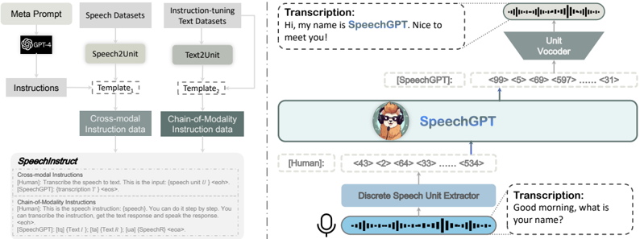

> [!abstract] arXiv · 2023 · Preprint
> **Dong Zhang et al.** (Fudan University) · [→ Paper](https://arxiv.org/abs/2305.11000) · Demo: ✓ · Code: ✓
>
> SpeechGPT extends a large language model to natively perceive and generate speech by expanding its vocabulary with HuBERT discrete units and training through three progressive stages, enabling end-to-end spoken dialogue without relying on separate ASR or TTS pipelines.

## Problem

Prior speech-language model systems relied on a cascade architecture, connecting an LLM with separate ASR and TTS components. This cascade design prevents inter-modal knowledge transfer: the LLM's language understanding cannot directly inform how speech is generated, and paralinguistic signals such as prosody and emotion are discarded at ASR boundaries. Spoken language models capable of generating speech (AudioLM, VALL-E) addressed generation but could not comprehend semantic content from speech input. The field lacked a single model that could both understand and produce speech as first-class modalities alongside text.

## Method

SpeechGPT treats speech discretisation as a vocabulary expansion problem. HuBERT (a self-supervised model trained on masked prediction of cluster indices) converts continuous audio into discrete unit sequences; adjacent duplicate frames are collapsed to reduce sequence length. These unit tokens are appended to LLaMA's vocabulary, and the embedding matrix is expanded accordingly with randomly initialised rows for the new tokens. A multi-speaker unit HiFi-GAN vocoder converts predicted discrete unit sequences back to audio, using speaker embeddings concatenated to each frame to support multi-speaker synthesis.

Training proceeds in three stages. Stage 1 (modality-adaptation pre-training) trains LLaMA-13B on LibriLight (60K hours) with a next-token prediction objective over discrete unit sequences, teaching the model to handle the speech modality at scale (96 A100 GPUs, 900 steps). Stage 2 (cross-modal instruction fine-tuning) trains on SpeechInstruct, a dataset the authors construct by discretising ASR corpora into unit-text pairs and generating 100 diverse task instructions per task type using GPT-4; text instruction data from moss-002-sft is mixed in to preserve language capability. Stage 3 (chain-of-modality instruction fine-tuning) adds LoRA adapters (rank 8, only 6M trainable parameters) on top of the stage-2 model, using data where the model is trained to first transcribe a speech instruction to text, reason in text, then produce a speech response. This chain-of-modality pattern serialises cross-modal reasoning as an explicit text intermediate, mitigating the need for direct speech-to-speech reasoning.

The SpeechInstruct dataset consists of two parts: cross-modal instruction data (9 million unit-text pairs from GigaSpeech, Common Voice, and LibriSpeech) and chain-of-modality data (37,969 quadruplets of speech and text instruction-response pairs generated via a Transformer text-to-unit generator trained on LibriSpeech).

## Key Results

Evaluation is qualitative: the paper presents case studies rather than MOS scores or WER measurements. Table 1 shows cross-modal instruction-following examples where SpeechGPT correctly performs ASR and TTS when prompted with natural language instructions (e.g., "Can you transcribe the speech into a written format?" or "Would you mind speaking these words as naturally as possible?"). Table 2 presents 10 spoken dialogue turns illustrating that SpeechGPT can comprehend speech input and produce coherent speech responses while maintaining the HHH criteria (harmless, helpful, honest). No quantitative baselines are reported; the evaluation is entirely human case-study based.

## Novelty Assessment

The core architectural contribution, expanding an LLM's vocabulary with discrete speech units, is grounded in prior work on HuBERT tokenisation and generative spoken language models (GSLM, AudioLM). What SpeechGPT adds is the systematic combination of this approach with instruction fine-tuning (borrowing from the visual instruction tuning tradition) and the chain-of-modality training pattern that externalises text reasoning before speech output. The three-stage training curriculum is a practical engineering contribution. The SpeechInstruct dataset is the first speech-text cross-modal instruction dataset at this scale, which is a concrete dataset contribution. The absence of quantitative evaluation limits the strength of empirical claims; the paper demonstrates feasibility and instruction-following capability through examples rather than controlled benchmarks.

## Field Significance

> [!tip]
> High: SpeechGPT demonstrates that an LLM backbone can natively handle speech input and output through vocabulary expansion and staged instruction fine-tuning, without cascade ASR/TTS glue code. The proof of concept shows that cross-modal instruction-following is achievable at modest training cost by combining HuBERT tokenisation with staged fine-tuning. The chain-of-modality approach, where the model generates a text intermediate before emitting speech tokens, addresses the difficulty of direct speech-to-speech generation without requiring architectural changes to the LLM backbone.

## Claims

- Expanding an LLM's token vocabulary with discretised speech units enables a single model to perform both speech comprehension and speech generation without a cascade pipeline. *(§4.1)*
- A multi-stage training curriculum, separating modality adaptation, cross-modal instruction tuning, and chain-of-modality alignment, is necessary to acquire reliable cross-modal instruction-following from an LLM backbone. *(§4.2)*
- The chain-of-modality pattern, generating a text intermediate before the speech response, is a practical mechanism for transferring LLM reasoning capability to speech output. *(§3.2, §4.2)*
- Large-scale instruction dataset construction via GPT-4-generated task descriptions applied to existing ASR corpora is a scalable approach to bootstrapping cross-modal training data. *(§3.1)*

## Limitations and Open Questions

> [!warning]
> The paper provides no quantitative evaluation: no MOS, WER, or speaker similarity scores are reported, and no comparison to cascade baselines is made. All results are case studies. Claims about spoken dialogue quality and instruction-following capability cannot be independently verified from the paper alone.

Additional limitations acknowledged by the authors:

- The system does not model paralinguistic information; it cannot generate responses with different emotional tones or speaking styles.
- The chain-of-modality design requires generating a full text response before producing speech, introducing latency incompatible with real-time interaction.
- Context length limitations (2048 tokens) prevent true multi-turn dialogue; only single-turn exchanges are demonstrated.
- HuBERT units discard fine-grained acoustic detail (prosody, speaker identity beyond the vocoder's speaker embedding), limiting expressiveness relative to audio codec approaches.
- The unit vocoder is trained separately and is not end-to-end jointly optimised with the LLM, leaving a quality gap between unit-based and codec-based approaches.

## Wiki Connections

- [[spoken-language-model]] — SpeechGPT is an early unified speech-text LLM using discrete units
- [[autoregressive-codec-tts]] — uses autoregressive LM decoding over discrete speech tokens, paralleling codec-based TTS
- [[self-supervised-speech]] — HuBERT is the core speech tokeniser for the proposed system
- [[instruction-conditioned-tts]] — SpeechInstruct introduces multi-modal instruction-following for speech generation
- [[speech-to-speech]] — end-to-end spoken dialogue without separate ASR/TTS pipeline is the primary capability
- [[neural-codec]] — contrasts with codec-based approaches (AudioLM, VALL-E); uses SSL units instead
- [[2302.13971]] — LLaMA backbone used as the foundation language model
