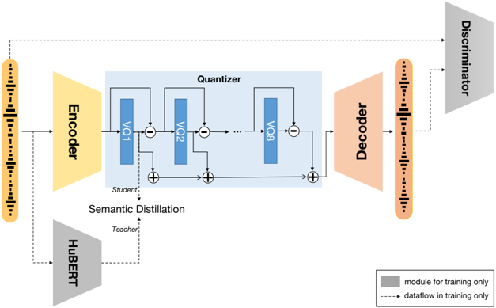

> [!abstract] arXiv · 2023 · Preprint
> **Zhang et al.** (Fudan University) · [→ Paper](https://arxiv.org/abs/2308.16692) · Demo: ✓ · Code: ✓
>
> SpeechTokenizer unifies semantic and acoustic discrete speech representations in a single RVQ-based codec by using HuBERT distillation to force content information into the first quantizer layer, enabling downstream speech language models to separate content from paralinguistic details without a multi-stage pipeline.

## Problem

Speech language models such as VALL-E depend on discrete speech tokens, but no existing tokenisation scheme is well-suited for that role. Semantic tokens (from HuBERT k-means) carry strong text alignment but discard acoustic detail, so synthesised speech sounds unnatural. Acoustic tokens from codecs like EnCodec preserve audio fidelity but mix content and speaker identity together, causing models to make content errors during generation. Hierarchical systems that chain semantic and acoustic models address both problems but introduce multi-stage error accumulation and slower inference. No formal benchmark existed to diagnose these trade-offs.

## Method

SpeechTokenizer is a convolutional encoder-decoder codec augmented with Residual Vector Quantization (RVQ), following the general structure of SoundStream and EnCodec. The key architectural change is replacing the LSTM module in the EnCodec encoder with a BiLSTM, which strengthens the representation's ability to capture local context for semantic modelling. During training, a HuBERT model acts as a frozen semantic teacher guiding the first RVQ quantizer via two distillation objectives: a continuous cosine-similarity loss computed dimension-wise (not timestep-wise) between the first-layer quantized output and HuBERT layer-9 or average-layer representations, and a pseudo-label prediction loss over HuBERT unit targets. The remaining seven RVQ quantizers are trained purely for reconstruction, complementing the paralinguistic information discarded by the first layer. The full generator objective is a weighted sum of time-domain L1 loss, multi-scale mel-spectrogram loss, GAN adversarial and feature-matching terms, RVQ commitment loss, and the distillation loss.

The resulting codec naturally disentangles content from speaker identity across the quantizer hierarchy. The paper then demonstrates utility by building a Unified Speech Language Model (USLM) on top of SpeechTokenizer: a 12-layer transformer autoregressive model produces first-layer (semantic) tokens from phoneme input, while a 12-layer non-autoregressive model generates layers 2-8 (paralinguistic) conditioned on the first-layer tokens and an acoustic speaker prompt. This reproduces the VALL-E AR+NAR structure but with a tokeniser whose layers already separate content from timbre, removing the need for explicit semantic bridges such as SPEAR-TTS.

The paper also introduces SLMTokBench, a benchmark evaluating speech tokens on two axes: text alignment (mutual information between tokens and text, downstream ASR word error rate) and information preservation (WER and speaker similarity of resynthesised speech).

## Key Results

In reconstruction evaluation on LibriSpeech test (Table 2), SpeechTokenizer achieves a MUSHRA score of 90.55 versus EnCodec's 79.86, a substantial subjective quality advantage. ViSQOL scores are comparable (4.30 vs. 4.37) and transcription WER is slightly lower for SpeechTokenizer (5.04 vs. 5.11).

On SLMTokBench (Table 3), SpeechTokenizer RVQ-1 tokens achieve mutual information of 31.6-32.9 (depending on teacher) versus 16.5 for EnCodec RVQ-1, confirming the content-focused design. Speaker similarity from RVQ-1 alone drops to 0.73-0.74, showing that timbre has been actively expelled from that layer. The full RVQ-1:8 token set recovers speaker similarity to 0.97, matching EnCodec.

For zero-shot TTS on VCTK (Table 4), USLM outperforms a reproduced VALL-E across all four metrics: WER 6.5 vs. 7.9, SPK-SIM 0.84 vs. 0.75, MOS 3.63 vs. 3.08, SMOS 3.45 vs. 3.31. The baseline VALL-E was trained under identical conditions (same data, same setup), making this a fair comparison.

Codebook analysis (Table 8) shows SpeechTokenizer RVQ-1 reaches a Phone-Normalized Mutual Information (PNMI) of 0.71, surpassing HuBERT KM500 units (0.43) and far above EnCodec RVQ-1 (0.28), indicating that the first quantizer's codes map more cleanly onto phoneme categories than either dedicated semantic tokeniser.

## Novelty Assessment

The core contribution is genuine: forcing semantic content into the first RVQ layer via teacher distillation is a structurally elegant solution to the codec-LM mismatch problem. The distillation approach is new in this context, though the individual components (RVQ-GAN codec, HuBERT representations, AR+NAR language modelling) are all borrowed from prior work. The D-axis cosine distillation loss (computed per feature dimension rather than per timestep) is a minor but well-motivated technical novelty shown to outperform the standard T-axis formulation in ablations.

The SLMTokBench benchmark is a useful addition, providing a principled two-dimensional framework for evaluating discrete representations that did not exist before. However, the benchmark's mutual information estimation methodology relies on variational approximation and a fixed BiLSTM downstream model, so absolute scores depend on evaluation setup.

The USLM result — while outperforming VALL-E — is evaluated on VCTK with a 3-second speaker prompt, which is a relatively constrained setup. The paper does not report results on other standard zero-shot TTS benchmarks, limiting breadth of comparison.

## Field Significance

> [!tip]
> High — SpeechTokenizer is one of the most-cited neural codec designs in speech LM research (104 in-corpus citations). By demonstrating that the standard EnCodec acoustic token representation is suboptimal for language modelling and providing a drop-in alternative with structured information separation, it gave the field a concrete reference point for what properties a codec needs to serve as the token vocabulary for a speech LM.

## Claims

- Separating semantic content from paralinguistic information across RVQ layers within a single codec improves both reconstruction quality and speech language model coherence compared to undifferentiated acoustic tokenisation. *(§4.4, Tables 2 and 4)*
- Acoustic tokens from standard neural codecs encode content and speaker identity in an entangled form that causes systematic word errors in autoregressive language model generation. *(§2.3, Table 3)*
- A distillation objective computed per feature dimension (D-axis) produces stronger semantic guidance to a codec's first quantizer than the conventional per-timestep (T-axis) formulation. *(Appendix C, Table 7)*
- The first-layer tokens of a hierarchically disentangled codec can serve as a zero-shot voice conversion mechanism by swapping higher-layer tokens from a reference speaker, without requiring a separate conversion model. *(§5.2, Table 5)*
- Codec tokens trained without explicit content supervision exhibit poor codebook utilisation and weak phoneme-code correspondence, increasing the modelling burden on downstream language models. *(Appendix F, Table 8)*

## Limitations and Open Questions

> [!warning]
> SpeechTokenizer is trained solely on English LibriSpeech. While preliminary results in Appendix G suggest cross-lingual token transfer is plausible, the codec is not validated for multilingual speech language models and the text-alignment properties of RVQ-1 may not hold for typologically distant languages.

The SLMTokBench mutual information metric relies on a variational upper bound and a fixed BLSTM downstream model; its absolute values are not directly comparable across evaluation frameworks. The USLM is evaluated only on VCTK with a single 3-second prompt per speaker, which does not represent the range of zero-shot conditions used in contemporaneous benchmarks. Model size is not reported for SpeechTokenizer itself. The voice conversion application (§5.2) is characterised as a single-shot demonstration rather than a full evaluation against dedicated VC baselines.

## Wiki Connections

Core concepts: [[neural-codec]] | [[autoregressive-codec-tts]] | [[disentanglement]] | [[zero-shot-tts]] | [[self-supervised-speech]] | [[evaluation-metrics]]

In-corpus references: [[2302.13971]] (LLaMA, used as background LLM context)
