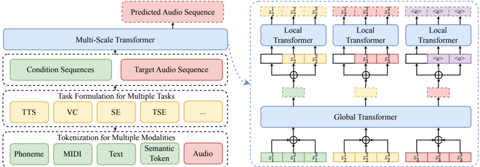

> [!abstract] arXiv · 2023 · Preprint
> **Yang et al.** · [→ Paper](https://arxiv.org/abs/2310.00704) · Demo: ✓ · Code: ✓
>
> UniAudio unifies 11 audio generation tasks (TTS, voice conversion, singing, speech enhancement, text-to-sound, text-to-music, and more) in a single 1B-parameter autoregressive language model by tokenizing all modalities into discrete sequences and predicting audio tokens with a novel multi-scale Transformer that resolves the sequence-length bottleneck imposed by RVQ-based codecs.

## Problem

Prior audio generation systems were heavily task-specific: TTS models, voice conversion systems, music generators, and speech enhancement models each required distinct architectures, training objectives, and data pipelines derived from domain-specific knowledge. While LLM-based approaches had shown promise in individual tasks (VALL-E for TTS, MusicGen for music), no prior work had demonstrated a single unified model capable of handling the full breadth of audio generation tasks. The long token sequences produced by residual vector quantization (RVQ) codecs -- one audio frame expanding to multiple tokens -- created a practical computational barrier: the quadratic attention cost of processing T×nq-length sequences made training with more than 3--4 quantization levels infeasible with standard flat-sequence LM approaches.

## Method

UniAudio converts all input and output modalities into discrete token sequences, then predicts target audio autoregressively from a concatenated source-target sequence. Audio of any type (speech, music, sound effects, singing) is tokenized by a custom RVQ codec built on an EnCodec-style encoder-decoder with a mel-spectrogram discriminator replacing the MS-STFT discriminator; this codec runs at 50 Hz with 3 quantization levels by default. Other condition modalities are tokenized separately: phoneme sequences via dictionary lookup or forced alignment, MIDI as frame-level F0 sequences, text as continuous embeddings from a frozen T5 encoder, and semantic tokens via K-means clustering of HuBERT representations.

The core architectural innovation is the multi-scale Transformer. Rather than flattening all RVQ tokens into a single T×nq sequence (which scales quadratically and is practically limited to nq ≤ 3), the multi-scale design separates inter-frame and intra-frame modeling into a global Transformer and a local Transformer. The global Transformer processes one embedding per audio frame (sequence length T), using the summed quantization vector to represent each frame. Its outputs are then passed frame-by-frame to a lightweight local Transformer that autoregressively predicts the nq tokens within each frame. Both modules are causal, preserving full autoregressive property. With nq=3, the global Transformer has 744M parameters (24 layers, d=1536) and the local Transformer has 238M parameters (8 layers), totaling approximately 1B parameters.

All 11 tasks are formulated identically: a sequence of condition tokens followed by the target audio token sequence, framed with task-identifier special tokens such as `<sound_task>` or `<tts_task>`. Training proceeds in two stages: joint pretraining on 7 tasks (165K hours), followed by fine-tuning to add 4 new tasks (audio editing, speech dereverberation, instructed TTS, speech editing). To prevent forgetting during fine-tuning, task-level temperature-based data resampling (α=0.05) is used.

## Key Results

UniAudio is evaluated across all 11 tasks with a mix of subjective MOS/SMOS and objective metrics. On the core tasks from the training stage:

- **TTS (LibriSpeech test-clean):** MOS 3.81 with WER 2.0% and speaker similarity SIM 0.708. This places UniAudio above VALL-E, NaturalSpeech 2, YourTTS, and Make-A-Voice on SIM, and competitive with NaturalSpeech 2 on WER. VoiceBox outperforms on SIM (0.681 vs. 0.708) objective metric but is not directly compared on MOS. *(Table 10, Appendix B.1)*
- **Voice conversion (VCTK):** MOS 3.54, SMOS 3.56, SIM 0.868, WER 4.8%. UniAudio surpasses LM-VC and Make-A-Voice on both speaker similarity and naturalness. *(Table 10, Appendix B.1)*
- **Singing voice synthesis (M4Singer):** MOS 4.08, comparable to Make-A-Voice (3.96) and DiffSinger (3.94). *(Table 12, Appendix B.3)*
- **Speech enhancement (VCTK):** Best DNSMOS (3.66) and MOS (3.68) among compared systems, but lower PESQ (2.63) than discriminative baselines, consistent with a known limitation of generative methods on signal-level metrics. *(Table 11, Appendix B.2)*

The ablation on the multi-scale Transformer (Table 4) shows it matches flat-sequence prediction in TTS quality (MOS 3.77 vs. 3.80) at substantially lower memory cost (19.4 GB vs. 36.7 GB) and training time (0.73s vs. 1.63s per iteration), while enabling nq=8 which yields MOS 3.84.

Multi-task training consistently outperforms single-task training across all 11 tasks (Appendix C.1, Table 17), confirming that cross-task sharing is beneficial rather than neutral. Fine-tuning on 4 new tasks does not significantly degrade performance on the original 7 (Appendix C.2).

## Novelty Assessment

The primary architectural contribution is the multi-scale Transformer, which provides a principled solution to the RVQ long-sequence problem that is both auto-regressive (unlike delay, parallel, or coarse-first approaches) and computationally tractable (unlike flat-sequence modeling). The design is explicitly compared against four alternatives (flat, coarse-first, delay, parallel) in controlled ablations; the multi-scale approach achieves comparable quality with substantially better efficiency. This is a genuine structural innovation, not a configuration change.

The broader claim that a single model can unify 11 audio generation tasks is largely an engineering integration: the task-formulation idea (concatenate condition and target as one sequence) is directly inherited from VALL-E and AudioLM, and the two-stage train-then-finetune setup is standard. The novelty lies in the scale of demonstration (11 tasks, 165K hours, 1B parameters) and the custom codec trained for universal audio coverage, but these are extensions of known components rather than new paradigms.

The multi-task training benefit, while validated empirically across all tasks, is not deeply explained; the paper offers three plausible but informal hypotheses in Appendix D. The codec comparison (Table 18) shows the custom codec outperforms EnCodec on PESQ/STOI across speech, sound, music, and singing, validating the design choice.

## Field Significance

> [!tip]
> High -- UniAudio demonstrates that a single autoregressive LM can unify the full breadth of audio generation tasks with competitive or state-of-the-art performance across all of them. The multi-scale Transformer introduces a practically important architectural solution to the RVQ sequence-length problem that subsequent work can adopt independently of the multi-task framing. Together, these contributions helped establish the viability of universal audio foundation models as a direction, at a time when the field was largely task-specific.

## Claims

- Training a single audio language model across diverse generation tasks (TTS, voice conversion, sound synthesis, music, singing) produces consistent performance improvements over task-specific models trained on the same data. *(§3.4.1, Appendix C.1, Table 17)*
- The autoregressive property is critical for audio generation quality: parallel and delay-based codec prediction approaches yield measurably lower naturalness than fully autoregressive methods when codec quantization levels are held constant. *(§3.4.2, Tables 4–5)*
- Hierarchical factorisation of RVQ codec token sequences into inter-frame and intra-frame modeling substantially reduces training memory and time relative to flat-sequence autoregressive prediction, with comparable generation quality. *(§2.3, §3.4.2, Table 4)*
- Pre-training on a broad multi-task audio corpus enables strong adaptation to unseen audio generation tasks via fine-tuning on small datasets, outperforming task-specific models trained from scratch on those tasks. *(§3.3, Appendix B.5–B.8, Table 17)*
- Signal-level metrics such as PESQ are poorly suited for evaluating generative audio models: systems achieving higher perceptual MOS scores routinely score lower on PESQ than discriminative baselines. *(§3.2, §3.4.2, Table 11)*

## Limitations and Open Questions

> [!warning]
> Model checkpoints are not released due to misuse concerns, limiting reproducibility. Only code and demos are public. Researchers cannot directly reproduce the full 165K-hour training run or perform ablations at scale.

UniAudio does not handle all known audio tasks: noise removal, noisy speech editing, and speech-to-speech translation are explicitly excluded. New modalities cannot be introduced during fine-tuning, only new combinations of modalities already seen at training time. The system relies entirely on labeled data; self-supervised or weakly supervised pre-training from unlabeled audio, which could substantially increase coverage, is left as future work.

The multi-task benefit is empirically demonstrated but mechanistically underexplained. The paper offers informal hypotheses (shared codec token space, data augmentation equivalences between TTS and VC conditions) but no formal analysis. It is unclear whether the gains stem from better codec representations, increased effective data volume per task, or genuine cross-task transfer.

## Wiki Connections

Core methods: [[autoregressive-codec-tts]] | [[neural-codec]] | [[spoken-language-model]]

Capabilities: [[zero-shot-tts]] | [[voice-conversion]] | [[instruction-conditioned-tts]]

Related papers cited: [[2301.02111]] (VALL-E) | [[2210.13438]] (EnCodec) | [[2304.09116]] (NaturalSpeech 2) | [[2306.12925]] (AudioPaLM) | [[2303.03926]] (VALL-E X) | [[2305.02765]] (HiFi-Codec) | [[2006.04558]] (FastSpeech 2)

[[2406.18009]] — E2 TTS: Embarrassingly Easy Fully Non-Autoregressive Zero-Shot TTS
