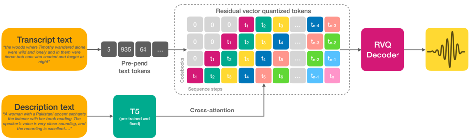

> [!abstract] arXiv · 2024 · Preprint
> **Lyth & King** (Stability AI) · [→ Paper](https://arxiv.org/abs/2402.01912) · Demo: ✓ · Code: ?
>
> A fully automatic pipeline for labeling 45k hours of audiobook speech with multi-attribute natural language descriptions (accent, pitch, speaking rate, recording quality), used to train an autoregressive speech language model capable of high-fidelity TTS guided entirely by free-form text prompts.

## Problem

Prior large-scale TTS systems with natural language control depended on either reference audio embeddings (requiring an existing recording of the target speaker) or human-authored descriptions. Human annotation is expensive and cannot scale to the tens of thousands of hours that modern speech language models require, leaving the field with a fundamental tension: natural language control requires description metadata, but large-scale datasets do not have it.

Earlier work on description-guided TTS labelled at most a few dozen hours of data and often still required fixed speaker IDs for identity control. No system had demonstrated natural language conditioning covering the full range of speaker identity, accent, prosody, and channel conditions simultaneously at the scale needed for capable in-context learning.

## Method

The system has two main components: an automatic labeling pipeline and a speech language model trained on its output.

For labeling, the pipeline covers seven attributes: gender (provided by dataset creators), accent (53-class classifier trained on EdAcc, VCTK, and VoxPopuli), pitch (speaker-level mean relative to gender), pitch standard deviation (proxy for monotony), speaking rate (phonemes per second), estimated SNR (using the Brouhaha library), and C50 room acoustics. Continuous attributes are binned into seven discrete categories and assigned short phrases. A large language model (Stable Beluga 2) then converts keyword tuples into natural language sentences, e.g. "a woman with a deep voice speaking slowly and somewhat monotonously with a Hungarian accent in an echoey room with background noise." This approach is applied to the 45k-hour English Multilingual LibriSpeech corpus and the smaller 585-hour LibriTTS-R corpus (included for its higher audio fidelity from the Miipher speech-enhancement model).

The model adapts Meta's AudioCraft framework for TTS. The transcript is prepended as a token sequence, while the natural language style description is applied via cross-attention. No speaker embedding or reference audio is provided: the description is the sole conditioning signal for identity and style. For discrete audio representations the system uses the Descript Audio Codec (DAC) at 44.1 kHz with a frame rate of 86 Hz and nine codebooks, adopting the delay pattern from MusicGen to handle the multi-codebook prediction in an autoregressive LM.

High audio fidelity is achieved through a combination of: (1) using DAC rather than EnCodec, which the authors report provides subjectively and objectively superior audio quality, and (2) including LibriTTS-R in training, which provides approximately 500 hours (roughly 1%) of clean, professionally enhanced speech alongside the crowd-sourced data. The hypothesis is that labeling recording quality explicitly allows the model to learn a disentangled fidelity representation, enabling clean-sounding synthesis even for accents or styles that only appear in low-fidelity training examples.

## Key Results

Subjective listening tests with 30 native English speakers compare the proposed system against Audiobox (Meta) and ground truth on samples from LibriTTS-R.

On overall naturalness (MOS), the system scores 3.92 vs. 2.79 for Audiobox and 3.67 for the ground truth (Table 2). Outperforming the ground truth is attributed to mild speech-enhancement artifacts in LibriTTS-R and label noise in the test descriptions, both of which favor the model's output over real recordings.

On description relevance (REL), the system also scores 3.88 vs. 3.19 for Audiobox (and 3.62 for ground truth), again exceeding ground truth for the same reasons.

Objective audio quality metrics (PESQ, STOI, SI-SDR) evaluated via TorchAudio-SQUIM on 20 samples with "excellent recording quality" descriptions show the proposed model substantially outperforms Audiobox and approaches ground-truth values: PESQ 3.84 vs. 3.46 (Audiobox), STOI 0.996 vs. 0.988, SI-SDR 26.53 dB vs. 21.84 dB (Table 1).

Objective attribute control is validated using the same automatic classifiers that labeled the training data. Gender accuracy reaches 94%; accent accuracy is 68%, with the gap attributed to noisy training labels and a heavily imbalanced accent distribution. Continuous attributes (pitch, speaking rate, SNR) show good correlation with target descriptions, while C50 room acoustics control remains unreliable.

Comparisons are against Audiobox only. No single-speaker baselines (FastSpeech, VITS) or zero-shot reference-based systems (VALL-E, Voicebox) are included, so the evaluation establishes advantage over the closest natural-language-conditioned competitor but does not benchmark against the broader TTS landscape.

## Novelty Assessment

The primary contribution is the automatic annotation pipeline that makes description-guided TTS trainable at 45k-hour scale. This is genuinely new in 2024: prior description-guided systems were constrained by human-annotation bottlenecks and never demonstrated the breadth of style control (accent, fidelity, prosody) this paper achieves in a single model. The pipeline itself is straightforward engineering: classifiers, signal-processing measures, binning, and LLM text generation. None of the individual components are novel, but combining them and applying them at this scale to enable a new capability mode is the contribution.

The model architecture is an incremental adaptation of AudioCraft/MusicGen for TTS, not a structural invention. Choosing DAC over EnCodec and using LibriTTS-R for high-fidelity grounding are practical engineering choices that demonstrably improve output quality. The claim that roughly 1% high-fidelity data can substantially lift overall audio quality, if it generalizes, is a useful empirical observation for practitioners working with mixed-quality training corpora.

## Field Significance

> [!tip]
> High — This paper provides the first demonstration that fully automatic synthetic annotations can replace human labeling for natural language conditioned TTS at tens-of-thousands-of-hours scale. It decouples description-guided TTS from the annotation bottleneck that had limited prior work and enables a practical path to training large speech LMs with expressive style control. The codec choice and mixed-fidelity training strategy offer reusable design patterns for subsequent instruction-conditioned systems.

## Claims

- Automatic acoustic labeling can substitute for human annotations in training large-scale instruction-conditioned speech language models without a loss in attribute control accuracy relative to human-labeled systems. *(§3.1, §3.2, §4.1)*
- Including a small proportion of high-fidelity audio (approximately 1%) in a predominantly noisy training corpus, combined with explicit recording-quality labels, enables a speech LM to generate professional-sounding speech on demand from text prompts alone. *(§3.1.2, §4.2, Table 1)*
- The choice of neural audio codec has a measurable effect on perceptual audio quality in autoregressive TTS; higher-fidelity codecs translate directly to higher MOS and objective quality scores. *(§3.3, §4.2, Table 1–2)*
- Natural language conditioning on accent can be achieved in a single TTS model covering dozens of accents, though classifier accuracy reflects the noise and imbalance inherent in automatic accent labeling of crowd-sourced data. *(§3.1.1, §4.1)*

## Limitations and Open Questions

> [!warning]
> The evaluation compares only against Audiobox. No standard TTS baselines (reference-based zero-shot systems, encoder-decoder models) are included, making it impossible to assess whether the MOS gains arise from the conditioning approach, the codec choice, or the training data mix.

The system is evaluated only on English audiobook speech; generalization to conversational, spontaneous, or non-English speech is stated as future work but untested. The accent accuracy of 68% indicates that discrete accent labels in crowd-sourced data are noisy, and the model's C50 control was found to be unreliable even after training. Model size and total compute are not reported. The automatic labeling pipeline requires training multiple specialized classifiers (accent, gender), each of which introduces its own noise floor. The demo website is the only verification source; no code or model weights are released.

## Wiki Connections

This paper extends [[autoregressive-codec-tts]] by training at 45k-hour scale and demonstrates how [[instruction-conditioned-tts]] can be operationalized without human annotations. It builds on [[neural-codec]] work, specifically replacing [[2210.13438]] (EnCodec) with the Descript Audio Codec for higher fidelity. The training data includes the English split of [[2012.03411]] (MLS). The speech LM approach is closely related to [[2301.02111]] (VALL-E) and [[2303.03926]] (VALL-E X). The description relevance evaluation methodology connects to [[subjective-evaluation]] and [[prosody-control]].

[[2403.16973]] — VoiceCraft: Zero-Shot Speech Editing and Text-to-Speech in the Wild
