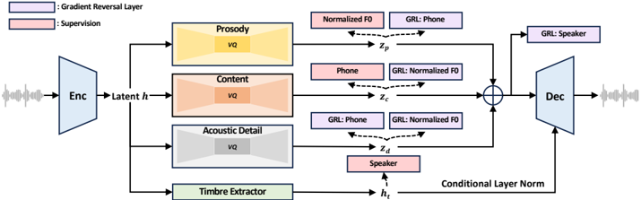

> [!abstract] arXiv · 2024 · Preprint
> **Ju et al.** (Microsoft) · [→ Paper](https://arxiv.org/abs/2403.03100) · Demo: ✓ · Code: ?
>
> NaturalSpeech 3 decomposes speech into disentangled attribute subspaces (content, prosody, timbre, acoustic details) via a factorized vector quantisation codec and generates each attribute separately with a discrete diffusion model, achieving human-level naturalness on LibriSpeech in a zero-shot setting.

## Problem

Prior zero-shot TTS systems treat speech generation as a monolithic problem over raw waveforms, mel-spectrograms, or residual VQ token sequences. Residual VQ codec representations decompose speech hierarchically but do not disentangle attribute information across levels: content, prosody, timbre, and acoustic texture remain entangled within the token sequence, forcing the generative model to untangle them during learning. This entanglement makes it difficult to independently control each attribute and raises the modelling complexity, particularly for prosody transfer and speaker similarity in zero-shot synthesis.

## Method

NaturalSpeech 3 is built around two jointly trained components: FACodec, a neural speech codec with factorized vector quantisation (FVQ), and a factorized diffusion model that generates each attribute subspace in sequence.

FACodec encodes a 16 kHz speech waveform through convolutional encoder blocks with a hop size of 200 (12.5 ms per frame). The encoder output is routed to three FVQ modules, each projecting into an 8-dimensional bottleneck before quantisation to force attribute isolation: a prosody quantizer (1 codebook), a content quantizer (2 codebooks), and an acoustic detail quantizer (3 codebooks). Timbre is extracted globally by a Transformer-based timbre extractor producing a single vector. Disentanglement is enforced through a combination of supervised auxiliary losses (F0 prediction on prosody codes, phoneme prediction on content codes, speaker classification on the timbre vector), gradient reversal layers to actively suppress cross-attribute information leakage, and detail dropout that randomly masks acoustic detail codes during training to prevent the codec from offloading content and prosody into the detail subspace.

The factorized diffusion model is a discrete masked diffusion system (mask-and-predict, not continuous DDPM), operating over the discrete tokens from FACodec. Generation proceeds sequentially: duration diffusion, phoneme-level prosody diffusion, prosody diffusion, content diffusion, and acoustic detail diffusion. Each stage conditions on a prompt extracted from a reference speech clip by the codec (partial noising for in-context learning) and on the outputs of prior stages. Timbre is extracted from the prompt directly and injected into the codec decoder via conditional layer normalization without generation. The phoneme encoder uses a 6-layer Transformer; the main diffusion Transformer has 12 layers with 1024-dimensional embeddings, totalling approximately 500M parameters. Classifier-free guidance (scale 1.0) is applied during inference except for duration. At 4 iterations per diffusion stage, inference requires 60 forward passes in total.

The paper also shows the factorisation paradigm generalises to autoregressive generation by substituting VALL-E for the diffusion modules while retaining FACodec, demonstrating the design is not tied to its diffusion formulation.

## Key Results

On LibriSpeech test-clean, NaturalSpeech 3 achieves CMOS of 0.00 relative to ground truth (compared to -0.18 for NaturalSpeech 2 and -0.23 for Voicebox), UTMOS of 4.30, Sim-O of 0.67, Sim-R of 0.76, SMOS of 4.01, and WER of 1.81%, establishing the strongest results among all compared zero-shot TTS systems on this benchmark at the time of submission (Table 1, Table 9). The SMOS of 4.01 exceeds ground truth SMOS of 3.85, suggesting the system's speaker consistency is perceived as comparable to or better than the natural recordings by subjective listeners.

On the RAVDESS prosody benchmark, NaturalSpeech 3 achieves an average MCD of 4.28 and MCD-Acc of 0.52, outperforming all baselines including NaturalSpeech 2 (4.56 MCD, 0.25 MCD-Acc) and Mega-TTS 2 (4.44 MCD, 0.39 MCD-Acc). This demonstrates improved prosody transfer, not just speaker voice quality (Table 2).

Ablation confirms that factorisation is the primary driver: removing it degrades Sim-O from 0.67 to 0.55, CMOS by 0.25, and SMOS by 0.42 (Table 3). Scaling to 1B parameters and 200K hours of training data yields further improvement on an internal test set (Sim-O 0.73 to 0.78, WER 2.11% to 1.71%; Tables 7, 8).

FACodec also enables zero-shot voice conversion without task-specific training, achieving Sim-O of 0.86 and WER of 3.46% on VCTK, competitive with dedicated VC models (Table 14).

Latency analysis on a single V100 shows a real-time factor (RTF) of 0.296, compared to 4.52 for VALL-E and 0.366 for NaturalSpeech 2 (Table 10). Reducing to one diffusion iteration per stage (15 total forward passes) yields RTF 0.067 with only minor quality loss (-0.01 Sim-O, -0.29 UTMOS).

## Novelty Assessment

The core contribution is the factorized codec design (FACodec) rather than the diffusion formulation itself. The discrete masked diffusion applied per-attribute is an existing approach (adapted from MaskGIT-style generation). The novel element is using separate quantizers with targeted supervision and gradient reversal to explicitly disentangle speech attributes at the codec stage, so that the generative model operates on already-separated representations rather than entangled residual VQ tokens. This is a genuine architectural contribution to the neural codec-for-TTS design space.

The factorized diffusion ordering (duration, prosody, content, detail) and the attribute-specific prompting mechanism are also new. The demonstration that the same factorization framework improves VALL-E (Table 6) strengthens the claim that FACodec is a general-purpose representation improvement, not merely tuned for the diffusion model above it.

Limitations: the evaluation is on English only (Librilight corpus); no multi-speaker subjective naturalness test with statistically grounded confidence intervals is reported; FACodec requires phoneme-level transcriptions for content supervision, limiting scalability to low-resource or unsupervised settings.

## Field Significance

> [!tip]
> High — NaturalSpeech 3 advances the case that structured speech disentanglement at the codec level provides a more tractable generation problem than entangled residual VQ representations, demonstrating gains across quality, speaker similarity, prosody, and intelligibility simultaneously. The FACodec component, released alongside demos, offers a reusable foundation for attribute-controllable TTS and a direct comparison point for subsequent codec design work. Its first demonstration of human-level naturalness on multi-speaker LibriSpeech in a zero-shot setting marked a concrete capability milestone for the field at its release date.

## Claims

- Explicit disentanglement of speech attributes in the codec representation reduces the complexity of zero-shot generation and improves speaker similarity, quality, and prosody simultaneously. *(§3, §4.2, Table 1, Table 2)*
- Gradient reversal combined with attribute-specific supervised losses is an effective mechanism for suppressing cross-attribute information leakage in neural codec quantization. *(§3.2.2, Appendix B.4)*
- The factorization paradigm for codec representations is architecture-agnostic and improves both autoregressive and non-autoregressive generators when applied. *(§4.3.2, Table 6)*
- Discrete masked diffusion over disentangled codec tokens is faster than autoregressive LM-based codec generation at comparable or better quality. *(Appendix A.5, Table 10)*
- Performance on zero-shot TTS scales predictably with both training data volume and model size when the underlying speech representation captures disentangled attributes. *(§4.4, Tables 7, 8)*

## Limitations and Open Questions

> [!warning]
> FACodec requires phoneme-level transcriptions for content supervision during training, constraining its applicability to languages and settings where reliable alignments are unavailable. The zero-shot TTS evaluation is English-only; multilingual generalisation is stated as future work but not demonstrated.

Additional limitations: the attribute factorization is incomplete (background sounds, energy, and other fine-grained characteristics are not captured, as noted in Appendix C); the acoustic detail subspace retains some content and prosody leakage without gradient reversal (verified qualitatively in Appendix B.4); and the prosody evaluation relies on MCD and emotion classifiers on the RAVDESS dataset, which assesses a narrow range of acted emotions rather than naturalistic prosodic variation.

Open questions include whether factorized disentanglement continues to improve at larger scales and whether supervision-free disentanglement is achievable without degrading reconstruction quality.

## Wiki Connections

Architectural context: [[diffusion-tts]], [[neural-codec]], [[disentanglement]]

Zero-shot capability: [[zero-shot-tts]], [[prosody-control]], [[voice-conversion]]

In-corpus papers this builds on: [[2304.09116]] (NaturalSpeech 2, latent diffusion TTS predecessor), [[2301.02111]] (VALL-E, discrete codec LM baseline), [[2210.13438]] (EnCodec, the reference codec design), [[2308.16692]] (SpeechTokenizer, related factorized codec work), [[2305.09636]] (SoundStorm, parallel discrete generation), [[2105.06337]] (GradTTS, diffusion TTS)

Cited by: [[2410.00037]] (Moshi, NaturalSpeech 3 as reference codec-LM system) · [[2411.13577]] (WavChat survey, NaturalSpeech 3 as TTS reference system)

[[2406.18009]] — E2 TTS: Embarrassingly Easy Fully Non-Autoregressive Zero-Shot TTS
[[2407.08551]] — Autoregressive Speech Synthesis without Vector Quantization
[[2409.05377]] — BigCodec: Pushing the Limits of Low-Bitrate Neural Speech Codec
