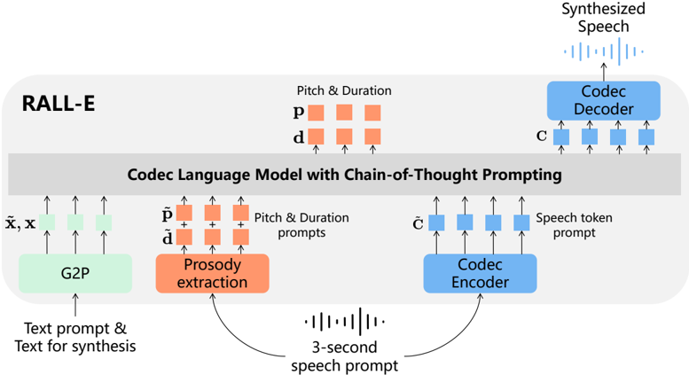

> [!abstract] arXiv · 2024 · Preprint
> **Xin et al.** (Microsoft) · [→ Paper](https://arxiv.org/abs/2404.03204) · Demo: ✓ · Code: ?
>
> RALL-E applies chain-of-thought prompting to autoregressive codec language model TTS by predicting prosody tokens (pitch and duration) as an explicit intermediate step before speech token generation, dramatically reducing the word error rate of LLM-based zero-shot TTS without reranking.

## Problem

Autoregressive codec language models for TTS (the VALL-E family) achieve impressive zero-shot speaker cloning but suffer from poor robustness: the sequential token-by-token generation process produces unstable prosody, word omissions, repetitions, and hallucinations. While reranking multiple samples at inference can partially compensate, it multiplies latency proportionally to the number of samples drawn. Prior work addressing robustness (ELLA-V, VALL-T) either entangles duration prediction with speech token generation or requires computationally expensive transducer training. The core failure mode is that the AR model must simultaneously learn content alignment and prosody from a single training signal, with no structural constraint enforcing that generated speech tokens correspond to the input phoneme sequence.

## Method

RALL-E adapts the chain-of-thought (CoT) prompting strategy from LLM reasoning to the codec TTS setting. Rather than having the AR Transformer jump directly from phoneme input to speech token generation, RALL-E inserts an explicit intermediate prediction stage: the model first generates a phoneme-level prosody token sequence encoding discretised pitch (quantised to 256 buckets) and duration (capped at 32 frames) for the full input utterance, then uses those prosody tokens as an additional conditioning signal when generating the first-layer RVQ speech tokens autoregressively. Prosody tokens for the speaker prompt are also extracted and provided as context, allowing the model to condition on reference style in the same way VALL-E conditions on prompt speech tokens. The NAR Transformer that predicts RVQ residual layers 2-16 receives the prosody tokens summed into its phoneme embeddings.

The second key mechanism is duration-guided masking. In VALL-E the AR Transformer attends globally to all input phonemes when predicting each speech token, leaving alignment entirely implicit. RALL-E uses the predicted duration to restrict each speech token's attention to a local phoneme window of width 2k+1 centered on the corresponding phoneme (k=1 in the final system), masking all other phoneme and prosody positions. This makes alignment an explicit structural constraint rather than something the model must discover from data alone. A complementary duration-guided inference rule uses the total predicted duration D to set a hard stop condition, preventing early termination and consequent word omissions.

The model is built on a 12-layer Transformer (1024-dimensional embeddings, 4096-dimensional FFN) for both AR and NAR components, trained on the 44K-hour English MLS subset using SoundStream with 16 RVQ layers as the codec. Pitch is extracted via the WORLD vocoder; phoneme-speech alignment is obtained from an internal tool.

## Key Results

On the LibriSpeech test-clean set (1205 utterances), RALL-E achieves WER of 2.5% compared to 5.6% for the VALL-E baseline trained on the same data, a 55% relative reduction without reranking (Table 2). With reranking over 5 samples, WER drops to 1.0% against VALL-E's 1.7%, even surpassing the reranked WER of ground-truth transcriptions (1.8% WER reflects ASR errors on real speech). UTMOS improves from 3.9 to 4.0, indicating more stable naturalness. Speaker similarity (SIM) is comparable to the VALL-E reimplementation at 0.49.

On 50 hard sentences containing repetitive numbers, file paths, and code strings, RALL-E reduces the error rate from 68% to 4%, closely approaching non-autoregressive NaturalSpeech 2 (0%) (Table 1, §4.4). RALL-E also outperforms ELLA-V (2.8% WER) and VALL-T (3.9% WER) on the standard test set, though the baseline data conditions differ. Subjective CMOS tests show RALL-E rates slightly better than both VALL-E and ground truth utterances; SMOS (3.57 vs 3.50 for VALL-E) shows modest speaker similarity improvement.

Ablation results (Table 4) confirm that duration CoT prompting is the dominant contributor: removing it raises WER from 2.5% to 13.4%. Duration-guided masking contributes independently (removing it raises WER to 3.2%). Pitch CoT has a smaller but measurable effect on mispronunciation.

## Novelty Assessment

The core insight, applying chain-of-thought prompting to stabilise autoregressive speech generation, is a genuine adaptation of an NLP technique to a structurally different domain. The mechanism is not just a rebranding: the duration-guided masking makes phoneme-speech alignment an architectural constraint rather than a learned emergent property, addressing a root cause of AR TTS failure rather than post-hoc reranking. The two components (prosody CoT and duration masking) interact non-trivially and are ablated cleanly.

The contribution is primarily architectural and training-recipe. The underlying model (VALL-E with SoundStream) is not itself new, and the codec, Transformer architecture, and training data are standard. The paper does not compare against continuous-output models (flow matching, diffusion) that handle alignment differently. The robustness gains on hard sentences (68% to 4% error rate) are the most striking result, though these sentences are non-naturalistic edge cases not representative of typical TTS use.

## Field Significance

> [!tip]
> High — RALL-E introduces a principled mechanism for controlling robustness in autoregressive codec TTS, demonstrating that explicit intermediate prosody prediction substantially closes the robustness gap between AR and non-AR TTS without sacrificing voice cloning capability. The chain-of-thought framing and duration-guided masking provide design patterns that can be applied to any decoder-only TTS model beyond the specific VALL-E instantiation used here.

## Claims

- Autoregressive codec language model TTS can be substantially stabilised by predicting prosody tokens as explicit intermediate targets before speech token generation, without requiring reranking or a separate alignment model at inference. *(§3.2, Table 2)*
- Duration-guided attention masking, which restricts each speech token to attend only to a local phoneme window based on predicted alignment, provides significant robustness improvements beyond prosody conditioning alone. *(§3.3, Table 4)*
- The robustness deficit of AR codec TTS relative to non-autoregressive methods is most pronounced on structurally unusual inputs (repetitive patterns, numeric sequences, code strings) where learned implicit alignment is most likely to fail. *(§4.4, Table 1)*
- Reranking over multiple samples and explicit intermediate prosody prediction address the same underlying alignment problem and can be combined for additive gain, but prosody CoT prompting reduces the dependency on reranking by improving single-sample quality. *(§4.2, Table 2)*

## Limitations and Open Questions

> [!warning]
> The paper relies on an internal proprietary alignment tool for extracting phoneme-speech alignments during training. Alignment quality directly affects duration-guided masking effectiveness (§3.3 notes that alignment errors required loosening the masking window from k=0 to k=1). Reproduction requires either the same tool or a comparable open alternative, which the paper does not specify or release.

Evaluation is entirely English on LibriSpeech and the MLS English subset. Whether the CoT prosody approach transfers to languages with different phoneme-duration relationships or tonal languages is untested. The comparison with ELLA-V and VALL-T is not fully controlled: all three systems differ in training data size and evaluation subset, making it difficult to isolate the architectural contribution from data-scale effects. Speaker similarity (SIM 0.49) remains below the originally reported VALL-E score (0.58), a gap the authors attribute to differences in prompt resynthesis methodology rather than genuine capability differences but cannot rule out.

## Wiki Connections

- [[autoregressive-codec-tts]] — RALL-E directly addresses the robustness problem of this paradigm by introducing chain-of-thought prompting as an architectural remedy for AR TTS failures.
- [[zero-shot-tts]] — the system demonstrates zero-shot voice cloning via audio prompt conditioning in the VALL-E style while substantially improving robustness without reranking overhead.
- [[neural-codec]] — uses SoundStream with 16-layer RVQ as the speech representation; the codec's discrete token structure is fundamental to the CoT prompting formulation.
- [[evaluation-metrics]] — evaluates robustness via WER, error-type decomposition (substitution/deletion/insertion), and a purpose-built hard-sentence test set, providing a more nuanced robustness metric beyond naturalness scores.
- [[2301.02111]] (VALL-E) — RALL-E is built directly on VALL-E's architecture and training recipe, extending it with CoT prosody prompting and duration-guided masking.
- [[2210.13438]] (EnCodec) — the EnCodec RVQ formulation motivates the hierarchical AR/NAR token prediction structure that RALL-E inherits and modifies.
- [[2403.03100]] (NaturalSpeech 3) — cited as a non-autoregressive reference point achieving near-zero error on the hard-sentence benchmark, contextualising RALL-E's robustness gains.
- [[2304.09116]] (NaturalSpeech 2) — used as the 0% error-rate upper bound on hard sentences, showing that non-AR approaches avoid the hallucination problem RALL-E addresses.
- [[2401.07333]] (ELLA-V) — a direct competitor addressing AR TTS robustness by interleaving speech and phoneme tokens; RALL-E disentangles duration prediction from speech generation, giving higher controllability.
- [[2310.00704]] (UniAudio) — cited as related work applying decoder-only architectures to multi-task audio generation.
- [[2306.12925]] (AudioPaLM) — cited as an example of LLM-based multi-modal speech modelling in the related work context.
- [[2204.02152]] (UTMOS) — the automatic speech quality predictor used to evaluate naturalness of synthesised samples.
