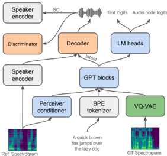

> [!abstract] arXiv · 2024 · Preprint
> **Casanova et al.** (Coqui.ai / NVIDIA / Cantina.ai) · [→ Paper](https://arxiv.org/abs/2406.04904) · Demo: ✓ · Code: ✓
>
> XTTS extends the Tortoise autoregressive TTS framework to 16 languages, including several low-resource ones, through a Perceiver Resampler conditioning encoder and a custom VQ-VAE, achieving the best character error rate among evaluated multilingual zero-shot systems while matching naturalness quality of strong monolingual baselines.

## Problem

Prior multilingual zero-shot TTS systems were limited to a small number of high-resource languages: YourTTS covered three, VALL-E X and Mega-TTS 2 handled two, and Voicebox supported six. This left speakers of the vast majority of the world's languages without viable zero-shot synthesis. At the same time, comparisons in the literature were often unfair: papers evaluated against YourTTS's multilingual checkpoint despite that checkpoint suffering from severe imbalance (66% of batches drawn from just six speakers), making it an artificially weak baseline for English-only systems.

## Method

XTTS is a three-component pipeline built on top of Tortoise. The first component is a VQ-VAE (13M parameters) that encodes mel-spectrograms into discrete codes using a single codebook of 8,192 entries at 21.53 Hz. After training, the codebook is filtered to retain only the 1,024 most-frequent codes, which the authors found improved expressiveness in preliminary experiments. The second component is a GPT-2 decoder-only transformer (443M parameters) that autoregressively predicts VQ-VAE codes from a joint sequence of text tokens and speaker conditioning. Text is tokenized via a custom 6,681-token BPE tokenizer; Korean, Japanese, and Chinese are romanised before tokenisation. The third component is a HiFi-GAN vocoder decoder (26M parameters) conditioned on speaker embeddings from the H/ASP model, added at each upsampling layer. This avoids decoding directly from VQ-VAE codes, which caused pronunciation artefacts in preliminary experiments.

The key architectural departure from Tortoise is the Conditioning Encoder: rather than compressing a reference audio clip into a single 1,024-dim embedding, XTTS uses six scaled dot-product attention layers followed by a Perceiver Resampler to produce 32 fixed-size 1,024-dim embeddings per reference clip, independent of clip length. This richer speaker representation proved critical for multilingual training, where a single embedding was insufficient to capture voice identity across diverse acoustic conditions. A Speaker Consistency Loss (SCL) is added to the decoder training objective to further enforce similarity. Total model size is approximately 482M parameters. Training used 27,281 hours across 16 languages (Table 1), with English comprising the majority; a language batch balancer ensures no language dominates.

## Key Results

Evaluated on 240 FLORES+ sentences per language with 20 DAPS speakers as references, XTTS achieves CER 0.54 in English, compared to 0.68 for StyleTTS 2, 0.77 for HierSpeech++, and 1.09 for Tortoise (Table 2). UTMOS is 4.007, below HierSpeech++ (4.457) and StyleTTS 2 (4.426) but above Tortoise (4.088). Speaker similarity (SECS) is 0.642, below the monolingual YourTTS (Exp. 1) at 0.712 but comparable to Mega-TTS 2 (0.643). Across all 16 languages, XTTS outperforms a YourTTS model trained on the same XTTS dataset in both CER and SECS in nearly every language (Table 4).

Subjective preference tests (CMOS, SMOS) show XTTS preferred over HierSpeech++ by +0.41 CMOS and over Mega-TTS 2 by +0.92 CMOS for naturalness, while slightly trailing both in SMOS (-0.31 and -0.39 respectively), consistent with the objective similarity scores (Table 3). The paper also demonstrates that ten minutes of adaptation data for a target speaker improves SECS from 0.585 to 0.717 in cross-lingual transfer, including a whispered voice style transferred to all 16 languages.

English comparisons against StyleTTS 2 and HierSpeech++ are against monolingual models, whereas XTTS is trained on 16 languages simultaneously. The multilingual training penalty on speaker similarity is acknowledged by the authors as an expected trade-off.

## Novelty Assessment

XTTS's primary architectural novelty is replacing Tortoise's single speaker embedding with a Perceiver Resampler-based Conditioning Encoder that produces 32 speaker embeddings, a targeted modification that enables robust multilingual speaker cloning. The remaining components (VQ-VAE from Tortoise, GPT-2 backbone, HiFi-GAN decoder, Speaker Consistency Loss from YourTTS) are adapted from prior work rather than newly invented. The genuine contribution is engineering this combination to work effectively across 16 languages, including genuinely low-resource ones like Hungarian and Czech, and doing so with a training dataset (27k hours) far smaller than comparable autoregressive systems like VALL-E (60k hours). The public release of model, checkpoints, and training code (Coqui TTS) is itself a significant practical contribution to the community.

## Field Significance

> [!tip]
> High — XTTS demonstrates that massively multilingual zero-shot TTS at 16 languages (including low/medium-resource languages) is achievable with a well-engineered autoregressive pipeline and under 30k hours of training data. It provides the first rigorous multilingual zero-shot evaluation framework, exposes systematic fairness problems in prior benchmark comparisons, and makes a strong open-source implementation available, enabling follow-on work in multilingual synthesis for underserved languages.

## Claims

- Multilingual zero-shot TTS training degrades speaker similarity compared to monolingual training on the same data, reflecting a fundamental trade-off in cross-lingual speaker conditioning. *(§4.1, Table 2, Table 3)*
- A Perceiver Resampler-based speaker conditioning encoder, producing multiple fixed-length embeddings from variable-length reference audio, improves voice cloning robustness in massively multilingual autoregressive TTS over single-embedding approaches. *(§2)*
- Evaluating multilingual TTS models against monolingual baselines on the same language produces misleading comparisons, because the multilingual model's per-language training data is substantially reduced. *(§3.2, §4.1)*
- A small amount of target-speaker fine-tuning data (approximately 10 minutes) substantially improves speaker similarity in cross-lingual zero-shot synthesis, including extreme prosody styles such as whispering. *(§5)*
- Low-frequency codec codebook entries can be pruned without quality loss and improve expressiveness in multilingual discrete-token TTS. *(§2)*

## Limitations and Open Questions

> [!warning]
> Speaker similarity lags behind monolingual specialists in English, and the multilingual evaluation uses cross-lingual prompting (English speaker references for non-English languages), which may understate true within-language similarity. No human listening test was conducted for multilingual outputs beyond subjective English comparisons.

The paper lacks ablations isolating the contribution of the Perceiver Resampler versus the larger reference representation alone. The VQ-VAE compression (21.53 Hz, 1 codebook) is highly compact compared to EnCodec at 75 Hz with 8 codebooks; the quality ceiling this imposes is not characterised against higher-fidelity codecs. Arabic and CJK language results remain weakest by CER (Table 4), and the causes, whether limited training data, romanisation quality, or tokeniser coverage, are not analysed. The authors acknowledge future intent to disentangle speaker and prosody for cross-speaker prosody transfer, which the current architecture does not support.

## Wiki Connections

Core concepts: [[zero-shot-tts]] | [[multilingual-tts]] | [[autoregressive-codec-tts]] | [[neural-codec]] | [[speaker-adaptation]] | [[evaluation-metrics]]

In-corpus references: [[2301.02111]] (VALL-E) | [[2305.07243]] (Tortoise) | [[2303.03926]] (VALL-E X) | [[2010.05646]] (HiFi-GAN) | [[2106.15561]] (Neural TTS Survey)
