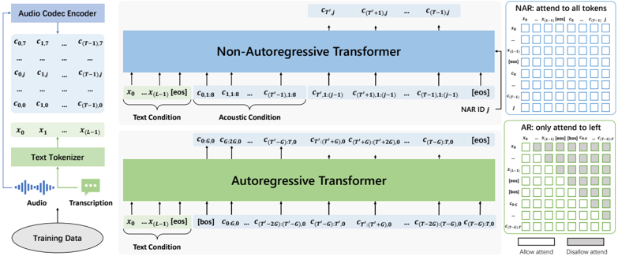

> [!abstract] arXiv · 2024 · Preprint
> **Chen et al.** (Microsoft) · [→ Paper](https://arxiv.org/abs/2406.05370) · Demo: ✓ · Code: ✗
>
> VALL-E 2 extends the VALL-E codec language model with Repetition Aware Sampling and Grouped Code Modeling to achieve what the authors characterise as human parity on zero-shot TTS benchmarks for the first time, surpassing ground-truth speech on WER and SMOS on both LibriSpeech and VCTK.

## Problem

VALL-E's autoregressive decoding had two persistent failure modes: instability under nucleus sampling (causing garbled or repetitive output) and the infinite loop issue where repeated tokens lock the decoder into an unrecoverable cycle. Its inference speed was also constrained by the full frame rate of the underlying codec, making it relatively slow. Prior stabilisation attempts (ELLA-V, RALL-E) required forced-alignment data, adding processing complexity and limiting scalability, while non-autoregressive alternatives traded naturalness for speed.

## Method

VALL-E 2 retains the two-stage hierarchical architecture of the original VALL-E: an autoregressive (AR) Transformer generates the first (coarse) codec code sequence, and a non-autoregressive (NAR) Transformer produces the remaining seven code sequences conditioned on the text, the acoustic prompt, and the AR output. EnCodec at 6kbps 24kHz is used for tokenisation and Vocos as the waveform decoder. The system is trained on Libriheavy (50k hours of labelled English audiobooks) using only utterance-level speech-transcription pairs, with no forced alignment or per-speaker auxiliary data.

Two key modifications differentiate VALL-E 2 from VALL-E. First, Grouped Code Modeling partitions the codec sequence into groups of size G (evaluated at G=1, 2, 4, 8) and treats each group as a single AR step. This reduces sequence length by a factor of G, cutting both inference latency and the context length that the Transformer must attend over, which the paper shows improves long-context modelling. Second, Repetition Aware Sampling replaces VALL-E's pure random sampling. At each AR step, nucleus sampling generates a candidate token; if the token's repetition ratio in a sliding window of size K=10 exceeds a threshold (t_r=0.1), it is replaced by a random draw from the full distribution. This adaptive switch prevents infinite loops while preserving the diversity benefits of nucleus sampling, and importantly adds negligible runtime cost.

## Key Results

On LibriSpeech test-clean with a reference utterance as prompt, VALL-E 2 (G=1) achieves SMOS of 4.61 vs. ground truth SMOS of 4.13, and CMOS of +0.033 relative to ground truth (Table 2). On the same dataset with a 3s prefix prompt, single-sampling WER reaches 1.6% against ground truth WER of 1.6%, matching it with no multiple-sampling overhead (Table 1). With G=2, the model preserves near-identical quality while reducing AR sequence length by half.

On the out-of-domain VCTK benchmark (108 speakers, diverse accents), VALL-E 2 with a 3s prompt yields SMOS of 4.42 vs. ground truth 4.47, and CMOS of +0.207, again meeting or exceeding ground truth across multiple prompt lengths (Table 5). VCTK WER drops roughly in half under single sampling compared to VALL-E. Ablations confirm that prompt input to both AR and NAR models is critical for speaker similarity (removing it collapses SIM by 50–80%), and that the NAR model's explicit acoustic condition splitting substantially improves speaker identity capture.

On inference efficiency, G=4 reduces sequence length by 4x with only modest quality degradation on LibriSpeech and essentially no degradation on VCTK WER; G=8 degrades more noticeably, indicating a practical ceiling for grouping.

## Novelty Assessment

The two core contributions (Repetition Aware Sampling and Grouped Code Modeling) are targeted engineering refinements to an existing autoregressive codec LM framework rather than paradigm changes. Repetition Aware Sampling is an adaptive heuristic over nucleus and random sampling, elegant and effective, but conceptually straightforward. Grouped Code Modeling is a well-known idea applied to codec sequences (token grouping appears in other sequence models), though the application to reduce codec frame rate while improving long-context modelling is a meaningful insight here. The real contribution of the paper is demonstrating, for the first time, that these modifications are sufficient to close the gap to human parity on LibriSpeech and VCTK by objective and subjective measures. That empirical milestone is significant even if the individual components are incremental.

## Field Significance

> [!tip]
> High — VALL-E 2 establishes a documented human-parity benchmark for zero-shot codec language model TTS on two widely-used test sets, providing a concrete performance ceiling for the autoregressive-codec paradigm. Its two decoding innovations directly address the stability and efficiency gaps that limited first-generation codec LMs, and the grouped code modelling approach offers a practical handle for trading off inference speed against quality.

## Claims

- Adaptive sampling that detects and breaks token repetition loops can stabilise autoregressive codec LM decoding without requiring forced-alignment auxiliary data. *(§3.4.1, Table 1)*
- Grouping codec codes into multi-token AR steps reduces effective sequence length and simultaneously improves long-context modelling quality at moderate group sizes. *(§3.1, §4.2.1, Table 1)*
- Autoregressive codec TTS can match or exceed ground-truth speech on robustness and speaker similarity metrics when evaluated on clean English audiobook benchmarks. *(§4.2.2, Table 2; §4.3.2, Table 5)*
- Prompt availability in both the AR and NAR stages is independently necessary for preserving speaker identity; removing either prompt degrades speaker similarity substantially. *(§4.2.3, Table 3; §4.3.3, Table 6)*
- Inference-time multiple sampling followed by metric-based selection can substantially close the single-sample robustness gap, but at proportional computational cost. *(§4.1.3, Table 1)*

## Limitations and Open Questions

> [!warning]
> Human parity is claimed solely from results on LibriSpeech test-clean and VCTK; both benchmarks are read speech from controlled or semi-controlled recording conditions. Generalisation to spontaneous, noisy, or low-resource speech is undemonstrated and the authors explicitly flag this caveat.

The model is English-only and trained on audiobook data (Libriheavy), leaving multilingual and conversational speech scenarios unexplored. No model size is reported, making it difficult to assess parameter efficiency against competing approaches. Code is not released, limiting reproducibility. The paper does not compare against contemporaneous diffusion or flow-matching zero-shot systems such as NaturalSpeech 3 or Voicebox on the same test sets, so cross-paradigm positioning is unclear. The stability benefit of Repetition Aware Sampling comes at the cost of a non-deterministic inference procedure, which may complicate deployment in latency-sensitive applications.

## Wiki Connections

**Concepts:** [[autoregressive-codec-tts]] · [[zero-shot-tts]] · [[neural-codec]] · [[speaker-adaptation]] · [[evaluation-metrics]]

**Related papers:** [[2301.02111]] (original VALL-E) · [[2403.03100]] (NaturalSpeech 3) · [[2402.08093]] (BASE TTS) · [[2401.07333]] (ELLA-V) · [[2404.03204]] (RALL-E) · [[2308.16692]] (SpeechTokenizer) · [[2303.03926]] (VALL-E X)

Cited by in-corpus papers: [[2505.17589]] (CosyVoice 3 cites VALL-E 2 as a key prior work in autoregressive TTS) · [[2411.00774]] (Freeze-Omni uses VALL-E 2 as a reference for codec LM design) · [[2502.06490]] (Discrete Speech Tokens Review reviews VALL-E 2's grouped token prediction as a key technique) · [[2412.15649]] (SLAM-Omni adopts grouped token prediction from VALL-E 2) · [[2505.07916]] (MiniMax-Speech cites VALL-E 2 as a baseline)

[[2407.08551]] — Autoregressive Speech Synthesis without Vector Quantization
