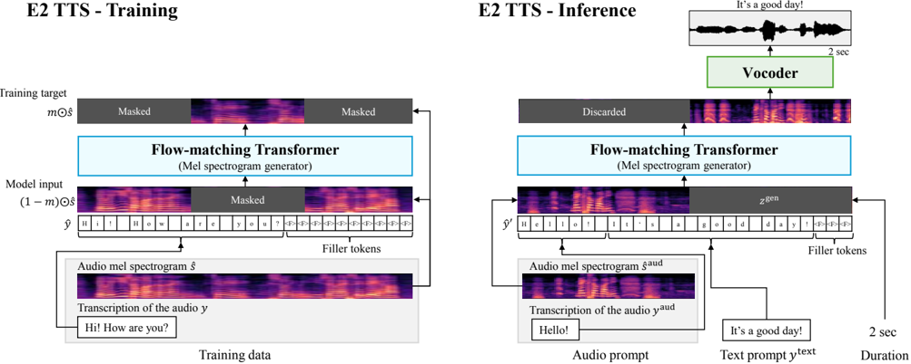

> [!abstract] arXiv · 2024 · Preprint
> **Eskimez et al.** (Microsoft) · [→ Paper](https://arxiv.org/abs/2406.18009) · Demo: ✓ · Code: ?
>
> E2 TTS achieves human-level naturalness and strong zero-shot speaker similarity with a flow-matching mel spectrogram generator conditioned on raw characters padded with filler tokens, eliminating duration models, grapheme-to-phoneme converters, and phoneme aligners entirely.

## Problem

Non-autoregressive zero-shot TTS systems face a structural challenge: the input text and the output audio operate at very different sequence lengths, requiring some mechanism to bridge the alignment gap. Prior approaches each imposed complexity to solve this: Voicebox and NaturalSpeech 3 relied on frame-wise phoneme aligners run offline; Matcha-TTS required monotonic alignment search plus an independent duration model; E3 TTS avoided these but demanded a specialized U-Net cross-attention design. Autoregressive approaches (VALL-E family) sidestep alignment but incur sequential latency, codec tokenizer sensitivity, and instability on long sequences. The question E2 TTS asks is whether the alignment problem can be dissolved rather than solved, by framing it as a joint learning problem.

## Method

E2 TTS consists of two modules: a flow-matching mel spectrogram generator and a BigVGAN-based vocoder. The key architectural idea is to convert the input character sequence into an extended sequence that matches the target mel-spectrogram length by appending filler tokens. During training, a random temporal mask covers 70--100% of the mel-spectrogram, and the model learns to recover the masked region conditioned on the unmasked audio context and the padded character sequence. This is a speech-infilling objective identical in spirit to Voicebox, with the critical substitution of frame-wise phoneme sequences for raw character sequences plus fillers.

The mel spectrogram generator is a vanilla Transformer with U-Net style skip connections, 24 layers, 16 attention heads, an embedding dimension of 1024, and 4096 feed-forward width, totalling 335M parameters. Mel features are 100-dimensional log mel-filterbanks extracted at 24 kHz with 10.7 ms frame shift. Conditional flow matching with an optimal transport path generates mel features from noise, using the midpoint ODE solver with 32 function evaluations at inference. Classifier-free guidance with strength 1.0 is applied. At inference, the audio prompt and its transcription are concatenated with the synthesis text and filler tokens; the masked region covering the synthesis span is generated conditioned on the unmasked prompt audio.

Two extensions are proposed. E2 TTS X1 removes the requirement for audio prompt transcription by training without it in the extended sequence, enabling prompt-only inference. E2 TTS X2 allows mixed character/phoneme inputs, where words can be replaced by phoneme sequences in parentheses at a 15% rate during training, allowing pronunciation overrides at inference without retraining.

## Key Results

On LibriSpeech-PC test-clean (1,132 samples, 39 speakers), E2 TTS trained on Libriheavy achieves WER 2.0% and speaker similarity (SIM-o) 0.675 from random initialization, improving to WER 1.9% and SIM-o 0.708 with unsupervised pretraining. Both outperform the authors' Voicebox reimplementation (WER 2.2%, SIM-o 0.667 on the same data), as well as VALL-E and NaturalSpeech 3. Training on 200,000 hours of proprietary data reaches WER 1.9% and SIM-o 0.707 from random initialization.

Subjective evaluation (12 native evaluators, 39 samples) gives E2 TTS with pretraining a CMOS of -0.05 relative to ground truth, a level conventionally taken as indistinguishable from human speech. Voicebox and NaturalSpeech 3 score -0.78 and -0.98 respectively. SMOS (speaker similarity) is comparable across systems: E2 TTS 4.65-4.66, Voicebox 4.73, NaturalSpeech 3 4.76. The CMOS comparison directly identifies phoneme alignment as the primary bottleneck to naturalness: replacing it with joint character-and-filler modeling closes the gap.

Training convergence analysis (Fig. 4) shows E2 TTS takes longer to converge than Voicebox (which benefits from explicit alignment supervision early in training) but surpasses it by end of training, consistent with the hypothesis that joint learning of duration and acoustic modeling yields a better end state.

## Novelty Assessment

The core contribution is a reframing of the alignment problem rather than a new architectural component. The Transformer backbone and flow-matching objective are taken directly from Voicebox. What is new is the substitution of frame-wise phoneme sequences with raw characters plus filler tokens, which moves duration modeling from an explicit pipeline step into implicit joint optimization. This is a conceptually clean and practically significant simplification, but the individual building blocks are established. The ablation structure (comparing Voicebox trained identically except for the input representation) makes the case clearly and the gains in naturalness are substantial. The extensions (X1 prompt-free transcription, X2 mixed phoneme/character inputs) are useful engineering additions that improve inference-time usability without changing the core method.

## Field Significance

> [!tip]
> High -- E2 TTS demonstrates that the traditional alignment pipeline in non-autoregressive TTS (G2P, phoneme aligner, duration model) is not just removable but actively harmful to naturalness. By showing that a flow-matching model can learn implicit duration and alignment from characters and filler tokens, it opens a simpler design path for zero-shot TTS that has been taken up by subsequent systems. The 55 in-corpus citations indicate substantial influence within the field.

## Claims

- Explicit phoneme alignment supervision in non-autoregressive TTS, while useful for early convergence, imposes a naturalness ceiling that joint character-level training can exceed. *(§3.4, Table 2)*
- Flow-matching mel spectrogram generators can learn alignment implicitly from raw characters and filler tokens, eliminating the need for grapheme-to-phoneme converters, phoneme aligners, and duration models. *(§2.1, §2.3)*
- Unsupervised pretraining on unlabeled speech improves downstream zero-shot TTS performance in both intelligibility and speaker similarity. *(§3.4, Table 1)*
- Zero-shot TTS speaker similarity scores at inference can exceed those of ground-truth recordings on standard speaker verification metrics, suggesting the metrics reward consistency within a generation rather than perceptual identity. *(§3.4, Table 2)*
- Non-autoregressive TTS systems trained jointly on duration and acoustics scale predictably with training data volume without requiring architectural changes. *(§3.4, Table 1)*

## Limitations and Open Questions

> [!warning]
> The CMOS evaluation covers only 39 samples from 39 LibriSpeech speakers read English. The naturalness finding ("indistinguishable from ground truth") is thus narrow in scope: spontaneous speech, non-native speakers, expressive or prosodically complex content, and cross-lingual settings are untested.

E2 TTS requires specifying a target duration at inference. A separate regression-based duration model (trained on Voicebox's approach) is used for fair baseline comparison, but this reintroduces a pipeline dependency. The paper does not propose a learned duration estimator integrated into the main model.

Inference requires the audio prompt length to be controlled carefully: the model must automatically identify the prompt/synthesis boundary from context, and very long prompts could confuse this. The analysis in §3.6.2 is reassuring for prompts up to 10 seconds but does not test extremes.

The X1 extension degrades SIM-o modestly (0.664 vs 0.675 without pretraining), indicating some speaker identity leaks through the audio prompt's transcription. Whether this matters in practice depends on the application.

## Wiki Connections

Concept pages: [[flow-matching]] · [[zero-shot-tts]] · [[speaker-adaptation]] · [[evaluation-metrics]] · [[subjective-evaluation]] · [[autoregressive-codec-tts]]

Related papers: [[2301.02111]] (VALL-E, autoregressive codec baseline) · [[2304.09116]] (NaturalSpeech 2, diffusion latent baseline) · [[2403.03100]] (NaturalSpeech 3, factorized diffusion baseline) · [[2404.03204]] (RALL-E) · [[2406.02430]] (Seed-TTS) · [[2310.00704]] (UniAudio)

[[2407.08551]] — Autoregressive Speech Synthesis without Vector Quantization
