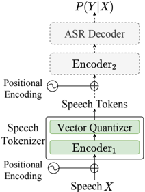

> [!abstract] arXiv · 2024 · Preprint
> **An et al.** (Alibaba Group) · [→ Paper](https://arxiv.org/abs/2407.04051) · Demo: ✓ · Code: ✓
>
> FunAudioLLM presents CosyVoice, a multilingual zero-shot TTS system built on supervised semantic speech tokens, flow matching, and an autoregressive language model, achieving near-human-level content consistency and speaker similarity across five languages.

## Problem

Prior neural codec TTS systems rely on unsupervised or self-supervised tokenizers (HuBERT, EnCodec, SoundStream), which produce tokens with weak semantic alignment. This forces the system to depend on very clean, meticulously curated training data and makes the synthesis process unstable under noisy conditions. At the same time, existing open-source multilingual TTS systems either lack true zero-shot speaker adaptation, do not support instruction-based style control, or are limited to one or two languages. The field lacked an open, production-grade multilingual TTS system that simultaneously handles zero-shot cloning, cross-lingual transfer, and fine-grained paralinguistic control.

## Method

CosyVoice, the TTS component of FunAudioLLM, is a three-stage pipeline. The first stage is a novel supervised semantic speech tokenizer (S3) built by inserting a vector quantizer after the first six layers of the SenseVoice-Large encoder (a 1.5B-parameter multilingual ASR model). Because SenseVoice-Large is trained with supervision on ASR labels, the resulting tokens carry strong semantic content; the single codebook has 4,096 entries and produces a 50Hz token sequence. Unlike unsupervised codec tokens, S3 tokens are robust to data noise, broadening the usable training data pool.

The second stage is an autoregressive Transformer language model conditioned on phoneme-level text that predicts S3 token sequences token-by-token, trained with teacher forcing. The third stage is a flow-matching model (ODE-based, using a convolutional Transformer U-Net) that reconstructs mel spectrograms from the generated tokens and a speaker embedding, followed by a HiFTNet vocoder. Classifier-free guidance with 70–100% condition masking strengthens in-context learning during flow-matching training.

Zero-shot voice cloning is achieved at inference by prepending the prompt speech's S3 tokens to the input sequence for the AR language model, effectively treating the reference as pre-generated context. For cross-lingual cloning, the prompt text and tokens are omitted from the input to prevent source-language prosody from leaking into target-language output. Instruction fine-tuning of a 300M base model produces CosyVoice-instruct, which accepts natural-language descriptions controlling speaker identity (character description), speaking style (emotion, gender, speaking rate, pitch), and fine-grained paralinguistics (laughter, breathing, word emphasis).

CosyVoice-sft-300M is fine-tuned on seven multilingual speakers for direct deployment. Training data totals approximately 170k hours across Chinese (130k hours), English (30k hours), Cantonese (5k hours), Japanese (4.6k hours), and Korean (2.2k hours), with pseudo labels generated by SenseVoice-Large and Paraformer.

The report also describes SenseVoice, an ASR/emotion/audio-event model, which serves as the foundation for S3 but is outside the core TTS scope.

## Key Results

On LibriTTS test-clean (English), CosyVoice achieves a WER of 2.89% and speaker similarity (SPK-SIM) of 74.30%, compared to 2.66% WER and 69.67% SPK-SIM for original (human) speech and 8.32% WER for ChatTTS. ASR re-ranking reduces WER further to 1.51% (Table 10). On AISHELL-3 (Mandarin), CosyVoice achieves 3.82% CER and 81.58% SPK-SIM, versus 2.52% CER / 74.15% SPK-SIM for original speech; re-ranking yields 1.84% CER (Table 11). Speaker similarity exceeds the original recordings on both benchmarks, indicating effective voice cloning.

Emotion controllability: with explicit style instructions, CosyVoice-instruct reaches 83–100% accuracy across four emotions (happy, angry, sad, disgusted) versus 1–59% for the base model without instruction (Table 12). Data synthesis experiments show that CosyVoice-generated speech can substitute or augment real Librispeech training data for ASR, with combined training reducing WER to 2.04% test-clean from 2.79% baseline (Table 13).

Comparisons are on standard open benchmarks; the ChatTTS comparison is limited to WER and CER (no speaker similarity, as ChatTTS does not release voice cloning) and both systems differ in training data scale and language coverage.

## Novelty Assessment

The primary architectural contribution is the S3 supervised semantic speech tokenizer, which replaces unsupervised codec tokenization with a quantizer grafted onto a supervised ASR encoder. This is a genuine design choice with measurable consequences: the paper argues it reduces the data-quality bar and stabilises synthesis, though direct ablations against pure codec baselines on naturalness (MOS) are not presented. The overall CosyVoice pipeline (AR-LM + flow matching + neural vocoder) is consistent with the VALL-E and Voicebox families, adapted to multilingual and instruction-conditioned use cases. The CosyVoice-instruct instruction-following capability is an engineering integration of instruction fine-tuning applied to TTS, with no novel training objective. The data synthesis application (§4.7) is presented as a by-product rather than a primary contribution. No MOS listening tests are reported; the evaluation relies entirely on ASR-based content metrics and automatic speaker similarity.

## Field Significance

> [!tip]
> High: CosyVoice establishes a viable open-source baseline for production-grade multilingual zero-shot TTS, and the S3 supervised semantic tokenizer introduces a meaningful alternative to unsupervised codec tokens as the foundation of autoregressive TTS pipelines. The paper demonstrates that supervised ASR representations can substitute for self-supervised codec tokens in token-based TTS while broadening usable training data, which is a practically useful design principle. The absence of MOS evaluation is a notable gap for field-level assessment.

## Claims

- Supervised speech tokenizers derived from ASR encoders provide stronger semantic alignment than unsupervised codec tokens, enabling stable synthesis on noisier training data. *(§2.3)*
- Zero-shot cross-lingual voice cloning requires omitting the source-language prompt tokens at inference to prevent prosody leakage across languages. *(§2.4.3)*
- Instruction fine-tuning on natural-language style descriptions substantially improves emotion controllability in TTS, achieving near-ceiling accuracy on multiple emotion categories where the base model fails. *(§4.6, Table 12)*
- TTS-generated speech can partially substitute for real recorded data in ASR training without degrading recognition accuracy on held-out test sets. *(§4.7, Table 13)*

## Limitations and Open Questions

> [!warning]
> No MOS or MUSHRA naturalness evaluation is reported. All generation quality is measured by ASR-based WER/CER and automatic speaker similarity. This makes it impossible to assess perceived naturalness or to compare directly with systems that do report MOS.

CosyVoice supports five languages; extension to lower-resource or unseen languages remains untested. The system cannot infer appropriate emotion or speaking style from text content alone — explicit instruction is required. Singing and highly expressive intonation are acknowledged as weak areas. The pipeline is not trained end-to-end with the LLM backbone, so error propagation between components is a known concern in the described applications. Streaming generation is supported via HiFTNet modifications but is not evaluated in this report.

## Wiki Connections

Architecture concepts: [[autoregressive-codec-tts]], [[zero-shot-tts]], [[multilingual-tts]], [[neural-codec]], [[instruction-conditioned-tts]], [[emotion-synthesis]]

Related in-corpus papers: [[2301.02111]] (VALL-E, neural codec language models for zero-shot TTS), [[2210.13438]] (EnCodec, neural audio codec), [[2303.03926]] (cross-lingual neural codec language modeling), [[2305.02765]] (HiFiCodec)
