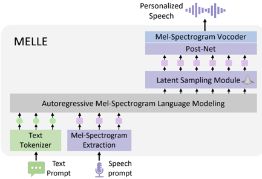

> [!abstract] arXiv · 2024 · Preprint
> **Meng et al.** (Microsoft) · [→ Paper](https://arxiv.org/abs/2407.08551) · Demo: ✓ · Code: ?
>
> MELLE replaces discrete codec codes with direct autoregressive prediction of continuous mel-spectrogram frames, achieving zero-shot TTS in a single stage with improved robustness and naturalness over VALL-E and its variants.

## Problem

Neural codec language models (VALL-E family) introduced an influential autoregressive TTS paradigm but carry three intertwined drawbacks. Vector-quantized codec codes sacrifice fidelity relative to continuous representations because they are designed for compression, not generation quality. The random top-p sampling over discrete tokens causes robustness failures, particularly for long sequences, manifesting as stretches of silence or persistent noise. Finally, the two-pass architecture (an autoregressive model for primary tokens followed by a non-autoregressive model for residual codes) adds inference complexity and storage overhead.

Prior attempts to improve robustness, such as ELLA-V and VALL-E R, introduced explicit monotonic alignment constraints that improved WER at the cost of substantial drops in speaker similarity. Other systems, such as CosyVoice and SEED-TTS, moved computation to continuous spaces in a second stage but retained two-stage pipelines.

## Method

MELLE frames TTS as autoregressive mel-spectrogram language modeling. A Transformer decoder takes the concatenation of BPE text tokens and mel-spectrogram frames as input and predicts the next mel-spectrogram frame (or a group of r frames, controlled by a reduction factor) at each step. Three modules sit on top of the language model's output at each step.

The Latent Sampling Module, inspired by variational autoencoders, predicts a Gaussian distribution (mean and log-variance) from the decoder output and samples a latent vector via reparameterization. This replaces the top-p discrete sampling of codec language models with a learned continuous sampling mechanism, providing output diversity without requiring manual sampling configuration. A stop prediction layer determines sequence termination, and a convolutional post-net refines the coarse spectrogram.

Training uses four losses jointly: L1/L2 regression on intermediate and final spectrogram predictions; KL divergence between the predicted Gaussian and a prior centered at the ground-truth frame (rather than the standard normal, which accelerates optimization); spectrogram flux loss, which penalizes low inter-frame variation in the predicted mean, discouraging silence and monotonicity; and binary cross-entropy for stop prediction. An off-the-shelf HiFi-GAN vocoder trained on LibriTTS converts the generated mel-spectrograms to waveforms. The main model is trained on 50K hours of Libriheavy; a smaller variant (MELLE-limited) uses 960-hour LibriSpeech.

The reduction factor r provides a throughput knob: r=2 halves AR steps and inference time with modest speaker similarity loss, while r=4 reduces inference time to one quarter of the baseline and still outperforms most VALL-E variants on WER.

## Key Results

On LibriSpeech test-clean zero-shot continuation, MELLE achieves 1.47% WER (Conformer-Transducer) against ground truth at 1.61%, representing a 47.9% relative WER reduction over VALL-E and 8.1% over VALL-E 2. Speaker similarity (WavLM-TDNN cosine) is 0.508, comparable to VALL-E 2 (0.504) and far above VALL-E (0.508 vs. ground truth 0.668) (Table 1). For cross-sentence inference, WER matches VALL-E 2 and objective SIM is marginally lower, a gap the authors attribute partly to speaker verification model bias: under ECAPA-TDNN, MELLE's SIM exceeds VALL-E 2 (0.680 vs. 0.662).

Subjective evaluation on 40 cross-sentence samples shows MELLE achieving MOS 4.20 vs. ground truth 4.29 (CMOS -0.032, not significantly different from ground truth at p>0.1). SMOS reaches 4.40, exceeding ground truth at 3.94, compared to VALL-E 2 at 3.88 (Table 3). Inference time for 10-second speech is 5.49s for standard MELLE, dropping to 2.76s at r=2 and 1.40s at r=4, compared to VALL-E/VALL-E 2 at 7.32s (Table 5).

Ablation confirms both the Latent Sampling Module and the spectrogram flux loss are essential: removing both degrades cross-sentence WER from 1.47% to 23.21%, with flux loss contributing most of the robustness gain (Table 4).

Subjective evaluation covers only 40 samples (one per speaker) from LibriSpeech test-clean. MELLE-limited was compared against VALL-E R rather than VALL-E 2 for the 960-hour condition, so direct comparisons are not fully controlled across training scales.

## Novelty Assessment

MELLE's core novelty is the demonstration that autoregressive speech synthesis can bypass vector quantization entirely, replacing discrete next-token prediction with direct continuous mel-spectrogram generation at human-parity quality. The idea that continuous autoregressive generation might outperform discrete codec approaches is non-trivial and was not established before this work. The specific technical innovations, namely the VAE-inspired Latent Sampling Module, the spectrogram flux loss, and the modified KL divergence prior anchored to the ground-truth frame rather than a standard normal, are each well-motivated and contribute measurably (per ablations). The architecture otherwise builds on the established Transformer decoder language model backbone from VALL-E, with standard components (post-net from Tacotron lineage, HiFi-GAN vocoder).

The paper is most strongly differentiated from the two-stage continuous alternatives (TorToiseTTS, CosyVoice, SEED-TTS) by its single-pass design. Against VALL-E 2, it achieves comparable or superior performance at similar training scale while eliminating the NAR pass and the residual codebook machinery.

## Field Significance

> [!tip]
> High — MELLE establishes that autoregressive mel-spectrogram language modeling, without any vector quantization, is a viable and competitive path for zero-shot TTS. By demonstrating parity with VALL-E 2 on objective metrics and superiority on subjective metrics in a simpler single-stage architecture, it challenges the assumption that discrete codec codes are necessary for autoregressive speech generation at scale. The paper opens a line of research into continuous-token autoregressive TTS that does not depend on codec design choices.

## Claims

- Continuous mel-spectrogram representations preserve more speaker-relevant acoustic information than vector-quantized codec codes at standard compression rates. *(§5.1, Table 1)*
- Autoregressive TTS models trained to predict continuous frames can achieve naturalness comparable to human speech while avoiding the silence and repetition failures endemic to discrete codec language models. *(§5.2, Table 3)*
- Variational sampling in the continuous latent space is more effective than top-p discrete sampling for improving output diversity and speaker similarity in autoregressive TTS. *(§5.3, Table 4)*
- A reduction factor that predicts multiple frames per autoregressive step can substantially reduce inference time with only modest degradation in speaker similarity. *(§5.4, Table 5)*

## Limitations and Open Questions

> [!warning]
> The subjective evaluation rests on only 40 samples from a single English corpus (LibriSpeech test-clean). The naturalness and speaker similarity advantages may not generalize to noisier prompts, non-native accents, or other languages.

The model's output quality is bounded by the HiFi-GAN vocoder, which was trained on only 585 hours of LibriTTS. Voicebox, which used a proprietary 60K-hour vocoder, showed higher SIM in part for this reason. Replacing or scaling the vocoder is identified as the most direct path to improvement.

The evaluation is English-only. Multilingual extension analogous to VALL-E X is deferred to future work. The paper also leaves open whether other continuous representations (VAE latent spaces, flow-based representations) would outperform mel-spectrograms as the target token. The model size is not reported, limiting cost comparisons with VALL-E 2 or Voicebox.

## Wiki Connections

Core method: [[autoregressive-codec-tts]], [[zero-shot-tts]], [[neural-codec]]

Speaker modeling: [[speaker-adaptation]]

Evaluation: [[evaluation-metrics]], [[subjective-evaluation]]

Related papers: [[2301.02111]] (VALL-E), [[2406.05370]] (VALL-E 2), [[2406.07855]] (VALL-E R), [[2401.07333]] (ELLA-V), [[2305.07243]] (TorToiseTTS), [[2305.09636]] (SoundStorm), [[2403.03100]] (NaturalSpeech 3), [[2406.02430]] (SEED-TTS), [[2407.05407]] (CosyVoice), [[2406.18009]] (E2 TTS), [[2402.08093]] (BASE TTS), [[2303.03926]] (VALL-E X)

[[2502.17239]] — Baichuan-Audio: A Unified Framework for End-to-End Speech Interaction
