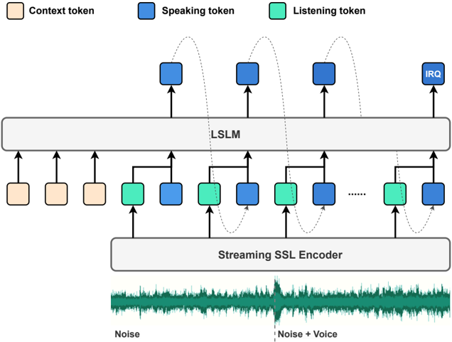
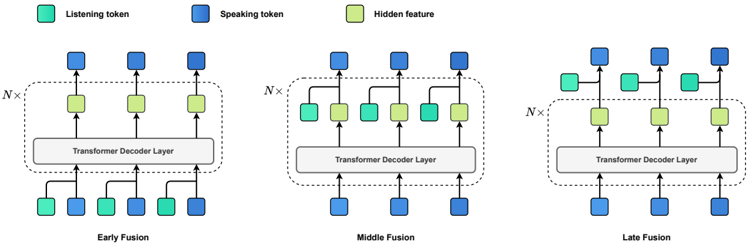

> [!abstract] arXiv · 2024 · Preprint
> **Ma et al.** (Shanghai Jiao Tong University / ByteDance) · [→ Paper](https://arxiv.org/abs/2408.02622) · Demo: ✓ · Code: ?
>
> Introduces LSLM, the first end-to-end speech language model capable of simultaneous listening and speaking, enabling real-time full-duplex interaction and turn-taking without external ASR or TTS modules.

## Problem

Existing speech language models (SLMs) are limited to half-duplex, turn-based conversation: they can either listen or speak, but not both at the same time. This prevents them from responding to interruptions or handling real-time user input during speech generation, a fundamental mismatch with natural human dialogue. Prior attempts at full-duplex interaction relied on text-centric LLMs augmented with cascade ASR and TTS modules, introducing perceivable latency and losing paralinguistic information. No publicly available model or systematic analysis of intrinsic full-duplex capability in end-to-end SLMs existed before this work.

## Method

LSLM (Listening-while-Speaking Language Model) is an end-to-end system with two parallel channels: a speaking channel and a listening channel. For speech generation, a decoder-only autoregressive Transformer (12 blocks, 12 attention heads, 768 dimensions, 106M parameters) models single-layer discrete audio tokens produced by a vq-wav2vec SSL encoder applied to the target speech. A GAN-based vocoder recovers the waveform from discrete tokens, conditioned on an acoustic prompt providing speaker timbre. This single-layer discrete token design avoids the VALL-E-style two-stage (AR+NAR) pipeline, enabling fully streaming, frame-synchronous generation.

For listening, the same vq-wav2vec encoder processes the incoming audio stream in a streaming fashion, producing continuous embeddings that are projected into the AR model's embedding space via a linear layer. At each autoregressive step, the model conditions its next-token prediction on both the speaking channel history and the real-time listening channel embeddings up to that point.

Turn-taking is handled via a special IRQ (interruption) token added to the vocabulary. During training, samples are constructed with a 50% probability of containing an interruption: when an interruption occurs, the model is trained to emit IRQ 0.5 seconds after the interruption onset. Three fusion strategies for combining the listening and speaking channels are explored: Early Fusion (at input embeddings), Middle Fusion (at every Transformer block's hidden state), and Late Fusion (at output logits before softmax).

Two evaluation scenarios are defined. Command-based FDM tests interruption by a specific keyword ("Honey") synthesized with 22 speakers; Voice-based FDM tests interruption by a diverse set of spoken words from unseen speakers using the Speech Commands Dataset. Background noise from the MUSAN Freesound subset is mixed into the listening channel to simulate realistic conditions.

## Key Results

For command-based FDM, middle fusion (LSLM-MF) achieves WER of 4.05% in clean conditions and 4.51% under noise, compared to the Vanilla TTS baseline at 4.28% (no listening channel). Early fusion degrades severely (WER 33.56%), likely because fusing at the input embedding level conflates speaking and listening signals. Interactive capability (F1) for LSLM-MF reaches 98.00% clean and 97.38% noisy; late fusion degrades to 94.89% under noise. Middle fusion is therefore the clear winner, preserving TTS quality while maintaining strong turn-taking accuracy.

Voice-based FDM is more challenging: WER rises to 5.33% clean and 8.50% noisy for LSLM-MF, and interactive F1 drops to 95.50% clean and 85.15% noisy. The higher error rates reflect the diversity of interruption commands and the speaker independence test condition. Ablation results show that fine-tuning both the TTS backbone and SSL encoder jointly (rather than freezing either) is essential for peak performance.

## Novelty Assessment

The core contribution is architectural: LSLM is the first published end-to-end model to demonstrate simultaneous speech generation and real-time audio input processing within a single autoregressive LM. The three fusion strategies (early, middle, late) constitute a systematic design comparison. Middle fusion, which injects listening embeddings at every Transformer block without collapsing speaking and listening at the input level, is a non-obvious design choice supported by clear experimental evidence.

The building blocks are established: vq-wav2vec for SSL-based streaming audio encoding, decoder-only autoregressive TTS, and GAN-based vocoders are all prior work. The novelty lies in the combination and the IRQ token mechanism for real-time turn-taking within a unified generation model. The scale is modest (106M parameters, LibriTTS training), and the evaluation uses WER and precision/recall rather than subjective listening tests, limiting comparison against full-pipeline dialogue systems on naturalness. The paper explicitly acknowledges this as an "initial exploration" and does not claim to have solved smooth human-computer interaction.

## Field Significance

> [!tip]
> High — LSLM provides the first systematic open analysis of full-duplex modeling in an end-to-end SLM, at a time when GPT-4o and Moshi were demonstrating full-duplex capability without published architectural details. By formalising the full-duplex modeling (FDM) task, introducing the fusion strategy taxonomy, and releasing a working system trained on public data, this paper enables follow-on research and gives the community a concrete baseline for real-time interruption handling in spoken conversational agents.

## Claims

- Full-duplex speech generation requires that the listening channel information be injected at intermediate representation layers, not at the input or output level, to avoid degrading speech generation quality. *(§6.2, Table 2)*
- A single-layer discrete token autoregressive TTS backbone can integrate real-time audio input streams with minimal WER degradation relative to a no-listening baseline in controlled conditions. *(§6.2, Table 2)*
- Robustness to noise and sensitivity to unseen speaker interruptions are distinct challenges in full-duplex SLMs, and voice-based generalisation introduces significantly higher error rates than command-based triggering. *(§6.2, Table 3)*
- Joint fine-tuning of both the speech generation backbone and the streaming SSL encoder is necessary for full-duplex models to reach peak interactive capability; freezing either component degrades turn-taking recall. *(§6.3, Table 4)*

## Limitations and Open Questions

> [!warning]
> The system produces speech tokens but not semantic speech responses: it stops speaking when interrupted but does not generate a contextually appropriate spoken reply. The paper evaluates TTS output and turn-taking accuracy, not full dialogue capability. The "full duplex" claim is therefore limited to interruption detection and cessation, not conversational back-and-forth.

Voice-based FDM shows a meaningful WER increase (5.33% vs 4.28% baseline in clean conditions, 8.50% under noise), suggesting real costs from the dual-channel architecture in harder generalisation settings. The evaluation relies entirely on automatic metrics (WER, precision/recall for turn-taking); no subjective MOS or naturalness assessment is reported, making quality comparisons to cascade systems difficult. The 106M parameter model trained on LibriTTS is modest in scale, and it is unclear whether the fusion findings generalise to larger LLM backbones. Speaker-following (identifying which interrupting speaker to respond to) and speech-in/speech-out dialogue generation with full-duplex capability are explicitly left as future work.

## Wiki Connections

- [[spoken-language-model]] — LSLM directly extends the speech language model paradigm from half-duplex to full-duplex, introducing real-time simultaneous listening and speaking within a single autoregressive model.
- [[streaming-tts]] — the single-layer discrete token design and streaming vq-wav2vec encoder are motivated by latency requirements, making LSLM a streaming-native architecture.
- [[autoregressive-codec-tts]] — the speaking channel uses a decoder-only autoregressive model over single-layer SSL-derived discrete tokens, a variant of the codec-based AR TTS paradigm.
- [[self-supervised-speech]] — vq-wav2vec is used as both the speech tokenizer for the speaking channel and the streaming audio encoder for the listening channel, making SSL representations a core structural component.
- [[speech-to-speech]] — LSLM addresses the speech-to-speech interaction problem at the system level, tackling real-time turn-taking as a prerequisite for natural spoken dialogue.
- [[2301.02111]] (VALL-E) — LSLM explicitly diverges from the VALL-E AR+NAR multi-RVQ design, choosing single-layer tokens to eliminate NAR latency for real-time interaction.
- [[2406.02430]] (Seed-TTS) — command-based FDM training uses speaker timbre from 22 Seed-TTS boutique speakers to synthesize interruption commands.
- [[2407.05407]] (CosyVoice) — an in-corpus contemporaneous zero-shot TTS system; cited as context for the broader SLM-based TTS landscape.
- [[2402.08093]] (BASE TTS) — cited as an example of large-scale decoder-only TTS; contextualises LSLM's focus on real-time interaction over scale.
- [[2302.13971]] (LLaMA) — cited as the paradigmatic GPT-style LLM backbone that prior half-duplex SLMs build on.
- [[2307.09288]] (LLaMA 2) — cited in the context of text LLM architectures motivating speech LM development.
- [[2311.07919]] (Qwen-Audio) — cited as a representative simplex SLM with strong understanding capability, contrasted with LSLM's full-duplex design.
- [[2407.10759]] (Qwen2-Audio) — cited as a contemporaneous multimodal audio LLM, situating LSLM within the broader audio-language model landscape.
