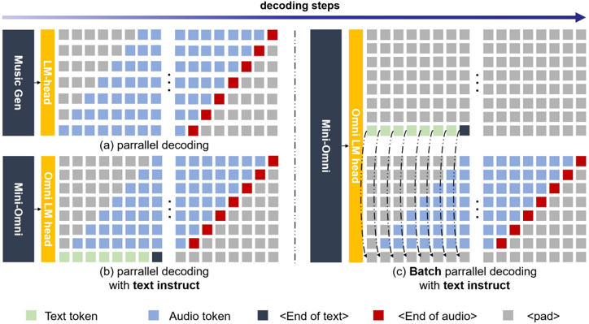

> [!abstract] arXiv · 2024 · Preprint
> **Xie et al.** (Inspirai / Tsinghua University) · [→ Paper](https://arxiv.org/abs/2408.16725) · Demo: ✓ · Code: ✓
>
> Mini-Omni introduces text-instructed parallel decoding, enabling a 0.5B language model to generate streaming speech and text simultaneously without waiting for text generation to complete, making it the first open-source end-to-end speech-to-speech conversational model.

## Problem

Existing approaches to speech-capable language models fall into two inadequate categories: cascade systems that pass text through a separate TTS model (high latency), and sequential audio-after-text systems like SpeechGPT that must finish generating text before beginning audio output (also high latency). Neither supports true real-time dialogue. Direct audio reasoning also proves empirically difficult, as models trained purely on audio tokens tend to produce incoherent outputs. GPT-4o demonstrated that genuine end-to-end streaming speech interaction is achievable, but remains closed-source, leaving no open academic baseline for the paradigm.

## Method

Mini-Omni builds on Qwen2-0.5B as its backbone language model and extends it with two lightweight adapters: a Whisper-small encoder adapter for speech input and a TTS adapter consisting of six additional transformer blocks for speech output. The audio codec is SNAC, a music-grade multi-codebook encoder with seven token layers that operates at hundreds of tokens per second. The high codebook depth makes flattened token sequences impractically long, so the model instead uses parallel decoding across all eight heads (one text head plus seven SNAC codebook heads) with a one-step delay between adjacent layers.

The core decoding innovation is text-instructed parallel generation: the model generates text and audio tokens simultaneously, with text tokens preceding audio tokens by N positions (N is a tunable hyperparameter). Because text has higher information density, it can act as an online conditioning signal for the co-generated audio. This avoids the latency penalty of sequential text-then-audio generation while retaining the reasoning structure of the text modality.

A second inference strategy, batch parallel decoding, addresses the observed gap between text and audio reasoning quality. Two samples are run in parallel per inference call: one producing both text and audio, the other producing text only. The text output of the text-only sample is substituted into the text positions of the audio sample, ensuring the audio is conditioned on the model's strongest text reasoning. Audio from the first sample is streamed using the content of the text-only response, with minimal additional resource overhead.

Training follows three sequential stages, called "Any Model Can Talk." Stage 1 (modality alignment) freezes the core LM and trains only the two adapters on ASR and TTS data. Stage 2 (adaptation training) freezes the adapters and trains the core LM on spoken QA with text-only responses. Stage 3 (multi-modal fine-tuning) unfreezes all weights and fine-tuning on full multimodal interaction data, including annealing on the newly introduced VoiceAssistant-400K dataset. Training uses eight A100 GPUs with a cosine annealing schedule.

VoiceAssistant-400K is a synthetic dataset of 400K entries generated by GPT-4o specifically for speech assistant fine-tuning, designed to avoid the code-heavy, overly long outputs common in open-source QA datasets that are ill-suited for speech synthesis.

## Key Results

ASR evaluation on LibriSpeech shows Mini-Omni achieves 4.5% WER on test-clean and 9.7% on test-other, which slightly trails Whisper-small (3.4% / 7.6%) but outperforms VITA (8.14% / 18.41%) on both partitions (Table 2). The paper does not report MOS or SPK-SIM scores for speech output quality, instead noting qualitatively that audio output quality is "on par with common TTS systems." No direct comparison to other SCA systems on speech naturalness is provided.

The batch parallel decoding strategy demonstrably closes the gap between text and audio reasoning quality, as shown through case studies in section 4.4. The paper acknowledges that audio responses are "somewhat weaker" than text responses without batch decoding, which motivates the design but is not quantified with automatic metrics.

## Novelty Assessment

The primary contribution is algorithmic: the text-instructed parallel decoding scheme is genuinely new, combining the parallel codebook generation idea from MusicGen with cross-modal text conditioning in a single inference pass. This solves a concrete problem (latency from sequential text-then-audio generation) without requiring architectural surgery on the base LM. The batch parallel decoding idea is creative and practically motivated, though it doubles inference compute at each step.

The "Any Model Can Talk" training recipe is an engineering integration: adapter-based modality alignment is well-established, and three-stage curriculum training follows patterns from prior multimodal LLM work. The SNAC codec selection and VoiceAssistant-400K dataset are supporting contributions. The 0.5B scale is notable in demonstrating that these capabilities do not require a large model, though the evaluation is limited (ASR only; no speech naturalness metrics).

## Field Significance

> [!tip]
> High — Mini-Omni is the first open-source demonstration that an end-to-end speech-to-speech conversational model can be built on a small (0.5B) pretrained LM without cascade architecture or sequential audio-after-text generation. The text-instructed parallel decoding approach provides a concrete, replicable method for transferring LM reasoning to the audio modality in real time, at a scale accessible to academic groups.

## Claims

- Simultaneous text and audio generation, conditioned on text tokens generated in parallel, enables streaming speech output without the latency penalty of sequential text-then-audio decoding. *(§3.2)*
- Audio reasoning quality in end-to-end speech LMs lags behind text reasoning quality when trained on similar data volumes, and batch inference strategies can partially bridge this gap. *(§3.2, §4.4)*
- A three-stage adapter-based training curriculum can integrate speech input and output into a frozen language model backbone with minimal degradation to text capabilities. *(§3.3)*
- Multi-codebook audio codecs with high token rates require parallel decoding schemes to maintain practical streaming throughput in autoregressive speech LMs. *(§3.1, §3.2)*

## Limitations and Open Questions

> [!warning]
> The paper reports no MOS or naturalness metrics for speech output, making it impossible to quantitatively compare audio quality against TTS or SCA baselines. The claim that quality is "on par with common TTS systems" is unsupported.

Evaluation is restricted to ASR performance on LibriSpeech; there is no evaluation of conversational quality, response coherence, or latency. The 0.5B model size limits reasoning depth, and the paper acknowledges that audio reasoning remains weaker than text reasoning. The VoiceAssistant-400K dataset is entirely synthesized by GPT-4o, which may introduce systematic biases in prosody and topic coverage. The model supports only English. The paper is described as a work-in-progress technical report, with some experiments deferred to a future version.

## Wiki Connections

Core methods: [[spoken-language-model]] · [[autoregressive-codec-tts]] · [[neural-codec]] · [[streaming-tts]] · [[speech-to-speech]]

Related work cited: [[2305.11000]] (SpeechGPT, earlier end-to-end speech LM) · [[2305.15255]] (Spectron, spectrogram-powered LLM) · [[2408.05211]] (VITA, voice-input multimodal LLM) · [[2407.10759]] (Qwen2-Audio) · [[2407.10671]] (Qwen2 base model)

Cited by in-corpus papers: [[2409.06666]] (LLaMA-Omni cites Mini-Omni as the primary prior work for simultaneous text-audio generation) · [[2411.00774]] (Freeze-Omni cites Mini-Omni as the predecessor for streaming speech LM design) · [[2410.17196]] (VoiceBench evaluates Mini-Omni as a representative end-to-end audio LLM)

[[2502.11946]] — Step-Audio: Unified Understanding and Generation in Intelligent Speech Interaction
[[2507.16632]] — Step-Audio 2 Technical Report
