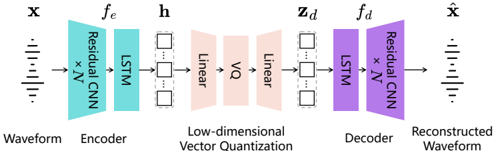

> [!abstract] arXiv · 2024 · Preprint
> **Detai Xin et al.** (University of Tokyo, Microsoft, Keio University) · [→ Paper](https://arxiv.org/abs/2409.05377) · Demo: ✓ · Code: ✓
>
> BigCodec demonstrates that scaling a neural speech codec to 159M parameters yields 1 kbps reconstruction quality that matches or exceeds codecs operating at 4-6x higher bitrates, with MUSHRA scores that surpass even the ground truth recording.

## Problem

Low-bitrate neural speech codecs (operating around 1 kbps) suffer a steep quality cliff: reconstruction fidelity, speaker similarity, and intelligibility all degrade markedly as bitrate approaches this regime. Prior low-bitrate work addressed this through architectural tricks (autoregressive prediction, non-deterministic encoding) or coding-method innovations, but no prior study had explored whether simply scaling model capacity could recover quality at constrained bitrates. Popular codecs at the time (EnCodec at 14M, DAC at 74M) were not specifically designed for the 1 kbps regime, and their low-bitrate operating points produced substantial perceptual degradation.

## Method

BigCodec adopts the standard VQ-VAE plus GAN framework, but makes three design choices that together push quality at 1 kbps. First, model scale: the encoder/decoder stack is expanded from a baseline of ~17M parameters (BigCodec-base) to 159M by increasing both the number of CNN blocks (from 4 to 5) and channel widths (starting at 48, reaching 1536 in the final encoder block). Second, temporal modeling: a two-layer unidirectional LSTM is inserted after the convolutional encoder to capture long-range dependency, improving on the local receptive field of dilated CNNs alone. Third, low-dimensional vector quantization: latent variables are projected into an 8-dimensional space before quantization against a single codebook of 8192 codes, avoiding the sparse high-dimensional quantization problem that leads to poor codebook utilisation.

Training uses MPD and MS-STFT discriminators (the multi-scale discriminator was found redundant), a multi-scale mel-spectrogram reconstruction loss (weighted at 15, reflecting direct perceptual relevance), and least-square GAN loss with feature matching. The total downsampling rate is 200, giving a theoretical bitrate of 1.04 kbps at 16 kHz. The model is trained on LibriSpeech 960h using 8 A100 GPUs for approximately 600k steps, with a scheduled learning rate declining from 1e-4 to 1e-5.

## Key Results

On the LibriSpeech test-clean set (2620 utterances), BigCodec achieves a MUSHRA score of 92.33 against ground truth at 91.84, outperforming all low-bitrate baselines by a large margin. Prior low-bitrate codecs peak at 74.67 (TF-Codec) and 67.90 (LLM-Codec). On objective metrics, BigCodec matches higher-bitrate codecs: PESQ-NB 3.27 vs. DAC-4k 3.19 and EnCodec-6k 3.18; STOI 0.93 vs. DAC-4k 0.94 and EnCodec-6k 0.94. Speaker similarity (SIM: 0.84) substantially exceeds all low-bitrate baselines, with TF-Codec at 0.73 and EnCodec-1.5k at 0.60.

On out-of-domain languages (MLS, 700 utterances across 7 languages), BigCodec generalises well despite being trained on English only, outperforming all low-bitrate baselines on every objective metric. Ablation studies confirm that the scale-up is the primary driver: BigCodec-base (17M) performs comparably to TF-Codec despite lacking its autoregressive machinery, but the full 159M model adds substantial SIM gains. Scaling beyond 159M (BigCodec-300M) and scaling training data to 60k hours (LibriLight) both yield no measurable improvement, indicating a capacity saturation point. The LSTM contributes independently of the parameter count increase it brings.

The inference RTF of BigCodec on CPU is 1.1x, just barely real-time, compared to 3.1x for BigCodec-base, reflecting the compute cost of the larger model.

## Novelty Assessment

The architectural choices in BigCodec (GAN framework, dilated CNN encoder/decoder, VQ-VAE quantisation, mel-spectrogram loss) are individually established. The contribution is applying the scale-up strategy from BigVGAN to the codec domain and pairing it with two specific design decisions: LSTM temporal modelling and low-dimensional VQ projection. These combinations, along with the empirical demonstration that 1 kbps quality can approach 4-6 kbps quality, constitute a genuine advance. The single-codebook design (versus RVQ used by EnCodec and DAC) is a deliberate simplification that works at this bitrate.

The paper is honest about limits: beyond 159M the returns plateau, and data scaling shows no benefit for codec training at this scale. The baseline comparisons are largely fair, using official checkpoints at comparable bitrates, though EnCodec is evaluated at 24 kHz then downsampled and training corpora differ substantially (BigCodec: 960h English; EnCodec: 17k hours multilingual).

## Field Significance

> [!tip]
> High — BigCodec establishes that model capacity is a critical underexplored axis for low-bitrate neural codec design, providing a practical 1 kbps codec that downstream TTS and speech LM systems can use without the severe quality penalties associated with constrained-bitrate operation. The result is significant because 1 kbps operation is the practical floor for bandwidth-constrained deployment, and prior codecs had not demonstrated that quality at this regime was recoverable through scaling alone.

## Claims

- At very low bitrates (around 1 kbps), model capacity is a decisive factor in reconstruction quality, with larger models substantially outperforming architecturally sophisticated but smaller codecs. *(§III-C, §IV-B, Table I)*
- Low-dimensional vector quantisation before codebook lookup substantially improves codebook utilisation in single-codebook, single-quantisation-step codec designs. *(§III-A, §IV-B)*
- Adding sequential (LSTM) modelling to a convolutional codec encoder improves both perceptual quality and speaker similarity at low bitrates, independently of the parameter count effect. *(§III-A, §IV-D, Table III)*
- Scaling codec model size beyond a saturation point (approximately 159M parameters in this setting) yields no further reconstruction benefit, analogous to scale-up behaviour observed in neural vocoders. *(§IV-D, Table III)*
- Increasing training data volume from 960 hours to 60k hours does not improve codec reconstruction quality, suggesting that model capacity rather than data quantity is the binding constraint at this bitrate. *(§IV-D, Table III)*

## Limitations and Open Questions

> [!warning]
> BigCodec is trained exclusively on clean English speech (LibriSpeech 960h), while competing codecs such as EnCodec and DAC train on diverse multilingual datasets including music and environmental sounds. The multilingual generalisation result is encouraging, but the clean-speech-only training domain limits applicability to noisy or music-heavy audio without fine-tuning.

The RTF of 1.1x on a high-end desktop CPU means BigCodec barely achieves real-time decoding; edge-device or streaming deployments would require hardware acceleration. The model's 159M parameter footprint is an order of magnitude larger than EnCodec (14M), imposing memory costs for downstream TTS systems that embed a codec. The paper does not report streaming latency or chunked-inference performance, which is relevant for spoken conversational agent use cases.

Whether the subjective superiority over ground truth reflects a genuine perceptual enhancement or a test artefact (e.g., listener anchoring, signal processing smoothing) remains unaddressed and warrants scepticism.

## Wiki Connections

BigCodec is a [[neural-codec]] built on GAN vocoder principles (see [[gan-vocoder]]), building on EnCodec ([[2210.13438]]) and drawing scale-up inspiration from BigVGAN ([[2206.04658]]). It is used as a codec backbone in several downstream TTS and [[autoregressive-codec-tts]] systems, including NaturalSpeech 3 ([[2403.03100]]). Its evaluation methodology spans both [[evaluation-metrics]] (PESQ, STOI, MCD, SIM) and [[subjective-evaluation]] (MUSHRA with 29 raters).

[[2507.16632]] — Step-Audio 2 Technical Report
