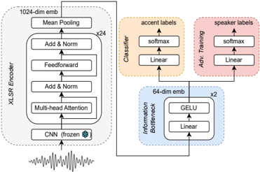
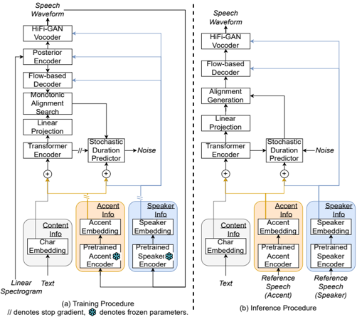

> [!abstract] arXiv · 2025 · Preprint
> **Zhong et al.** (University of Edinburgh) · [→ Paper](https://arxiv.org/abs/2409.09098) · Demo: ✓ · Code: ?
>
> AccentBox introduces zero-shot accent generation as a unified task combining foreign accent conversion, accented TTS, and zero-shot TTS, using a two-stage pipeline that extracts speaker-agnostic accent embeddings via an improved accent identification model and conditions a ZS-TTS system on those embeddings.

## Problem

Zero-shot TTS systems have improved substantially in naturalness and speaker similarity, but almost universally ignore accent variation. Most systems train on American English-dominant data without any accent conditioning, causing them to hallucinate a default accent rather than reproduce a target speaker's accent. Prior work fragmented accent-related speech generation across three separate tasks: Foreign Accent Conversion (FAC), which cannot generate arbitrary text or generalise to unseen accent pairs; accented TTS, which cannot handle unseen speakers or accents; and ZS-TTS, which lacks any accent control. A further barrier is speaker-accent entanglement in accent identification models, which tend to learn speaker identity as a proxy for accent rather than discriminating accent independently.

## Method

AccentBox addresses accent generation through a two-stage pipeline. In the first stage, a new accent identification model called GenAID (Generalisable Accent Identification Across Speakers) is trained to extract continuous, speaker-agnostic accent embeddings. GenAID is built on top of XLSR-large (a self-supervised cross-lingual speech model) and fine-tuned for accent classification on a reprocessed version of Common Voice 17.0. Five modifications over the CommonAccent baseline address speaker-accent entanglement: validation exclusively on unseen speakers during training to prevent the model memorising speaker-to-accent mappings; weighted sampling to handle class imbalance; speed and noise perturbation for robustness; an information bottleneck (two-layer MLP) that compresses XLSR embeddings to a lower-dimensional representation to remove redundant information; and adversarial training that penalises the model for retaining speaker identity, using an MSE loss between the predicted speaker distribution and a uniform distribution over all speakers.

In the second stage, AccentBox conditions a pretrained YourTTS (VITS-based) ZS-TTS on the frozen GenAID accent embeddings. YourTTS was chosen over LLM-based ZS-TTS systems for its lower data and compute requirements and stable generation. The GenAID embeddings replace the one-hot language embeddings in YourTTS and are injected into both the Transformer Text Encoder and the Stochastic Duration Predictor. This means accent is treated as a continuous conditioning signal rather than a discrete label. The TTS system is first pretrained on LibriTTS-R clean and then fine-tuned on VCTK for 200,000 steps.

At inference, three scenarios are explored: inherent accent generation (speaker and accent from the same reference), cross accent generation (speaker from one reference, accent from another), and unseen accent generation (accent not seen during fine-tuning). All inference uses unseen speakers, satisfying the zero-shot requirement.

## Key Results

For accent identification on unseen speakers, the full GenAID system (#6) achieves 0.56 F1 and 0.56 accuracy across 13 accents, compared to 0.40 F1 for the CommonAccent baseline (#1). The seen/unseen gap in accuracy drops from 0.53 to 0.06, and the Silhouette Coefficient for Speaker Clusters (SCSC) decreases from 0.236 to 0.079, confirming substantially reduced residual speaker information. The information bottleneck is identified as the single most effective modification.

For accent generation on VCTK (9 seen accents), AccentBox (Proposed) achieves higher accent cosine similarity than the Baseline and Accent_ID systems in both inherent and cross accent generation tasks, and also outperforms the open-source VALL-E X implementation on inherent accent generation (AccCos #6: 0.9336 vs. 0.9077 for VALL-E X, §IV.B, Table V). In subjective listening tests on American and Irish accents, AccentBox is preferred for accent similarity over the Baseline by 69.1% (American) and 61.3% (Irish), and over Accent_ID by 57.4%-65.7% across both accents (§IV.B, Tables VI-VII). For naturalness, results are mixed: the Proposed system is preferred for American accent generation but scores lower for Irish, where limited fine-tuning data and monotonic prosody in reference speech appear to cause degradation. Speaker similarity results are also mixed, with objective SpkCos slightly lower for AccentBox than baselines, likely reflecting a trade-off between accent fidelity and speaker identity preservation.

## Novelty Assessment

The unified task definition of zero-shot accent generation is a genuine conceptual contribution: no prior work had framed the problem as jointly satisfying any-text, any-speaker, and any-accent generation simultaneously. The technical approach is engineering integration of established components (XLSR fine-tuning, information bottleneck, adversarial speaker suppression, YourTTS conditioning) rather than new architectural primitives. Speaker-accent disentanglement in accent identification has been studied in related contexts (speaker anonymisation), and conditioning TTS on pre-trained representation embeddings is well-established. The paper's primary novelty lies in combining these elements for a new task, establishing a first benchmark, and demonstrating that continuous accent embeddings outperform discrete one-hot labels for cross-accent transfer. The evaluation is limited to two accents in listening tests (American and Irish) due to budget constraints, and the unseen accent generation scenario is demonstrated with audio samples only, without systematic metrics.

## Field Significance

Moderate — AccentBox identifies a concrete gap in zero-shot TTS systems (accent hallucination) that is largely invisible in standard speaker-similarity benchmarks, and provides the first benchmark unifying FAC, accented TTS, and ZS-TTS under a single task framing. The speaker-accent disentanglement approach for accent identification generalises beyond TTS and provides a reusable methodology for obtaining speaker-agnostic accent representations from self-supervised speech models. The evaluation scope is narrow and the TTS backbone (YourTTS) is already dated relative to flow-matching and LLM-based systems, but the task definition and benchmark provide a foundation for future work on accent-aware speech generation.

## Claims

- **supports:** Speaker-accent entanglement in accent identification models causes poor generalisation to unseen speakers and limits the utility of accent embeddings for conditioning TTS systems.
  > *Evidence:* The CommonAccent baseline achieves 0.96 accuracy on seen speakers but only 0.43 on unseen speakers (gap 0.53), and has a high SCSC of 0.236, indicating that it memorises speaker-to-accent mappings. GenAID with information bottleneck and adversarial training reduces the gap to 0.06 and SCSC to 0.079. *(§III.A, §IV.A, Table IV)*

- **supports:** Continuous accent embeddings extracted from a speaker-agnostic model provide stronger accent conditioning for zero-shot TTS than discrete one-hot accent labels.
  > *Evidence:* AccentBox conditioned on continuous GenAID embeddings achieves higher accent cosine similarity than the Accent_ID system using one-hot accent embeddings in both inherent and cross accent generation, and is preferred by listeners in subjective accent similarity tests. *(§IV.B, Tables V–VII)*

- **complicates:** Zero-shot accent generation introduces a trade-off between accent fidelity and naturalness that varies with accent data coverage.
  > *Evidence:* AccentBox shows higher naturalness preference for American accent (60.0% preferred over Baseline, p=0.011) but lower preference for Irish accent (33.9%), where limited training data and sensitivity to monotonic prosody in reference speech cause degradation. *(§IV.B, Table VI)*

- **complicates:** Objective speaker similarity metrics may not align with subjective listener perception when accent and speaker identity are jointly manipulated.
  > *Evidence:* For inherent accent generation, AccentBox achieves lower SpkCos (0.8293) than Baseline (0.8413) and VALL-E X (0.8605) in objective evaluation, yet listeners subjectively prefer AccentBox for speaker similarity (70.0%, p=0.002 for American accent), suggesting the speaker verification model is biased toward common accent patterns. *(§IV.B, Tables V–VI)*

- **refines:** Standard ZS-TTS evaluations based on naturalness and speaker similarity fail to detect accent hallucination, underrepresenting the accent fidelity gap between TTS systems trained predominantly on American English and target accented speakers.
  > *Evidence:* The paper demonstrates that current SOTA ZS-TTS systems (including VALL-E X) generate a default American-English accent regardless of the target speaker's accent, an artefact not captured by conventional MOS or speaker-similarity metrics. Accent cosine similarity and subjective accent preference tests are introduced as complementary metrics. *(§I, §III.B)*

## Limitations and Open Questions

> [!warning]
> Subjective listening tests are restricted to two accents (American and Irish) due to budget constraints; the cross-accent and unseen-accent generation results lack systematic subjective evaluation. The Irish accent results show degraded naturalness, indicating the system is sensitive to data volume and reference speech quality in ways that may not generalise across all 13 accents.

The TTS backbone (YourTTS, VITS-based) is several generations behind current LLM-based and flow-matching ZS-TTS systems. The authors chose YourTTS for stability and compute efficiency, but the quality ceiling limits competitiveness with current state-of-the-art naturalness. The paper does not evaluate WER, arguing that ASR models are biased against accented speech; this is a reasonable methodological choice but limits comparability with other work. Unseen accent generation is demonstrated only via audio samples on the demo page, with no quantitative evaluation.

## Wiki Connections

- [[zero-shot-tts|Zero-Shot TTS]] — AccentBox extends zero-shot TTS to include accent control as a first-class conditioning dimension, identifying a systematic accent hallucination failure mode in existing ZS-TTS systems.
- [[voice-conversion|Voice Conversion]] — the cross accent generation scenario in AccentBox is functionally a form of accent conversion, unifying FAC with TTS under a zero-shot framework.
- [[disentanglement|Disentanglement]] — GenAID explicitly disentangles speaker identity from accent in the learned embedding space using information bottleneck and adversarial training.
- [[self-supervised-speech|Self-Supervised Speech]] — GenAID builds on XLSR-large, a self-supervised cross-lingual speech model, as its acoustic encoder for accent classification and embedding extraction.
- [[evaluation-metrics|Evaluation Metrics]] — the paper introduces accent cosine similarity as a complement to standard speaker similarity and naturalness metrics, and argues against WER due to ASR model bias against accented speech.
- [[2301.02111]] (VALL-E) — used as an open-source ZS-TTS comparison system (via VALL-E X) in the accent generation evaluation; AccentBox outperforms it on accent cosine similarity.
