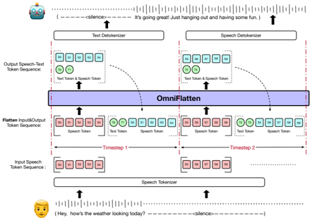

> [!abstract] arXiv · 2024 · Preprint
> **Zhang et al.** (Alibaba, Tongyi Lab) · [→ Paper](https://arxiv.org/abs/2410.17799) · Demo: ✓ · Code: ?
>
> OmniFlatten adapts a small text LLM into a full-duplex spoken dialogue system through a three-stage progressive post-training scheme that flattens interleaved speech and text token streams into a single sequence, enabling simultaneous listening and speaking without any architectural changes to the backbone model.

## Problem

Existing spoken dialogue systems are predominantly turn-based: the model listens, then speaks, then listens again. This half-duplex design fails to handle the concurrent bidirectional communication that characterises natural human conversation, including interruptions, backchannels, and overlapping speech. End-to-end full-duplex systems capable of listening and speaking simultaneously remained a largely unsolved challenge, with prior work either relying on parallel multi-stream architectures that require purpose-built model designs (Moshi), or simplifying the problem in ways that degraded speech quality (SyncLM's deduplication approach).

## Method

OmniFlatten builds on Qwen2-0.5B as a backbone text LLM and extends it to full-duplex speech conversation through three progressive post-training stages, without modifying the backbone architecture. Speech is tokenised using the CosyVoice semantic tokenizer, which encodes audio into discrete tokens via an encoder and a single-codebook VQ layer (4096 codes). Detokenisation uses an OT-CFM (Optimal-transport Conditional Flow Matching) model followed by a HiFi-GAN vocoder.

The key training concept is a "flattening" operation: speech and text token streams from both user and assistant are segmented into fixed-size chunks and concatenated into a single autoregressive sequence. This allows a standard GPT-style model to handle multi-stream dialogue without any parallel decoding machinery.

**Stage 1 — Modality Alignment:** The text LLM is fine-tuned on paired ASR and TTS data (~100K hours, 70% proprietary) using task-ID prefix tokens, acquiring basic speech understanding and generation capabilities.

**Stage 2 — Half-duplex Dialogue Learning:** Four streams (user speech, user text, assistant text, assistant speech) from turn-based dialogues are flattened into a single sequence. The model learns to perform the ASR-then-respond-then-TTS pattern across multi-turn dialogues.

**Stage 3 — Full-duplex Dialogue Learning:** User speech arrives in fixed chunks (10 tokens each) while the model outputs assistant text (2 tokens per chunk) and speech interleaved. This stage is split into two sub-stages: first training on three streams (removing user text), then on two streams (removing assistant text as well), progressively eliminating dependence on intermediate text to push toward low-latency speech-to-speech generation.

Training data for dialogue learning is synthesised: 390K sessions of text dialogue are converted to speech via CosyVoice, then placed in a simulated timeline that includes immediate responses, user interruptions, and silent waiting periods, with background noise added at 15-30 dB SNR from the MUSAN corpus. This yields 2,000 hours of multi-channel spoken dialogue data.

## Key Results

For modality alignment capability, OmniFlatten achieves 7.91% WER on LibriSpeech test-clean and 19.21% on test-other, competitive with VITA (8.14%/18.4%) though well below Whisper-Large (1.82%/3.5%). On TTS intelligibility, it scores 4.51% WER on LibriTTS and 4.46% CER on AIShell-3, behind CosyVoice (2.89%/3.82%) but functional for dialogue use.

For full-duplex conversation quality, evaluated by LLM scoring (QWen-max, 1-10 scale): the full three-stream model (OmniFlatten 3-stream full process) achieves 4.88 (English text) and 5.6 (Chinese text), compared to LLaMA-Omni 8B at 6.01/4.17 and Moshi 7B at 3.92/- (English only). The 2-stream model (speech-only output) drops significantly to 2.19/3.06, indicating that eliminating intermediate text harms semantic coherence.

Turn-taking performance against Moshi (Table 4): OmniFlatten achieves 20.6% assistant turn-taking accuracy at the 1st token vs. Moshi's 2.9%, and a mean response time of 193 ms vs. Moshi's 553 ms. User turn-taking (interruption handling) accuracy at 25 tokens is 51.8% vs. Moshi's 45.7%, though neither system achieves high success rates in this harder scenario.

Ablations confirm each training stage contributes cumulatively: omitting modality alignment and half-duplex stages both hurt final full-duplex scores.

## Novelty Assessment

The core contribution is the flattening scheme: a generic method to represent interleaved multi-stream dialogue data as a single autoregressive sequence, making full-duplex dialogue trainable on any standard GPT backbone without architectural modification. This is a genuine methodological simplification compared to Moshi's parallel-stream design, though the conceptual distance from prior interleaved sequence representations (e.g., SyncLM's chunking) is modest. The multi-stage curriculum (modality alignment → half-duplex → full-duplex) is a practical training recipe that any practitioner could reproduce. The data synthesis pipeline for simulated full-duplex dialogue is a meaningful engineering contribution in the absence of real full-duplex conversational data. Overall, the paper occupies the middle ground between an architectural proposal and an engineering integration: the flattening idea is novel in the full-duplex context, but the individual building blocks (CosyVoice tokenizer, Qwen2 backbone, OT-CFM vocoder, supervised fine-tuning) are all borrowed from prior work.

## Field Significance

Moderate — OmniFlatten demonstrates that full-duplex spoken dialogue can be approached through sequence-level data engineering rather than model-level architectural changes, offering a simpler training path than parallel-stream systems like Moshi. At 0.5B parameters trained largely on simulated data, the absolute dialogue quality is modest compared to larger models, but the method's simplicity makes it accessible and replicable. It provides a useful data point on the trade-off between full speech-to-speech generation (lower latency, weaker semantics) and text-assisted generation (higher latency, stronger semantics) in the two-stream vs. three-stream comparison.

## Claims

- Full-duplex spoken dialogue can be achieved by flattening interleaved speech and text token streams into a single autoregressive sequence, without modifying the backbone LLM architecture. *(§3, §3.3.2)*
- Progressive curriculum training (modality alignment followed by half-duplex, then full-duplex) improves final full-duplex dialogue quality compared to training directly on full-duplex data. *(§4.3, Table 3)*
- Eliminating intermediate text output from dialogue models substantially reduces response latency but causes a significant drop in semantic coherence, indicating a fundamental trade-off between speed and content quality in speech-to-speech generation. *(§3.3.2, §4.3, Table 3)*
- Turn-taking response latency in full-duplex speech models can be reduced by chunked interleaved sequence training, with practical response times under 200 ms achievable at 0.5B parameter scale. *(§4.3, Table 4)*

## Limitations and Open Questions

> [!warning]
> The 0.5B backbone is substantially smaller than comparators (LLaMA-Omni 8B, GLM-Voice 9B, Moshi 7B), making LLM-score comparisons in Table 3 not directly attributable to the method alone. The paper acknowledges GLM-Voice results may reflect test-set leakage. Dialogue quality scores remain well below the ground-truth ceiling.

Training data is entirely synthesised from text dialogues via a TTS pipeline; real conversational dynamics (natural prosody, disfluencies, real interruption patterns) are not represented. The model does not handle backchannels from either speaker, a basic feature of natural human conversation. User turn-taking accuracy at 25 tokens remains below 55% for both models evaluated, leaving interruption handling far from reliable. The paper does not report naturalness MOS, making direct quality comparison to TTS-oriented systems difficult. All evaluation uses simulated test data matching the training distribution, raising questions about real-world robustness.

## Wiki Connections

- [[spoken-language-model]] — full-duplex spoken conversational agent; extends a text LLM to simultaneous listen-and-speak
- [[speech-to-speech]] — end-to-end speech input to speech output without a hard text bottleneck in the two-stream mode
- [[streaming-tts]] — assistant speech generated in interleaved chunks alongside user audio input
- [[autoregressive-codec-tts]] — CosyVoice semantic tokens generated autoregressively in the flattened sequence
- [[neural-codec]] — CosyVoice semantic tokenizer (4096-code single codebook) encodes both user and assistant speech
- [[2407.05407]] (CosyVoice) — speech tokenizer and OT-CFM + HiFi-GAN vocoder used throughout
- [[2409.06666]] (LLaMA-Omni) — primary comparison baseline for dialogue quality at comparable scale
- [[2408.02622]] (LSLM) — concurrent full-duplex work; contrasted on architectural approach
- [[2412.02612]] (GLM-4-Voice) — larger SDM comparison baseline
- [[2408.16725]] (Mini-Omni) and [[2410.11190]] (Mini-Omni2) — concurrent small-scale SDM baselines
- [[2305.11000]] (SpeechGPT) — early speech-in speech-out LLM; contextualises the SpeechLM lineage
- [[2407.04051]] (FunAudioLLM) — related Tongyi Lab work on speech-text alignment
