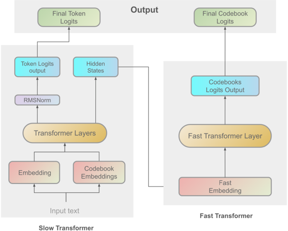
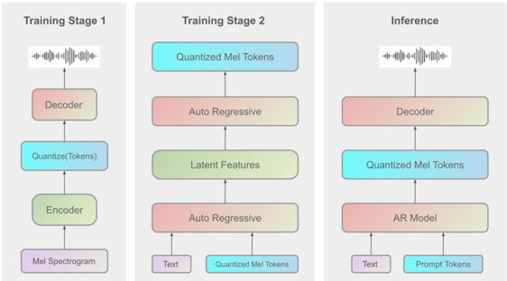

> [!abstract] arXiv · 2024 · Preprint
> **Liao et al.** (Fish Audio) · [→ Paper](https://arxiv.org/abs/2411.01156) · Demo: ✓ · Code: ✓
>
> Fish-Speech proposes a serial fast-slow Dual Autoregressive (Dual-AR) architecture combined with a novel GAN vocoder (Firefly-GAN) using Grouped Finite Scalar Vector Quantization (GFSQ), enabling stable multilingual zero-shot voice cloning without grapheme-to-phoneme conversion.

## Problem

Most TTS systems depend on grapheme-to-phoneme (G2P) conversion to bridge text and phonetic representations. This coupling creates fragility for context-dependent polyphonic words and substantially complicates cross-lingual generalisation, since each language requires its own phonetic rules and lexicon. Separately, codec-based autoregressive TTS pipelines often suffer from codebook collapse or low utilisation when residual vector quantization is applied naively, limiting the expressiveness of the discrete acoustic representations and reducing generation stability. Fish-Speech targets both problems simultaneously.

## Method

Fish-Speech is a two-component framework. The first component is the Dual Autoregressive (Dual-AR) language model, which replaces G2P preprocessing by leveraging an LLM backbone for direct linguistic feature extraction from raw text. The Dual-AR consists of a Slow Transformer and a Fast Transformer operating in serial. The Slow Transformer processes the full input token sequence and generates intermediate hidden states encoding global linguistic and semantic structure; it also predicts semantic tokens. The Fast Transformer then takes the concatenated hidden states and codebook embeddings as input, refining the Slow Transformer's output to produce fine-grained acoustic codebook predictions. This hierarchical decomposition is intended to improve the stability of the GFSQ codebook during autoregressive generation, which the authors report as a persistent challenge in token-based TTS when codebook dimensions are large.

The second component is Firefly-GAN (FF-GAN), a vocoder that decodes GFSQ tokens back to waveform. FF-GAN extends EVA-GAN's architecture by replacing the Multi-Receptive Field (MRF) module of HiFi-GAN with a ParallelBlock using depth-wise separable convolutions and dilated convolutions. The quantization scheme, GFSQ (Grouped Finite Scalar Vector Quantization), combines Finite Scalar Quantization (FSQ) with Group Vector Quantization (GVQ), partitioning the feature space into groups and applying scalar quantization per group. The authors report 100% codebook utilisation with this scheme, which they attribute to FSQ's bounded scalar structure eliminating the dead-code problem common in RVQ.

Training uses 720,000 hours of multilingual audio spanning English, Mandarin, German, French, Italian, Japanese, Korean, and Arabic, balanced across languages. The training pipeline has three stages: large-batch pre-training, supervised fine-tuning on higher-quality data with smaller batches, and DPO training on manually labelled positive and negative pairs. Inference uses KV caching, torch compile, and other optimisations, achieving a first-packet latency of 150ms and a real-time factor of approximately 1:5 on an RTX 4060 mobile GPU and 1:15 on an RTX 4090.

## Key Results

Evaluation is conducted on a proprietary voice cloning test set comparing Fish-Speech against CosyVoice, F5-TTS, and a commercial system (reecho). On WER (intelligibility), Fish-Speech achieves 6.89%, lower than ground truth (9.22%), and substantially below F5-TTS (13.98%) and CosyVoice (22.2%) (§6.1, Table 1). On speaker similarity using Resemblyzer, Fish-Speech scores 0.914 versus a ground truth of 0.921, with CosyVoice slightly ahead at 0.936 and F5-TTS at 0.905 (§6.2, Table 2). On MOS, Fish-Speech scores 4.05 versus 3.8 for CosyVoice and 2.9 for F5-TTS (§6.3, Table 3).

All comparisons are on a proprietary test set with undisclosed composition; no standard public benchmark is used. The MOS pool uses "naive listeners" rather than trained raters, which may inflate scores. CosyVoice's higher Resemblyzer score (0.936 vs 0.914) is not discussed by the authors.

## Novelty Assessment

The Dual-AR architecture is a genuine structural contribution: the serial fast-slow decomposition into a Slow Transformer (semantic tokens) and a Fast Transformer (acoustic codebook tokens) addresses a real instability problem in grouped quantization during autoregressive generation. The GFSQ quantizer combining FSQ and GVQ to eliminate codebook collapse is also non-trivial, though FSQ itself was introduced by Mentzer et al. (2023) and the grouping idea is derived from GVQ. The Firefly-GAN vocoder is an incremental extension of EVA-GAN and HiFi-GAN, substituting the MRF module with a ParallelBlock — a meaningful but not paradigm-shifting modification.

Overall the contribution is a mix of genuine architectural novelty (Dual-AR, GFSQ) and engineering integration (training scale, multilingual data curation, inference optimisation). The evaluation is limited to proprietary data, which makes it difficult to position the results relative to the broader literature using standard benchmarks. The paper reads as a technical report from an active open-source project (fish.audio) rather than a fully rigorous academic study.

## Field Significance

Moderate — Fish-Speech introduces the Dual-AR fast-slow decomposition as a practical solution to codebook instability in grouped scalar quantization, filling a gap left by standard RVQ-based systems in stable multilingual generation. Its open-source release and reported real-time inference at consumer GPU scale give it practical reach beyond the academic paper itself, though the proprietary evaluation limits direct comparison with the wider field.

## Claims

- Eliminating grapheme-to-phoneme conversion by directly feeding raw text to an LLM backbone is viable for multilingual TTS and can improve handling of context-dependent polyphonic words. *(§1, §3)*
- Hierarchical decomposition of autoregressive token generation into semantic-level and acoustic-level stages improves codebook stability in grouped scalar quantization. *(§3.1, §3.1.1)*
- Grouped Finite Scalar Vector Quantization achieves higher codebook utilisation than residual vector quantization alternatives, mitigating dead-code collapse. *(§3.2.2, §3.2.3)*
- Real-time TTS inference with low first-packet latency is achievable on consumer GPU hardware through standard inference optimisations without architectural compromise. *(§4.2)*

## Limitations and Open Questions

> [!warning]
> The entire experimental evaluation is conducted on a proprietary test set with undisclosed composition and size. No public benchmark is used, making it impossible to independently verify the claimed superiority over CosyVoice and F5-TTS or to compare against the broader literature.

The MOS evaluation uses "naive listeners" rather than trained raters or crowdsourced panels following standard listening test protocols (e.g. ITU-T P.800), which may inflate scores relative to conventional evaluations. The paper does not report model size, training compute, or inference memory requirements in full, limiting reproducibility. DPO training details are omitted from the main training description. The paper does not evaluate cross-lingual transfer or accent preservation, which are claimed motivations for the non-G2P design. It is also unclear how the system handles low-resource languages beyond the eight listed in the training data.

## Wiki Connections

- [[autoregressive-codec-tts]] — Dual-AR is a variant of codec-based autoregressive TTS, building on the token-prediction paradigm established by [[2301.02111]] (VALL-E)
- [[neural-codec]] — GFSQ is a custom quantization scheme replacing RVQ; relates to [[2210.13438]] (EnCodec) and [[2309.15505]] (FSQ)
- [[zero-shot-tts]] — voice cloning from a short reference clip without speaker-specific fine-tuning
- [[multilingual-tts]] — trained on 720k hours across 8 languages without language-specific phoneme systems
- [[gan-vocoder]] — Firefly-GAN extends the HiFi-GAN vocoder family
- [[2407.05407]] (CosyVoice) — primary baseline and competing multilingual zero-shot system
- [[2305.07243]] (Betker, TorToise) — non-G2P LLM-based synthesis approach cited as inspiration
- [[2406.04904]] (XTTS) — competing multilingual zero-shot system
- [[2502.06490]] (Discrete Speech Tokens Review) — reviews Fish-Speech's GFSQ tokenization as an example of hybrid discrete token design
- [[2502.05512]] (IndexTTS) — cites Fish-Speech as a competing industrial multilingual zero-shot TTS system
