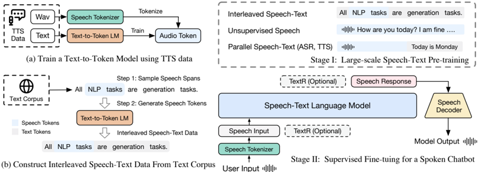

> [!abstract] arXiv · 2024 · Preprint
> **Zeng et al.** (Tsinghua University / Zhipu.AI) · [→ Paper](https://arxiv.org/abs/2411.17607) · Demo: ? · Code: ?
>
> Proposes a scalable method to train speech language models on 1 trillion tokens by synthesising speech-text interleaved data directly from text corpora, bypassing the need for parallel speech-text datasets and achieving state-of-the-art spoken question answering performance.

## Problem

Speech language models have lagged behind text LLMs primarily because of data scarcity. While text corpora run to tens of trillions of tokens, large unsupervised speech datasets offer at most tens of billions of tokens at typical frame rates. Methods that rely on parallel speech-text corpora (such as Spirit-LM) face a fundamental scaling ceiling because aligned data is orders of magnitude harder to obtain than raw text. The resulting models are unable to transfer the knowledge stored in pre-trained LLMs into the speech domain effectively, particularly for factual question answering in speech-only settings.

## Method

The paper introduces a three-component system: a supervised speech tokenizer, a text-to-token model that generates synthetic interleaved data, and a two-stage training pipeline built on top of a pre-trained LLM.

The speech tokenizer is derived from Whisper-large-v3 by inserting a 1D average pooling layer and a vector quantization (VQ) bottleneck into the encoder. Training uses ASR supervision rather than waveform reconstruction, yielding discrete tokens with strong semantic preservation even at low frame rates. A single codebook of size 16,384 at 12.5 Hz is chosen as the best trade-off between semantic retention (WER 8.43 on LibriSpeech) and pre-training efficiency. For streaming inference, bidirectional attention is replaced with block-causal attention operating on 2-second segments. A flow-matching decoder (following CosyVoice's architecture) converts discrete tokens back to Mel spectrograms, which HiFi-GAN then renders to waveforms.

To generate 600B tokens of synthetic interleaved data without requiring any parallel speech-text corpus, a 1.5B text-to-token model is trained on TTS datasets to predict speech token sequences from text. At data construction time, random text spans are sampled from FineWeb-Edu and Chinese-FineWeb-Edu using a span corruption ratio of 0.3 (selected via ablation), and each span is converted to speech tokens by this text-to-token model. The resulting sequences interleave text and speech tokens at the word level, encouraging the downstream LLM to learn cross-modal alignment.

Pre-training (Stage 1) uses GLM-4-9B-Base extended with a speech vocabulary, trained on 1T tokens: 30% text, one epoch each of unsupervised speech (700k hours via Emilia) and supervised ASR/TTS data, and the remaining 600B synthetic interleaved tokens. Fine-tuning (Stage 2) uses SpeechDialog-90K, a dataset derived from Magpie by GPT-4 adaptation for speech, yielding 90K speech instruction/response triplets. Inference supports both direct speech-to-speech mode and a text-guided mode where the model generates an intermediate text response before the speech output.

## Key Results

On pre-training benchmarks (Table 3), the 9B model outperforms all baselines on speech language modelling tasks, matching Spirit-LM and Moshi on Spoken TopicStoryCloze (S setting: 82.9) while substantially exceeding them on cross-modal settings (T→S: 85.0, S→T: 93.6). On spoken question answering, gains are dramatic: on Llama Questions (S setting), the model reaches 50.7 versus Moshi's 21.0 and Spirit-LM's unreported prior performance, effectively more than doubling Moshi's best score. TriviaQA (S) reaches 26.5 versus Moshi's 7.3. Importantly, these results are achieved with approximately one-tenth of Moshi's natural speech data (700k hours vs. 7 million hours).

For the spoken chatbot evaluation (Table 4), the text-guided 9B model scores 3.69 on general QA and 4.7 on knowledge tasks (GPT-4 scored on 1-10 scale), outperforming LlamaOmni (3.5, 3.9) and Moshi (2.42, 3.6). UTMOS for speech quality reaches 4.33, the highest among all evaluated systems, and ASR-WER of 7.83 indicates high intelligibility. Even in direct speech-to-speech mode (without text guidance), the model (scores 3.18 / 3.2) still performs comparably to text-guided baselines from prior work.

Ablation (Table 5) shows that removing interleaved data causes near-total collapse on spoken QA (Llama Q. S: 50.7 drops to 2.3), while scaling from 100B to 600B interleaved tokens yields consistent gains, particularly on factual question answering.

## Novelty Assessment

The paper's primary novelty is the synthetic interleaved data construction pipeline. The key insight, converting text spans to speech tokens via a learned text-to-token model rather than full TTS synthesis, is both computationally efficient and removes the bottleneck of parallel corpus availability. The supervised VQ-Whisper tokenizer builds directly on CosyVoice's approach but extends it with streaming-capable block-causal attention, which is an engineering contribution rather than a conceptual leap.

The scale achieved (1T pre-training tokens, 600B synthetic) is genuinely differentiated from prior work and the ablation evidence for interleaved data necessity is strong and clearly presented. The SpeechDialog-90K fine-tuning data synthesis method (GPT-4 adapted Magpie dialogues) is a practical but unremarkable engineering choice. The claim of reaching 31% on spoken question answering (vs. Moshi's 13%) refers to aggregate accuracy across the three QA datasets in the speech-to-speech setting, and the comparison appears fair (same evaluation protocol). The model has no code or demo release as of the submission date, which limits reproducibility.

## Field Significance

> [!tip]
> High — this paper demonstrates that the data scarcity problem constraining speech language models can be substantially mitigated through synthetic interleaved data generated from text corpora, with no requirement for parallel speech-text alignment. The approach enables speech LM pre-training at a scale previously achievable only with massive proprietary speech datasets like Moshi's 7-million-hour collection, making frontier spoken language modelling more accessible and providing a scalable recipe that subsequent work can build on.

## Claims

- Synthetic speech-text interleaved data, generated by converting text spans to speech tokens using a learned text-to-token model, enables effective cross-modal knowledge transfer from pre-trained LLMs to the speech domain. *(§2.2, §3.3.1, Table 5)*
- Lower speech tokenizer frame rates improve speech language modelling performance within a fixed token budget, with gains plateauing around 12.5 Hz where information loss begins to outweigh efficiency benefits. *(§3.3.2, Figure 3a)*
- Supervised speech tokenization derived from ASR model fine-tuning achieves stronger semantic preservation at low frame rates than unsupervised codec-based tokenisers, while maintaining competitive speech reconstruction quality. *(§2.1, Table 1)*
- Speech-text pre-training with interleaved data substantially narrows the gap between speech-only and speech-to-text performance on spoken question answering, suggesting that cross-modal alignment transfers factual knowledge from text representations to speech decoding. *(§3.2, Table 3)*
- An intermediate text response in speech generation (text-guided mode) provides meaningful accuracy gains for knowledge-intensive tasks, but a well-pre-trained model operating purely in the speech domain can still match text-guided baselines from prior work. *(§3.2, Table 4)*

## Limitations and Open Questions

> [!warning]
> No code or model weights are publicly released with this paper, and the proprietary Chinese ASR dataset (10k hours) used in tokenizer training cannot be replicated by third parties, limiting reproducibility of the full pipeline.

The fine-tuning dataset (SpeechDialog-90K) is synthesised using MeloTTS for speech responses, so the chatbot's output speech may inherit MeloTTS quality characteristics rather than reflecting the model's own generative capacity. The evaluation of spoken chatbots relies on GPT-4 scoring, which is a reasonable but proxy measure that may not correlate perfectly with human judgements. The paper does not evaluate multilingual spoken QA or chatbot performance despite training on English and Chinese data. Full-duplex conversation capability, demonstrated by Moshi, is not explored. Scaling beyond 9B parameters is left as future work.

## Wiki Connections

- [[spoken-language-model]] — demonstrates that synthetic interleaved data from text corpora enables 1T-token speech-text pre-training, substantially advancing spoken language modelling capabilities without relying on large parallel speech datasets.
- [[neural-codec]] — introduces a supervised VQ-Whisper tokenizer as an alternative to acoustic codec tokenisers, showing that ASR-derived discrete tokens achieve better semantic retention at low frame rates for speech LM pre-training.
- [[autoregressive-codec-tts]] — the speech LM backbone uses next-token prediction over discrete speech tokens; the text-to-token model that generates synthetic interleaved data is also an autoregressive model trained on TTS data.
- [[speech-to-speech]] — the full system constitutes an end-to-end spoken chatbot operating in the speech domain; spoken QA evaluation directly benchmarks speech-to-speech factual knowledge transfer.
- [[2406.05370]] (VALL-E 2) — cited as a prior neural codec language model for zero-shot TTS; this paper's approach differs by targeting speech LM pre-training and QA rather than high-fidelity TTS.
- [[2407.05407]] (CosyVoice) — the supervised semantic tokeniser design and flow-matching decoder architecture are directly adapted from CosyVoice; this paper extends the tokeniser to speech LM pre-training at scale.
- [[2409.06666]] (LlamaOmni) — compared as a spoken chatbot baseline; this paper's 9B model outperforms LlamaOmni on both general QA and knowledge tasks.
- [[2407.05361]] (Emilia) — provides the 700k-hour unsupervised speech dataset used for speech pre-training and decoder training.
- [[2408.16532]] (WavTokenizer) — compared as a neural codec tokeniser baseline in Table 1 (as RVQGAN); the supervised VQ-Whisper approach achieves comparable or better reconstruction with causal operation.
- [[2402.05755]] (Spirit-LM) — the most direct prior work on interleaved speech-text pre-training; this paper extends its approach by generating interleaved data synthetically from text corpora rather than requiring parallel speech-text datasets.
- [[2204.02152]] (UTMOS) — used to evaluate speech quality of the spoken chatbot output.
- [[2301.02111]] (VALL-E) — foundational neural codec LM for TTS; cited as context for the broader neural codec language modelling paradigm.
- [[2408.16725]] (Mini-Omni) — compared as a spoken chatbot baseline; outperformed on most evaluation dimensions.
- [[2305.11000]] (SpeechGPT) — compared as an early spoken chatbot baseline; this paper substantially surpasses SpeechGPT on spoken QA in both S and S→T settings.
- [[1711.05101]] (AdamW) — optimizer used for all training stages.
