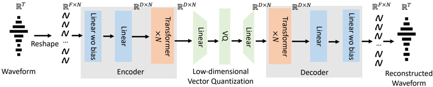

> [!abstract] arXiv · 2024 · Preprint
> **Wu et al.** (Microsoft) · [→ Paper](https://arxiv.org/abs/2411.18803) · Demo: ? · Code: ?
>
> TS3-Codec is the first fully transformer-based, convolution-free neural audio codec, achieving streaming single-codebook compression at 12% of the computation and 77% of the bitrate of the leading convolutional baseline while matching or exceeding its reconstruction quality.

## Problem

Neural audio codecs (NACs) for speech language model (SLM) backbones must balance several competing requirements: streaming capability for real-time dialogue, a single codebook to avoid the multi-stream complexity that RVQ introduces in language model decoding, low bitrate for efficient sequence modeling, and low computational cost to leave headroom for the language model itself. Virtually all existing NACs rely on convolutional encoders and decoders. Transformers have appeared only as intermediate feature-refinement layers inside convolutional backbones (as in Mimi), not as the sole architectural primitive. Whether a purely transformer-based codec can meet these requirements simultaneously, and whether it offers efficiency advantages over its convolutional counterparts, was an open question.

## Method

TS3-Codec replaces the convolutional encoder-decoder backbone entirely with stacked transformer layers. The encoder takes raw 16 kHz waveforms and first reshapes the 1-D signal into windowed frames of size F, projecting them via two linear layers into a D-dimensional embedding space. A stack of transformer layers (8 layers, 16 attention heads, feed-forward dimension 4096 in the default configuration) then processes these embeddings using causal sliding-window attention: each frame attends only to the preceding 16 or 32 frames, ensuring constant-time incremental processing and streaming compatibility without quadratic complexity growth. The decoder is symmetric to the encoder, using the same transformer configuration and mirrored linear projections to reconstruct the waveform. Between the two, a factorized vector quantization layer maps encoder outputs to a single codebook of 65,536 or 131,072 entries in a low-dimensional (8 or 16) code space, achieving bitrates of 640-850 bps.

Training uses the standard GAN framework adapted from BigCodec: a multi-scale mel-spectrogram reconstruction loss, a least-squares GAN loss with Multi-Period Discriminator (from HiFi-GAN) and Multi-Scale STFT Discriminator (from EnCodec), a feature matching loss, and a VQ commitment loss. Codebook loss weights are scaled proportionally to codebook size (4.0 for 8K, 32.0 for 65K, 64.0 for 131K entries). All models train on 60K hours of Libri-light for 500K steps on 16 V100 GPUs. The primary streaming baseline (BigCodec-S) is a custom streaming version of BigCodec built by converting all non-causal convolutions to causal ones and removing snake-activation up/downsampling, trained under identical conditions for a fair comparison.

## Key Results

At approximately 1000 bps in the streaming setting (Table 3), TS3-Codec (X1, 800 bps) achieves UTMOS 3.85, WER 3.6%, PESQ 2.22, and SPK-SIM 0.68, outperforming BigCodec-S (G1, 1040 bps, 7.1G MACs) on all metrics except WER, while using only 7.6G MACs. Compared to Mimi, the leading RVQ-based streaming codec at 1100 bps (UTMOS 3.60, WER 3.0%), TS3-Codec scores higher on UTMOS and PESQ but ranks second on WER; the paper attributes Mimi's WER advantage to its semantic distillation training objective. Against the much larger BigCodec-S (G2, 61.1G MACs, 159.9M params), TS3-Codec is competitive despite using only 12% of the compute and 77% of the bitrate.

At approximately 600 bps (Table 4), TS3-Codec (X3/X4) achieves the best STOI, PESQ, MCD, SPK-SIM, and UTMOS among all streaming models and outperforms the two non-streaming single-codebook baselines (WavTokenizer, SpeechTokenizer) across most metrics as well. Again, Mimi leads on WER, consistent with the semantic distillation advantage at the lower bitrate.

WavTokenizer, while reporting strong UTMOS in its own paper, shows poor WER (6.8% at ~975 bps), and the paper notes this metric was not disclosed in the original WavTokenizer work.

## Novelty Assessment

The core contribution is architectural: TS3-Codec is genuinely the first codec to eliminate convolution entirely and rely solely on transformer layers with sliding-window causal attention. This is not a straightforward substitution; the paper demonstrates that this design choice buys computational efficiency (MACs for transformer-only codecs scale more favourably than for convolutional models at equivalent parameter counts), and that the BigCodec convolutional codec at 160M parameters has a MACs footprint comparable to a 1-billion-parameter transformer. The single-codebook streaming design is also new; prior streaming codecs (EnCodec, Mimi) used RVQ, and prior single-codebook codecs (BigCodec, WavTokenizer) lacked streaming capability. The large codebook sizes (65K, 131K) in a single-codebook streaming setting are likewise unexplored before this work. The evaluation is thorough and the baseline BigCodec-S is carefully reproduced and strengthened (it outperforms Mimi on most metrics), making the comparison credible. The main limitation is the absence of a subjective MOS evaluation; UTMOS is used as a proxy throughout.

## Field Significance

> [!tip]
> High — TS3-Codec provides the first evidence that a purely transformer-based architecture can match or exceed convolutional codecs in the streaming single-codebook regime while requiring dramatically less computation. This matters directly for spoken conversational agent systems, where the codec's compute budget competes with the language model's, and where single-codebook designs simplify the LM's token prediction task. The result shifts the baseline assumption that convolutions are necessary for audio codec design.

## Claims

- Transformer architectures can match convolutional neural audio codecs in streaming reconstruction quality while requiring substantially lower multiply-accumulate operations at similar parameter counts. *(§3.2, §5.1, Table 3)*
- A single-codebook design is compatible with full streaming operation, showing that the prior tradeoff between single-codebook simplicity and streaming capability is not fundamental. *(§2.3, §3.1)*
- Semantic distillation (as used in Mimi and SpeechTokenizer) provides consistent word error rate benefits over codecs trained without it, even when those codecs achieve higher perceptual quality scores. *(§5.1, §5.2, Table 3, Table 4)*
- At equivalent computational budgets, transformer-based codec architectures outperform their causal convolutional counterparts across intelligibility, distortion, and naturalness metrics. *(§5.1, Figure 2, Figure 3)*

## Limitations and Open Questions

> [!warning]
> All naturalness evaluations rely on UTMOS rather than human MOS. While UTMOS correlates well with human judgements on codec-reconstructed speech, the paper presents no subjective listening test to confirm its quality claims.

The codec is evaluated only on English speech (LibriSpeech). Generalisation to other languages, accents, and non-speech audio is untested. The training set (Libri-light) is entirely read speech; performance on conversational, emotional, or noisy speech is unknown. Code and checkpoints are not released (as of the preprint), limiting reproducibility. The paper does not evaluate latency (time-to-first-byte or algorithmic delay) in a real streaming deployment, only computational complexity in offline MACs. The effect of the large codebook sizes (65K, 131K) on downstream speech language model training and inference has not been demonstrated.

## Wiki Connections

- [[neural-codec]] — introduces the first transformer-only, convolution-free single-codebook streaming codec architecture, establishing that convolutions are not necessary for this task.
- [[streaming-tts]] — demonstrates that streaming audio tokenisation can be achieved at low computational cost with transformer-only codecs, a key constraint for real-time spoken conversational agents.
- [[spoken-language-model]] — motivates the single-codebook and low-token-rate design choices explicitly around simplifying speech language model architecture and training.
- [[2210.13438]] (EnCodec) — the primary reference for RVQ-based streaming codec design; TS3-Codec adopts the MS-STFT discriminator from EnCodec while replacing the convolutional backbone.
- [[2409.05377]] (BigCodec) — the main baseline; TS3-Codec builds a streaming variant (BigCodec-S) from BigCodec's official implementation as the primary fair comparison point.
- [[2410.00037]] (Moshi) — motivates the streaming and single-codebook design requirements; Moshi's Mimi codec is the reference for state-of-the-art streaming RVQ performance.
- [[2408.16532]] (WavTokenizer) — compared as a single-codebook non-streaming baseline; TS3-Codec matches or exceeds it in streaming mode at similar bitrates.
- [[2308.16692]] (SpeechTokenizer) — compared as an RVQ-based baseline using semantic distillation; illustrates the WER benefit of semantic distillation and the quality cost of RVQ at low bitrates.
- [[2301.02111]] (VALL-E) — cited as a foundational motivation for discrete speech tokenisation for language modeling.
- [[2402.13236]] (Towards Audio Language Modeling) — provides conceptual framing for the codec properties important to speech language models.
- [[2204.02152]] (UTMOS) — used as the primary naturalness metric throughout all evaluations.
