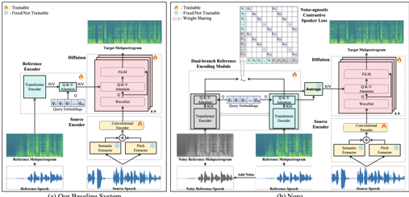

> [!abstract] arXiv · 2025 · Preprint
> **He et al.** · [→ Paper](https://arxiv.org/abs/2411.19770) · Demo: ? · Code: ?
>
> Noro addresses noise-degraded reference speech in one-shot voice conversion by introducing a dual-branch reference encoding module and a noise-agnostic contrastive speaker loss that teach the system to represent speaker identity independently of acoustic interference.

## Problem

One-shot voice conversion systems perform well under controlled conditions but degrade substantially when reference speech contains real-world noise. Prior approaches either pipeline a separate speech enhancement module before the VC system (adding inference cost and breaking end-to-end training) or rely on data augmentation during training without architectural changes to enforce noise-invariant speaker representations. At low SNR (below 5 dB), these strategies still leave substantial performance gaps, particularly in speaker similarity.

## Method

Noro is built on a diffusion-based one-shot VC baseline. The baseline encodes source speech through a frozen HuBERT model as the semantic extractor, applies K-Means quantization to obtain continuous semantic embeddings, and extracts frame-level F0 via PyWorld. A CNN encoder combines semantic and pitch representations into a source representation. The reference encoder is a Transformer-based network that produces a hidden sequence, which is compressed to a fixed-length utterance-level speaker representation through cross-attention with learned query embeddings; this representation conditions a WaveNet-based diffusion acoustic model via FiLM layers and a second attention block.

Noro replaces the single reference encoder with a dual-branch reference encoding module. Both branches share identical weights; at training time, clean reference speech and a noise-augmented version (created by mixing with noise from the DEMAND database at SNR drawn from N(0,20) dB) are passed through separate branches, yielding representations h_ref and h'_ref. The average of the two representations conditions the diffusion model during training; at inference only one branch is active, so the architecture is identical to the baseline. A noise-agnostic contrastive speaker loss is applied to the pooled clean and noisy representations: cross-entropy is computed over a concatenated batch such that samples from the same speaker (whether clean or noisy) are attracted and samples from different speakers are repelled. The total training objective combines the diffusion score-matching loss and this contrastive loss with scalar weights.

The paper also investigates a secondary finding: the baseline reference encoder, repurposed directly as a speaker encoder (called VC-SPK2VEC), is evaluated under the SUPERB speaker verification protocol using VoxCeleb2 fine-tuning and VoxCeleb1 testing.

## Key Results

On the VCTK test set (150 source-reference pairs), Noro matches the baseline in clean conditions: CER 4.74 vs. 4.71, SECS 82.38 vs. 82.35. In noisy conditions (0-5 dB SNR), where the baseline degrades sharply to CER 7.26 and SECS 77.28, Noro recovers substantially to CER 4.66 and SECS 80.09. The subjective results follow the same pattern: baseline CMOS/SMOS fall from 3.29/3.02 (clean) to 2.09/2.75 (noisy), while Noro's CMOS/SMOS fall only to 2.95/2.97 (Table II). Noro improves on the baseline at both noise bands (0-5 dB and 5-10 dB SNR) and outperforms the compared systems (FaCodec-VC, FreeVC, DiffVC) on SECS under noisy conditions.

For the speaker verification side experiment, VC-SPK2VEC achieves 5.32% EER, which surpasses wav2vec 2.0 Large (5.65%), HuBERT Large (5.98%), and wav2vec 2.0 Base (6.02%), while trailing slightly behind HuBERT Base (5.11%) and WavLM variants (3.77-4.69%). This is achieved with a 72.4M parameter model trained on LibriLight without explicit speaker label supervision in the traditional sense.

## Novelty Assessment

The dual-branch weight-sharing strategy is an established pattern for learning invariant representations under data augmentation (analogous to consistency regularisation and SimCLR-style contrastive learning). Applying it specifically to the reference encoder of a one-shot VC system to enforce speaker-noise disentanglement is a direct and well-motivated adaptation, but not a conceptual departure from known techniques. The noise-agnostic contrastive speaker loss is a supervised contrastive loss with augmented views, which is standard in metric learning. The primary engineering contribution is the clean integration of these components into a diffusion VC system with a weight-sharing scheme that keeps inference identical to the baseline.

The secondary finding, that a VC reference encoder achieves competitive speaker verification under SUPERB, is an interesting empirical observation but remains a side experiment: no novel architecture or training procedure is proposed for this part, and the comparison is against frozen SSL models using a simple downstream x-vector classifier.

## Field Significance

Moderate — Noro provides practical evidence that noise-robust one-shot VC can be achieved through architectural regularisation at the reference encoder, without adding inference-time overhead or requiring a separate enhancement module. The contrastive disentanglement strategy is reusable across voice conversion architectures that rely on learned speaker embeddings from reference speech.

## Claims

- **supports:** Contrastive training with noise-augmented views enforces noise-invariant speaker representations and substantially improves one-shot VC robustness at low SNR without adding inference cost.
  > *Evidence:* Noro's dual-branch reference encoding module and noise-agnostic contrastive speaker loss hold SECS at 80.09 and CER at 4.66 in 0-5 dB noise, versus 77.28 and 7.26 for the baseline; weight sharing means inference architecture is unchanged. *(§III.A, Tables I-II)*

- **complicates:** Standard one-shot voice conversion systems degrade substantially when reference speech contains background noise, even after data augmentation training.
  > *Evidence:* The diffusion-based baseline trained on LibriLight with no noise-robustness mechanism shows CMOS dropping from 3.29 to 2.09 and SMOS from 3.02 to 2.75 under 0-5 dB noisy reference conditions. *(§III.A.2, Table II)*

- **supports:** Voice conversion reference encoders trained on large-scale speech data develop speaker representations competitive with dedicated self-supervised speaker models.
  > *Evidence:* VC-SPK2VEC (the Noro baseline reference encoder repurposed as a speaker encoder, 72.4M params, trained on LibriLight 60k hr) achieves 5.32% EER on VoxCeleb1 under SUPERB, outperforming wav2vec 2.0 Base (6.02%), wav2vec 2.0 Large (5.65%), and HuBERT Large (5.98%). *(§III.B.2, Table III)*

- **refines:** Speaker-noise disentanglement in voice conversion benefits from training objectives that explicitly align clean and noisy representations of the same speaker, beyond simple noise augmentation.
  > *Evidence:* t-SNE visualisations show that the baseline (trained with augmentation but no contrastive alignment) produces clearly separated clean/noisy representation clusters, while Noro's contrastive loss causes them to mix, correlating with the performance gap under noise. *(§III.A.2, Figure 2)*

## Limitations and Open Questions

The evaluation uses reference speech from VCTK (studio-recorded English) with synthetically added noise from DEMAND; real-world recordings that mix noise with reverberation, codec compression, or far-field capture may behave differently. The test set is small (ten source-reference pairs per condition for subjective evaluation, 150 for objective), and the paper does not report statistical significance for differences between Noro and the baseline in clean conditions where they are nearly equal. The contrastive loss relies on speaker labels during training, so the approach does not extend directly to fully unsupervised training on unlabelled data. The secondary VC-SPK2VEC finding is evaluated only under one SUPERB protocol; performance on other speaker tasks (diarization, speaker counting) is not explored.

## Wiki Connections

- [[voice-conversion|Voice Conversion]] — Noro directly advances one-shot VC by introducing a mechanism to handle noisy reference speech, a known failure mode for real-world deployment.
- [[zero-shot-tts|Zero-Shot TTS]] — One-shot VC is the VC analogue of zero-shot speaker adaptation; Noro's dual-branch reference encoding addresses the same challenge of speaker identity extraction from a single reference utterance.
- [[diffusion-tts|Diffusion TTS]] — The underlying acoustic model is a WaveNet-based diffusion system; Noro's noise-robustness contributions integrate within this diffusion framework.
- [[speaker-adaptation|Speaker Adaptation]] — The paper's secondary finding demonstrates that VC reference encoders trained on large-scale speech data develop strong speaker representations, informing the relationship between generative speaker conditioning and speaker verification.
- [[self-supervised-speech|Self-Supervised Speech]] — The source encoder uses a frozen HuBERT model as the semantic extractor; the secondary experiment explicitly compares the VC reference encoder against SSL speaker models (HuBERT, WavLM, wav2vec 2.0) under SUPERB.
- [[disentanglement|Disentanglement]] — The noise-agnostic contrastive speaker loss is designed to separate speaker identity from acoustic noise in the reference representation space, which is the paper's core training innovation.
